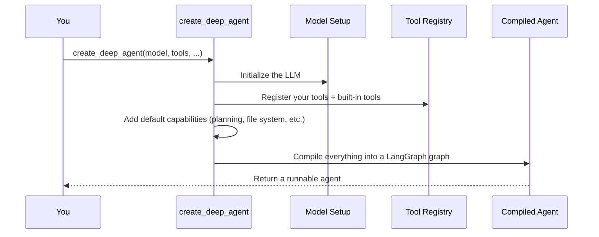

# Chapter 1: Deep Agent (create_deep_agent)

## Why Does This Exist?

Imagine you're building an AI assistant that doesn't just chat — it actually *gets things done*. You want it to:

- **Plan** a multi-step task before jumping in
- **Use tools** like searching the web or reading files
- **Delegate** parts of the work to specialized sub-agents
- **Remember** things across conversations
- **Ask for permission** before doing something risky

Building all of that from scratch is like building a car engine from raw metal. That's where `create_deep_agent` comes in — it's the **master builder** that takes all the parts and assembles them into a fully working agent.

Think of it this way: if an AI agent were a kitchen, `create_deep_agent` is the general contractor who brings together the oven, the fridge, the knives, the recipe book, and the sous-chefs — and makes sure they all work together.

---

## A Concrete Example: The Research Assistant

Let's say you want to build a **research assistant**. A user asks:

> "What's the weather in San Francisco?"

A simple chatbot would just guess. But a *deep agent* can:

1. Call a weather tool to get real data
2. Return an accurate, tool-backed answer

Here's the smallest possible deep agent that does this:

```python
from deepagents import create_deep_agent

def get_weather(city: str) -> str:
    """Get weather for a given city."""
    return f"It's always sunny in {city}!"

agent = create_deep_agent(
    model="openai:gpt-4o",
    tools=[get_weather],
    system_prompt="You are a helpful assistant.",
)
```

Then you **invoke** it like a chat API:

```python
result = agent.invoke({
    "messages": [
        {"role": "user", "content": "What's the weather in SF?"}
    ]
})
print(result["messages"][-1].content)
```

**Output:** Something like `"It's always sunny in San Francisco!"` — pulled from the actual tool, not made up.

That's it. You just built your first deep agent! 🎉

---

## What Just Happened?

When you called `create_deep_agent`, it didn't just create a simple chat wrapper. It assembled a **full agent machine** behind the scenes. Let's break down the key pieces:

### 1. The Model (`model`)

This is the "brain" — the LLM that does the thinking. You specify it as a string like `"openai:gpt-4o"` or `"anthropic:claude-sonnet-4-20250514"`. The model decides *when* to call tools and *what* to say.

### 2. The Tools (`tools`)

These are the "hands" — Python functions the agent can call. Your `get_weather` function is a tool. The agent reads the function name, parameters, and docstring to understand when and how to use it.

### 3. The System Prompt (`system_prompt`)

This is the "personality and rules" — it tells the agent who it is and how to behave. We'll dive deep into this in [System Prompt](02_system_prompt_.md).

### 4. Everything Else (Optional!)

`create_deep_agent` accepts many more parameters for advanced capabilities:

| Parameter | What It Does | Learn More |
|-----------|-------------|------------|
| `subagents` | Delegate work to specialized agents | [Subagents](10_subagents_.md) |
| `backend` | Virtual file system for reading/writing files | [Backend (File System)](07_backend__file_system_.md) |
| `permissions` | Control what the agent can read/write | [Permissions](08_permissions_.md) |
| `store` | Long-term memory across conversations | [Memory / Store](06_memory___store_.md) |
| `interrupt_on` | Pause for human approval before risky actions | [Human-in-the-Loop](09_human_in-the-loop__interrupt__.md) |

Don't worry about these yet — we'll cover each one in its own chapter. The beauty of `create_deep_agent` is that **all of these are optional**. Start simple, add complexity as you need it.

---

## The Full Signature

Here's what `create_deep_agent` looks like under the hood:

```python
create_deep_agent(
    model=None,
    tools=None,
    *,
    system_prompt=None,
    subagents=None,
    memory=None,
    permissions=None,
    backend=None,
    interrupt_on=None,
    store=None,
    checkpointer=None,
    # ... and a few more
)
```

**Key insight:** Only `model` is truly essential. Everything else has sensible defaults. The framework fills in the blanks so you can start simple.

---

## What Happens When You Call `create_deep_agent`?

Let's peek behind the curtain. When you call `create_deep_agent`, here's the step-by-step:



Here's what each step means:

1. **Initialize the LLM** — Parses your `"openai:gpt-4o"` string and sets up the model client
2. **Register tools** — Takes your custom tools *plus* built-in ones (like `write_todos` for planning) and makes them available
3. **Add default capabilities** — Wires in the file system, task planning, and other built-in features
4. **Compile into a graph** — Uses LangGraph to create an executable state machine that the agent runs through
5. **Return a runnable agent** — You get back an object with `.invoke()` and `.stream()` methods

---

## The Agent You Get Back

The returned agent behaves like a LangGraph graph. The most important method is `.invoke()`:

```python
result = agent.invoke({"messages": [...]})
```

You pass in a list of messages (like a chat history), and you get back a dictionary containing the full conversation — including the agent's final response.

The last message is always the agent's answer:

```python
answer = result["messages"][-1].content
```

You can also **stream** the agent's work in real-time, which we'll cover in [Streaming](11_streaming_.md).

---

## A Slightly Bigger Example

Let's add a second tool to see how the agent chooses between them:

```python
def get_weather(city: str) -> str:
    """Get the current weather for a city."""
    return f"It's always sunny in {city}!"

def get_time(timezone: str) -> str:
    """Get the current time in a timezone."""
    return f"It's 3:00 PM in {timezone}."
```

Now create the agent with both tools:

```python
agent = create_deep_agent(
    model="openai:gpt-4o",
    tools=[get_weather, get_time],
    system_prompt="You are a helpful assistant.",
)
```

When a user asks about weather, the agent calls `get_weather`. When they ask about time, it calls `get_time`. The **model** decides which tool to use based on the function names and docstrings — that's why clear naming matters!

```python
result = agent.invoke({
    "messages": [
        {"role": "user", "content": "What time is it in Tokyo?"}
    ]
})
```

**Output:** The agent calls `get_time("Asia/Tokyo")` and returns something like `"It's 3:00 PM in Asia/Tokyo."`

---

## Analogy: The Master Builder

If this whole framework were a construction project:

- **`create_deep_agent`** is the **general contractor** who takes the blueprints and assembles everything
- **Model** is the **architect** who decides what to do next
- **Tools** are the **specialized workers** (plumber, electrician, painter)
- **System Prompt** is the **project spec** that defines the rules
- **Subagents** are **subcontractors** hired for specialized jobs
- **Permissions** are the **safety regulations** that limit what can be done
- **Backend** is the **workshop** where materials are stored

Without the general contractor, none of these pieces talk to each other. `create_deep_agent` is what makes them all work as one machine.

---

## Common Beginner Mistakes

### ❌ Forgetting the docstring on tools

```python
def get_weather(city: str) -> str:
    return f"Sunny in {city}"
```

The model won't know *when* to use this tool. Always add a docstring:

```python
def get_weather(city: str) -> str:
    """Get the current weather for a city."""
    return f"Sunny in {city}"
```

### ❌ Overcomplicating your first agent

Don't pass every parameter on day one. Start with just `model`, `tools`, and `system_prompt`. Add more as you need it.

### ❌ Expecting the agent to "just know" things

The agent can only use what you give it. No weather tool? It'll guess. No file access? It can't read files. The agent's power comes from the tools and capabilities *you* wire in.

---

## Summary

In this chapter, you learned:

- **`create_deep_agent`** is the central factory function — the entry point for the entire framework
- It assembles the model, tools, prompts, and optional capabilities into one runnable agent
- You invoke the result with `.invoke({"messages": [...]})`, similar to a chat API
- Start simple with just `model`, `tools`, and `system_prompt` — add complexity later
- The agent is only as capable as the tools and permissions you give it

You now have the foundation. But we've been passing `system_prompt` as a simple string without much thought. In the next chapter, you'll learn how to craft a system prompt that gives your agent a clear identity and boundaries.

👉 [System Prompt](02_system_prompt_.md)

---

Generated by [AI Codebase Knowledge Builder](https://github.com/The-Pocket/Tutorial-Codebase-Knowledge)