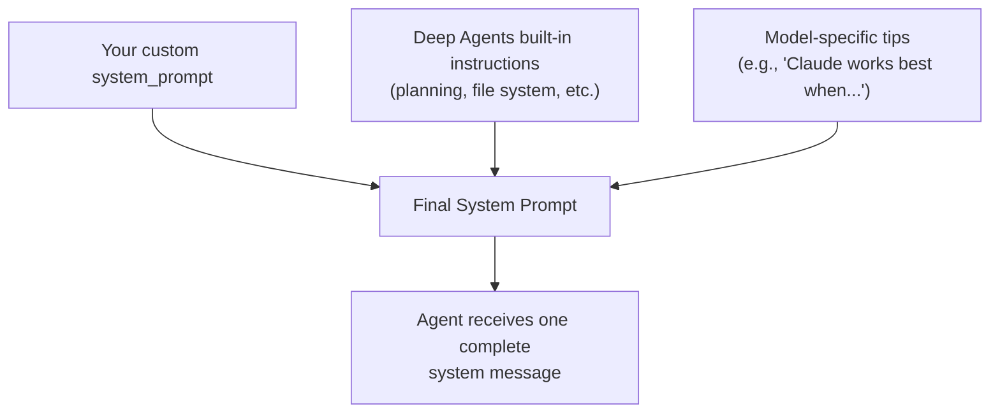
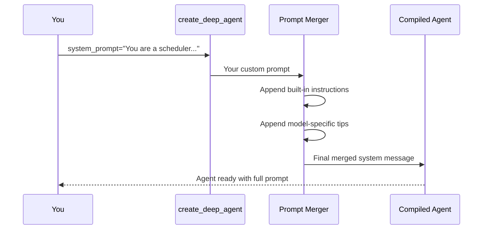

# Chapter 2: System Prompt

In [Chapter 1: Deep Agent](01_deep_agent__create_deep_agent__.md), we built our first agent using `create_deep_agent`. We passed in a simple string for `system_prompt` — something like `"You are a helpful assistant."` — and moved on. But that humble string is doing a lot more work than you might think. Let's find out why.

---

## Why Does This Matter?

Imagine you just hired a new employee. On their first day, you hand them a desk and say: *"Do a good job."* That's it. No job title, no responsibilities, no rules.

What happens? They might do great work — or they might spend the whole day reorganizing the supply closet when you needed them to answer customer emails.

**A system prompt is the antidote to that chaos.** It's the job description *and* the employee handbook rolled into one. It tells your agent:

- **Who it is** (its role)
- **What it should do** (its task boundaries)
- **How it should behave** (its norms and constraints)

Without a clear system prompt, your agent will wander. With one, it stays focused.

---

## A Concrete Example: The Customer Support Agent

Let's say you're building a customer support agent for an online shoe store. A user messages in:

> "I ordered the wrong size. Can I swap my sneakers for a different one?"

A generic agent with `"You are a helpful assistant"` might:
- Give fashion advice about the sneakers
- Write a poem about shoes
- Explain the history of footwear

None of that helps! But with a well-crafted system prompt:

```python
system_prompt = """
You are a customer support agent for ShoeBox, an online shoe retailer.

Your job:
- Help customers with orders, returns, and exchanges
- Answer questions about sizing and availability
- Escalate complaints you cannot resolve

Rules:
- Never process refunds directly; always create a refund request
- Be friendly but concise
- If unsure, say so rather than guessing
"""
```

Now the agent knows exactly what to do. It'll guide the customer through an exchange — not write a haiku about laces.

---

## What Exactly Is a System Prompt?

At its core, a system prompt is just a **string of text** that gets injected into the conversation as a special "system" message. LLMs treat system messages as high-priority instructions — they carry more weight than regular user messages.

Think of it this way:

| Message Type | Analogy | Priority |
|-------------|---------|----------|
| System | The company handbook | 🏆 Highest |
| User | A customer walking in | 📋 Normal |
| Assistant | The employee's response | 📋 Normal |

The system message sets the ground rules before any conversation happens.

---

## The Magic: Deep Agents Merges Prompts for You

Here's the really cool part. You don't have to write a *complete* system prompt from scratch. Deep Agents has **built-in instructions** that teach the agent how to:

- Plan tasks using `write_todos` (covered in [Task Planning](05_task_planning__write_todos__.md))
- Use the file system tools (covered in [Backend (File System)](07_backend__file_system__.md))
- Work with subagents (covered in [Subagents](10_subagents__.md))
- Handle model-specific quirks and tips

**You only need to write what's unique to your business.** Deep Agents stitches everything together automatically.

The final prompt your agent sees looks like this:



This means you can keep your prompt focused on *business logic* — the framework handles the rest.

---

## How to Write a Good System Prompt

Let's break down the key ingredients of an effective system prompt, one by one.

### 1. Define the Role

Tell the agent who it is. This single sentence sets the tone for everything that follows.

```python
system_prompt = "You are a medical appointment scheduler for City Hospital."
```

Without this, the agent doesn't know if it's a doctor, a patient, or a receptionist. The role anchors its behavior.

### 2. Set Task Boundaries

Tell the agent what it should — and shouldn't — do. This prevents the agent from drifting into unrelated territory.

```python
system_prompt = """
You are a medical appointment scheduler for City Hospital.

Your job:
- Book, reschedule, and cancel appointments
- Check doctor availability
- Answer questions about office hours

You must NOT:
- Give medical advice
- Access patient records
- Prescribe medications
"""
```

The "must NOT" section is just as important as the "your job" section. It's the guardrail.

### 3. Add Behavioral Norms

These are the softer rules — tone, style, and how the agent should handle edge cases.

```python
system_prompt = """
You are a medical appointment scheduler for City Hospital.

Your job:
- Book, reschedule, and cancel appointments
- Check doctor availability
- Answer questions about office hours

You must NOT:
- Give medical advice
- Access patient records
- Prescribe medications

Behavior:
- Be warm and professional
- If unsure about a rule, say "Let me check on that"
- Always confirm details before booking
"""
```

Notice how each addition builds on the last. You're layering specificity.

---

## Putting It All Together

Now let's create the full agent with our system prompt:

```python
from deepagents import create_deep_agent

agent = create_deep_agent(
    model="openai:gpt-4o",
    tools=[],  # we'll add tools later
    system_prompt="""
You are a medical appointment scheduler for City Hospital.

Your job:
- Book, reschedule, and cancel appointments
- Check doctor availability
- Answer questions about office hours

You must NOT:
- Give medical advice
- Access patient records
- Prescribe medications

Behavior:
- Be warm and professional
- If unsure, say "Let me check on that"
- Always confirm details before booking
""",
)
```

When a user asks:

```python
result = agent.invoke({
    "messages": [
        {"role": "user", "content": "My throat hurts, what medicine should I take?"}
    ]
})
```

The agent will **refuse** to give medical advice, because the system prompt explicitly forbids it. Instead, it might say something like:

> *"I'm not able to give medical advice, but I can help you book an appointment with a doctor. Would you like me to check availability?"*

That's the system prompt doing its job — keeping the agent in its lane.

---

## What Happens Under the Hood?

When you pass `system_prompt` to `create_deep_agent`, here's what happens step by step:



1. **Your prompt** is passed in as-is
2. **Built-in instructions** are appended — these teach the agent about planning, file tools, etc.
3. **Model-specific tips** are appended — these optimize behavior for the specific LLM you chose (covered in [Model Configuration](03_model_configuration_.md))
4. **The final merged prompt** becomes the system message the agent sees

You never have to worry about the built-in stuff. It's handled for you.

---

## A Simpler Example: The Recipe Helper

Let's try a lighter example to reinforce the concept. You want an agent that suggests recipes based on ingredients:

```python
system_prompt = """
You are a recipe assistant. Users tell you what ingredients they have,
and you suggest a dish they can make.

Rules:
- Only suggest recipes that use the mentioned ingredients
- If ingredients are missing for a recipe, say so
- Keep suggestions practical (under 30 minutes)
"""
```

```python
agent = create_deep_agent(
    model="openai:gpt-4o",
    tools=[],
    system_prompt=system_prompt,
)
```

When asked:

```python
result = agent.invoke({
    "messages": [
        {"role": "user", "content": "I have eggs, cheese, and bread."}
    ]
})
```

The agent stays in its lane and suggests something like a grilled cheese with a fried egg — not a 3-hour beef bourguignon.

---

## Common Beginner Mistakes

### ❌ Making the prompt too vague

```python
system_prompt = "You are helpful."
```

Helpful at *what*? The agent has no identity, no boundaries. It'll do anything.

### ❌ Making the prompt too long

A 10-page prompt is just as bad as a one-word prompt. The model can get confused or ignore later instructions. Aim for **concise and specific** — a few well-chosen paragraphs.

### ❌ Forgetting to say what NOT to do

Most people only list what the agent *should* do. But the "must not" rules are your guardrails. Without them, the agent might:

- Make up facts when it doesn't know something
- Perform actions it shouldn't (like processing a refund directly)
- Wander into topics outside its domain

### ❌ Trying to include framework instructions

Don't write things like "Use the write_todos tool to plan your tasks." Deep Agents already includes that in its built-in instructions. You're duplicating effort and potentially conflicting with the framework's own guidance.

---

## Quick Reference: System Prompt Template

Here's a simple template you can adapt for any agent:

```text
You are a [ROLE] for [CONTEXT/ORGANIZATION].

Your job:
- [Task 1]
- [Task 2]
- [Task 3]

You must NOT:
- [Boundary 1]
- [Boundary 2]

Behavior:
- [Norm 1]
- [Norm 2]
```

Start here, then refine as you test your agent and see where it drifts.

---

## Summary

In this chapter, you learned:

- A **system prompt** defines your agent's role, task boundaries, and behavioral norms
- It's like a **job description + employee handbook** — it keeps the agent focused
- **Deep Agents merges your prompt with built-in instructions**, so you only write what's unique to your business
- A good prompt has three parts: **role**, **boundaries**, and **behavioral norms**
- Don't forget the "must NOT" section — guardrails are as important as goals
- Keep it concise; the framework handles the rest

You now know how to give your agent a clear identity. But the agent still needs a brain — and in the next chapter, you'll learn how to configure the model that powers it.

👉 [Model Configuration](03_model_configuration_.md)

---

Generated by [AI Codebase Knowledge Builder](https://github.com/The-Pocket/Tutorial-Codebase-Knowledge)