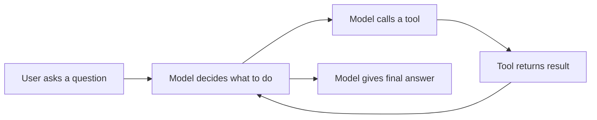
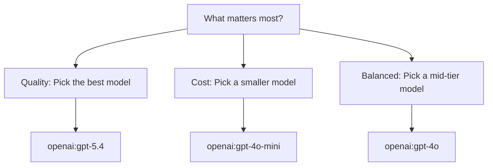
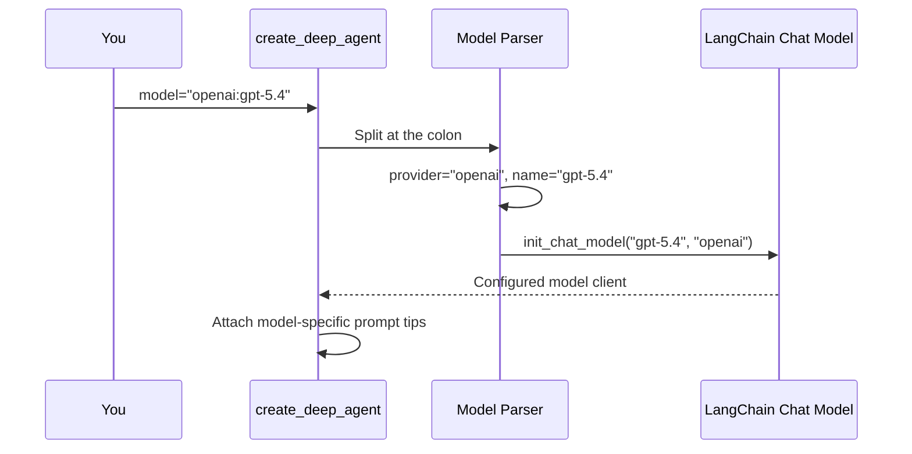

# Chapter 3: Model Configuration

In [Chapter 2: System Prompt](02_system_prompt_.md), you learned how to give your agent a clear identity and boundaries. But an identity without a brain is just a job description taped to an empty chair. Your agent needs something to *think* with — and that's where model configuration comes in.

---

## Why Does This Matter?

Imagine you're running a restaurant. You need a chef. But "chef" isn't enough — you need to decide *who* you're hiring:

- A **seasoned executive chef** who makes flawless decisions but costs a fortune
- A **solid line cook** who's fast, reliable, and reasonably priced
- A **culinary student** who's cheap but might mess up the complicated stuff

The same is true for AI agents. The **model** you choose determines:

- **How well** the agent plans and reasons
- **How reliably** it calls the right tools with the right arguments
- **How fast** it responds
- **How much** each run costs

This isn't a minor detail — it's the single biggest factor in your agent's quality and cost.

---

## A Concrete Example: The Research Agent

Let's say you're building a research agent that searches the web and writes reports. You try two different models:

```python
# Option A: Premium model
agent = create_deep_agent(
    model="openai:gpt-5.4",
    tools=[internet_search],
    system_prompt="You are a research assistant.",
)
```

```python
# Option B: Budget model
agent = create_deep_agent(
    model="openai:gpt-4o-mini",
    tools=[internet_search],
    system_prompt="You are a research assistant.",
)
```

Both agents *work*. But when you give them a complex task like *"Compare the economic policies of Japan and South Korea"*:

- **Option A** plans carefully, makes 4 targeted searches, and produces a structured comparison
- **Option B** might skip steps, call the wrong tools, or produce a shallower answer

Same code. Same tools. Same prompt. **Different model, different results.**

---

## The Format: `provider:model`

Deep Agents uses a simple string format to specify models:

```text
provider:model
```

The part before the colon is the **provider** (who made the model). The part after is the **model name** (which specific model). Think of it like a phone number: area code + number.

Here are the most common options:

| String | Provider | Model | Best For |
|--------|----------|-------|----------|
| `"openai:gpt-5.4"` | OpenAI | GPT-5.4 | Complex reasoning, reliable tool use |
| `"openai:gpt-4o"` | OpenAI | GPT-4o | Strong all-rounder |
| `"openai:gpt-4o-mini"` | OpenAI | GPT-4o Mini | Fast, cheap tasks |
| `"anthropic:claude-sonnet-4-20250514"` | Anthropic | Claude Sonnet 4 | Nuanced reasoning, long context |
| `"google_genai:gemini-3.5-flash"` | Google | Gemini 3.5 Flash | Speed and cost efficiency |

The format is always the same: just a string, no objects, no imports.

---

## The One Hard Rule: Tool Calling Support

Deep Agents has **one non-negotiable requirement**: your model must support **tool calling** (also called "function calling").

Why? Because Deep Agents agents don't just chat — they *do things*. They call tools, plan tasks, write files. If the model can't reliably decide *when* and *how* to call a tool, the whole system breaks.



If the model can't do step B → C reliably, the agent is stuck. That's why older or cheaper models that lack tool calling support won't work with Deep Agents.

**Good news:** Most modern models from OpenAI, Anthropic, and Google support tool calling. If you stick to the models listed above, you're fine.

---

## Setting Up Your Provider

Each provider needs two things: a **package** and an **API key**. Let's walk through each one.

### OpenAI

Install the package:

```bash
pip install -U "langchain[openai]"
```

Set your API key:

```bash
export OPENAI_API_KEY="sk-your-key-here"
```

Then use it:

```python
agent = create_deep_agent(
    model="openai:gpt-5.4",
)
```

That's it. The framework reads `OPENAI_API_KEY` from your environment automatically.

### Anthropic

Install the package:

```bash
pip install -U "langchain[anthropic]"
```

Set your API key:

```bash
export ANTHROPIC_API_KEY="your-key-here"
```

Then use it:

```python
agent = create_deep_agent(
    model="anthropic:claude-sonnet-4-20250514",
)
```

### Google Gemini

Install the package:

```bash
pip install -U "langchain[google-genai]"
```

Set your API key:

```bash
export GOOGLE_API_KEY="your-key-here"
```

Then use it:

```python
agent = create_deep_agent(
    model="google_genai:gemini-3.5-flash",
)
```

The pattern is always the same: **install package → set API key → pass model string**.

---

## How to Choose: A Decision Guide

With multiple options, how do you pick? Here's a simple framework:



### Ask yourself these questions:

1. **Is the task complex?** Multi-step reasoning, planning, or nuanced decisions → use a premium model
2. **Is cost a concern?** High-volume, simple tasks → use a smaller model
3. **Is speed critical?** Real-time interactions → use a fast model
4. **Are tools involved?** Complex tool chains → use a model known for reliable tool calling

### A practical rule of thumb:

- **Development and testing:** Start with a cheaper model like `gpt-4o-mini` to save money while iterating
- **Production:** Upgrade to a stronger model like `gpt-5.4` for reliability
- **Simple tasks:** A smaller model is often *enough* — don't overpay

---

## What Happens Under the Hood?

When you pass `model="openai:gpt-5.4"` to `create_deep_agent`, here's what happens:



Step by step:

1. **Parse the string** — Split `"openai:gpt-5.4"` into provider and model name
2. **Initialize the model** — Use LangChain's `init_chat_model` to create the right client
3. **Load model-specific tips** — As mentioned in [Chapter 2: System Prompt](02_system_prompt_.md), the framework appends model-specific advice to your system prompt (e.g., "Claude works best when you...")
4. **Wire it into the agent** — The model becomes the "brain" that decides when to call tools and what to say

You don't need to worry about steps 2–4. The framework handles them automatically based on your string.

---

## Model-Specific Prompt Tips

Here's a detail that connects back to [Chapter 2: System Prompt](02_system_prompt_.md). Different models respond differently to instructions. Deep Agents knows this and automatically appends **model-specific tips** to your system prompt.

For example:

- **Claude models** might get tips about how to structure tool calls effectively
- **GPT models** might get tips about planning and step-by-step reasoning
- **Gemini models** might get tips about formatting preferences

This happens transparently — you just write your business prompt, and the framework optimizes the rest for the model you chose. That's why switching models is often as simple as changing one string.

---

## Switching Models Is Easy

Because the model is just a string, you can swap it in one line:

```python
# Monday: use OpenAI for complex tasks
agent = create_deep_agent(
    model="openai:gpt-5.4",
    tools=[search, write_report],
    system_prompt="You are a research analyst.",
)
```

```python
# Tuesday: use Anthropic for a different perspective
agent = create_deep_agent(
    model="anthropic:claude-sonnet-4-20250514",
    tools=[search, write_report],
    system_prompt="You are a research analyst.",
)
```

Same tools, same prompt, different brain. This makes it easy to experiment and find the best model for your use case.

---

## Common Beginner Mistakes

### ❌ Using a model that doesn't support tool calling

If you try to use an older or text-only model, your agent will fail when it tries to call tools. Always check that your model supports function/tool calling.

### ❌ Forgetting to set the API key

```python
agent = create_deep_agent(model="openai:gpt-5.4")
# Error if OPENAI_API_KEY is not set!
```

The framework needs the key to authenticate with the provider. Set it in your environment before running your code.

### ❌ Using the most expensive model for everything

If your agent handles 10,000 simple queries a day, using `gpt-5.4` for each one is like hiring a Michelin-star chef to make toast. Match the model to the task complexity.

### ❌ Not testing with different models

Sometimes a cheaper model works just as well for your specific task. You won't know unless you try. Swap the model string and compare results.

---

## Quick Reference: Model String Cheat Sheet

| Model String | Strengths | Cost | Speed |
|-------------|-----------|------|-------|
| `"openai:gpt-5.4"` | Best reasoning & tool use | 💰💰💰 | 🐢🐢 |
| `"openai:gpt-4o"` | Strong all-rounder | 💰💰 | 🐢 |
| `"openai:gpt-4o-mini"` | Fast & cheap | 💰 | 🏃 |
| `"anthropic:claude-sonnet-4-20250514"` | Nuanced, long context | 💰💰 | 🐢 |
| `"google_genai:gemini-3.5-flash"` | Fast & affordable | 💰 | 🏃🏃 |

---

## Summary

In this chapter, you learned:

- **Model configuration** is specified as a `"provider:model"` string — simple and swappable
- It's like **choosing which specialist to hire** — different models have different strengths, costs, and speeds
- Deep Agents **requires tool calling support** — the model must reliably decide when and how to use tools
- Setup is always: **install package → set API key → pass model string**
- The framework **parses your string and configures everything automatically**, including model-specific prompt tips
- **Match the model to the task** — don't overpay for simple jobs, don't underpay for complex ones

Your agent now has an identity (system prompt) and a brain (model). But a brain without hands can't *do* anything. In the next chapter, you'll learn how to give your agent tools — the functions it can call to interact with the world.

👉 [Tools](04_tools_.md)

---

Generated by [AI Codebase Knowledge Builder](https://github.com/The-Pocket/Tutorial-Codebase-Knowledge)