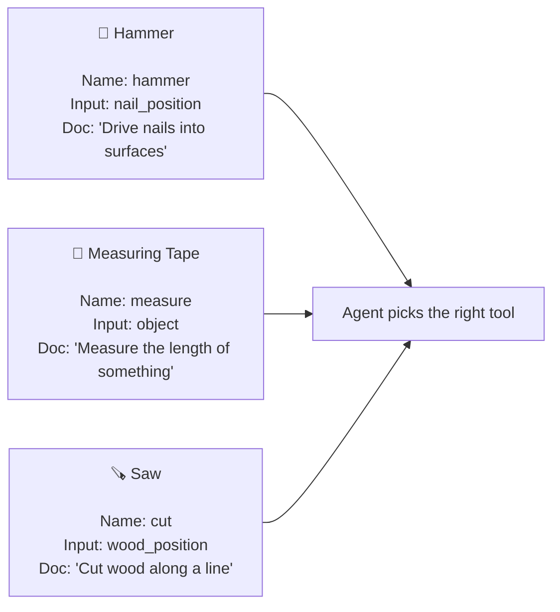
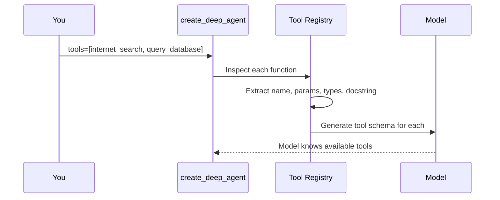
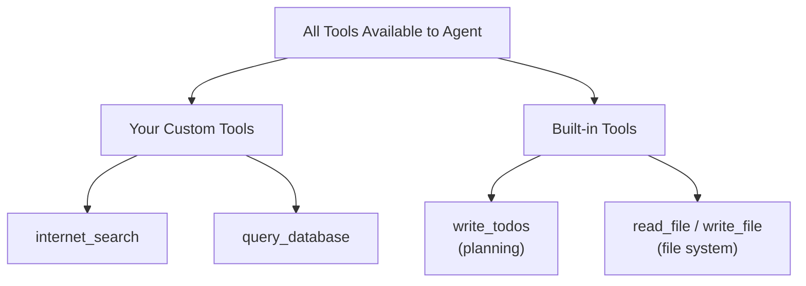
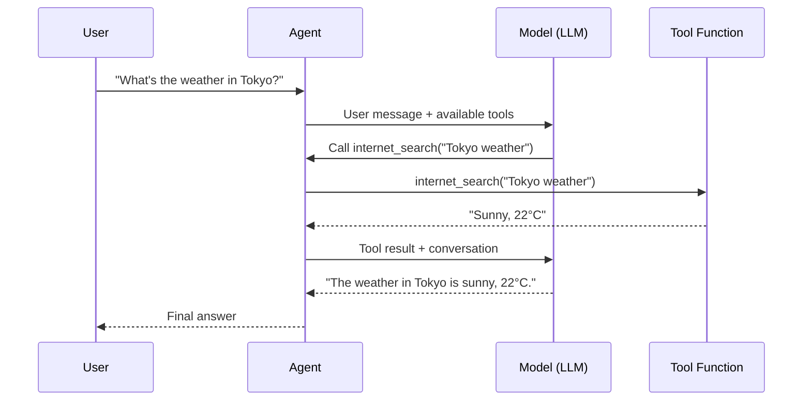

# Chapter 4: Tools

In [Chapter 3: Model Configuration](03_model_configuration_.md), you chose the "brain" for your agent — the LLM that does the thinking. But a brain without hands can't *do* anything. You can think about solving a problem all day, but if you can't pick up a tool and act, nothing gets done. That's where **tools** come in.

---

## Why Does This Matter?

Imagine you hire a brilliant research analyst. They can think, plan, and reason — but they're locked in an empty room with no internet, no phone, and no files. You ask them: *"What's Apple's stock price?"*

They'll give you their best guess. And it'll be wrong.

**Tools are how your agent reaches outside its empty room.** They're Python functions the agent can call to:

- Search the web
- Query a database
- Create a ticket
- Send an email
- Read or write a file
- ...anything you can code

Without tools, your agent can only talk. With tools, your agent can *act*.

---

## A Concrete Example: The Research Agent

Let's say you're building a research agent. A user asks:

> "What are the latest developments in quantum computing?"

A tool-less agent would make something up. But with a search tool:

```python
def internet_search(query: str) -> str:
    """Search the web for information on a topic."""
    # ...calls a search API...
    return "Recent breakthrough in quantum error correction..."
```

You wire it into the agent:

```python
agent = create_deep_agent(
    model="openai:gpt-4o",
    tools=[internet_search],
    system_prompt="You are a research assistant.",
)
```

Now when the user asks about quantum computing, the agent **calls the tool**, gets real data, and gives a grounded answer. No guessing.

---

## What Exactly Is a Tool?

At its core, a tool is just a **regular Python function**. Nothing fancy. No special classes, no decorators, no magic.

But here's the key: the LLM has never seen your code. It doesn't know what your function does — it can only read:

1. **The function name** — `internet_search` vs `handle_stuff`
2. **The parameter names and type annotations** — `query: str` vs `data: Any`
3. **The docstring** — `"Search the web for information on a topic"`

These three pieces are the **label and instruction manual** on the tool. They tell the LLM *when* to use it and *how* to call it.

Think of it like a physical toolbox:



If the label says "hammer" and the manual says "drive nails," the agent won't try to measure a table with it. **Clear labels = correct tool picks.**

---

## The Three Pillars of a Good Tool

Let's break down each piece that the LLM reads, one by one.

### 1. The Function Name

This is the first thing the LLM sees. It should be a **verb-noun pair** that describes exactly what the function does.

```python
# ❌ Vague — what does "handle" mean?
def handle(query: str) -> str:

# ✅ Clear — search the internet
def internet_search(query: str) -> str:
```

The name is like the label on a jar. "Stuff" tells you nothing. "Flour" tells you everything.

### 2. Type Annotations

These tell the LLM *what kind of data* to pass in. Without them, the LLM is guessing.

```python
# ❌ No types — the LLM might pass a number or a list
def search(query):

# ✅ With types — the LLM knows to pass a string
def search(query: str) -> str:
```

Type annotations are guardrails. They prevent the LLM from calling `search(42)` when it should call `search("quantum computing")`.

You can also use more specific types:

```python
from typing import Literal

def internet_search(
    query: str,
    topic: Literal["general", "news", "finance"] = "general",
) -> str:
    """Search the web for information."""
    ...
```

Now the LLM knows `topic` must be one of those three exact strings — not "sports" or "cooking."

### 3. The Docstring

This is the **instruction manual**. It tells the LLM *when* to use the tool and *what it returns*. This is the most important piece.

```python
# ❌ No docstring — the LLM has no idea when to use this
def get_customer(customer_id: str) -> dict:
    return db.query(customer_id)

# ✅ With docstring — the LLM knows exactly when and why
def get_customer(customer_id: str) -> dict:
    """Look up a customer's profile by their ID."""
    return db.query(customer_id)
```

A good docstring answers two questions:
- **When** should I use this tool?
- **What** does it give me back?

---

## Putting It All Together: A Complete Tool

Here's a well-designed tool with all three pillars:

```python
def internet_search(
    query: str,
    max_results: int = 5,
) -> str:
    """Search the web for information on a topic."""
    # ...calls a search API...
    return search_api.results(query, max_results)
```

- **Name**: `internet_search` — clear verb-noun pair
- **Types**: `query: str`, `max_results: int = 5` — the LLM knows what to pass
- **Docstring**: `"Search the web for information on a topic"` — tells the LLM when to use it

The LLM reads this and thinks: *"The user asked about quantum computing. I have a tool called `internet_search` that takes a string query. I should call `internet_search('quantum computing latest developments')`."*

---

## Multiple Tools: The Agent Chooses

When you give an agent multiple tools, the **model decides which one to use** based on the user's request. Let's see this in action:

```python
def internet_search(query: str) -> str:
    """Search the web for information on a topic."""
    return f"Search results for: {query}"

def query_database(sql: str) -> str:
    """Run a SQL query against the sales database."""
    return f"Query result: 42 rows"
```

Wire both into the agent:

```python
agent = create_deep_agent(
    model="openai:gpt-4o",
    tools=[internet_search, query_database],
    system_prompt="You are a business analyst.",
)
```

Now the agent picks the right tool based on the question:

```python
# User asks about news → agent calls internet_search
result = agent.invoke({
    "messages": [
        {"role": "user", "content": "What's trending in AI?"}
    ]
})
```

```python
# User asks about sales → agent calls query_database
result = agent.invoke({
    "messages": [
        {"role": "user", "content": "How many units sold last month?"}
    ]
})
```

The agent reads the function names and docstrings, and **routes to the right tool automatically**. You don't write any if/else logic — the LLM handles it.

---

## What Happens Under the Hood?

When you pass `tools=[internet_search, query_database]` to `create_deep_agent`, here's what happens:



Step by step:

1. **Inspect each function** — The framework reads the function signature, type annotations, and docstring
2. **Generate a tool schema** — This is a JSON description that the LLM understands (like OpenAI's function calling format)
3. **Register with the model** — The schema is sent to the LLM so it knows what tools are available
4. **At runtime** — When the LLM decides to use a tool, it outputs a structured tool call, and the framework executes the actual Python function

You never write the schema yourself. The framework generates it from your function definition. **That's why clear names, types, and docstrings matter so much** — they become the schema the LLM sees.

---

## A Real-World Example: The Tavily Search Tool

Here's a more realistic search tool using the Tavily API (a popular search service):

```python
import os
from typing import Literal
from tavily import TavilyClient

tavily_client = TavilyClient(api_key=os.environ["TAVILY_API_KEY"])
```

```python
def internet_search(
    query: str,
    max_results: int = 5,
    topic: Literal["general", "news", "finance"] = "general",
) -> str:
    """Search the web for information on a topic."""
    return tavily_client.search(
        query=query,
        max_results=max_results,
        topic=topic,
    )
```

Now create the agent:

```python
agent = create_deep_agent(
    model="openai:gpt-4o",
    tools=[internet_search],
    system_prompt="You are an expert researcher.",
)
```

When invoked, the agent will call `internet_search` with appropriate arguments, get real search results, and synthesize an answer. The LLM even knows to use `topic="news"` for current events and `topic="finance"` for stock questions — because the type annotation told it those are the options.

---

## Tool Design Principles

Let's distill the key rules for writing good tools.

### ✅ Rule 1: One Tool, One Job

```python
# ❌ Does too many things
def manage_orders(action: str, data: dict) -> dict:
    """Create, update, or cancel orders."""
    ...

# ✅ One tool per action
def create_order(product_id: str, quantity: int) -> dict:
    """Create a new order for a product."""
    ...

def cancel_order(order_id: str, reason: str) -> dict:
    """Cancel an existing order."""
    ...
```

Why? The LLM picks tools based on the docstring. If one tool does three things, the LLM gets confused about *when* to use it. One tool, one job = clear decisions.

### ✅ Rule 2: Be Specific with Names

```python
# ❌ Too generic
def search(q: str) -> str:
    """Search."""
    ...

# ✅ Specific and descriptive
def search_internal_docs(query: str) -> str:
    """Search internal company documents by query."""
    ...
```

### ✅ Rule 3: Return Structured Data

```python
# ❌ Returns a messy string
def get_customer(id: str) -> str:
    return f"John, age 30, email john@test.com"

# ✅ Returns structured data
def get_customer(id: str) -> dict:
    """Look up a customer profile by ID."""
    return {"name": "John", "age": 30, "email": "john@test.com"}
```

Structured data lets the LLM extract specific fields when it needs them.

### ✅ Rule 4: Use Default Values for Optional Parameters

```python
def internet_search(
    query: str,
    max_results: int = 5,
) -> str:
    """Search the web for information on a topic."""
    ...
```

Defaults let the LLM call the tool with just the required argument (`query`), without worrying about every optional parameter.

---

## Built-in Tools

When you create a deep agent, you don't start from zero. Deep Agents automatically adds **built-in tools** like:

- `write_todos` — for task planning (covered in [Task Planning](05_task_planning__write_todos__.md))
- `read_file`, `write_file`, `edit_file` — for the file system (covered in [Backend (File System)](07_backend__file_system__.md))

Your custom tools sit alongside these built-in ones. The LLM sees them all and picks the right one for each step.



You don't need to do anything special — `create_deep_agent` registers both your tools and the built-in ones automatically.

---

## The Tool Calling Flow

Let's trace what happens end-to-end when a user asks a question that requires a tool:



Notice the **loop**: the LLM decides to call a tool → the tool runs → the result goes back to the LLM → the LLM decides what to do next. This loop can repeat multiple times for complex tasks.

---

## Common Beginner Mistakes

### ❌ Forgetting the docstring

```python
def get_weather(city: str) -> str:
    return f"Sunny in {city}"
```

The LLM sees a function called `get_weather` but has no idea *when* to use it or *what* it returns. Always add a docstring:

```python
def get_weather(city: str) -> str:
    """Get the current weather for a given city."""
    return f"Sunny in {city}"
```

### ❌ Vague function names

```python
def process(data: str) -> str:
    """Process data."""
    ...
```

"Process" could mean anything. The LLM won't know when this is the right tool to call.

### ❌ No type annotations

```python
def search(query) -> str:
    """Search the web."""
    ...
```

Without `query: str`, the LLM might pass a number, a list, or something else entirely. Type annotations are guardrails.

### ❌ Making one tool do everything

```python
def do_everything(action: str, params: dict) -> dict:
    """Do anything you need."""
    ...
```

This defeats the purpose. The LLM can't decide when to use a tool that "does everything." Break it into focused, single-purpose tools.

### ❌ Giving the agent dangerous tools without safeguards

```python
def execute_sql(sql: str) -> str:
    """Run any SQL query on the database."""
    ...
```

This is a loaded gun. Prefer specific, safe tools:

```python
def get_user_roles(user_id: str) -> list[str]:
    """Get the roles assigned to a user."""
    ...
```

For more on controlling what agents can do, see [Permissions](08_permissions_.md) and [Human-in-the-Loop](09_human-in-the-loop__interrupt__.md).

---

## Quick Reference: Tool Checklist

Before adding a tool, ask yourself:

| Question | Good Sign | Red Flag |
|----------|-----------|----------|
| Is the name clear? | `search_customers` | `handle` |
| Are types annotated? | `query: str` | `query` |
| Is there a docstring? | `"""Search customers by name."""` | *(none)* |
| Does it do one thing? | `cancel_order` | `manage_orders` |
| Is the return structured? | `→ dict` | `→ str` (messy) |
| Is it safe to call? | Reads only | Deletes data |

---

## Summary

In this chapter, you learned:

- **Tools are Python functions** that let your agent interact with the outside world — they're the agent's hands and feet
- The LLM reads **three things** to decide when and how to use a tool: the **function name**, **type annotations**, and **docstring**
- Think of tools like a **labeled toolbox** — clear labels mean the agent picks the right tool for the job
- **One tool, one job** — keep tools focused and specific
- The framework **automatically generates tool schemas** from your function definitions
- Deep Agents adds **built-in tools** (planning, file system) alongside your custom ones
- Never give an agent a dangerous tool without safeguards — design safety into the tool itself

Your agent now has an identity ([System Prompt](02_system_prompt_.md)), a brain ([Model Configuration](03_model_configuration_.md)), and hands (Tools). But complex tasks need more than just acting — they need *planning*. In the next chapter, you'll learn how agents break big tasks into step-by-step plans.

👉 [Task Planning (write_todos)](05_task_planning__write_todos__.md)

---

Generated by [AI Codebase Knowledge Builder](https://github.com/The-Pocket/Tutorial-Codebase-Knowledge)