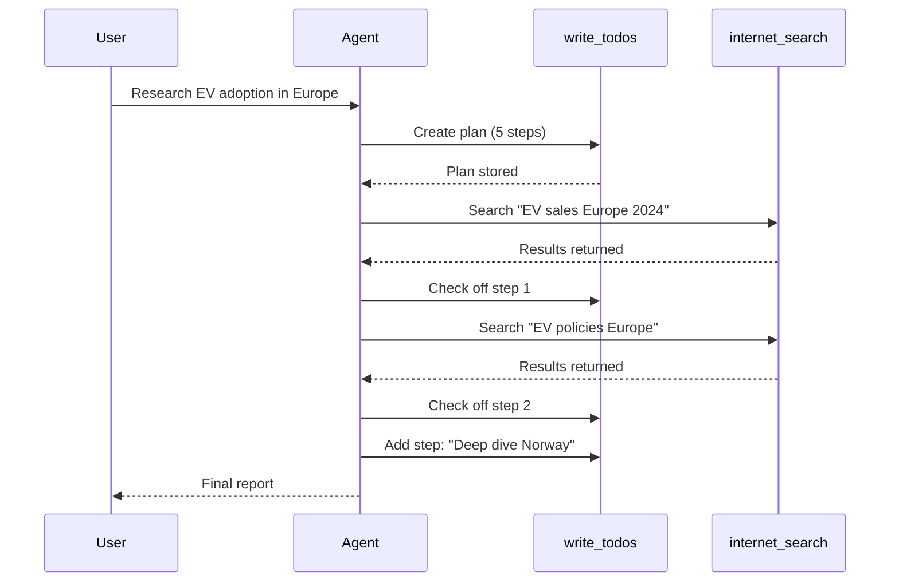
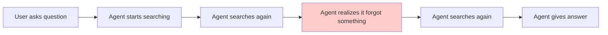
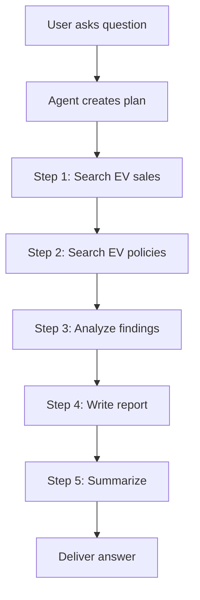
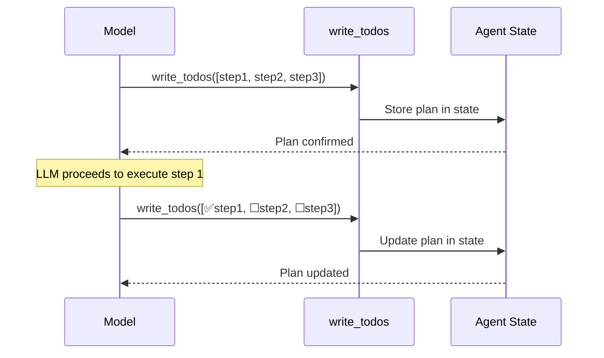

# Chapter 5: Task Planning (write_todos)

In [Chapter 4: Tools](04_tools_.md), you gave your agent hands — Python functions it can call to interact with the world. But here's the thing: having hands doesn't mean you know what to do with them. Imagine a chef who just starts grabbing ingredients and throwing them in a pot without a recipe. The result? A mess. **Task planning** is the recipe — it's how your agent thinks before it acts.

---

## Why Does This Matter?

Imagine you ask someone to plan a vacation:

> "Book me a trip to Tokyo for next week."

A **reactive** person might immediately book the first flight they see, then realize they forgot to check if the hotel is available, then realize the dates don't work, then cancel everything and start over. Chaos.

A **planning** person would first write down the steps:

1. Check available flights to Tokyo next week
2. Find hotels near the city center
3. Compare prices and pick the best options
4. Book the flight
5. Book the hotel
6. Research activities and restaurants
7. Create a day-by-day itinerary

Then they'd work through the list, checking off each step. If they discover the flights are too expensive, they'd adjust the plan — maybe look at different dates.

**That's exactly what `write_todos` does for your agent.** It's a built-in tool that lets the agent:

- **Break down** a complex task into an ordered checklist
- **Track progress** by checking off completed steps
- **Adapt the plan** when new information arrives

This is what makes Deep Agents fundamentally different from simple chat agents. They *think ahead* rather than reacting one step at a time.

---

## A Concrete Example: The Research Report

Let's say you're building a research agent. A user asks:

> "Write a report on the current state of electric vehicle adoption in Europe."

A simple chat agent might just start typing an answer from memory — and it'll be shallow, outdated, or wrong. A Deep Agent with `write_todos` does something smarter. Before it does *anything*, it creates a plan:

```
📋 Task Plan:
1. ☐ Search for latest EV sales data in Europe
2. ☐ Search for government EV policies by country
3. ☐ Search for charging infrastructure statistics
4. ☐ Read and analyze the search results
5. ☐ Write the report to a file
6. ☐ Summarize key findings for the user
```

Then it works through the list one by one, checking off each step. If step 1 reveals that Norway is way ahead of other countries, it might add a new step: "Deep dive into Norway's EV incentives."

This is planning in action. And the best part? **You don't have to build it.** It's built in.

---

## What Is `write_todos`?

`write_todos` is a **built-in tool** that comes automatically with every Deep Agent. You don't add it to your `tools` list — it's already there, just like `read_file` and `write_file`.

Think of it as a smart to-do list that lives inside the agent's memory. The agent can:

| Action | What It Does | Analogy |
|--------|-------------|---------|
| Create a plan | Write down all the steps before starting | A chef writing a recipe before cooking |
| Check off steps | Mark steps as done when completed | Crossing items off a grocery list |
| Reorder steps | Move steps around based on priority | Re-prioritizing your errands |
| Add new steps | Insert steps when new needs emerge | Adding "buy milk" when you realize you're out |
| Remove steps | Delete steps that turn out to be unnecessary | Skipping a store that's closed |

The agent manages this list *itself*. You don't write any planning logic. The LLM decides when to plan, what to plan, and how to adapt.

---

## How It Works: A Simple Walkthrough

Let's trace what happens when you give a Deep Agent a complex task. We'll use the research agent from [Chapter 4: Tools](04_tools_.md):

```python
agent = create_deep_agent(
    model="openai:gpt-4o",
    tools=[internet_search],
    system_prompt="You are an expert researcher.",
)
```

Now invoke it with a multi-step request:

```python
result = agent.invoke({
    "messages": [
        {"role": "user", 
         "content": "Research EV adoption in Europe"}
    ]
})
```

Here's what happens inside the agent:



Notice the key moments:

1. **Before doing anything**, the agent calls `write_todos` to create a plan
2. **After each step**, it checks off the completed item
3. **When it learns something new** (Norway is interesting), it adds a step
4. **Only at the end** does it deliver the final answer

---

## You Don't Call `write_todos` — The Agent Does

Here's the most important thing to understand: **you never call `write_todos` yourself.** It's a tool the LLM decides to use, just like your custom tools.

Remember the tool calling flow from [Chapter 4: Tools](04_tools_.md)? It works the same way:

1. The LLM sees the user's request
2. It sees `write_todos` in its available tools
3. It decides: *"This is a complex task. I should plan first."*
4. It calls `write_todos` with a list of steps
5. The framework stores the plan
6. The LLM proceeds to execute the plan step by step

You don't write any code to trigger this. The LLM makes the decision based on the task complexity. Simple questions like "What's 2+2?" won't trigger planning. Complex requests like "Write a research report" will.

---

## What the Plan Looks Like Internally

When the agent calls `write_todos`, it creates a structured list of todo items. Each item has:

| Field | What It Holds | Example |
|-------|--------------|---------|
| `content` | What needs to be done | "Search for EV sales data" |
| `status` | Current state | `"pending"`, `"in_progress"`, `"completed"` |
| `activeForm` | What the agent is doing right now | "Searching for EV sales data..." |

The agent updates this list as it works. Here's how the plan evolves over time:

**After initial planning:**
```
1. ☐ Search for EV sales data in Europe
2. ☐ Search for government EV policies
3. ☐ Search for charging infrastructure stats
4. ☐ Write the report
5. ☐ Summarize findings
```

**After completing step 1:**
```
1. ✅ Search for EV sales data in Europe
2. ☐ Search for government EV policies
3. ☐ Search for charging infrastructure stats
4. ☐ Write the report
5. ☐ Summarize findings
```

**After discovering Norway is interesting:**
```
1. ✅ Search for EV sales data in Europe
2. ✅ Search for government EV policies
3. ☐ Deep dive into Norway's EV incentives
4. ☐ Search for charging infrastructure stats
5. ☐ Write the report
6. ☐ Summarize findings
```

The plan is **alive** — it changes as the agent learns. This is fundamentally different from a static script that follows rigid steps.

---

## Planning vs. No Planning: A Comparison

Let's see the difference side by side. Imagine the same task: *"Research EV adoption in Europe."*

### Without Planning (Simple Chat Agent)



Problems:
- No structure — the agent just reacts
- It might forget important subtasks
- It can't track what it's already done
- It might repeat work or skip steps

### With Planning (Deep Agent + write_todos)



Benefits:
- **Structured** — the agent knows all the steps upfront
- **Trackable** — it can see what's done and what's left
- **Adaptable** — it can add or remove steps as needed
- **Reliable** — less likely to forget or repeat steps

---

## When Does the Agent Plan?

The agent doesn't plan for *every* request. It's smart about when to use `write_todos`:

| Request Type | Will It Plan? | Why? |
|-------------|---------------|------|
| "What's 2+2?" | ❌ No | Simple, one-step answer |
| "What's the weather in Tokyo?" | ❌ No | Single tool call, no complexity |
| "Compare EV adoption in 3 countries" | ✅ Yes | Multi-step, needs multiple searches |
| "Write a research report on AI" | ✅ Yes | Complex, many subtasks |
| "Debug this code and fix all issues" | ✅ Yes | Multiple steps, might discover new issues |

The LLM decides based on task complexity. You can influence this through your [System Prompt](02_system_prompt_.md) — for example, you could add a rule like "Always plan before starting research tasks."

---

## How the Built-in Instructions Help

Remember from [Chapter 2: System Prompt](02_system_prompt_.md) that Deep Agents merges your custom prompt with built-in instructions? Part of those built-in instructions teach the agent *how and when to use `write_todos`*.

The built-in instructions cover things like:

- **When to plan** — complex, multi-step tasks
- **How to structure steps** — clear, actionable items
- **When to update the plan** — after completing a step or learning new info
- **When NOT to plan** — simple, single-step questions

You don't write any of this. The framework handles it. Your job is just to write your business-specific prompt.

---

## A Real Example You Can Run

Let's put it all together with a complete, runnable example:

```python
from deepagents import create_deep_agent

def internet_search(query: str) -> str:
    """Search the web for information."""
    return f"Results for: {query}"

agent = create_deep_agent(
    model="openai:gpt-4o",
    tools=[internet_search],
    system_prompt="You are a research assistant.",
)
```

Now give it a complex task:

```python
result = agent.invoke({
    "messages": [
        {"role": "user", 
         "content": "Compare renewable energy adoption in Germany and France"}
    ]
})
```

**What happens inside:**

1. The agent calls `write_todos` with a plan like:
   - Search for Germany's renewable energy stats
   - Search for France's renewable energy stats
   - Compare the two countries
   - Summarize findings

2. It works through each step, calling `internet_search` and checking off items

3. It delivers a structured comparison

You can observe this process if you use streaming (covered in [Streaming](11_streaming_.md)) — you'll see the agent create the plan, execute each step, and adapt as it goes.

---

## What Happens Under the Hood

Let's look at how `write_todos` is implemented internally. When `create_deep_agent` sets up the agent, it registers `write_todos` as a built-in tool alongside your custom tools.

The tool itself is straightforward — it takes a list of todo items and stores them in the agent's state:

```python
# Simplified version of what write_todos does
def write_todos(todos: list[dict]) -> dict:
    """Update the task plan with new steps."""
    # Each todo has: content, status, activeForm
    # Store in agent state for tracking
    return {"todos": todos}
```

When the agent calls it, the plan is saved in the **LangGraph state** — the same state that holds the conversation messages. This means:

- The plan persists across tool calls within the same run
- The agent can read the current plan at any time
- Each update overwrites the previous plan (it's a full replacement, not an append)

The flow looks like this:



Every time the agent completes a step or wants to change the plan, it calls `write_todos` again with the updated list. The previous plan is replaced entirely.

---

## The Plan Is a Living Document

One of the most powerful aspects of `write_todos` is that the plan isn't set in stone. The agent can:

### Add steps when it discovers new needs

The agent searches for EV data and realizes charging infrastructure is a key factor. It adds a new step: "Research charging station coverage."

### Remove steps that turn out to be unnecessary

The agent planned to "Search for EV tax incentives by country" but discovers a comprehensive report that already covers this. It removes the step.

### Reorder steps based on priority

The agent realizes it should understand the overall market size before diving into country-specific data. It reorders the plan.

### Split steps into smaller ones

"Write the report" becomes "Write introduction," "Write market overview," "Write country comparison," and "Write conclusion."

This adaptability is what makes Deep Agents so effective for complex tasks. The plan evolves with the agent's understanding.

---

## Planning and the File System Work Together

Here's a pattern you'll see often: the agent uses `write_todos` to plan, then uses the file system tools (covered in [Backend (File System)](07_backend__file_system__.md)) to save intermediate results.

Why? Because complex research generates a lot of data. If the agent tries to keep everything in its conversation context, it'll run out of room. Instead:

1. **Plan** the research steps with `write_todos`
2. **Search** and collect data
3. **Write** intermediate results to files
4. **Read** the files back when needed
5. **Compile** the final answer

This plan → search → save → compile pattern is the bread and butter of Deep Agents. The planning tool provides the structure, and the file system provides the storage.

---

## Common Beginner Mistakes

### ❌ Expecting planning for simple tasks

If you ask "What's the capital of France?", the agent won't create a 5-step plan. It'll just answer. Planning is for *complex* tasks. Don't worry — the LLM knows when to plan.

### ❌ Trying to call `write_todos` yourself

`write_todos` is a tool for the *agent*, not for you. You don't import it or call it in your code. The LLM decides when to use it, just like it decides when to call your custom tools.

### ❌ Writing planning instructions in your system prompt

You might be tempted to add something like: *"Always break tasks into steps using write_todos."* But Deep Agents already includes these instructions in its built-in prompt (as we learned in [Chapter 2: System Prompt](02_system_prompt_.md)). Adding your own might conflict with the framework's guidance.

### ❌ Confusing the plan with the output

The todo list is an *internal* planning tool. The user doesn't see it (unless you use streaming to show the agent's work). The final answer is what the agent delivers after executing the plan.

---

## Quick Reference: Task Planning Cheat Sheet

| Question | Answer |
|----------|--------|
| Do I need to add `write_todos` to my tools list? | No, it's built in automatically |
| Do I call it in my code? | No, the LLM calls it when it decides to plan |
| When does the agent plan? | For complex, multi-step tasks |
| Can the plan change? | Yes, the agent adds, removes, and reorders steps |
| Where is the plan stored? | In the agent's LangGraph state |
| Can I see the plan? | Yes, via streaming (see [Streaming](11_streaming_.md)) |
| Can I force planning? | You can hint at it in your system prompt, but the LLM ultimately decides |

---

## Summary

In this chapter, you learned:

- **`write_todos`** is a built-in tool that lets the agent plan before it acts — like writing a recipe before cooking
- It makes Deep Agents **fundamentally different** from simple chat agents that just react step by step
- The agent **creates a plan**, **tracks progress**, and **adapts** as new information arrives
- You **don't call it yourself** — the LLM decides when to plan based on task complexity
- The plan is a **living document** that evolves as the agent works
- Planning pairs naturally with the **file system** for the plan → search → save → compile pattern
- Deep Agents includes **built-in instructions** that teach the agent how and when to plan

Your agent now has an identity ([System Prompt](02_system_prompt_.md)), a brain ([Model Configuration](03_model_configuration_.md)), hands ([Tools](04_tools_.md)), and a strategy for tackling complex tasks. But what about remembering things across conversations? In the next chapter, you'll learn how to give your agent long-term memory.

👉 [Memory / Store](06_memory___store_.md)

---

Generated by [AI Codebase Knowledge Builder](https://github.com/The-Pocket/Tutorial-Codebase-Knowledge)