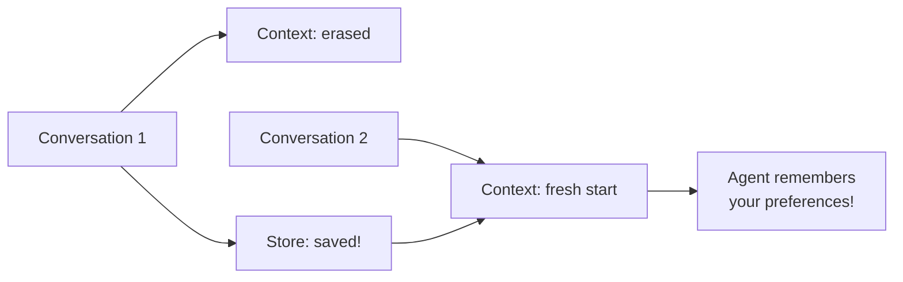
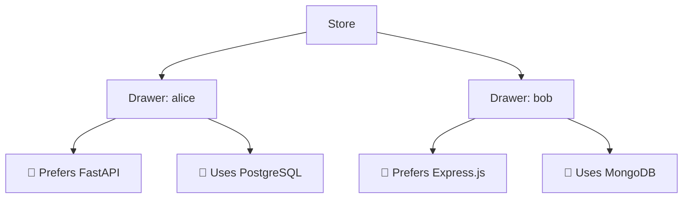
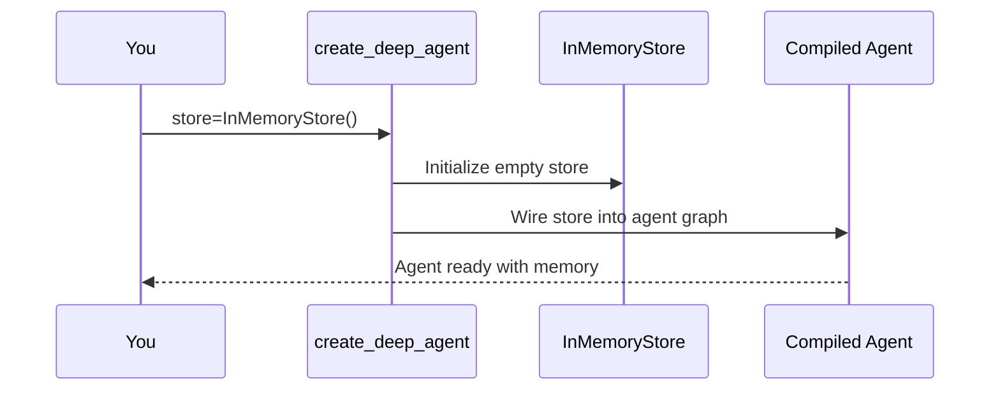
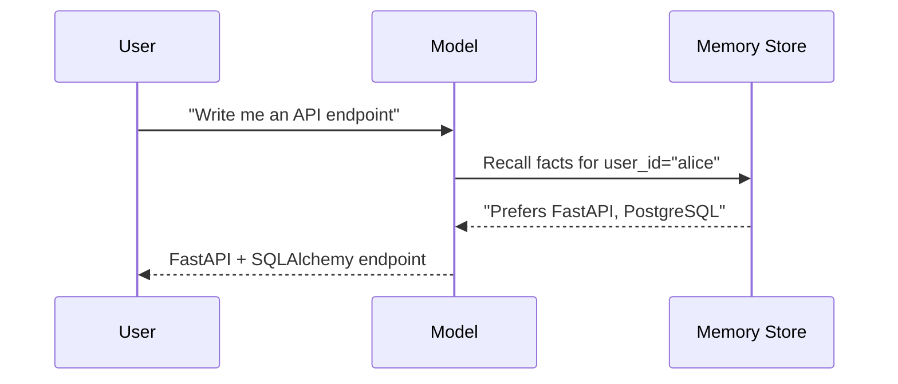
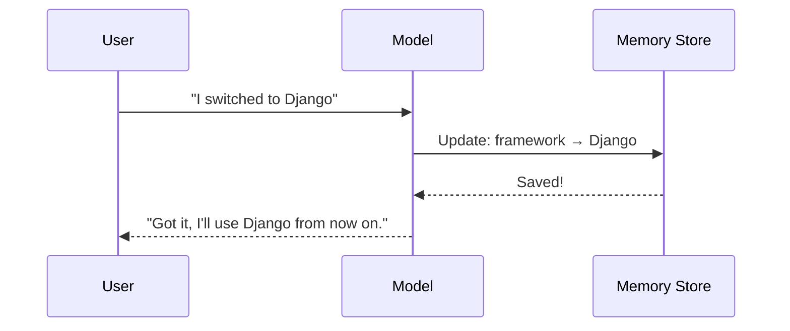

# Chapter 6: Memory / Store

In [Chapter 5: Task Planning (write_todos)](05_task_planning__write_todos__.md), you learned how your agent plans before it acts — breaking complex tasks into step-by-step checklists. But there's a problem: every time you start a new conversation, your agent starts from scratch. It doesn't remember *anything* from last time. That's like hiring an employee who forgets everything overnight. **Memory / Store** fixes that.

---

## Why Does This Matter?

Imagine you have a personal assistant. Every morning, you have to re-explain:

- "I prefer my meetings in the afternoon."
- "I use Python, not Java."
- "Always CC my manager on project updates."

By the 100th time, you'd be furious. You'd say: *"Why can't you just REMEMBER?"*

That's exactly what happens with AI agents by default. Each conversation is a blank slate. The agent has no idea what you told it yesterday, last week, or in a completely different thread.

**Memory / Store gives your agent a notebook it carries everywhere.** It survives across conversations, across threads, across sessions. The agent can:

- **Save** important facts it learns about you
- **Recall** those facts in future conversations
- **Update** them when things change

This is what makes agents *progressively more useful* — the more you work with them, the better they get.

---

## A Concrete Example: The Coding Assistant

Let's say you're building a coding assistant. In your first conversation, you tell it:

> "I always use Python with FastAPI. My project uses PostgreSQL. I prefer type hints everywhere."

Without memory, the next day you start a new conversation and ask:

> "Write me an API endpoint for creating a user."

The agent might suggest Express.js with MongoDB — completely wrong for your stack. 😩

**With memory**, the agent *remembers* your preferences. It saved them from yesterday's conversation. So when you ask for that endpoint, it automatically writes:

- FastAPI, not Express
- SQLAlchemy with PostgreSQL, not MongoDB
- Full type hints on every function

Same question, wildly different (and correct) result. That's the power of persistent memory.

---

## Short-Term vs. Long-Term Memory

Before we dive into code, let's clarify the two types of memory your agent has:

| Type | What It Is | How Long It Lasts | Analogy |
|------|-----------|-------------------|---------|
| **Context** (short-term) | The current conversation messages | One session only | A whiteboard that gets erased after each meeting |
| **Store** (long-term) | Saved facts and preferences | Forever, across sessions | A notebook you carry from meeting to meeting |

The **context** is what we've been using all along — the `messages` list you pass to `.invoke()`. It's great for the current conversation, but it vanishes when the session ends.

The **store** is what we're adding now. It persists. It's the notebook.



---

## How to Add Memory to Your Agent

Enabling memory is surprisingly simple. You pass a `store` parameter to `create_deep_agent`:

```python
from deepagents import create_deep_agent
from langgraph.store.memory import InMemoryStore

store = InMemoryStore()

agent = create_deep_agent(
    model="openai:gpt-4o",
    tools=[],
    system_prompt="You are a helpful assistant.",
    store=store,
)
```

That's it! The agent now has a persistent store it can read from and write to.

> **What is `InMemoryStore`?** It's a LangGraph store that keeps data in memory. It's great for development and testing. For production, you'd use a persistent backend (like a database) — but the API is the same.

---

## How the Agent Uses Memory

Here's the key insight: **you don't manually save or load things from the store.** The agent decides what to remember and when to recall it, just like it decides when to call [Tools](04_tools_.md).

When you enable `store`, the agent gains the ability to:

1. **Save facts** — "This user prefers Python with FastAPI"
2. **Recall facts** — Look up what it knows before answering
3. **Update facts** — "Actually, they switched to Django"

The LLM makes these decisions automatically. You just provide the store; the agent uses it intelligently.

---

## A Full Example: Remembering User Preferences

Let's build a coding assistant that remembers your tech stack:

```python
from deepagents import create_deep_agent
from langgraph.store.memory import InMemoryStore

store = InMemoryStore()
```

```python
agent = create_deep_agent(
    model="openai:gpt-4o",
    tools=[],
    system_prompt="You are a coding assistant.",
    store=store,
)
```

**Conversation 1** — Tell the agent about your preferences:

```python
result = agent.invoke({
    "messages": [
        {"role": "user", 
         "content": "I use Python with FastAPI and PostgreSQL."}
    ]
}, config={"configurable": {"user_id": "alice"}})
```

The agent saves this fact to the store. Now start a **completely new conversation**:

```python
result = agent.invoke({
    "messages": [
        {"role": "user", 
         "content": "Write me an API endpoint for creating a user."}
    ]
}, config={"configurable": {"user_id": "alice"}})
```

The agent recalls your preferences from the store and writes a FastAPI + SQLAlchemy endpoint — without you repeating anything!

---

## The `user_id` Connection

Notice the `config` parameter in the example above:

```python
config={"configurable": {"user_id": "alice"}}
```

This is how the store knows **whose** data to look up. The store organizes data by namespace, and the `user_id` is a natural way to partition it.

Think of it like a filing cabinet:



When Alice talks to the agent, it opens Alice's drawer. When Bob talks, it opens Bob's. No mix-ups.

---

## What Gets Stored?

The agent is smart about what it saves. It doesn't store every word of every conversation — that would be like writing down every "um" and "uh" in a meeting. Instead, it stores **high-value facts**:

| Good Candidate for Store | Bad Candidate for Store |
|--------------------------|------------------------|
| "User prefers Python" | "User said hello" |
| "Project uses FastAPI" | "The weather is sunny" |
| "Always use type hints" | "What's 2+2?" |
| "Deploy to AWS, not GCP" | Temporary calculation results |

The built-in instructions (which we learned about in [System Prompt](02_system_prompt_.md)) teach the agent *what kind of things are worth remembering*. You don't need to spell this out.

---

## What Happens Under the Hood?

When you pass `store=InMemoryStore()` to `create_deep_agent`, here's what happens:



Then at runtime, when the agent needs to remember something:



Step by step:

1. **User asks a question** — the agent receives the message
2. **Agent recalls from store** — before answering, it looks up relevant facts for this user
3. **Store returns saved data** — preferences, conventions, past decisions
4. **Agent answers with context** — it uses the recalled facts to give a better answer

When the agent *learns* something new worth saving:



The agent updates the store so future conversations reflect the change.

---

## Memory + Checkpointer: A Common Pairing

There's another concept you might see alongside `store`: the **checkpointer**. While the store saves *facts*, the checkpointer saves *conversation state* (the full message history for a thread).

| Concept | What It Saves | Scope | Analogy |
|---------|--------------|-------|---------|
| **Store** | Facts and preferences | Cross-thread, cross-conversation | A notebook |
| **Checkpointer** | Conversation history | Within a single thread | A meeting transcript |

You can use both together:

```python
from langgraph.checkpoint.memory import MemorySaver
from langgraph.store.memory import InMemoryStore

checkpointer = MemorySaver()
store = InMemoryStore()
```

```python
agent = create_deep_agent(
    model="openai:gpt-4o",
    store=store,
    checkpointer=checkpointer,
)
```

The checkpointer lets you resume a conversation where you left off. The store lets the agent remember facts across *different* conversations. Together, they give your agent both short-term continuity and long-term learning.

---

## Guiding What the Agent Remembers

While the built-in instructions handle most of the "when to remember" logic, you can nudge the agent through your [System Prompt](02_system_prompt_.md):

```python
system_prompt = """
You are a coding assistant.

Always remember:
- The user's preferred programming language and framework
- The user's project conventions (naming, testing, etc.)
- Any corrections the user makes to your suggestions

When in doubt, save it to memory rather than forgetting.
"""
```

This tells the agent to be proactive about saving useful information. But don't go overboard — you don't want it saving every casual remark.

---

## Common Beginner Mistakes

### ❌ Forgetting to pass the store

```python
agent = create_deep_agent(
    model="openai:gpt-4o",
    # No store parameter!
)
```

Without `store`, the agent has no long-term memory. Every conversation starts fresh. It's like hiring someone with amnesia.

### ❌ Not passing `user_id` in config

```python
result = agent.invoke({"messages": [...]})
# No config with user_id!
```

The store needs to know *whose* data to look up. Without a `user_id`, the agent can't find the right drawer in its filing cabinet.

### ❌ Storing everything

Don't try to make the agent remember every single message. The store is for **high-value, reusable facts** — preferences, conventions, decisions. Not casual chit-chat.

### ❌ Confusing store with checkpointer

- **Store** = facts that persist across *different* conversations and threads
- **Checkpointer** = conversation history that persists within the *same* thread

They serve different purposes. Use both when you need both.

### ❌ Using InMemoryStore in production

`InMemoryStore` is great for development, but it vanishes when your process restarts. For production, use a persistent store backed by a database. The LangGraph ecosystem provides options for this.

---

## Quick Reference: Memory / Store Cheat Sheet

| Question | Answer |
|----------|--------|
| How do I enable memory? | Pass `store=InMemoryStore()` to `create_deep_agent` |
| Do I manually save/load data? | No, the agent decides what to remember and recall |
| How does the store know whose data to use? | Pass `user_id` in the `config` parameter |
| What should be stored? | User preferences, project conventions, past decisions |
| What should NOT be stored? | Casual conversation, temporary calculations |
| Store vs. Checkpointer? | Store = facts across conversations; Checkpointer = history within a thread |
| Is `InMemoryStore` production-ready? | No, use a database-backed store for production |

---

## Summary

In this chapter, you learned:

- **Memory / Store** gives your agent long-term memory that survives across conversations and threads — like a notebook it carries everywhere
- Without it, every conversation starts from scratch; with it, the agent **gets progressively more useful** over time
- You enable it by passing `store=InMemoryStore()` to `create_deep_agent`
- The agent **automatically decides** what to save, recall, and update — you don't write save/load logic
- Use `user_id` in the config so the store knows whose data to look up
- Store **high-value facts** (preferences, conventions, decisions), not casual conversation
- The **store** (facts) and **checkpointer** (conversation history) serve different but complementary purposes

Your agent now has an identity ([System Prompt](02_system_prompt_.md)), a brain ([Model Configuration](03_model_configuration_.md)), hands ([Tools](04_tools_.md)), a strategy ([Task Planning](05_task_planning__write_todos__.md)), and a memory. But where do the files go when the agent writes them? In the next chapter, you'll learn about the file system backend that powers the agent's workspace.

👉 [Backend (File System)](07_backend__file_system_.md)

---

Generated by [AI Codebase Knowledge Builder](https://github.com/The-Pocket/Tutorial-Codebase-Knowledge)