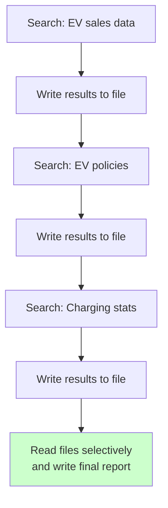
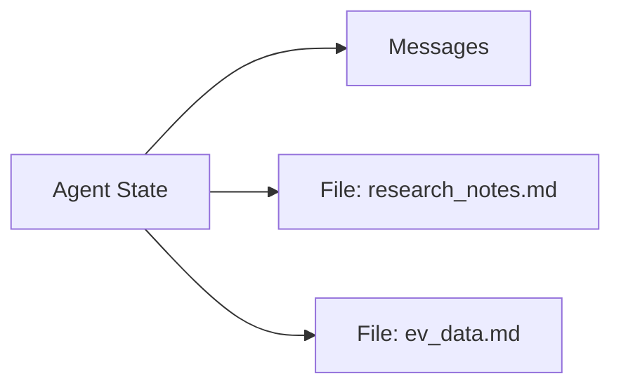
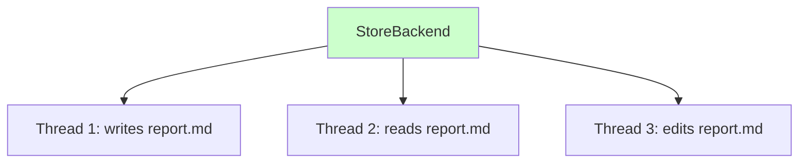
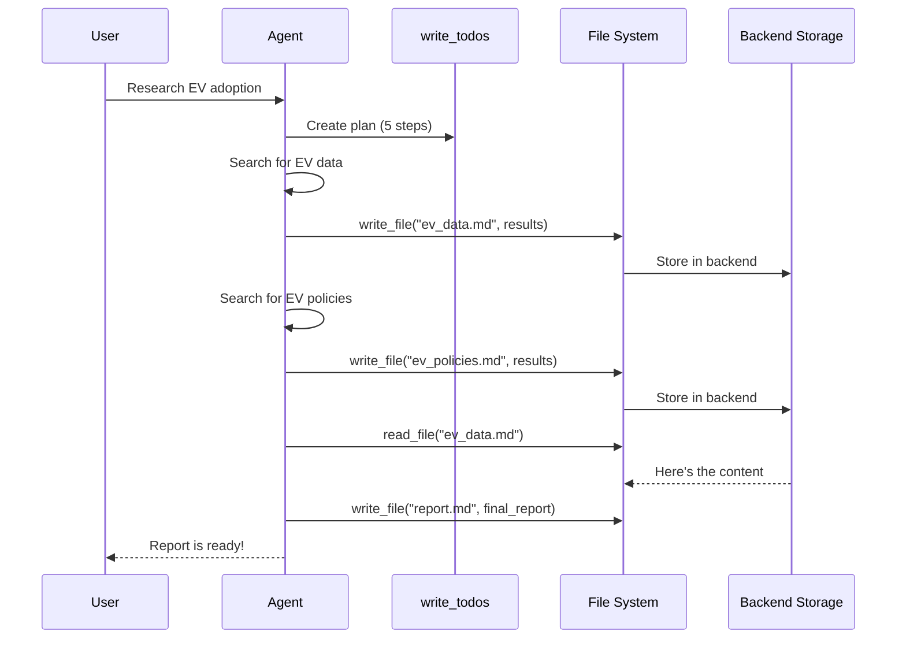
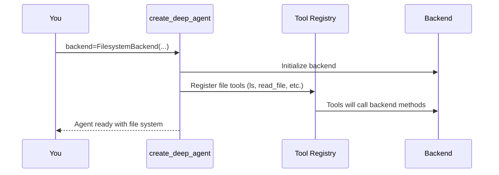
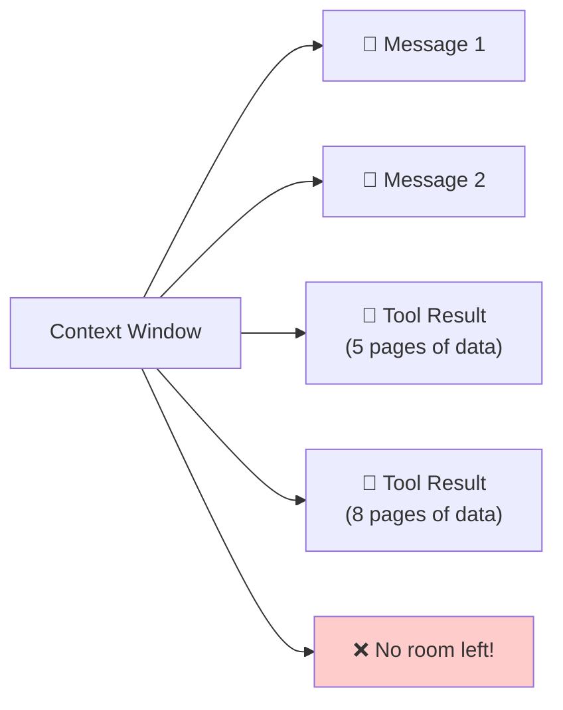
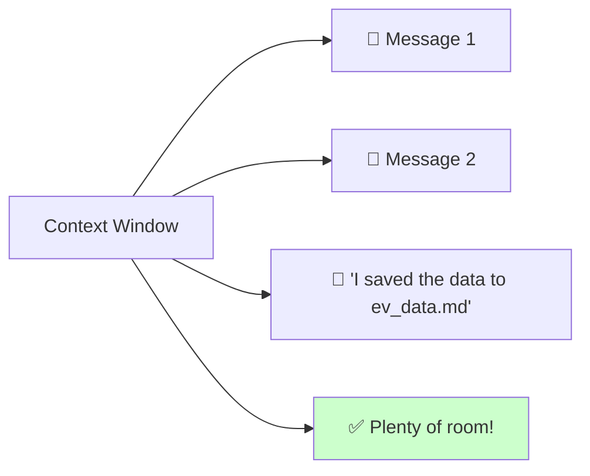
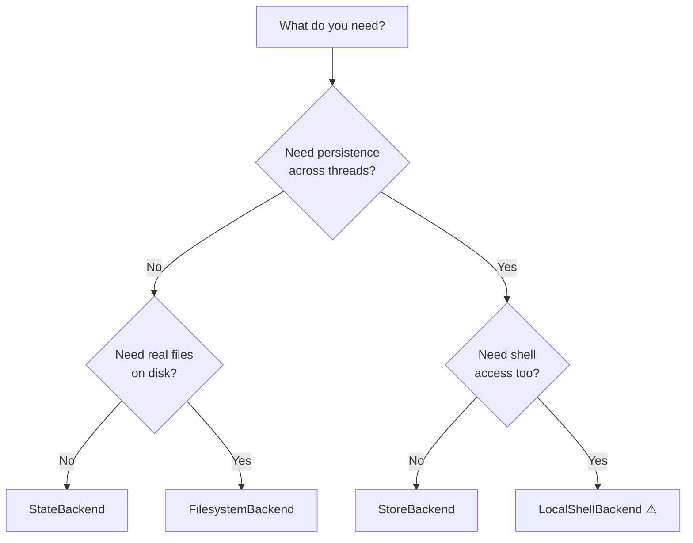

# Chapter 7: Backend (File System)

In [Chapter 6: Memory / Store](06_memory___store_.md), you gave your agent a notebook it carries everywhere — long-term memory that survives across conversations. But what about the *stuff* your agent creates along the way? Research notes, code files, intermediate results, full reports? Those aren't just "facts to remember" — they're **documents that need a home**. That's where the Backend (File System) comes in.

---

## Why Does This Matter?

Imagine you're writing a 20-page research paper. You could try to hold every draft, every source, and every footnote in your head — but you'd go crazy. Instead, you **write things down in files**. You create folders, save drafts, pull up earlier versions, and search across your notes.

AI agents face the exact same problem. When an agent researches a complex topic, it might gather pages and pages of search results. If it tries to keep all of that in its conversation context, two things happen:

1. **The context window fills up** — there's a hard limit on how much text the LLM can hold
2. **Quality degrades** — the more you stuff in, the harder it is for the LLM to focus on what matters

**The file system is the agent's desk with drawers.** Instead of holding everything in its head (context), the agent can file things away and retrieve them later. This is a game-changer for complex tasks.

---

## A Concrete Example: The Research Report Agent

Let's say your agent needs to write a report on renewable energy. Here's what happens **without** a file system:


The agent's context becomes a cluttered mess. Now here's the same task **with** a file system:



Much better! The agent saves intermediate results to files, keeping its context lean. When it's time to write the report, it reads back only what it needs.

---

## What Is the Backend?

The **backend** is the *storage location* for the agent's virtual file system. It answers the question: "Where do the files actually live?"

Think of it like choosing where to store your physical documents:

| Storage Option | Analogy | Traits |
|---------------|---------|--------|
| `StateBackend` | A whiteboard in the meeting room | Temporary, only visible in this meeting |
| `FilesystemBackend` | A filing cabinet in your office | Persistent, on your local disk |
| `StoreBackend` | A shared company drive | Persistent, accessible across teams |
| `LocalShellBackend` | Your personal computer | Full access, no isolation |
| Sandbox backend | A locked workshop | Isolated, safe to experiment |

Different backends make different trade-offs between **isolation**, **persistence**, and **sharing**. You pick the one that fits your use case.

---

## The Built-in File Tools

Regardless of which backend you choose, your agent gets the **same set of file tools**. The backend is just the storage — the tools are the interface. Here's what the agent can do:

| Tool | What It Does | Real-World Analogy |
|------|-------------|-------------------|
| `ls` | List files in a directory | Opening a drawer to see what's inside |
| `read_file` | Read a file's contents | Pulling a document out to read it |
| `write_file` | Create or overwrite a file | Filing a new document in a drawer |
| `edit_file` | Make targeted changes to a file | Using white-out and a pen on a document |
| `glob` | Find files by name pattern | Searching the cabinet by label |
| `grep` | Search inside files for text | Flipping through pages looking for a keyword |

You don't add these to your `tools` list — they're **built in automatically**, just like `write_todos` from [Chapter 5: Task Planning](05_task_planning__write_todos__.md).

---

## The Default: StateBackend

If you don't specify a backend, Deep Agents uses `StateBackend` by default:

```python
from deepagents import create_deep_agent

agent = create_deep_agent(
    model="openai:gpt-4o",
    tools=[],
    system_prompt="You are a research assistant.",
)
```

This is equivalent to:

```python
from deepagents import create_deep_agent
from deepagents.backends import StateBackend

agent = create_deep_agent(
    model="openai:gpt-4o",
    backend=StateBackend(),
)
```

**What does StateBackend do?** It stores files inside the current thread's LangGraph state — the same state that holds your conversation messages.



This means:
- ✅ Files persist **within the same thread** across multiple turns
- ❌ Files are **not shared** across different threads
- ❌ Files **vanish** when the thread is cleaned up

It's like a whiteboard: great for the current meeting, but erased when you leave the room.

**When to use it:** Quick tasks, prototyping, and situations where you don't need files to survive beyond one conversation.

---

## Local Disk: FilesystemBackend

When you want files to live on your **actual hard drive**, use `FilesystemBackend`:

```python
from deepagents import create_deep_agent
from deepagents.backends import FilesystemBackend

backend = FilesystemBackend(root_dir="/path/to/workspace")
```

```python
agent = create_deep_agent(
    model="openai:gpt-4o",
    backend=backend,
    system_prompt="You are a coding assistant.",
)
```

Now when the agent writes a file, it appears as a **real file on your disk**:

```text
/path/to/workspace/
├── research_notes.md
├── ev_data.md
└── final_report.md
```

You can open these files in your editor, commit them to git, or share them with colleagues. They're real files.

**Key detail:** Use an **absolute path** for `root_dir`. Relative paths can cause confusion about where files end up.

**When to use it:** Coding assistants, report generators, and any task where you want the output as real files on disk.

---

## Cross-Thread Persistence: StoreBackend

What if you want files to persist **across different conversations and threads**? That's where `StoreBackend` comes in. It uses the LangGraph Store (the same one from [Memory / Store](06_memory___store_.md)) as the storage layer:

```python
from langgraph.store.memory import InMemoryStore
from deepagents.backends import StoreBackend

langgraph_store = InMemoryStore()
backend = StoreBackend(store=langgraph_store)
```

```python
agent = create_deep_agent(
    model="openai:gpt-4o",
    backend=backend,
    store=langgraph_store,
)
```

Now files saved in one conversation are available in another. It's like a shared company drive — everyone (every thread) can access the same files.



**When to use it:** Multi-session workflows where different conversations need to share files.

---

## Full Power: LocalShellBackend

`LocalShellBackend` gives the agent access to your **local file system AND a shell**. The agent can not only read and write files — it can **execute commands**:

```python
from deepagents.backends import LocalShellBackend

backend = LocalShellBackend(root_dir="/path/to/workspace")
```

```python
agent = create_deep_agent(
    model="openai:gpt-4o",
    backend=backend,
    system_prompt="You are a devops assistant.",
)
```

The agent gains an `execute` tool that lets it run shell commands like `pip install`, `pytest`, or `git status`.

⚠️ **Warning:** There is **no isolation**. The agent runs commands directly on your machine. Only use this in controlled development environments — never in production.

**When to use it:** Development environments where the agent needs to run tests, install packages, or use version control.

---

## Combining Backends: CompositeBackend

Sometimes you want **different paths to go to different backends**. For example, temporary scratch files in state, but important outputs on disk. `CompositeBackend` lets you route by path:

```python
from deepagents.backends import (
    CompositeBackend, StateBackend, FilesystemBackend
)
```

```python
backend = CompositeBackend(
    backends={
        "/tmp/**": StateBackend(),
        "/output/**": FilesystemBackend(root_dir="/reports"),
    },
    default=StateBackend(),
)
```

Now:
- Files under `/tmp/` go to the in-memory state (temporary)
- Files under `/output/` go to your local disk (persistent)
- Everything else defaults to state

**When to use it:** Complex setups where different types of files need different storage strategies.

---

## How the Agent Uses Files: A Walkthrough

Let's trace a complete example. You give the agent a research task:

```python
result = agent.invoke({
    "messages": [
        {"role": "user", 
         "content": "Research EV adoption in Europe and write a report"}
    ]
})
```

Here's what happens inside:



Key moments:
1. The agent **plans** the task (using `write_todos` from [Chapter 5](05_task_planning__write_todos__.md))
2. It **saves intermediate results** to files instead of keeping them in context
3. It **reads files back** when it needs to reference earlier work
4. It **writes the final output** to a file
5. The backend handles the actual storage — the agent doesn't know or care where

---

## What Happens Under the Hood

When you pass `backend=FilesystemBackend(root_dir="/workspace")` to `create_deep_agent`, here's the wiring:



Each file tool delegates to the backend. For example, when the agent calls `write_file`:

```python
# Simplified: what write_file does internally
def write_file(path: str, content: str) -> str:
    """Write content to a file."""
    # The backend handles the actual storage
    backend.write(path, content)
    return f"Successfully wrote to {path}"
```

The `backend.write()` method does the real work — saving to state, disk, store, or wherever. The tool is just the interface; the backend is the implementation.

This separation means you can **swap backends without changing any agent logic**. The agent calls the same `write_file` tool regardless of whether files end up in memory, on disk, or in a shared store.

---

## The Context Window Problem (Solved!)

Let's circle back to the core problem. Why does the file system matter so much?

An LLM has a **fixed context window** — a maximum amount of text it can hold at once. Think of it like a desk: there's only so much space. If you pile on too many papers, you can't find anything.



The file system solves this by letting the agent **offload** large content:



Instead of keeping 5 pages of search results in context, the agent writes them to a file and keeps just a one-line note: *"I saved the data to ev_data.md."* When it needs the data later, it reads the file back. This pattern — **save to file, keep context lean, read back when needed** — is the bread and butter of Deep Agents.

---

## Choosing the Right Backend: A Decision Guide



Here's a simple summary:

| Backend | Persistence | Sharing | Isolation | Shell Access |
|---------|------------|---------|-----------|-------------|
| `StateBackend` | Within thread only | No | ✅ Full | No |
| `FilesystemBackend` | On disk | Via filesystem | ❌ None | No |
| `StoreBackend` | Across threads | Via store | ✅ Full | No |
| `LocalShellBackend` | On disk | Via filesystem | ❌ None | ✅ Yes |

**Start with `StateBackend`** (the default). Upgrade only when you have a specific need.

---

## Common Beginner Mistakes

### ❌ Forgetting that StateBackend files don't cross threads

If you start a new conversation thread, the files from the last thread are gone. If you need cross-thread files, use `StoreBackend` or `FilesystemBackend`.

### ❌ Using LocalShellBackend in production

`LocalShellBackend` lets the agent run arbitrary commands on your machine. That's fine for your laptop — dangerous for a server. Use sandbox backends for production.

### ❌ Using relative paths with FilesystemBackend

```python
# ❌ Where does this actually point?
backend = FilesystemBackend(root_dir="./workspace")

# ✅ Be explicit
backend = FilesystemBackend(root_dir="/home/user/workspace")
```

### ❌ Trying to add file tools manually

You don't need to add `read_file` or `write_file` to your `tools` list. They're built in automatically when a backend is configured. Adding them yourself could cause conflicts.

### ❌ Expecting the file system to replace memory

The file system is for **documents and data**. The [Memory / Store](06_memory___store_.md) is for **facts and preferences**. They serve different purposes. Use both when appropriate — save the research data to a file, but remember the user's preferences in the store.

---

## Quick Reference: Backend Cheat Sheet

| Question | Answer |
|----------|--------|
| What's the default backend? | `StateBackend` — stores in thread state |
| Do I need to add file tools? | No, they're built in automatically |
| How do I save files to disk? | Use `FilesystemBackend(root_dir="/path")` |
| How do I share files across threads? | Use `StoreBackend` with a LangGraph Store |
| Can the agent run shell commands? | Only with `LocalShellBackend` (⚠️ no isolation) |
| Can I mix backends? | Yes, use `CompositeBackend` with path routing |
| Does the agent know which backend it's using? | No — it just calls file tools, the backend handles storage |

---

## Summary

In this chapter, you learned:

- The **Backend (File System)** gives your agent a desk with drawers — a place to save, retrieve, and organize files instead of holding everything in context
- It solves the **context window problem**: agents can offload large content to files and read it back when needed
- You get **built-in file tools** (`ls`, `read_file`, `write_file`, `edit_file`, `glob`, `grep`) automatically
- Different **backends** store files in different places: in-memory state, local disk, shared store, or sandbox — each with different trade-offs
- **StateBackend** (default) is great for prototyping; **FilesystemBackend** for real files on disk; **StoreBackend** for cross-thread persistence
- The agent doesn't know which backend it's using — it just calls file tools, and the backend handles the rest
- **Never use LocalShellBackend in production** — it has no isolation

Your agent now has a full workspace: identity ([System Prompt](02_system_prompt_.md)), brain ([Model Configuration](03_model_configuration_.md)), hands ([Tools](04_tools_.md)), strategy ([Task Planning](05_task_planning__write_todos__.md)), memory ([Memory / Store](06_memory___store_.md)), and a filing system. But who decides what the agent is *allowed* to read and write? In the next chapter, you'll learn how to set permissions that keep your agent in bounds.

👉 [Permissions](08_permissions_.md)

---

Generated by [AI Codebase Knowledge Builder](https://github.com/The-Pocket/Tutorial-Codebase-Knowledge)