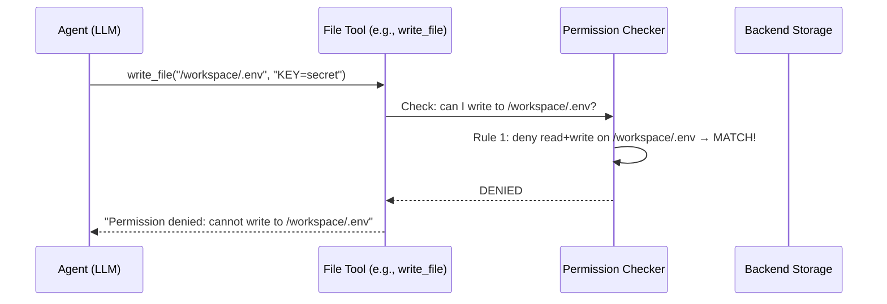

# Chapter 8: Permissions

In [Chapter 7: Backend (File System)](07_backend__file_system__.md), you gave your agent a desk with drawers — a place to save, retrieve, and organize files. But here's a scary thought: what if the agent opens the *wrong* drawer? What if it reads your `.env` file full of API keys? What if it overwrites your production config? **Permissions** are the lock on each drawer — they control which files the agent can access and what it's allowed to do with them.

---

## Why Does This Matter?

Imagine you hire a new employee and give them the key to **every room** in the building. The server room? Sure, go ahead. The CEO's office? Why not. The vault? Knock yourself out.

That's what happens by default with Deep Agents. The agent has full access to every file in its workspace. Most of the time, that's fine — the agent is just doing its job. But sometimes, it can go wrong:

- The agent **reads** a `.env` file and accidentally includes your secrets in its response
- The agent **overwrites** an important config file that it shouldn't touch
- The agent **deletes** critical data while trying to "clean up"

**Permissions let you build guardrails.** You decide which rooms the agent can enter and what it can do there. It's like giving your employee a badge that only opens the doors they need.

---

## A Concrete Example: The Coding Assistant

Let's say you're building a coding assistant that works in your project directory:

```text
/workspace/
├── src/
│   └── app.py
├── config/
│   └── settings.json
├── .env          ← Contains API keys!
└── README.md
```

You want the agent to:
- ✅ Read and write files in `/workspace/src/`
- ✅ Read files in `/workspace/config/`
- ❌ **Never** read or write `.env`
- ❌ **Never** write to `/workspace/config/`

Without permissions, the agent might happily read your `.env` file and echo your secrets back. With permissions, that file is locked — the agent simply can't touch it.

---

## What Are Permissions?

Permissions are a list of **rules** you pass to `create_deep_agent`. Each rule says:

- **Which operations** — read, write, or both
- **Which paths** — which files and folders the rule covers
- **Which mode** — allow or deny

Think of each rule as a sign on a door:

```text
🟢 ALLOW: "You may READ files in /workspace/src/"
🔴 DENY:  "You may NOT READ or WRITE /workspace/.env"
```

The agent checks these rules every time it tries to use a built-in file system tool like `read_file` or `write_file`. If a rule says "deny," the operation is blocked.

---

## The Key Concept: First Match Wins

This is the most important thing to understand about permissions: **rules are evaluated in order, and the first match wins.**

Imagine a security guard checking a list:

```text
1. Is this person on the VIP list? → Let them in
2. Is this person on the banned list? → Turn them away
3. Everyone else? → Let them in
```

If someone is on *both* lists, rule 1 wins — they get in. Order matters!

The same applies to permissions:

```python
permissions=[
    FilesystemPermission(
        operations=["read", "write"],
        paths=["/workspace/.env"],
        mode="deny",
    ),
    FilesystemPermission(
        operations=["read", "write"],
        paths=["/workspace/**"],
        mode="allow",
    ),
]
```

Here, `.env` is denied *before* the broader `/workspace/**` allow rule. If you reversed the order, `.env` would be allowed — the broad rule would match first!

---

## The `FilesystemPermission` Object

Each permission rule is a `FilesystemPermission` object with three fields:

| Field | What It Does | Example Values |
|-------|-------------|----------------|
| `operations` | Which file operations the rule covers | `["read"]`, `["write"]`, `["read", "write"]` |
| `paths` | Which file paths the rule covers (supports glob patterns) | `["/workspace/**"]`, `["/.env"]` |
| `mode` | Whether to allow or deny | `"allow"` or `"deny"` |

### Operations

The `operations` field maps directly to the built-in file tools:

| Operation | Tools It Controls |
|-----------|-------------------|
| `"read"` | `read_file`, `ls`, `glob`, `grep` |
| `"write"` | `write_file`, `edit_file` |

If you set `operations=["write"]`, the agent can still *read* those files — it just can't modify them.

### Paths and Glob Patterns

The `paths` field uses **glob patterns** to match file paths:

| Pattern | What It Matches |
|---------|----------------|
| `/workspace/**` | All files inside `/workspace/` (any depth) |
| `/workspace/*.md` | All `.md` files directly in `/workspace/` |
| `/.env` | Only the `.env` file at the root |
| `/**` | Every file, everywhere |

The `**` means "any number of subdirectories." It's like saying "and everything inside."

### Mode

Simple binary choice:

- `"allow"` — the agent *can* do this operation on these paths
- `"deny"` — the agent *cannot* do this operation on these paths

---

## Building Up Permissions: Step by Step

Let's construct the permissions for our coding assistant example, one rule at a time.

### Step 1: Block access to secrets

First, protect the sensitive files:

```python
from deepagents import FilesystemPermission

permissions = [
    FilesystemPermission(
        operations=["read", "write"],
        paths=["/workspace/.env", "/workspace/secrets/**"],
        mode="deny",
    ),
]
```

Now the agent can't read or write `.env` or anything under `secrets/`. But everything else is still open (since the default is allow when no rule matches).

### Step 2: Allow full access to source code

```python
permissions = [
    FilesystemPermission(
        operations=["read", "write"],
        paths=["/workspace/.env", "/workspace/secrets/**"],
        mode="deny",
    ),
    FilesystemPermission(
        operations=["read", "write"],
        paths=["/workspace/src/**"],
        mode="allow",
    ),
]
```

The agent can read and write source files. But wait — what about `config/`?

### Step 3: Allow read-only access to config

```python
permissions = [
    FilesystemPermission(
        operations=["read", "write"],
        paths=["/workspace/.env", "/workspace/secrets/**"],
        mode="deny",
    ),
    FilesystemPermission(
        operations=["read", "write"],
        paths=["/workspace/src/**"],
        mode="allow",
    ),
    FilesystemPermission(
        operations=["read"],
        paths=["/workspace/config/**"],
        mode="allow",
    ),
]
```

The agent can read config files but can't modify them. No accidental overwrites!

### Step 4: Deny everything else

Finally, lock down the rest:

```python
permissions = [
    FilesystemPermission(
        operations=["read", "write"],
        paths=["/workspace/.env", "/workspace/secrets/**"],
        mode="deny",
    ),
    FilesystemPermission(
        operations=["read", "write"],
        paths=["/workspace/src/**"],
        mode="allow",
    ),
    FilesystemPermission(
        operations=["read"],
        paths=["/workspace/config/**"],
        mode="allow",
    ),
    FilesystemPermission(
        operations=["read", "write"],
        paths=["/**"],
        mode="deny",
    ),
]
```

Now the agent can *only* access what you've explicitly allowed. Everything else is blocked. This is the **principle of least privilege** — give the agent only the access it needs, nothing more.

---

## Putting It All Together

Here's the complete agent with permissions:

```python
from deepagents import create_deep_agent, FilesystemPermission
from deepagents.backends import FilesystemBackend

backend = FilesystemBackend(root_dir="/workspace")
```

```python
agent = create_deep_agent(
    model="openai:gpt-4o",
    backend=backend,
    permissions=[
        FilesystemPermission(
            operations=["read", "write"],
            paths=["/workspace/.env", "/workspace/secrets/**"],
            mode="deny",
        ),
        FilesystemPermission(
            operations=["read", "write"],
            paths=["/workspace/src/**"],
            mode="allow",
        ),
        FilesystemPermission(
            operations=["read"],
            paths=["/workspace/config/**"],
            mode="allow",
        ),
        FilesystemPermission(
            operations=["read", "write"],
            paths=["/**"],
            mode="deny",
        ),
    ],
    system_prompt="You are a coding assistant.",
)
```

Now if the agent tries to `read_file("/workspace/.env")`, it gets blocked. If it tries to `write_file("/workspace/config/settings.json")`, it also gets blocked. But `read_file("/workspace/src/app.py")` and `write_file("/workspace/src/app.py")` both work.

---

## What Happens When a Permission Blocks an Operation?

When the agent tries to do something that's denied, it doesn't crash. Instead, the file tool returns an error message like:

> *"Permission denied: cannot write to /workspace/config/settings.json"*

The LLM sees this error and can adapt — maybe it saves the file somewhere else, or asks the user for guidance. The agent keeps running; it just can't do that specific thing.

---

## Common Patterns

Let's look at a few common permission setups.

### Pattern 1: Read-Only Agent

An agent that can look but not touch:

```python
permissions=[
    FilesystemPermission(
        operations=["write"],
        paths=["/**"],
        mode="deny",
    ),
]
```

One rule: deny all writes everywhere. The agent can read anything but can't modify a single file. Great for research agents that should only observe.

### Pattern 2: Sandbox to One Directory

An agent that can only work inside `/workspace/`:

```python
permissions=[
    FilesystemPermission(
        operations=["read", "write"],
        paths=["/workspace/**"],
        mode="allow",
    ),
    FilesystemPermission(
        operations=["read", "write"],
        paths=["/**"],
        mode="deny",
    ),
]
```

First rule: allow everything in `/workspace/`. Second rule: deny everything else. The agent can't escape its sandbox.

### Pattern 3: Protect Specific Files

An agent with broad access but protected zones:

```python
permissions=[
    FilesystemPermission(
        operations=["read", "write"],
        paths=["/workspace/.env", "/workspace/.git/**"],
        mode="deny",
    ),
]
```

Deny access to `.env` and the `.git` directory. Everything else is allowed (default). This is the lightest-touch approach — block only what's dangerous.

---

## What Happens Under the Hood

When you pass `permissions=[...]` to `create_deep_agent`, here's how it works:



Step by step:

1. **The LLM decides** to call `write_file("/workspace/.env", "KEY=secret")`
2. **The file tool** intercepts the call and asks the permission checker
3. **The permission checker** walks through your rules in order
4. **First match wins** — rule 1 denies write access to `.env`
5. **The tool returns an error** instead of writing the file
6. **The LLM sees the error** and can adapt its approach

If no rule matches, the default is **allow**. That's why the "deny everything else" rule at the end of the list is important for strict setups.

---

## The Default: No Permissions = Full Access

If you don't pass `permissions` at all:

```python
agent = create_deep_agent(
    model="openai:gpt-4o",
    backend=backend,
    # No permissions parameter!
)
```

The agent has **unrestricted access** to all files in the backend. Every `read_file`, `write_file`, `edit_file` call goes through without a check.

This is fine for trusted environments and prototyping. But for anything touching real data or production files, **always set permissions.**

---

## What Permissions Do NOT Cover

This is critical to understand: **permissions only protect built-in file system tools.** They do NOT cover:

| Protected by Permissions | NOT Protected by Permissions |
|--------------------------|------------------------------|
| `read_file` | Your custom tools |
| `write_file` | MCP tools |
| `edit_file` | Shell commands (sandbox `execute`) |
| `ls`, `glob`, `grep` | Direct API calls in your code |

Why? Because permissions are enforced at the file tool layer. If you write a custom tool that reads `.env` directly:

```python
def read_env_file() -> str:
    """Read the .env file."""  # ← Dangerous!
    with open("/workspace/.env") as f:
        return f.read()
```

The permission system can't stop this. The tool bypasses the file system tools entirely and reads the file directly via Python. **Permissions are not a substitute for careful tool design.**

To truly protect sensitive data, you need **defense in depth**:

1. **Permissions** — block built-in file tools from accessing sensitive paths
2. **Safe tool design** — don't create tools that bypass permissions (see [Chapter 4: Tools](04_tools_.md))
3. **Human-in-the-loop** — require approval for risky operations (see [Human-in-the-Loop](09_human-in-the-loop__interrupt__.md))

---

## A Visual: How Rules Are Evaluated

Let's trace through our example permissions with a few operations:

```text
Rules:
1. DENY  read+write  /workspace/.env, /workspace/secrets/**
2. ALLOW read+write  /workspace/src/**
3. ALLOW read        /workspace/config/**
4. DENY  read+write  /**
```

| Operation | Path | Rule Matched | Result |
|-----------|------|-------------|--------|
| `read_file` | `/workspace/src/app.py` | Rule 2 | ✅ Allowed |
| `write_file` | `/workspace/src/app.py` | Rule 2 | ✅ Allowed |
| `read_file` | `/workspace/config/settings.json` | Rule 3 | ✅ Allowed |
| `write_file` | `/workspace/config/settings.json` | Rule 4 | ❌ Denied |
| `read_file` | `/workspace/.env` | Rule 1 | ❌ Denied |
| `write_file` | `/workspace/.env` | Rule 1 | ❌ Denied |
| `read_file` | `/etc/passwd` | Rule 4 | ❌ Denied |

Notice how `write_file` on `/workspace/config/settings.json` is denied by rule 4 (the catch-all), because rule 3 only allows *read* access to config. The write operation doesn't match rule 3, so it falls through to rule 4.

---

## Common Beginner Mistakes

### ❌ Putting rules in the wrong order

```python
permissions=[
    # This matches EVERYTHING first!
    FilesystemPermission(
        operations=["read", "write"],
        paths=["/**"],
        mode="allow",
    ),
    # This never gets checked
    FilesystemPermission(
        operations=["read", "write"],
        paths=["/workspace/.env"],
        mode="deny",
    ),
]
```

The broad allow rule matches first, so `.env` is still accessible. **Always put specific deny rules before broad allow rules.**

### ❌ Forgetting the catch-all deny

Without a final `deny /**` rule, anything not explicitly covered is allowed by default. If you want a strict setup, always end with a catch-all deny.

### ❌ Thinking permissions protect custom tools

Permissions only protect the built-in file system tools. If you write a custom tool that reads sensitive files directly, permissions won't help. Design your custom tools to be safe from the start.

### ❌ Being too restrictive

If you deny everything, the agent can't do its job. A coding assistant that can't write files isn't very useful. Find the right balance — allow what's needed, deny what's dangerous.

### ❌ Only protecting write operations

Read access matters too! An agent that can read your `.env` file might include your API keys in its response. Protect sensitive files from both read and write.

---

## Quick Reference: Permissions Cheat Sheet

| Question | Answer |
|----------|--------|
| What do permissions protect? | Built-in file system tools only |
| What's the default with no permissions? | Full access (allow all) |
| How are rules evaluated? | In order — first match wins |
| What if no rule matches? | Default is allow |
| What glob pattern means "everything"? | `/**` |
| Can permissions block custom tools? | No — design safe tools separately |
| Can the agent crash from a denied operation? | No — it gets an error message and adapts |

---

## Summary

In this chapter, you learned:

- **Permissions** are access control rules that govern which file system operations the agent can perform on which paths — like a security guard checking badges at every door
- Rules are evaluated **in order — first match wins** — so always put specific deny rules before broad allow rules
- Each rule has three parts: **operations** (read/write), **paths** (glob patterns), and **mode** (allow/deny)
- If no rule matches, the **default is allow** — add a catch-all deny at the end for strict setups
- Permissions **only protect built-in file system tools** — they don't cover custom tools, MCP tools, or shell commands
- For true security, use **defense in depth**: permissions + safe tool design + human-in-the-loop
- A denied operation doesn't crash the agent — it returns an error message, and the LLM adapts

Your agent now has a full workspace with proper guardrails. But what about operations that are risky *beyond* just file access — like sending emails or processing payments? In the next chapter, you'll learn how to pause the agent and ask a human for approval before it takes dangerous actions.

👉 [Human-in-the-Loop (Interrupt)](09_human-in-the-loop__interrupt__.md)

---

Generated by [AI Codebase Knowledge Builder](https://github.com/The-Pocket/Tutorial-Codebase-Knowledge)