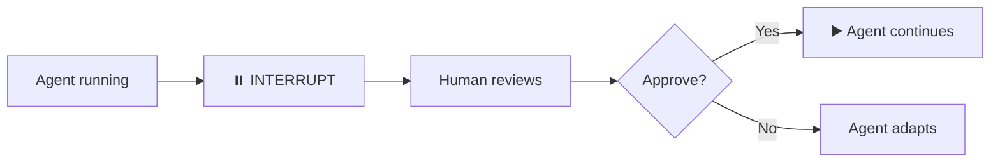
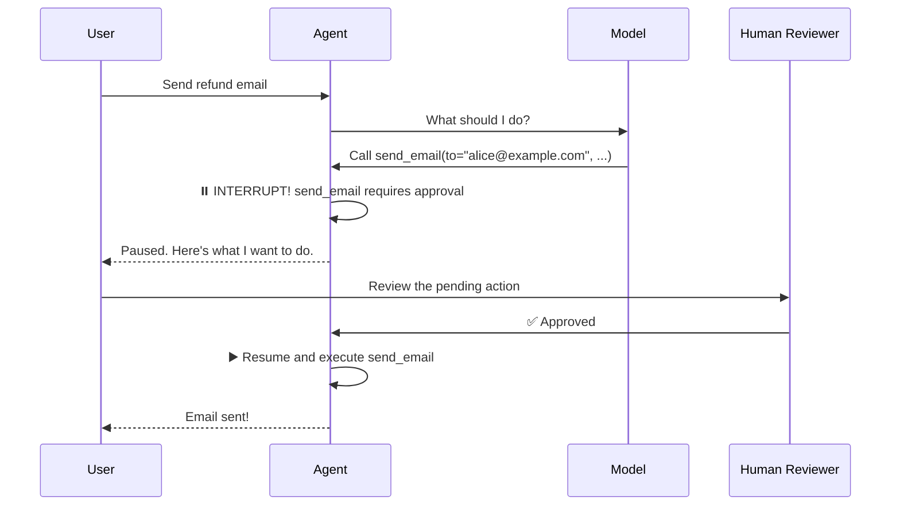
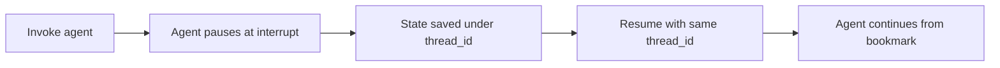
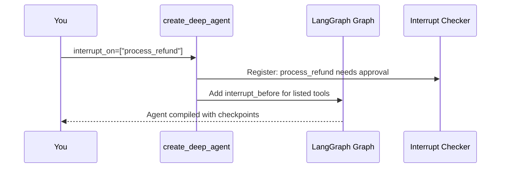
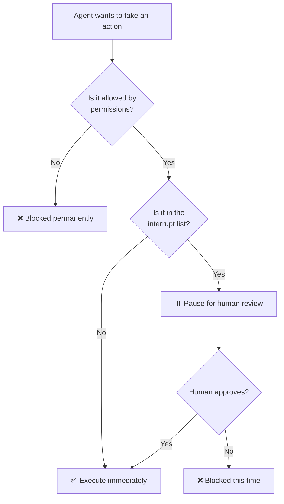

# Chapter 9: Human-in-the-Loop (Interrupt)

In [Chapter 8: Permissions](08_permissions_.md), you learned how to lock certain doors — controlling which files your agent can read and write. But what about operations that are risky *beyond* just file access? What if the agent wants to send an email, process a refund, or delete a database record? Permissions can't help here — the agent *should* be allowed to do those things, just not *without supervision*. That's where **Human-in-the-Loop** comes in.

---

## Why Does This Matter?

Imagine you work at a nuclear launch facility. No single person can fire a missile. It requires **two keys turned at the same time** — one from the commander, one from the operator. Neither can do it alone. This "two-key system" exists because some actions are too consequential to be taken by one person without a second opinion.

Your AI agent faces the same problem. Some operations are **irreversible or high-stakes**:

- Deleting a database table
- Sending an email to 10,000 customers
- Processing a $50,000 refund
- Merging code into the main branch
- Shutting down a production server

If the agent just *does* these things automatically, a misunderstanding or hallucination could cause real damage. But if you *never* let the agent do them, it can't be useful.

**Human-in-the-Loop (Interrupt) is the two-key system for your agent.** The agent prepares the action — it decides *what* to do and *how* — but it **pauses** and waits for a human to approve before actually doing it. No approval? No action.

---

## A Concrete Example: The Email Agent

Let's say you're building an agent that handles customer support emails. A user asks:

> "Send a refund confirmation to customer #4521."

The agent decides to call your `send_email` tool. But here's the scary part: what if it got the email address wrong? What if it sends a refund confirmation to the *wrong person*? That's a real customer impact.

**With Human-in-the-Loop**, the flow looks like this:

1. The agent prepares: *"I want to send an email to alice@example.com with subject 'Refund Confirmation'"*
2. The agent **pauses** — execution stops
3. A human reviews the details and says **approve** or **reject**
4. Only if approved, the email is sent

If the human notices the email address is wrong, they reject it. Crisis averted. The agent adapts and tries again with the correct address.

---

## The Key Concept: Interrupt

At its core, Human-in-the-Loop is built on LangGraph's **interrupt** capability. An interrupt is exactly what it sounds like — it **pauses the agent's execution** at a specific point and waits for external input before continuing.

Think of it like a pause button on a remote control:



Without the interrupt, the agent just barrels through every step. With it, the agent hits a checkpoint and waits for you.

---

## How to Enable It: The `interrupt_on` Parameter

You enable Human-in-the-Loop by passing the `interrupt_on` parameter to `create_deep_agent`:

```python
from deepagents import create_deep_agent

agent = create_deep_agent(
    model="openai:gpt-4o",
    tools=[send_email, process_refund],
    interrupt_on=["send_email", "process_refund"],
)
```

That's it! Now every time the agent tries to call `send_email` or `process_refund`, it will **pause** and wait for human approval.

The `interrupt_on` parameter takes a **list of tool names**. These are the tools that require a human's second key before they can execute.

---

## Which Tools Should Require Approval?

Not every tool needs a human checkpoint. Here's a simple guideline:

| Risk Level | Examples | Needs Approval? |
|-----------|----------|----------------|
| 🟢 **Read-only** | Search, read file, query database | No |
| 🟡 **Write, low stakes** | Save draft, create todo, write temp file | Usually no |
| 🟠 **Write, medium stakes** | Update record, send notification | Maybe |
| 🔴 **Irreversible / high stakes** | Delete data, send email, process payment | **Yes!** |

A good rule of thumb: **if undoing the action is hard or impossible, require approval.**

---

## The Full Flow: What Happens at Runtime

Let's trace the complete lifecycle of an agent run with interrupts. Here's our email agent:

```python
def send_email(to: str, subject: str, body: str) -> str:
    """Send an email to a recipient."""
    # ...sends the email...
    return f"Email sent to {to}"
```

```python
agent = create_deep_agent(
    model="openai:gpt-4o",
    tools=[send_email],
    interrupt_on=["send_email"],
)
```

When you invoke the agent:

```python
result = agent.invoke({
    "messages": [
        {"role": "user", 
         "content": "Send a refund email to alice@example.com"}
    ]
})
```

Here's what happens step by step:



Key moments:

1. **The LLM decides** to call `send_email` — it picks the tool and arguments
2. **The agent interrupts** — it pauses *before* executing the tool
3. **The human reviews** the pending tool call (who, what, arguments)
4. **The human approves or rejects**
5. **If approved**, the tool executes and the agent continues
6. **If rejected**, the agent gets the rejection feedback and adapts

---

## What You See When the Agent Pauses

When the agent hits an interrupt, the `.invoke()` call **returns early** — but not with a final answer. Instead, you get the agent's current state, including the **pending tool call** that needs approval.

Here's what that looks like conceptually:

```python
result = agent.invoke({"messages": [...]})
# The agent has paused!
# result contains the pending tool call:
# send_email(to="alice@example.com", subject="Refund", body="...")
```

You can inspect the pending action to see exactly what the agent wants to do. Then you either approve or reject.

---

## Approving an Action

To approve, you resume the agent and provide your approval. In LangGraph, this is done by passing the approval through the `Command` object:

```python
from langgraph.types import Command

# Resume the agent with approval
result = agent.invoke(
    Command(resume={"action": "approve"}),
    config={"configurable": {"thread_id": "thread-1"}},
)
```

The agent picks up where it left off, executes the `send_email` tool, and continues to produce its final answer.

---

## Rejecting an Action

To reject, you resume the agent with a rejection — and optionally, a reason:

```python
result = agent.invoke(
    Command(resume={"action": "reject", "reason": "Wrong email address"}),
    config={"configurable": {"thread_id": "thread-1"}},
)
```

The agent receives the rejection feedback and can adapt. It might:

- Try again with different arguments
- Ask the user for clarification
- Choose a different approach entirely

The LLM is smart enough to understand *why* the action was rejected and adjust its behavior.

---

## The `thread_id` Is Essential

Notice the `config` parameter with `thread_id`:

```python
config={"configurable": {"thread_id": "thread-1"}}
```

When the agent interrupts, it saves its entire state — conversation, plan, pending tool call — under this thread ID. When you resume, it needs the same thread ID to pick up where it left off.

Think of it like a bookmark:



Without the thread ID, the agent doesn't know which paused run to resume. **Always use a consistent `thread_id` when working with interrupts.**

---

## A Complete Example: The Refund Agent

Let's put it all together with a realistic example. You're building an agent that processes customer refund requests:

```python
def process_refund(order_id: str, amount: float) -> str:
    """Process a refund for an order."""
    # ...calls payment API...
    return f"Refund of ${amount} processed for {order_id}"
```

```python
def lookup_order(order_id: str) -> dict:
    """Look up order details by ID."""
    return {"order_id": order_id, "amount": 49.99, "status": "delivered"}
```

Create the agent with an interrupt on the risky tool:

```python
agent = create_deep_agent(
    model="openai:gpt-4o",
    tools=[lookup_order, process_refund],
    interrupt_on=["process_refund"],
    system_prompt="You handle customer refund requests.",
)
```

Now invoke it:

```python
config = {"configurable": {"thread_id": "refund-1"}}

result = agent.invoke({
    "messages": [
        {"role": "user", 
         "content": "I want a refund for order #ORD-789"}
    ]
}, config=config)
```

The agent will:

1. Call `lookup_order("ORD-789")` — no interrupt, this is read-only
2. Decide to call `process_refund("ORD-789", 49.99)` — **INTERRUPT!**

Now you review and approve:

```python
from langgraph.types import Command

result = agent.invoke(
    Command(resume={"action": "approve"}),
    config=config,
)
```

The refund is processed, and the agent gives the customer a confirmation message.

---

## What If You Reject?

Let's say you notice the amount is wrong:

```python
result = agent.invoke(
    Command(resume={
        "action": "reject",
        "reason": "Amount should be $29.99, not $49.99"
    }),
    config=config,
)
```

The agent sees the rejection reason and might:

- Re-check the order details
- Call `process_refund` again with the corrected amount
- Or ask the user for clarification

It adapts intelligently — just like an employee who got feedback from their manager.

---

## What Happens Under the Hood

When you pass `interrupt_on=["process_refund"]` to `create_deep_agent`, here's how the wiring works:



At runtime, when the LLM decides to call a tool:

1. **Before executing any tool**, the agent checks: is this tool in the `interrupt_on` list?
2. **If yes** → the agent saves its state and pauses (LangGraph interrupt)
3. **If no** → the tool executes normally, no pause

This check happens at the graph level — it's built into the LangGraph execution engine. The LLM doesn't even know the interrupt happened; from its perspective, it made a tool call and is waiting for the result.

---

## Interrupts and the Checkpointer

Here's an important detail: **interrupts require a checkpointer**. The checkpointer is what saves the agent's state when it pauses, so it can be resumed later.

You can use an in-memory checkpointer for development:

```python
from langgraph.checkpoint.memory import MemorySaver

checkpointer = MemorySaver()

agent = create_deep_agent(
    model="openai:gpt-4o",
    tools=[send_email],
    interrupt_on=["send_email"],
    checkpointer=checkpointer,
)
```

Without a checkpointer, the agent has nowhere to save its paused state — and interrupts won't work. If you forget the checkpointer, you'll get an error.

> **Recall from** [**Memory / Store**](06_memory___store__.md): the checkpointer saves *conversation state* within a thread, while the store saves *facts* across threads. Interrupts use the checkpointer because they need to save the exact execution state of a specific run.

---

## Interrupts vs. Permissions: When to Use Which?

Both [Permissions](08_permissions_.md) and Human-in-the-Loop control what the agent can do. But they serve different purposes:

| | Permissions | Human-in-the-Loop |
|---|---|---|
| **Question** | "Should the agent be *able* to do this?" | "Should the agent do this *right now*?" |
| **Decision** | Always deny | Case-by-case, human decides |
| **Analogy** | A locked door | A door that requires a signature |
| **Example** | Agent can never read `.env` | Agent can send email, but only after you say OK |

Use **permissions** for things the agent should *never* do. Use **interrupts** for things the agent *should* do, but only with supervision.

---

## Defense in Depth: Layering Your Safeguards

The safest agents use **multiple layers of protection**:



1. **Permissions** — the hard walls. The agent can't even *try* to read `.env` or write to protected paths
2. **Interrupts** — the checkpoints. The agent can try, but you get to vet it first
3. **Safe tool design** — the foundation. Tools that do one safe thing, not everything

Together, these three layers create a robust safety net. No single layer is perfect, but together they catch almost everything.

---

## Common Patterns for `interrupt_on`

Here are a few practical patterns:

### Pattern 1: Protect All Destructive Tools

```python
interrupt_on=["delete_file", "drop_table", "send_email", "process_payment"]
```

Any tool that destroys data or affects the real world gets a checkpoint.

### Pattern 2: Protect Shell Commands

If you're using `LocalShellBackend` (from [Backend (File System)](07_backend__file_system__.md)), the agent can run shell commands. Always interrupt on `execute`:

```python
interrupt_on=["execute"]
```

No agent should run `rm -rf /` without someone watching.

### Pattern 3: Protect External API Calls

Any tool that talks to an external service — sending emails, making payments, posting to social media — should probably be interrupted:

```python
interrupt_on=["send_email", "post_tweet", "process_refund"]
```

---

## What the Agent Sees When Rejected

When you reject an action, the agent doesn't just get a "no." It receives structured feedback that helps it adapt:

```python
Command(resume={
    "action": "reject",
    "reason": "The refund amount exceeds the $25 limit for this order"
})
```

The LLM reads this reason and can:

- Adjust the amount and try again
- Escalate to a different process
- Inform the user about the policy

This is why rejections with reasons are so powerful — they teach the agent to do better next time.

---

## Common Beginner Mistakes

### ❌ Forgetting the checkpointer

```python
agent = create_deep_agent(
    model="openai:gpt-4o",
    tools=[send_email],
    interrupt_on=["send_email"],
    # No checkpointer! Interrupts won't work!
)
```

Interrupts need a checkpointer to save state. Always include one.

### ❌ Forgetting the thread_id

```python
# First invoke — agent pauses
result = agent.invoke({"messages": [...]})

# Second invoke — agent can't find the paused run!
result = agent.invoke(Command(resume={"action": "approve"}))
```

Always use the same `thread_id` in `config` for both the initial invoke and the resume.

### ❌ Interrupting on read-only tools

```python
interrupt_on=["read_file", "lookup_order"]
```

Read-only tools don't change anything. Interrupting on them just slows things down without adding safety. Reserve interrupts for **write, delete, and external action** tools.

### ❌ Not providing a rejection reason

```python
Command(resume={"action": "reject"})
```

This works, but the agent has no idea *why* it was rejected. It might just try the exact same thing again. Always include a reason:

```python
Command(resume={"action": "reject", "reason": "Wrong customer ID"})
```

### ❌ Thinking interrupts replace permissions

Interrupts require a human to be available. If you're running an agent unattended (e.g., a background job), there's no one to approve! For operations that should *never* happen, use [Permissions](08_permissions_.md) instead.

---

## Quick Reference: Human-in-the-Loop Cheat Sheet

| Question | Answer |
|----------|--------|
| How do I enable it? | Pass `interrupt_on=["tool_name"]` to `create_deep_agent` |
| Do I need a checkpointer? | **Yes** — interrupts won't work without one |
| Do I need a thread_id? | **Yes** — for resuming the paused agent |
| How do I approve? | `Command(resume={"action": "approve"})` |
| How do I reject? | `Command(resume={"action": "reject", "reason": "..."})` |
| What tools should I interrupt on? | Destructive, irreversible, or external-facing tools |
| What if no one is available to review? | Use permissions to block instead |
| Does the LLM know about the interrupt? | No — it just sees a delayed tool result |

---

## Summary

In this chapter, you learned:

- **Human-in-the-Loop (Interrupt)** is a two-key system — the agent prepares an action, but it **pauses** until a human approves
- It's built on **LangGraph's interrupt capability**, which saves the agent's state and waits for external input
- Enable it with `interrupt_on=["tool_name"]` — a list of tool names that require approval
- **Interrupts require a checkpointer** and a consistent `thread_id` to save and resume state
- **Approve** with `Command(resume={"action": "approve"})` — **reject** with a reason so the agent can adapt
- Use interrupts for **risky but legitimate operations** (sending emails, processing payments, running commands)
- Use [Permissions](08_permissions_.md) for things the agent should **never** do — use interrupts for things it should do **with supervision**
- Layer your safeguards: **permissions + interrupts + safe tool design** = defense in depth
- Always provide a **rejection reason** — it helps the agent learn and adapt

Your agent now has a complete safety framework: it knows what it can't do (permissions) and what it can only do with supervision (interrupts). But complex tasks often need more than one agent working together. In the next chapter, you'll learn how to delegate work to specialized sub-agents.

👉 [Subagents](10_subagents_.md)

---

Generated by [AI Codebase Knowledge Builder](https://github.com/The-Pocket/Tutorial-Codebase-Knowledge)