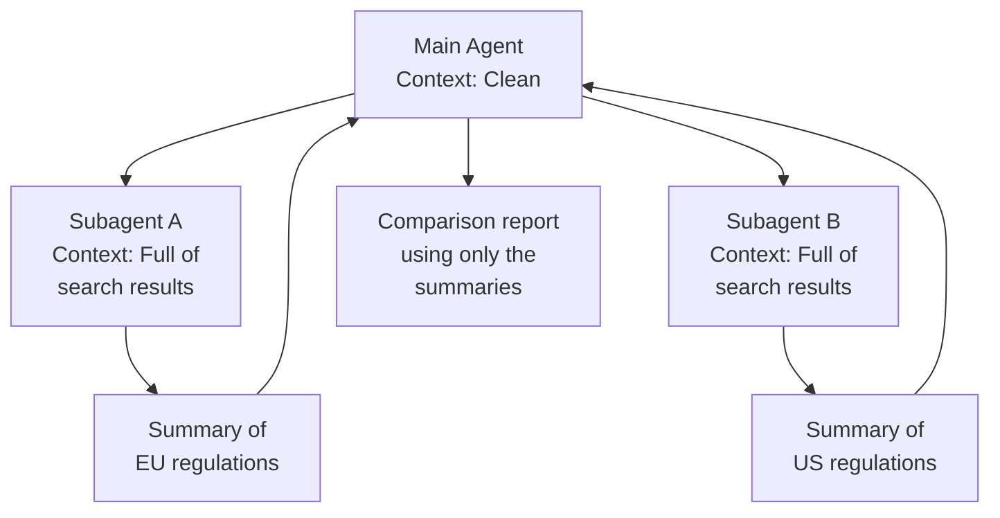
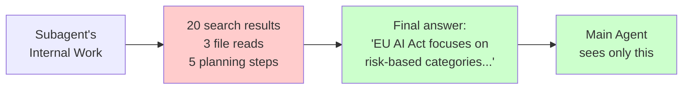
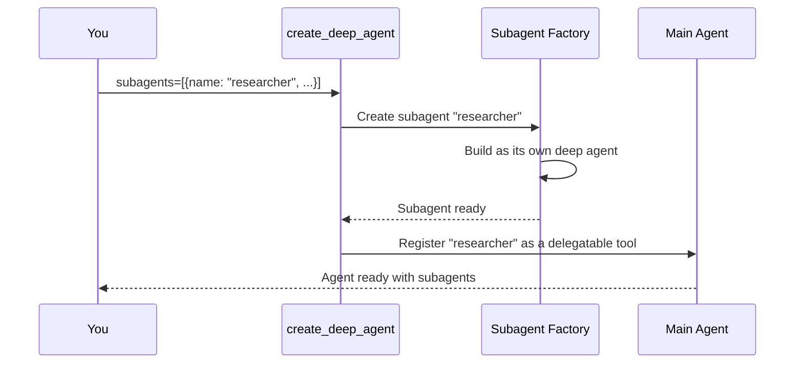
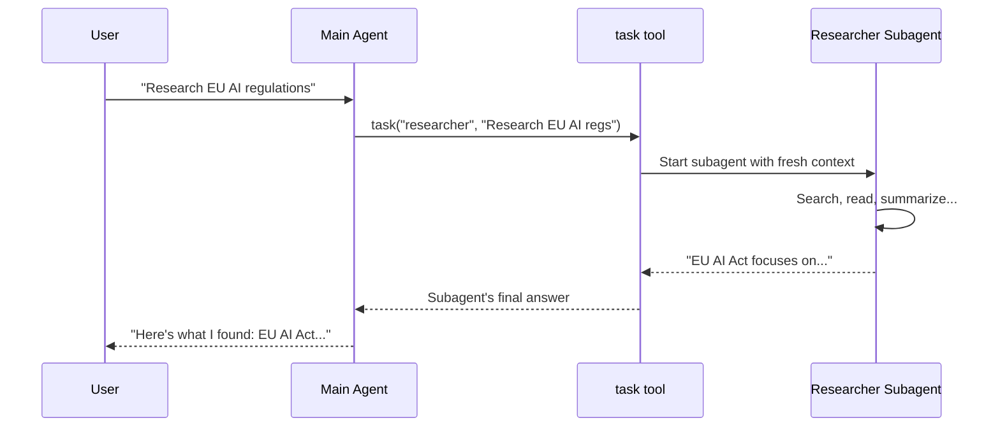

# Chapter 10: Subagents

In [Chapter 9: Human-in-the-Loop (Interrupt)](09_human-in-the-loop__interrupt__.md), you learned how to pause your agent before risky actions and ask a human for approval. But there's another kind of risk we haven't addressed: **context pollution**. When your agent does everything itself — searching, reading files, analyzing data — its conversation history fills up with tool outputs. Eventually, the agent can't think clearly. **Subagents** solve this by letting your main agent delegate work to specialized helpers, each working in their own clean sandbox.

---

## Why Does This Matter?

Imagine you're a project manager at a construction company. A client asks you to design and build a house. You *could* try to do everything yourself — survey the land, draw the blueprints, pour the foundation, run the wiring, paint the walls. But you'd be exhausted, your desk would be covered in blueprints and wiring diagrams, and you'd lose track of the big picture.

Instead, you **delegate**:

- 🏗️ You assign the **surveying** to a land surveyor
- 📐 You assign the **design** to an architect
- ⚡ You assign the **wiring** to an electrician

Each specialist works in their own workspace. They don't clutter your desk with their intermediate notes. You just get their final deliverables: a survey report, a blueprint, a wiring plan. Then *you* combine them into a finished house.

**That's exactly what subagents do for your AI agent.** The main agent is the project manager. Each subagent is a specialist. They work in their own conversation sandbox — the main agent never sees the messy intermediate steps, only the final result.

---

## A Concrete Example: The Research Agent

Let's say you're building a research agent. A user asks:

> "Research the latest AI regulations in the EU and the US, then compare them."

A single agent would need to:

1. Search for EU AI regulations (many pages of results)
2. Read through the results
3. Search for US AI regulations (many more pages)
4. Read through those results
5. Compare the two

By step 5, the agent's context is stuffed with search results. It's like trying to write a comparison essay while sitting in a room wallpapered with printouts. 😵

**With subagents**, the main agent delegates:

- Subagent A: "Research EU AI regulations" → returns a concise summary
- Subagent B: "Research US AI regulations" → returns a concise summary
- Main agent: Compares the two summaries

The main agent's context stays clean. It only sees the final deliverables from each subagent — not the 20 search results and 15 file reads that produced them.

---

## The Core Idea: Context Isolation

The most important concept in subagents is **context isolation**. Each subagent runs in its own sandbox with its own conversation history. The main agent never sees the subagent's internal back-and-forth — only the final answer.



Think of it like this: the main agent is reading executive summaries, not raw research papers. It gets the conclusions without the clutter.

---

## How to Define a Subagent

A subagent is defined as a **dictionary** with three key fields:

| Field | What It Does | Analogy |
|-------|-------------|---------|
| `name` | A unique identifier for the subagent | The specialist's name badge |
| `description` | Tells the main agent *when* to delegate to this subagent | The specialist's job title on their door |
| `system_prompt` | Instructions for how the subagent should behave | The specialist's job description |

You can also give a subagent its own `tools` and even its own `model`:

```python
subagents = [
    {
        "name": "researcher",
        "description": "Search and summarize information on a topic.",
        "system_prompt": "You are a researcher. Find and summarize info.",
        "tools": [internet_search],
    }
]
```

Notice how similar this looks to `create_deep_agent` itself? That's because **each subagent is essentially its own deep agent** — with its own model, tools, prompt, and conversation context.

---

## The `name` and `description` Are Critical

The main agent uses the `name` and `description` to decide *when* to delegate. This is just like [Tools](04_tools_.md) — the LLM reads the label to decide which tool to pick.

```python
# ❌ Vague — when should the main agent use this?
{"name": "helper", "description": "Helps with things."}

# ✅ Clear — the main agent knows exactly when to delegate
{
    "name": "researcher",
    "description": "Search the web and summarize findings on a topic.",
}
```

A good description answers: **"What kinds of tasks should I hand to this subagent?"**

---

## A Minimal Example: One Subagent

Let's build a research agent with a single subagent:

```python
from deepagents import create_deep_agent

def internet_search(query: str) -> str:
    """Search the web for information."""
    return f"Results for: {query}"
```

Define the subagent:

```python
subagents = [
    {
        "name": "researcher",
        "description": "Search the web and summarize findings.",
        "system_prompt": "You are a researcher. Be concise.",
        "tools": [internet_search],
    }
]
```

Create the main agent:

```python
agent = create_deep_agent(
    model="openai:gpt-4o",
    tools=[],
    subagents=subagents,
    system_prompt="You are a research coordinator.",
)
```

When you invoke it with a research question:

```python
result = agent.invoke({
    "messages": [
        {"role": "user", 
         "content": "What are the latest AI regulations in the EU?"}
    ]
})
```

The main agent delegates to the `researcher` subagent. The subagent searches, summarizes, and returns a concise answer. The main agent passes that answer along to the user.

---

## Multiple Subagents: Different Specialists

The real power comes when you have **multiple subagents with different specialties**. The main agent acts like a dispatcher — it reads each subagent's description and routes tasks to the right one.

```python
subagents = [
    {
        "name": "researcher",
        "description": "Search the web and summarize findings.",
        "system_prompt": "You are a researcher. Be concise.",
        "tools": [internet_search],
    },
    {
        "name": "analyst",
        "description": "Analyze data and produce charts or statistics.",
        "system_prompt": "You are a data analyst. Focus on numbers.",
        "tools": [query_database],
    },
]
```

Now the main agent can delegate research tasks to the researcher and data tasks to the analyst:

```python
agent = create_deep_agent(
    model="openai:gpt-4o",
    tools=[],
    subagents=subagents,
    system_prompt="You are a project coordinator.",
)
```

When a user asks a research question, the main agent picks the `researcher`. When they ask about sales data, it picks the `analyst`. The LLM makes this decision automatically — just like it picks the right [Tool](04_tools_.md) based on the function name and docstring.

---

## Different Models for Different Subagents

Here's a powerful trick: **each subagent can use a different model**. This lets you match the model to the task:

```python
subagents = [
    {
        "name": "researcher",
        "description": "Search and summarize information.",
        "model": "openai:gpt-4o-mini",  # Fast and cheap for search
        "system_prompt": "You are a researcher.",
        "tools": [internet_search],
    },
    {
        "name": "writer",
        "description": "Write polished, long-form content.",
        "model": "openai:gpt-5.4",  # Premium model for writing
        "system_prompt": "You are a professional writer.",
        "tools": [],
    },
]
```

The researcher uses a cheap, fast model — it's just searching and summarizing. The writer uses a premium model — it needs nuanced language and careful reasoning. You save money without sacrificing quality where it matters.

This connects back to what we learned in [Model Configuration](03_model_configuration_.md): **match the model to the task complexity**.

---

## What the Main Agent Sees

When a subagent finishes its work, it returns a **final answer** to the main agent. The main agent sees this as a single message — like receiving an email with the deliverable attached.

It does **NOT** see:
- The subagent's internal tool calls
- The search results the subagent read
- The files the subagent wrote and read back
- The subagent's planning steps (via `write_todos`)

It only sees: *"Here's what I found: [summary]"*



This is the magic of context isolation. The main agent's context window stays lean, no matter how messy the subagent's work gets.

---

## What Happens Under the Hood

When you pass `subagents=[...]` to `create_deep_agent`, here's what happens:



Step by step:

1. **Each subagent is compiled** into its own deep agent — with its own model, tools, prompt, and graph
2. **A `task` tool is registered** on the main agent for each subagent — the main agent can call `task(subagent_name="researcher", description="...")` to delegate
3. **At runtime**, when the main agent calls `task`, the subagent runs in its own sandbox
4. **The subagent's final answer** is returned to the main agent as a single message

---

## The Runtime Flow: Delegation in Action

Let's trace what happens when the main agent delegates a task:



Key moments:

1. The main agent decides to delegate (it calls the `task` tool)
2. The subagent starts with a **fresh, empty conversation** — no history from the main agent
3. The subagent does its work (searching, reading, planning)
4. The subagent returns only its **final answer**
5. The main agent receives that answer and continues

---

## The Default Subagent: `general-purpose`

If you don't provide any subagents, Deep Agents adds a default one called `general-purpose`. This subagent has the same model and tools as the main agent, and serves as a general helper for tasks that benefit from context isolation.

```python
# These are equivalent:
agent = create_deep_agent(model="openai:gpt-4o")

agent = create_deep_agent(
    model="openai:gpt-4o",
    subagents=[{
        "name": "general-purpose",
        "description": "Handle general tasks with context isolation.",
        # Uses the same model and tools as the main agent
    }],
)
```

If you provide your own subagents, the default is skipped (unless you explicitly include a `general-purpose` one). This means you're always in control of what your agent can delegate to.

---

## When to Use Subagents (And When Not To)

Subagents aren't always the right tool. Here's a simple guide:

| Situation | Use Subagents? | Why? |
|-----------|---------------|------|
| A task requires many tool calls with large outputs | ✅ Yes | Keeps main context clean |
| Different subtasks need different models | ✅ Yes | Match model to task complexity |
| Different subtasks need different prompts | ✅ Yes | Specialization improves quality |
| A simple, single-step question | ❌ No | Overhead without benefit |
| You need the main agent to see all intermediate steps | ❌ No | Subagents hide intermediates |
| The task is one search and one answer | ❌ No | Direct tool call is simpler |

A good rule of thumb: **if a subtask would produce more than a few paragraphs of intermediate output, delegate it to a subagent.**

---

## Subagents and the File System

Here's a powerful pattern: subagents can use the [Backend (File System)](07_backend__file_system__.md) to save their work. The main agent can then read those files later.

```python
subagents = [
    {
        "name": "researcher",
        "description": "Research a topic and save findings to a file.",
        "system_prompt": "Research the topic. Save findings to a file.",
        "tools": [internet_search],
    }
]
```

The researcher subagent:
1. Searches for information
2. Writes the results to a file (e.g., `research_notes.md`)
3. Returns a summary to the main agent

The main agent:
1. Gets the summary
2. Reads the full file if it needs more detail
3. Uses the information for its final answer

This combines **context isolation** (the subagent's search clutter stays in its sandbox) with **data persistence** (the file survives after the subagent finishes).

---

## Subagents and Permissions

Subagents inherit the main agent's [Permissions](08_permissions_.md). If the main agent can't write to `/secrets/`, neither can any of its subagents.

This is important for safety: you don't need to set permissions on each subagent individually. Set them once on the main agent, and they apply everywhere.

---

## A Complete Example: The Report Writer

Let's put it all together with a realistic example. You want an agent that researches a topic and writes a polished report:

```python
def internet_search(query: str) -> str:
    """Search the web for information."""
    return f"Results for: {query}"
```

Define two subagents — one for research, one for writing:

```python
subagents = [
    {
        "name": "researcher",
        "description": "Research a topic using web search.",
        "model": "openai:gpt-4o-mini",
        "system_prompt": "You research topics. Return concise findings.",
        "tools": [internet_search],
    },
    {
        "name": "writer",
        "description": "Write a polished report from research notes.",
        "model": "openai:gpt-5.4",
        "system_prompt": "You write professional reports.",
        "tools": [],
    },
]
```

Create the main agent:

```python
agent = create_deep_agent(
    model="openai:gpt-4o",
    tools=[],
    subagents=subagents,
    system_prompt="You coordinate research and writing tasks.",
)
```

Invoke it:

```python
result = agent.invoke({
    "messages": [
        {"role": "user", 
         "content": "Write a report on EU AI regulations"}
    ]
})
```

**What happens inside:**

1. Main agent delegates to `researcher`: "Research EU AI regulations"
2. Researcher searches, summarizes, returns findings
3. Main agent delegates to `writer`: "Write a report based on these findings: [summary]"
4. Writer produces a polished report
5. Main agent delivers the report to the user

The main agent's context only contains two short summaries — not pages of search results. Clean and efficient.

---

## Common Beginner Mistakes

### ❌ Making the description too vague

```python
{"name": "agent1", "description": "Does stuff."}
```

The main agent has no idea *when* to delegate to this subagent. Write a clear description that explains what kinds of tasks it handles:

```python
{
    "name": "researcher",
    "description": "Search the web and summarize findings on any topic.",
}
```

### ❌ Using subagents for simple tasks

If a task is just one search and one answer, a subagent is overhead. The main agent can call the tool directly. Reserve subagents for tasks that produce **lots of intermediate output**.

### ❌ Forgetting to give subagents the right tools

```python
{
    "name": "researcher",
    "description": "Search the web and summarize findings.",
    "tools": [],  # No search tool!
}
```

A researcher without a search tool can't research. Make sure each subagent has the tools it needs for its specialty.

### ❌ Expecting subagents to share context with the main agent

Subagents start with a **fresh conversation**. They don't see the main agent's chat history. If the subagent needs context, the main agent must include it in the task description when delegating.

### ❌ Creating too many subagents

Five subagents with overlapping responsibilities confuse the main agent. Keep it simple: one subagent per distinct specialty. If two subagents do similar things, merge them.

---

## Quick Reference: Subagents Cheat Sheet

| Question | Answer |
|----------|--------|
| How do I define a subagent? | A dictionary with `name`, `description`, and `system_prompt` |
| How does the main agent delegate? | It calls the built-in `task` tool automatically |
| Does the main agent see the subagent's work? | No — only the final answer |
| Can subagents use different models? | Yes — set `model` per subagent |
| Can subagents use different tools? | Yes — set `tools` per subagent |
| Is there a default subagent? | Yes — `general-purpose` is added automatically |
| Do subagents inherit permissions? | Yes — from the main agent |
| When should I use subagents? | When a subtask produces large intermediate output |

---

## Summary

In this chapter, you learned:

- **Subagents** are specialized child agents that the main agent delegates tasks to — like a project manager assigning work to specialists
- The key benefit is **context isolation**: each subagent works in its own sandbox, so the main agent's context stays clean
- You define subagents as dictionaries with `name`, `description`, `system_prompt`, and optional `model` and `tools`
- The main agent decides **when to delegate** based on each subagent's `description` — just like it picks [Tools](04_tools_.md) based on function names and docstrings
- Subagents can use **different models** — cheap ones for simple tasks, premium ones for nuanced work
- The main agent only sees the subagent's **final answer**, not the messy intermediate steps
- A default `general-purpose` subagent is added automatically if you don't provide any
- Use subagents for tasks with **large intermediate output** — skip them for simple, single-step questions

Your agent can now plan ([Task Planning](05_task_planning__write_todos__.md)), remember ([Memory / Store](06_memory___store_.md)), work with files ([Backend](07_backend__file_system_.md)), stay safe ([Permissions](08_permissions_.md) and [Human-in-the-Loop](09_human-in-the-loop__interrupt__.md)), and delegate to specialists. But how do you see what the agent is doing *while* it's doing it? In the next chapter, you'll learn how to stream the agent's work in real-time.

👉 [Streaming](11_streaming_.md)

---

Generated by [AI Codebase Knowledge Builder](https://github.com/The-Pocket/Tutorial-Codebase-Knowledge)