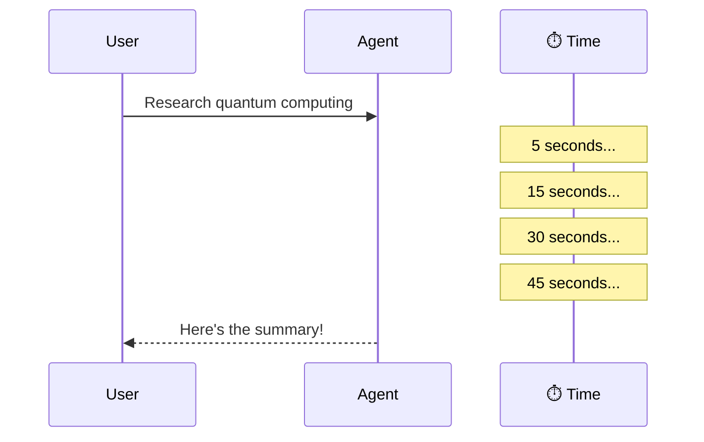
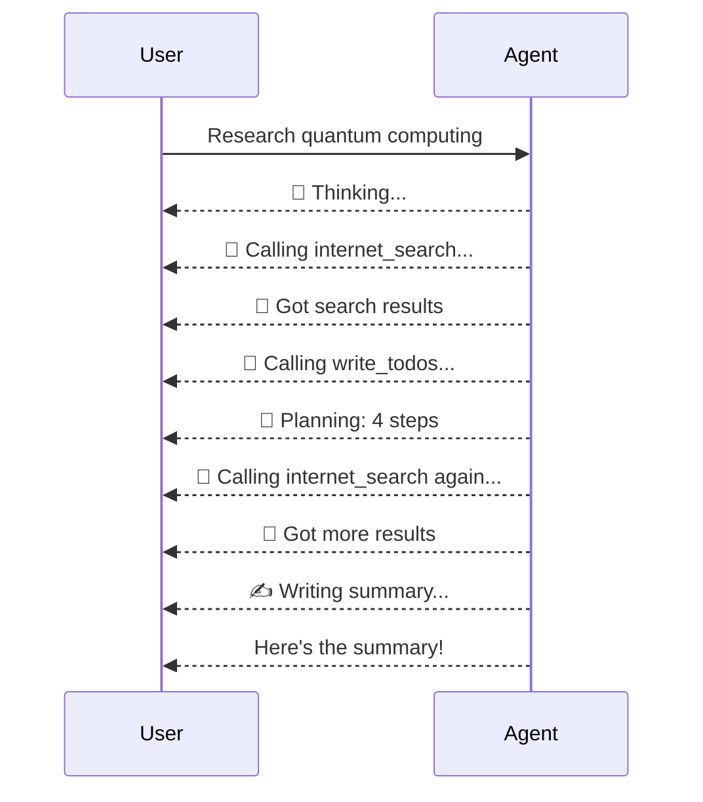
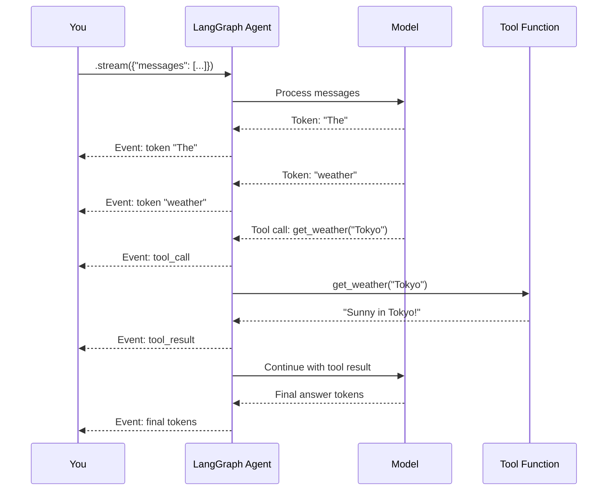

# Chapter 11: Streaming

In [Chapter 10: Subagents](10_subagents__.md), you learned how to delegate work to specialized sub-agents, keeping your main agent's context clean. But there's a problem we've been quietly ignoring throughout this entire tutorial: **waiting**. Every time you call `agent.invoke()`, you sit there — sometimes for seconds, sometimes for minutes — staring at a blank screen until the agent finishes. For long tasks, that silence is nerve-wracking. **Streaming** fixes that by letting you watch your agent work in real-time.

---

## Why Does This Matter?

Imagine you order a meal at a restaurant. The waiter takes your order and disappears into the back. You wait. And wait. Ten minutes pass. Is the chef cooking? Did they forget your order? Is the kitchen on fire? You have no idea.

Now imagine a different restaurant with an **open kitchen**. You can see the chef chopping vegetables, hear the sizzle of the pan, watch them plate the dish. Even though the meal takes the same amount of time, the experience is completely different — you feel informed and engaged.

That's exactly what streaming does for your agent. Instead of:

```python
# You wait... and wait... and wait...
result = agent.invoke({"messages": [...]})
# Finally! Here's the answer.
```

You get:

```python
# The agent is thinking...
# The agent is calling internet_search("EV adoption Europe")...
# The agent got search results...
# The agent is writing a file...
# The agent is generating the final answer...
# Done!
```

Same result. Radically different experience. And for web UIs, it's not just nice — it's **essential**. Users won't stare at a loading spinner for two minutes without feedback.

---

## A Concrete Example: The Research Agent

Let's say you're building a research agent that searches the web and writes reports. A user asks:

> "Research the current state of quantum computing and write a summary."

Using `.invoke()` (which we've used in every chapter so far), the experience looks like this:



The user sees nothing for 45 seconds. Is it working? Did it crash? Who knows.

Now with **streaming**:



Every step is visible. The user knows *exactly* what's happening. That's the power of streaming.

---

## The Key Difference: `.invoke()` vs `.stream()`

Up until now, we've used `.invoke()` for everything. It's simple: you pass in messages, you get back the final result. But it's **all-or-nothing** — you see nothing until the agent is completely done.

```python
# invoke: wait for the full result
result = agent.invoke({"messages": [...]})
```

`.stream()` works differently. Instead of returning one big result, it returns an **iterator of events** — a live feed of everything the agent is doing:

```python
# stream: get events as they happen
for event in agent.stream({"messages": [...]}):
    print(event)  # Each event is a small update
```

Think of it like the difference between downloading a file and streaming a video:

| | `.invoke()` | `.stream()` |
|---|---|---|
| Analogy | Downloading a movie | Streaming a movie |
| When you see results | Only at the end | As they happen |
| Good for | Background jobs, batch processing | Web UIs, debugging, long tasks |
| Returns | One final dictionary | An iterator of events |

---

## Your First Stream

Let's start with the simplest possible streaming example. We'll use the weather agent from [Chapter 1: Deep Agent](01_deep_agent__create_deep_agent__.md):

```python
from deepagents import create_deep_agent

def get_weather(city: str) -> str:
    """Get the current weather for a city."""
    return f"Sunny in {city}!"

agent = create_deep_agent(
    model="openai:gpt-4o",
    tools=[get_weather],
    system_prompt="You are a helpful assistant.",
)
```

Now instead of `.invoke()`, use `.stream()`:

```python
for event in agent.stream({
    "messages": [
        {"role": "user", "content": "What's the weather in Tokyo?"}
    ]
}):
    print(event)
```

**What you'll see** (simplified):

```text
🧠 LLM starts thinking...
🔧 Tool call: get_weather("Tokyo")
📄 Tool result: "Sunny in Tokyo!"
🧠 LLM continues thinking...
💬 Final answer: "The weather in Tokyo is sunny!"
```

Each line is a separate event, delivered the moment it happens. No more waiting in the dark.

---

## Understanding Stream Events

When you stream, each event is a **small dictionary** containing information about what just happened. The most important event types are:

| Event Type | What It Tells You | When It Fires |
|-----------|-------------------|---------------|
| **LLM tokens** | The text the model is generating, piece by piece | As the model thinks |
| **Tool calls** | Which tool the agent decided to call, and with what arguments | Before the tool runs |
| **Tool results** | What the tool returned after running | After the tool finishes |
| **Subagent activity** | When a subagent starts or finishes | During delegation |

Let's look at each one.

---

## Event Type 1: LLM Tokens

When the model generates text — whether it's thinking out loud or producing its final answer — you get **token events**. Each token is a small piece of text, like a word or even part of a word.

This is what makes chat UIs feel responsive. Instead of waiting for the full paragraph, you see words appear one at a time — just like ChatGPT.

```python
for event in agent.stream({"messages": [...]}):
    # Each token event contains a small piece of text
    if event has new token:
        print(token, end="", flush=True)
```

**What it looks like:**

```text
The| weather| in| Tokyo| is| currently| sunny| with| a| high| of| 22°C|.
```

Each `|` marks a separate token event. The text builds up incrementally, giving the impression of real-time typing.

---

## Event Type 2: Tool Calls

When the agent decides to use a [Tool](04_tools_.md), you get a **tool call event** before the tool actually runs. This tells you:

- **Which tool** the agent is calling
- **What arguments** it's passing

```python
# You might see something like:
{
    "tool_name": "get_weather",
    "args": {"city": "Tokyo"}
}
```

This is incredibly useful for **debugging**. If the agent calls the wrong tool with the wrong arguments, you see it immediately — no need to wait for the final result and wonder what went wrong.

---

## Event Type 3: Tool Results

After the tool finishes running, you get a **tool result event**. This contains what the tool returned:

```python
# You might see something like:
{
    "tool_name": "get_weather",
    "result": "Sunny in Tokyo!"
}
```

Together, tool call and tool result events give you a complete picture of the agent's interactions with the outside world.

---

## Event Type 4: Subagent Activity

When the agent delegates to a [Subagent](10_subagents__.md), you see events for that too:

```python
# Subagent starts
{"subagent": "researcher", "status": "started"}

# Subagent finishes
{"subagent": "researcher", "status": "completed", "result": "..."}
```

This lets you show users: *"The researcher subagent is working..."* and then *"The researcher finished!"* — even though you can't see the subagent's internal steps (that's the whole point of context isolation).

---

## A Practical Example: Building a Progress Display

Let's put it all together. You want to show a user what the agent is doing in real-time. Here's a simple pattern:

```python
for event in agent.stream({
    "messages": [
        {"role": "user", 
         "content": "Research EV adoption in Europe"}
    ]
}):
    kind = get_event_kind(event)
```

Then handle each type:

```python
    if kind == "tool_call":
        print(f"🔧 Calling {event['tool_name']}...")
```

```python
    elif kind == "tool_result":
        print(f"📄 Got result from {event['tool_name']}")
```

```python
    elif kind == "token":
        print(event["text"], end="", flush=True)
```

**What the user sees in real-time:**

```text
🔧 Calling internet_search...
📄 Got result from internet_search
🔧 Calling write_todos...
📄 Got result from write_todos
🔧 Calling internet_search...
📄 Got result from internet_search
The current state of EV adoption in Europe shows...
```

Every step is visible. No more black box.

---

## What Happens Under the Hood

When you call `.stream()` instead of `.invoke()`, the agent runs the same LangGraph graph — but instead of collecting all the output into one result, it **yields events as they happen**.



Key insight: the agent doesn't do anything *different* — it runs the same steps, calls the same tools, follows the same plan. The only difference is **when you see the output**. With `.invoke()`, everything is buffered until the end. With `.stream()`, each piece is delivered the moment it's ready.

---

## Streaming with a Checkpointer

If you're using a [checkpointer](06_memory___store_.md) (which you need for [Human-in-the-Loop](09_human-in-the-loop__interrupt__.md)), streaming works the same way — just pass the config:

```python
config = {"configurable": {"thread_id": "thread-1"}}

for event in agent.stream(
    {"messages": [{"role": "user", "content": "Hello"}]},
    config=config,
):
    print(event)
```

The checkpointer saves state in the background. Streaming just controls how *you* receive the events — it doesn't affect the agent's internal behavior.

---

## Streaming and Subagents

When a [Subagent](10_subagents__.md) is running, you'll see events from the main agent's perspective:

```text
🔧 Calling task(subagent="researcher", ...)
📄 Subagent "researcher" completed
```

You **won't** see the subagent's internal tool calls or token generation. Remember — subagents have [context isolation](10_subagents__.md). The main agent only sees the final answer, and so do you via the stream.

If you need to see inside a subagent, you'd need to stream that subagent independently — but in most cases, knowing *which* subagent is running and *when* it finishes is enough.

---

## The Stream Event Structure

Each event from `.stream()` is a dictionary. While the exact structure depends on the LangGraph version, the key fields are:

| Field | What It Contains |
|-------|-----------------|
| `event` | The type of event (e.g., `"on_chat_model_stream"`, `"on_tool_start"`) |
| `name` | The name of the component that produced the event |
| `data` | The actual content — tokens, tool args, tool results, etc. |

You typically filter events by the `event` field to find what you need:

```python
for event in agent.stream({"messages": [...]}):
    if event["event"] == "on_chat_model_stream":
        # LLM token — show to user
        token = event["data"]["chunk"].content
        print(token, end="", flush=True)
```

```python
    elif event["event"] == "on_tool_start":
        # Tool is about to run
        print(f"🔧 {event['name']}({event['data']['input']})")
```

Don't worry about memorizing the exact event names — they follow a consistent pattern, and you can always print a few events to explore the structure.

---

## When to Use Streaming vs. Invoke

Not every situation needs streaming. Here's a simple guide:

| Situation | Use `.invoke()` | Use `.stream()` |
|-----------|----------------|-----------------|
| Quick, simple questions | ✅ | ❌ Overkill |
| Background batch processing | ✅ | ❌ No one watching |
| Web UI with a chat interface | ❌ Users need feedback | ✅ |
| Debugging agent behavior | ❌ Too slow to iterate | ✅ See what's happening |
| Long-running research tasks | ❌ Users think it's broken | ✅ Show progress |
| API endpoint returning JSON | ✅ | ❌ Simpler is better |

**Rule of thumb:** If a human is waiting for the result, stream. If a machine is waiting, invoke.

---

## Common Beginner Mistakes

### ❌ Forgetting to iterate over the stream

```python
# ❌ This doesn't do anything useful!
result = agent.stream({"messages": [...]})
# result is an iterator, not a dictionary!
```

You need to iterate:

```python
# ✅ Consume the events
for event in agent.stream({"messages": [...]}):
    handle(event)
```

### ❌ Expecting the final result in the same format as invoke

With `.invoke()`, you get a clean dictionary with `result["messages"]`. With `.stream()`, you get a series of events. The final answer is spread across token events, not packaged in a single dictionary.

If you need the final result *and* want to stream, collect the events and extract the last message yourself.

### ❌ Streaming for every request

Simple questions like "What's 2+2?" don't need streaming. The agent responds in under a second. Streaming adds complexity without benefit. Use it for **long-running tasks** where the wait would be noticeable.

### ❌ Trying to modify events mid-stream

Streaming is for **observing**, not **controlling**. You can't change the agent's behavior by modifying stream events. If you need to control what the agent does, use [Permissions](08_permissions_.md) or [Human-in-the-Loop](09_human-in-the-loop__interrupt__.md).

### ❌ Ignoring the config parameter

If you're using a checkpointer or store, don't forget to pass `config`:

```python
# ❌ Missing config — checkpointer won't work properly
for event in agent.stream({"messages": [...]}):
    ...

# ✅ Include config for checkpointing and memory
for event in agent.stream(
    {"messages": [...]},
    config={"configurable": {"thread_id": "t1"}},
):
    ...
```

---

## Quick Reference: Streaming Cheat Sheet

| Question | Answer |
|----------|--------|
| How do I stream? | Use `agent.stream({"messages": [...]})` instead of `agent.invoke()` |
| What do I get back? | An iterator of events (dictionaries) |
| What events can I see? | LLM tokens, tool calls, tool results, subagent activity |
| Do I need to change the agent? | No — same `create_deep_agent` call, just different method |
| When should I stream? | When a human is waiting, or when debugging |
| When should I invoke? | When a machine is waiting, or for simple/quick tasks |
| Does streaming change agent behavior? | No — the agent runs the same way, you just see output sooner |
| Can I see inside subagents? | Only start/finish events, not internal steps |
| Do I need a checkpointer for streaming? | No, but include `config` if you're using one |

---

## Summary

In this chapter, you learned:

- **Streaming** lets you watch your agent work in real-time — like an open kitchen instead of a closed one
- Use **`.stream()`** instead of **`.invoke()`** to get an iterator of events instead of one final result
- You can observe **four types of events**: LLM tokens, tool calls, tool results, and subagent activity
- Streaming is **essential for web UIs** (show progress), **debugging** (see what's happening), and **long tasks** (keep users informed)
- The agent **doesn't behave differently** — streaming only changes *when you see the output*
- Use `.invoke()` for background jobs and simple tasks; use `.stream()` when humans are waiting
- You **can't control** the agent through stream events — use [Permissions](08_permissions_.md) and [Human-in-the-Loop](09_human-in-the-loop__interrupt__.md) for that

---

**Congratulations! 🎉** You've reached the end of the Deep Agents tutorial. Let's recap everything you've learned across all eleven chapters:

| Chapter | What You Learned |
|---------|-----------------|
| [Deep Agent](01_deep_agent__create_deep_agent__.md) | The central factory that assembles your agent |
| [System Prompt](02_system_prompt_.md) | How to give your agent an identity and boundaries |
| [Model Configuration](03_model_configuration_.md) | How to choose and configure the LLM brain |
| [Tools](04_tools_.md) | How to give your agent hands to interact with the world |
| [Task Planning](05_task_planning__write_todos__.md) | How your agent plans before it acts |
| [Memory / Store](06_memory___store_.md) | How your agent remembers across conversations |
| [Backend](07_backend__file_system__.md) | Where your agent's files live |
| [Permissions](08_permissions_.md) | How to control what your agent can access |
| [Human-in-the-Loop](09_human-in-the-loop__interrupt__.md) | How to pause for human approval on risky actions |
| [Subagents](10_subagents__.md) | How to delegate to specialized helpers |
| **Streaming** | How to watch your agent work in real-time |

You now have all the building blocks to create powerful, safe, and observable AI agents. Start simple with `model`, `tools`, and `system_prompt` — then add capabilities as your needs grow. Happy building! 🚀

---

Generated by [AI Codebase Knowledge Builder](https://github.com/The-Pocket/Tutorial-Codebase-Knowledge)