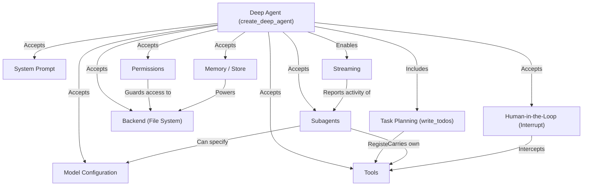

# Tutorial: markdown

**Deep Agents** is a batteries-included agent framework built on top of LangChain and LangGraph.
It lets developers build *complex, long-running AI agents* that can **plan tasks**, **read and write files**,
**delegate to specialized subagents**, **remember information across sessions**, and **pause for human approval**
on sensitive operations — all configured through a single `create_deep_agent` factory function.
Think of it as upgrading from a simple chatbot that just calls tools to an *engineering-grade agent*
that **plans**, **organizes**, **delegates**, and **operates safely** in production environments.

**Source Repository:** [None](None)

## Chapters

1. [Deep Agent (create_deep_agent)
](01_deep_agent__create_deep_agent__.md)
2. [System Prompt
](02_system_prompt_.md)
3. [Model Configuration
](03_model_configuration_.md)
4. [Tools
](04_tools_.md)
5. [Task Planning (write_todos)
](05_task_planning__write_todos__.md)
6. [Memory / Store
](06_memory___store_.md)
7. [Backend (File System)
](07_backend__file_system__.md)
8. [Permissions
](08_permissions_.md)
9. [Human-in-the-Loop (Interrupt)
](09_human_in_the_loop__interrupt__.md)
10. [Subagents
](10_subagents_.md)
11. [Streaming
](11_streaming_.md)

---

Generated by [AI Codebase Knowledge Builder](https://github.com/The-Pocket/Tutorial-Codebase-Knowledge)