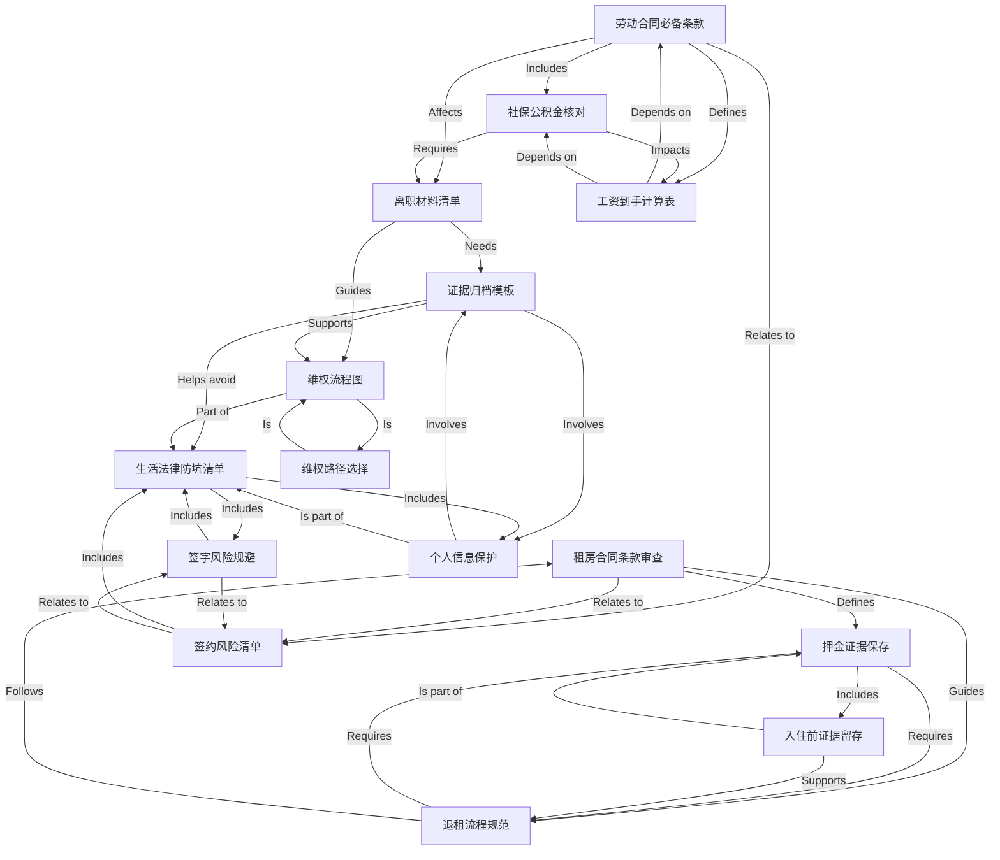

# Tutorial: life_base

This project teaches you how to protect yourself from scams in daily life—whether at work, renting a home, or dealing with general legal issues. It focuses on three key skills: **reviewing contracts carefully** (like labor or rental agreements), **saving evidence** (like chat records or photos), and **knowing how to fight for your rights** (维权) when things go wrong. The goal is to help you avoid common traps by being prepared with the right knowledge and tools.

## Chapters

1. [劳动合同必备条款
](01_劳动合同必备条款_.md)
2. [租房合同条款审查
](02_租房合同条款审查_.md)
3. [证据归档模板
](03_证据归档模板_.md)
4. [维权流程图
](04_维权流程图_.md)
5. [签约风险清单
](05_签约风险清单_.md)
6. [生活法律防坑清单
](06_生活法律防坑清单_.md)
7. [社保公积金核对
](07_社保公积金核对_.md)
8. [押金证据保存
](08_押金证据保存_.md)
9. [离职材料清单
](09_离职材料清单_.md)
10. [入住前证据留存
](10_入住前证据留存_.md)
11. [退租流程规范
](11_退租流程规范_.md)
12. [工资到手计算表
](12_工资到手计算表_.md)
13. [签字风险规避
](13_签字风险规避_.md)
14. [个人信息保护
](14_个人信息保护_.md)
15. [维权路径选择
](15_维权路径选择_.md)

---

Generated by [AI Codebase Knowledge Builder](https://github.com/The-Pocket/Tutorial-Codebase-Knowledge)