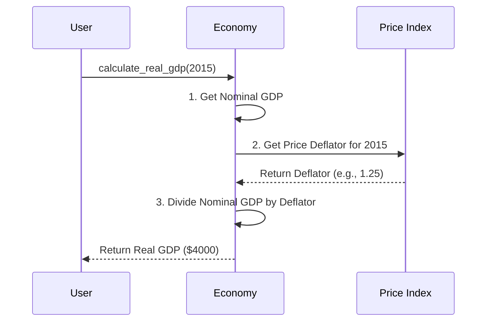

# Chapter 1: National Economic Output

Imagine you are running a massive lemonade stand empire. At the end of the year, you want to know how your business did. Did you actually make more lemonade, or did you just raise the price of each cup? A country faces the exact same question! To answer it, a country uses an annual "report card" to measure the total value of what it created. 

In this chapter, we'll explore how the `macro_economic` project helps us calculate this report card. By the end, you'll understand how to measure a country's true economic size, distinguish between what's made inside its borders versus what its citizens earn globally, and see if the economy *truly* grew or if things just got more expensive.

## Breaking Down the "Report Card"

Before we write any code, let's understand the three main sections of a country's economic report card:

### 1. GDP (Gross Domestic Product): The "Inside the Borders" Metric
GDP measures the total value of all finished goods and services made *inside* a country's borders in a year. 
* **Analogy:** It’s like counting all the cookies baked inside your kitchen, regardless of who owns the ingredients. If a foreign company bakes cookies in your kitchen, it counts toward your kitchen's GDP!

### 2. GNI (Gross National Income): The "Citizens Globally" Metric
GNI measures the total income earned by a country's citizens and businesses, no matter where in the world they are located.
* **Analogy:** Now we count all the money your family members earn, even if your sister is baking cookies in a neighbor's kitchen. Your sister's income counts toward your family's GNI, but not your kitchen's GDP.

### 3. Nominal vs. Real GDP: The "Price Illusion"
**Nominal GDP** is calculated using today's prices. If you baked the exact same number of cookies but doubled the price, Nominal GDP doubles. But did you actually produce more? No! 
**Real GDP** strips out price changes (inflation) to tell us if we *actually* produced more stuff. We will dive deeper into how prices change in [Price Level & Inflation](04_price_level___inflation_.md), but for now, just know: Real GDP is the truth-teller.

## Using the `macro_economic` Project

Let's use our project to calculate the economic output for a fictional country, "Econland." We want to answer our central use case: Did Econland truly produce more, or did prices just go up?

First, let's set up Econland's economy and calculate its Nominal GDP:

```python
from macro_economic import Economy

# Initialize Econland's economy for the year
econland = Economy("Econland", year=2023)

# Calculate Nominal GDP (current prices)
nominal_gdp = econland.calculate_nominal_gdp()
print(f"Nominal GDP: ${nominal_gdp}")
```

**Output:**
```text
Nominal GDP: $5000
```

Wow, $5000! But wait—did Econland actually bake more cookies, or did they just raise the prices? Let's calculate the Real GDP using a base year (a year where prices were normal) to find out:

```python
# Calculate Real GDP (adjusted for price changes)
real_gdp = econland.calculate_real_gdp(base_year=2015)
print(f"Real GDP: ${real_gdp}")
```

**Output:**
```text
Real GDP: $4000
```

Ah! The Real GDP is $4000. The Nominal GDP was inflated by higher prices, not by more production. The `macro_economic` project just saved us from a costly illusion!

## Under the Hood: How is Real GDP Calculated?

You might wonder how the `macro_economic` project magically strips away price changes. Let's look at the step-by-step process. It doesn't use magic; it uses a "Price Deflator" (a multiplier that shows how much prices have changed since the base year).



### The Internal Code

Let's peek inside the `Economy` class to see how this looks in code. It's surprisingly simple!

```python
# Inside macro_economic/economy.py
class Economy:
    def calculate_real_gdp(self, base_year):
        # Step 1: Get the raw, current value
        nominal = self.calculate_nominal_gdp()
        
        # Step 2: Find out how much prices have changed
        deflator = self.get_price_deflator(base_year)
        
        # Step 3: Divide to remove the price illusion
        return nominal / deflator
```

As you can see, we take the Nominal GDP and divide it by the Price Deflator. If prices went up by 25% (a deflator of 1.25), dividing by 1.25 shrinks the GDP back down to what it *would have been* if prices hadn't changed. This simple division is how we find the truth about a country's output!

## Conclusion

In this chapter, we learned that a country's economic "report card" is more than just a single number. We explored how **GDP** tracks what's made inside the borders, while **GNI** tracks what citizens earn globally. Most importantly, we learned the difference between **Nominal GDP** (which can be tricked by rising prices) and **Real GDP** (which strips out inflation to show true production). 

Now that we know how to measure the size of an economy, a natural next question arises: how do we make that economy bigger over time? Let's find out in the next chapter: [Economic Growth](02_economic_growth_.md).

---

Generated by [AI Codebase Knowledge Builder](https://github.com/The-Pocket/Tutorial-Codebase-Knowledge)