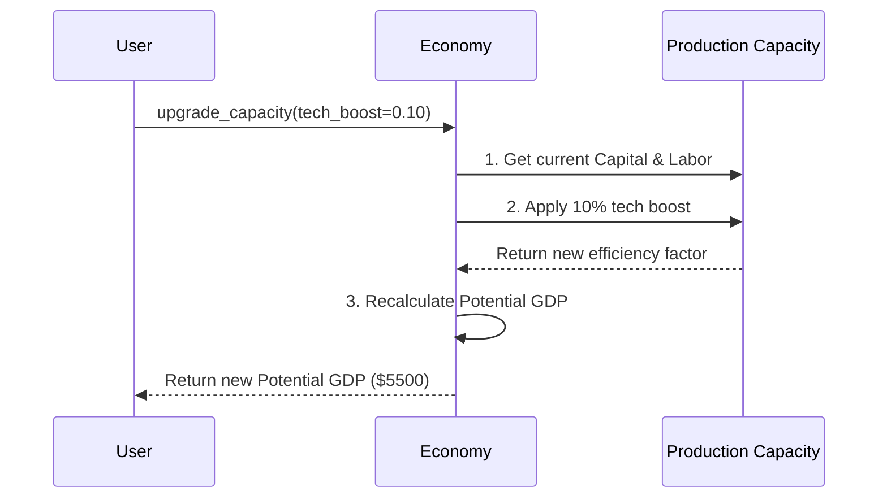

# Chapter 2: Economic Growth

In [National Economic Output](01_national_economic_output_.md), we learned how to measure the size of an economy using GDP. We figured out how to tell if Econland actually produced more cookies, or if the cookies just got more expensive. But how do we make sure Econland produces *even more* cookies next year, and the year after that?

Imagine you run a bakery. If you ask your bakers to work overtime, you'll produce more bread today. But they'll get exhausted, and tomorrow they might produce less. That's a short-term boom, not true growth. True growth means buying a bigger oven and teaching your bakers better recipes, so they can sustainably bake more bread every single day without burning out.

In this chapter, our central use case is: **How can we measure and increase Econland's long-term productive capacity (its "bigger oven") rather than just pushing for a temporary overtime boom?**

## Breaking Down True Growth

Before we code, let's understand the three main ingredients of true economic growth:

### 1. Potential GDP: The "Bigger Oven"
**Potential GDP** is the maximum amount an economy can produce when it's running at its best, stable speed—no exhausted workers, no idle factories. It represents the economy's true long-term capacity. If actual Real GDP is higher than Potential GDP, the economy is working "overtime" and might overheat!

### 2. Productivity: Doing More with Less
**Productivity** measures how much output you get from a unit of input. If a baker figures out how to bake two loaves of bread in the time it used to take to bake one, productivity has doubled. True growth relies heavily on becoming more efficient.

### 3. Capital and Technology: Upgrading the Machine
To boost productivity, an economy needs better tools. **Capital** means more machines and factories. **Technology** means better ways of doing things. Both allow workers to produce more value in the same amount of time.

## Using the `macro_economic` Project

Let's use our project to see if Econland is experiencing true growth or just a temporary sugar rush. First, let's check Econland's Potential GDP versus its actual Real GDP.

```python
from macro_economic import Economy

econland = Economy("Econland", year=2023)
# What is the maximum sustainable output?
potential = econland.calculate_potential_gdp()
print(f"Potential GDP: ${potential}")
```

**Output:**
```text
Potential GDP: $5000
```

Now let's see actual output (recall Real GDP from Chapter 1).

```python
# What are we actually producing right now?
real_gdp = econland.calculate_real_gdp(base_year=2015)
print(f"Real GDP: ${real_gdp}")
```

**Output:**
```text
Real GDP: $5500
```

Uh oh! Real GDP ($5500) is higher than Potential GDP ($5000). Econland is working "overtime" and might overheat! We need true growth. Let's simulate an investment in technology to increase our potential.

```python
# Upgrade the factory with better technology
econland.upgrade_capacity(tech_boost=0.10)
new_potential = econland.calculate_potential_gdp()
print(f"New Potential GDP: ${new_potential}")
```

**Output:**
```text
New Potential GDP: $5500
```

By upgrading technology, we expanded the economy's capacity. Now the $5500 output is sustainable—Econland has a bigger oven!

## Under the Hood: How is Potential GDP Calculated?

How does the `macro_economic` project know what an economy's maximum stable capacity is? It looks at the economy's "factors of production"—specifically, how many workers we have (Labor), how many machines we have (Capital), and how efficient we are (Technology).

When we call `upgrade_capacity(tech_boost=0.10)`, the system increases our efficiency multiplier, which in turn raises the ceiling of what we can produce.



### The Internal Code

Let's peek inside the `Economy` class to see how this looks in code. It uses a simple formula where Potential GDP depends on Capital, Labor, and Technology (often called Total Factor Productivity).

```python
# Inside macro_economic/economy.py
class Economy:
    def calculate_potential_gdp(self):
        # Combine capital, labor, and technology
        return self.capital * self.labor * self.tech_efficiency

    def upgrade_capacity(self, tech_boost):
        # Increase the tech efficiency multiplier
        self.tech_efficiency *= (1 + tech_boost)
```

As you can see, true economic growth isn't magic. It comes from physically upgrading the variables that build our Potential GDP—like making our `tech_efficiency` number bigger! Working overtime might temporarily push actual Real GDP higher, but only upgrading capacity can raise the `calculate_potential_gdp()` limit.

## Conclusion

In this chapter, we learned that true economic growth isn't just a temporary boom from working overtime; it's a sustained increase in **Potential GDP**. We achieve this by upgrading our economic machinery through better technology, more capital, and improved **productivity**. 

But when an economy grows and factories upgrade their machines, what happens to the people working there? Do we need more workers to run the new machines, or do the machines replace the workers? Let's explore the human side of the economy in the next chapter: [Employment & Unemployment](03_employment___unemployment_.md).

---

Generated by [AI Codebase Knowledge Builder](https://github.com/The-Pocket/Tutorial-Codebase-Knowledge)

你是一个经验丰富的经济学分析师，我是一个刚刚大学工科专业毕业的学生，结合上面提供的教程章节内容和经济分析师的实际工作修订并完善上面章节， 尽量让我能理解并掌握和运用该宏观经济学常识，同时要保持通俗易懂的风格和markdown格式