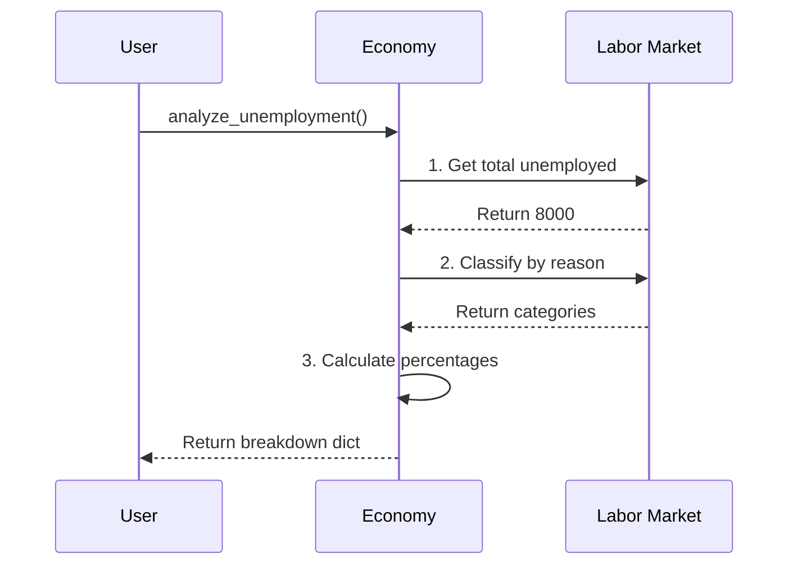

# Chapter 3: Employment & Unemployment

In [Economic Growth](02_economic_growth_.md), we learned how to upgrade Econland's "oven" (Potential GDP) through better technology and capital. But even the best, most high-tech oven is useless without bakers to run it! In this chapter, we look at the human fuel that powers the economic engine.

Imagine an economic engine. The labor force is the fuel. If everyone is working, the engine roars at full power. If people are unemployed, the engine is sputtering and wasting its potential. Our central use case: **Econland just upgraded its technology, but we notice the engine isn't running at full power. Why are some people not working, and how can we measure the true health of our labor market?**

## Breaking Down the Unemployment Engine

Before we code, let's understand why the engine might be sputtering. Not all unemployment is the same! There are three main types, plus a hidden group:

### 1. Frictional Unemployment: "Between Shifts"
This happens when people are simply between jobs. Imagine a baker who quit on Friday to start a better-paying job on Monday. For those two days, they are "unemployed," but the engine is fine. It's just normal turnover.

### 2. Structural Unemployment: "Wrong Tools"
This happens when workers' skills don't match the jobs available. Imagine our new high-tech oven requires digital programming, but our baker only knows how to chop wood for a fire. The jobs are there, but the workers don't have the right skills for the new industry.

### 3. Cyclical Unemployment: "Engine Sputtering"
This happens when the whole economy is in a slump. People aren't buying bread, so the bakery closes and fires its workers. This is directly tied to the economy's ups and downs (which we'll explore in [Economic Cycles](06_economic_cycles_.md)).

### 4. Discouraged Workers: "Left the Kitchen"
These are people who have given up looking for work entirely. They aren't counted in the official unemployment rate because they've stopped actively seeking jobs, but they represent lost fuel that the engine could have used.

## Using the `macro_economic` Project

Let's use our project to diagnose Econland's labor market. First, let's check the overall unemployment rate:

```python
from macro_economic import Economy

econland = Economy("Econland", year=2023)
unemployment_rate = econland.get_unemployment_rate()
print(f"Unemployment Rate: {unemployment_rate}%")
```

**Output:**
```text
Unemployment Rate: 8%
```

8% is quite high! But *why* are they unemployed? Let's break it down to see if it's a temporary issue or a deep problem:

```python
breakdown = econland.analyze_unemployment()
print(breakdown)
```

**Output:**
```text
{'frictional': 2%, 'structural': 5%, 'cyclical': 1%}
```

Aha! The majority of Econland's unemployment is **structural**. The new technology we added in Chapter 2 left our workers behind! But wait, are people giving up? Let's check for discouraged workers:

```python
discouraged = econland.get_discouraged_workers()
print(f"Discouraged Workers: {discouraged}")
```

**Output:**
```text
Discouraged Workers: 500
```

There are 500 people who have entirely left the labor force. The true labor market is weaker than the 8% rate suggests!

## Under the Hood: How is Unemployment Analyzed?

How does the `macro_economic` project break down the unemployment numbers? It doesn't just guess; it surveys the labor market and categorizes each unemployed person based on their recent history and the overall economy.



### The Internal Code

Let's peek inside the `Economy` class to see how this looks in code. It takes the raw numbers from the labor market and calculates the percentages for our report.

```python
# Inside macro_economic/economy.py
class Economy:
    def analyze_unemployment(self):
        # Get the raw numbers of each type
        frictional = self.labor.get_between_jobs()
        structural = self.labor.get_skill_mismatch()
        cyclical = self.labor.get_recession_layoffs()
        
        # Calculate percentages based on total unemployed
        total = self.labor.get_total_unemployed()
        return {
            'frictional': (frictional / total) * 100,
            'structural': (structural / total) * 100,
            'cyclical': (cyclical / total) * 100
        }
```

As you can see, the code simply asks the `labor` market for the raw counts of each type of unemployed person, adds them up, and calculates the percentage. This helps us see exactly *why* our engine is sputtering, so we know whether to wait it out (frictional), train our workers (structural), or stimulate the economy (cyclical).

## Conclusion

In this chapter, we learned that the unemployment rate is more than just a single number. We discovered that an economy's engine can sputter for different reasons: normal job-switching (**frictional**), a skills mismatch due to changing industries (**structural**), or an economic slump (**cyclical**). We also learned to watch out for **discouraged workers** who hide the true weakness of the labor market.

Now that we understand how many people are working and producing goods, a new question arises: if the engine is running and producing things, what happens to the prices of those things over time? Let's find out in the next chapter: [Price Level & Inflation](04_price_level___inflation_.md).

---

Generated by [AI Codebase Knowledge Builder](https://github.com/The-Pocket/Tutorial-Codebase-Knowledge)