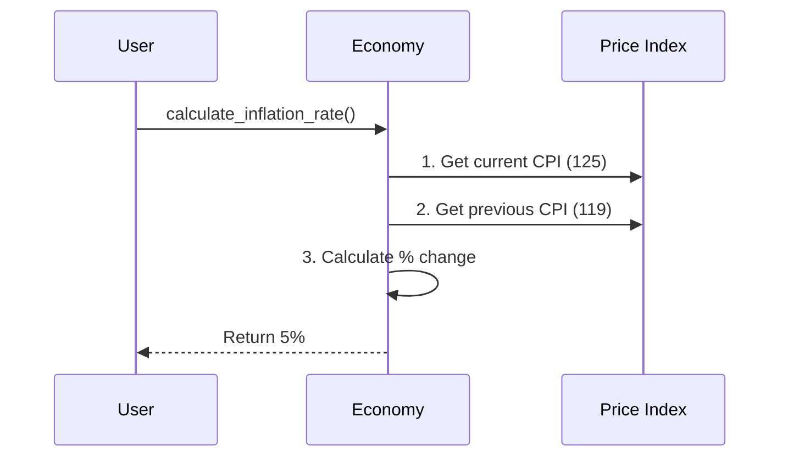

# Chapter 4: Price Level & Inflation

In [Employment & Unemployment](03_employment___unemployment_.md), we made sure Econland's bakers had jobs and our economic engine was running. But having a job is only half the battle! Imagine getting a 5% raise at the bakery, but the price of bread went up 10%. Are you actually able to buy more bread? No! 

Our central use case for this chapter: **Econland's workers are earning more money, but they complain they can buy less than before. How do we measure if money is losing its purchasing power, and are prices rising too fast?**

## Breaking Down the "Shrinking Measuring Cup"

Before we code, let's understand how prices work in an economy. It's not just about things getting more expensive; it's about the value of the money in your pocket.

### 1. Inflation: The Shrinking Measuring Cup
Inflation is when the overall price level rises, meaning the purchasing power of money falls. Think of it like a measuring cup that shrinks. If you use the same measuring cup to pour water, you get less water. Similarly, if prices inflate, the same $10 bill buys fewer goods than it did last year.

### 2. Deflation: The Dangerous Downward Spiral
Deflation is when overall prices fall. Sounds amazing, right? But it's actually a trap! If you know a new TV will be cheaper next month, you'll wait to buy it. If everyone waits, companies can't sell their products. They cut wages or fire workers, who then have even less money to spend, causing prices to drop further. It's a dangerous spiral!

### 3. CPI (Consumer Price Index): The Cost of Living
CPI measures the average change in prices that everyday consumers pay for a "basket" of goods and services—like food, rent, and gas. It's the economy's "cost of living" gauge for regular people.

### 4. PPI (Producer Price Index): The Cost of Making
PPI measures the average change in prices that producers (like our bakery) pay for their raw materials—like flour, steel, and electricity. If PPI goes up, companies might pass those costs onto consumers, causing CPI to rise next!

## Using the `macro_economic` Project

Let's use our project to see if Econland is suffering from inflation. First, let's check the Consumer Price Index (CPI) to see the cost of living:

```python
from macro_economic import Economy

econland = Economy("Econland", year=2023)
cpi = econland.get_cpi()
print(f"Consumer Price Index: {cpi}")
```

**Output:**
```text
Consumer Price Index: 125
```

A CPI of 125 means that the "basket" of goods that used to cost $100 in the base year now costs $125. Things are definitely more expensive! But by how much did prices rise compared to last year? Let's calculate the inflation rate:

```python
inflation_rate = econland.calculate_inflation_rate()
print(f"Inflation Rate: {inflation_rate}%")
```

**Output:**
```text
Inflation Rate: 5%
```

A 5% inflation rate means the measuring cup shrank by 5% over the year. But is this just hitting consumers, or are businesses suffering too? Let's check the Producer Price Index (PPI):

```python
ppi = econland.get_ppi()
print(f"Producer Price Index: {ppi}")
```

**Output:**
```text
Producer Price Index: 130
```

Uh oh! The PPI (130) is even higher than the CPI (125). The baker's flour and electricity costs are rising faster than the price of bread. This means businesses are absorbing some costs, but they might have to raise consumer prices soon!

## Under the Hood: How is Inflation Calculated?

How does the `macro_economic` project figure out the inflation rate? It doesn't just guess; it compares the CPI of the current year to the CPI of the previous year to see the percentage change.



### The Internal Code

Let's peek inside the `Economy` class to see how this looks in code. It takes the two CPI numbers and calculates the percentage difference.

```python
# Inside macro_economic/economy.py
class Economy:
    def calculate_inflation_rate(self):
        # 1. Get current and past CPI
        current_cpi = self.get_cpi()
        past_cpi = self.get_cpi(self.year - 1)
        
        # 2. Calculate percentage increase
        change = current_cpi - past_cpi
        return (change / past_cpi) * 100
```

As you can see, the math is straightforward! We find the difference in the price index, divide it by the older price, and multiply by 100 to get a percentage. This tells us exactly how fast our "measuring cup" is shrinking.

## Conclusion

In this chapter, we learned that tracking the price level is crucial for understanding the true value of our money. We explored how **inflation** shrinks our purchasing power, and why **deflation** can be a dangerous trap. By measuring both **CPI** (what consumers pay) and **PPI** (what producers pay), we can accurately gauge if the cost of living is rising too fast or if the economy is stuck with stagnant prices.

Now that we know how to measure the size of the economy (GDP), how many people are working (Employment), and what things cost (Price Level), a big question remains: What actually makes prices go up or down? Let's find out in the next chapter: [Aggregate Demand & Supply](05_aggregate_demand___supply_.md).

---

Generated by [AI Codebase Knowledge Builder](https://github.com/The-Pocket/Tutorial-Codebase-Knowledge)