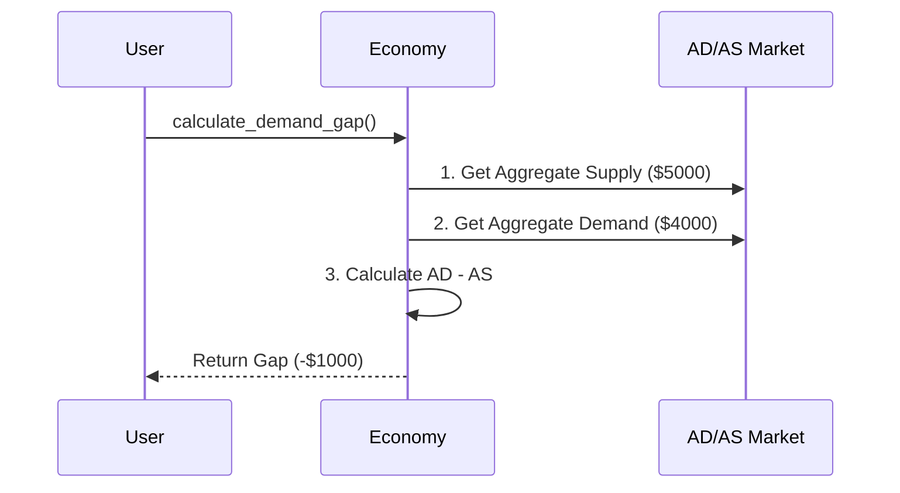

# Chapter 5: Aggregate Demand & Supply

In [Price Level & Inflation](04_price_level___inflation_.md), we learned how to measure if things are getting more expensive and how the "measuring cup" of money shrinks. But what actually makes prices rise or fall? And what makes factories hire more workers or lay them off? 

To understand this, we need to look at the ultimate economic seesaw: Aggregate Demand and Aggregate Supply. Our central use case for this chapter: **Econland's factories are sitting idle and workers are being laid off. How do we measure if the problem is that people aren't buying enough, or that factories aren't producing enough?**

## Breaking Down the "Economic Seesaw"

Before we code, let's understand the two sides of this giant seesaw and how they interact.

### 1. Aggregate Demand (AD): The "Wants to Buy" Side
Aggregate Demand is the total amount of spending in the economy. It's everyone's combined desire to buy things. Economists break it down into four parts:
* **C (Consumption):** Everyday spending by households (food, clothes, movies).
* **I (Investment):** Businesses buying machines or building factories.
* **G (Government):** Government spending on roads, schools, and defense.
* **NX (Net Exports):** What foreigners buy from us minus what we buy from them.

**Analogy:** Think of AD as all the orders coming into a restaurant kitchen.

### 2. Aggregate Supply (AS): The "Wants to Produce" Side
Aggregate Supply is the total amount of goods and services businesses are willing to produce and sell. It depends on how many workers we have, how many machines we have, and our technology (which we learned about in [Economic Growth](02_economic_growth_.md)).

**Analogy:** Think of AS as the kitchen's maximum capacity to cook food.

### 3. Effective Demand: Having the Money to Back It Up
It's not enough to just *want* a sports car; you need the money to buy it! **Effective demand** is desire backed by purchasing power. When effective demand falls short of what the economy can produce, factories idle and workers get laid off.

## Using the `macro_economic` Project

Let's use our project to diagnose Econland's idle factories. First, let's check the balance of our economic seesaw by calculating Aggregate Demand and Aggregate Supply:

```python
from macro_economic import Economy

econland = Economy("Econland", year=2023)
ad = econland.calculate_aggregate_demand()
as_ = econland.calculate_aggregate_supply()

print(f"Aggregate Demand: ${ad}")
print(f"Aggregate Supply: ${as_}")
```

**Output:**
```text
Aggregate Demand: $4000
Aggregate Supply: $5000
```

Aha! Demand ($4000) is much lower than Supply ($5000). Let's break down that demand to see *who* stopped spending:

```python
demand_breakdown = econland.get_ad_components()
print(demand_breakdown)
```

**Output:**
```text
{'C': 2000, 'I': 500, 'G': 1000, 'NX': 500}
```

It looks like Consumption (C) and Investment (I) are relatively low. People and businesses aren't spending enough! Let's calculate the exact "effective demand gap" to see how far off the seesaw is:

```python
gap = econland.calculate_demand_gap()
print(f"Effective Demand Gap: ${gap}")
```

**Output:**
```text
Effective Demand Gap: -$1000
```

A negative gap means demand is falling short of supply by $1000. This is why factories are idling—there aren't enough paying customers for what the economy is capable of producing!

## Under the Hood: How is the Demand Gap Calculated?

How does the `macro_economic` project figure out this gap? It simply subtracts the total spending (AD) from the total production capacity (AS). If the number is negative, we have insufficient effective demand.



### The Internal Code

Let's peek inside the `Economy` class to see how this looks in code. It takes the total demand and subtracts the total supply capacity to find the imbalance.

```python
# Inside macro_economic/economy.py
class Economy:
    def calculate_demand_gap(self):
        # 1. Get total production capacity
        supply = self.calculate_aggregate_supply()
        
        # 2. Get total spending (C + I + G + NX)
        demand = self.calculate_aggregate_demand()
        
        # 3. Find the difference
        return demand - supply
```

As you can see, the math is simple, but the implications are huge! If the result is negative, we have insufficient effective demand. This causes businesses to cut back, which leads directly to the cyclical unemployment we learned about in [Employment & Unemployment](03_employment___unemployment_.md). 

## Conclusion

In this chapter, we learned that the macro-economy acts like a giant seesaw. **Aggregate Demand** (total spending by consumers, businesses, government, and foreigners) must balance with **Aggregate Supply** (total production). When demand falls short of what the economy can produce—a situation called **insufficient effective demand**—factories idle and workers are laid off. 

But why does aggregate demand drop in the first place? And does it always drop slowly, or can it crash suddenly? Let's explore the ups and downs of the economy in the next chapter: [Economic Cycles](06_economic_cycles_.md).

---

Generated by [AI Codebase Knowledge Builder](https://github.com/The-Pocket/Tutorial-Codebase-Knowledge)