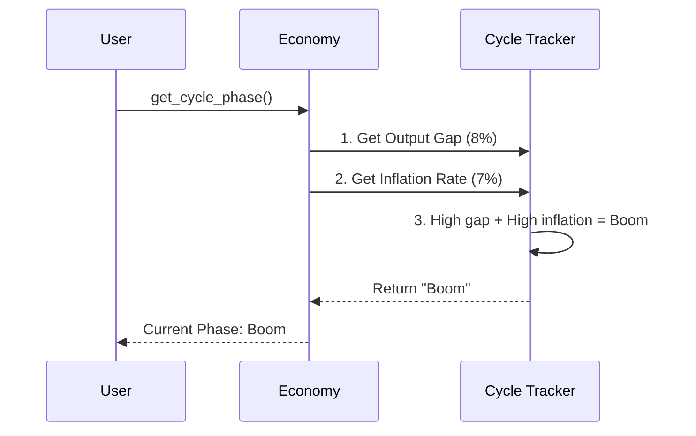

# Chapter 6: Economic Cycles

In [Aggregate Demand & Supply](05_aggregate_demand___supply_.md), we learned about the economic seesaw, where total spending (Demand) must balance with total production (Supply). But what happens when this seesaw keeps bouncing up and down over time? 

Imagine the economy is like a giant forest that goes through four distinct seasons every few years. Spring brings new life and growth; summer gets too hot; autumn sees leaves fall and things slow down; and winter brings a deep freeze. Policymakers constantly watch this forest, trying to keep it in a perpetual spring or mild summer without letting it freeze over. 

Our central use case for this chapter: **Econland is currently booming, but prices are rising too fast. How do we identify where we are in the economic "seasons," and how can we cool down the economy without causing a devastating freeze?**

## Breaking Down the "Economic Seasons"

Before we code, let's understand the four phases of an economic cycle. Just like the weather, the economy naturally fluctuates over time.

### 1. Expansion (Spring): Warming Up
During an expansion, things are looking up! Production increases, more jobs are created, and consumers start spending more. The economy is growing, but it hasn't reached its limits yet. It's like the snow melting and flowers beginning to bloom.

### 2. Boom (Summer): Overheating
The economy is now running at maximum speed. Factories are at full capacity, and almost everyone has a job. But because demand is so high and supply is maxed out, prices start to soar. This is the "overheating" phase, where high inflation becomes a major problem (just like we learned in [Price Level & Inflation](04_price_level___inflation_.md)).

### 3. Recession (Autumn): Cooling Down
The heat can't last forever. As prices get too high, people stop buying. Businesses see their orders drop, so they cut back on production and start laying off workers. The economy shrinks. A recession is typically defined as two quarters (six months) of declining Real GDP.

### 4. Depression (Winter): Deep Freeze
If a recession goes on for a long time and gets extremely severe, it turns into a depression. This is a prolonged economic freeze where unemployment stays incredibly high, businesses shut down entirely, and consumer confidence hits rock bottom. 

### Soft Landing vs. Hard Landing
When the economy is in the "Boom" phase of summer, policymakers try to cool it down. A **soft landing** is when they successfully reduce inflation without causing a recession—like gently easing into autumn. A **hard landing** is when they hit the brakes too hard, plunging the economy straight into a harsh winter (recession or depression).

## Using the `macro_economic` Project

Let's use our project to figure out what season Econland is currently experiencing. First, let's check the economic cycle phase:

```python
from macro_economic import Economy

econland = Economy("Econland", year=2023)
phase = econland.get_cycle_phase()
print(f"Current Phase: {phase}")
```

**Output:**
```text
Current Phase: Boom
```

Econland is in the Boom phase! It's running hot. Let's check if it's overheating by looking at the output gap (how much actual GDP exceeds Potential GDP, which we covered in [Economic Growth](02_economic_growth_.md)):

```python
gap = econland.calculate_output_gap()
print(f"Output Gap: {gap}%")
```

**Output:**
```text
Output Gap: 8%
```

An 8% positive output gap means Econland is producing way above its sustainable capacity. Inflation is likely spiking. Let's try to engineer a "soft landing" by gently cooling the economy down:

```python
result = econland.attempt_soft_landing(cooling_rate=0.02)
print(result)
```

**Output:**
```text
{'status': 'Soft Landing Achieved', 'new_phase': 'Expansion'}
```

By applying a gentle cooling rate of 2%, we successfully brought Econland out of the overheating Boom and back into a healthy Expansion, avoiding a harsh winter!

## Under the Hood: How is the Cycle Phase Calculated?

How does the `macro_economic` project know what season the economy is in? It doesn't look out the window; it looks at the data! It checks the output gap (Real GDP vs. Potential GDP) and the inflation rate to determine the current phase.



### The Internal Code

Let's peek inside the `Economy` class to see how this logic looks in code. It uses simple rules based on the output gap and inflation to determine the season.

```python
# Inside macro_economic/economy.py
class Economy:
    def get_cycle_phase(self):
        gap = self.calculate_output_gap()
        inflation = self.calculate_inflation_rate()
        
        # If producing above capacity and high inflation -> Boom
        if gap > 5 and inflation > 5:
            return "Boom"
        # Other conditions for Expansion, Recession, Depression...
```

As you can see, the code simply checks the economic "vital signs." A large positive output gap combined with high inflation is the classic sign of an overheating summer Boom. When we called `attempt_soft_landing()`, the system gently reduced the demand just enough to lower that gap and inflation, bringing the season back to a comfortable spring!

## Conclusion

In this chapter, we learned that the economy naturally flows through seasons: **Expansion** (spring), **Boom** (summer), **Recession** (autumn), and **Depression** (winter). We also discovered that policymakers' biggest challenge is cooling down an overheating economy for a **soft landing**, rather than slamming on the brakes and causing a **hard landing**. 

But how exactly do policymakers "cool down" or "heat up" the economy? They don't have a weather machine, but they do have the power of the purse! Let's explore how the government uses its budget to steer the economic seasons in the next chapter: [Fiscal Policy](07_fiscal_policy_.md).

---

Generated by [AI Codebase Knowledge Builder](https://github.com/The-Pocket/Tutorial-Codebase-Knowledge)