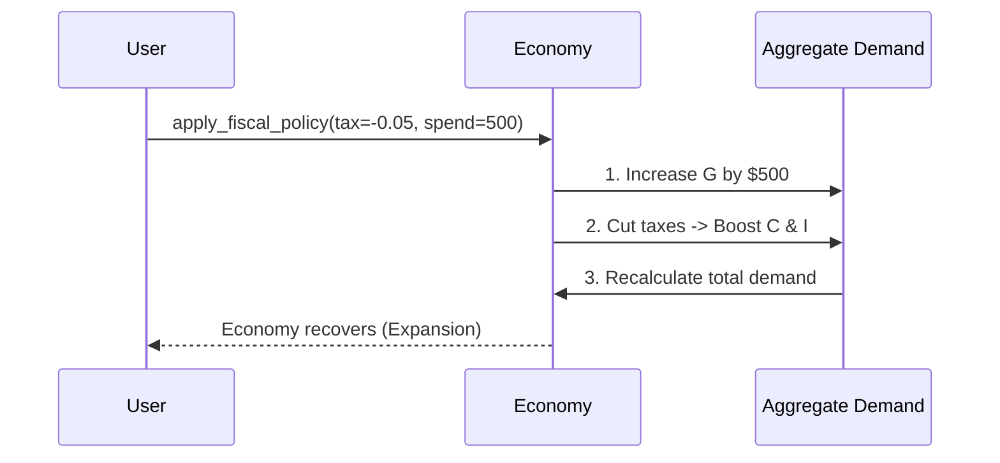

# Chapter 7: Fiscal Policy

In [Economic Cycles](06_economic_cycles_.md), we learned that the economy naturally goes through seasons—booming in the summer and freezing in the winter. But what if the winter is too harsh, or the summer is dangerously hot? Do we just sit and wait? 

No! The government has a toolkit to steer the economy, and the most powerful tool in that kit is **Fiscal Policy**. Imagine driving a car: when the economy is sluggish, the government steps on the gas (expansionary policy), and when it's overheating, it hits the brakes (contractionary policy). It also has shock absorbers that automatically smooth out the bumps in the road!

Our central use case for this chapter: **Econland is stuck in a deep recession. People are losing jobs, and factories are sitting idle. How can the government use its "purse" (taxes and spending) to step on the gas and rescue the economy?**

## Breaking Down the "Government's Car Controls"

Before we code, let's understand the pedals and shock absorbers the government uses to drive the economy.

### 1. Expansionary Policy: Stepping on the Gas
When the economy is in a slump, the government wants to boost [Aggregate Demand & Supply](05_aggregate_demand___supply_.md). It does this in two main ways:
* **Cutting Taxes:** If people and businesses pay less tax, they have more money in their pockets to spend and invest.
* **Increasing Spending:** The government builds roads, funds schools, or provides subsidies. This directly pumps money into the economy and creates jobs.

### 2. Contractionary Policy: Hitting the Brakes
When the economy is overheating (like the "Boom" phase we saw in [Economic Cycles](06_economic_cycles_.md)), inflation runs rampant. To cool it down, the government does the opposite:
* **Raising Taxes:** This pulls money out of people's pockets, reducing their spending power.
* **Cutting Spending:** The government spends less on projects, reducing the total demand in the economy.

### 3. Automatic Stabilizers: The Shock Absorbers
Some fiscal policies act like a car's shock absorbers—they work automatically without the government having to pass new laws! 
* **Unemployment benefits:** When the economy drops, more people automatically qualify for benefits, keeping some money flowing.
* **Progressive taxes:** As people earn less in a recession, they automatically fall into lower tax brackets, paying less tax. 
These stabilizers cushion the fall in bad times and gently tap the brakes in good times.

### 4. Deficits and Debt: The Fuel Bill
Stepping on the gas costs money. If the government spends more than it collects in taxes, it runs a **Fiscal Deficit**. To pay for this, the government has to borrow money, which adds to the **National Debt**. A little debt is fine to get out of a recession, but too much can cause long-term problems.

## Using the `macro_economic` Project

Let's use our project to step on the gas and rescue Econland from its recession. First, let's confirm the economy is struggling:

```python
from macro_economic import Economy

econland = Economy("Econland", year=2023)
phase = econland.get_cycle_phase()
print(f"Current Phase: {phase}")
```

**Output:**
```text
Current Phase: Recession
```

Econland is in a recession! Let's implement an expansionary fiscal policy by cutting taxes by 5% and increasing government spending by $500:

```python
# Step on the gas!
econland.apply_fiscal_policy(tax_change=-0.05, spending_change=500)
new_phase = econland.get_cycle_phase()
print(f"New Phase: {new_phase}")
```

**Output:**
```text
New Phase: Expansion
```

It worked! The economy is recovering. But how much did this rescue cost us? Let's check the deficit:

```python
deficit = econland.calculate_deficit()
print(f"Fiscal Deficit: ${deficit}")
```

**Output:**
```text
Fiscal Deficit: $600
```

We had to borrow $600 to fund this recovery. Finally, let's check if our shock absorbers (automatic stabilizers) are also helping cushion the bumps:

```python
stabilizer_impact = econland.get_stabilizer_effect()
print(f"Automatic Stabilizer Boost: ${stabilizer_impact}")
```

**Output:**
```text
Automatic Stabilizer Boost: $150
```

Great! Even without new laws, the automatic stabilizers provided an extra $150 of cushioning.

## Under the Hood: How Does Fiscal Policy Work?

How does the `macro_economic` project translate tax cuts and spending increases into economic recovery? It adjusts the components of Aggregate Demand (C, I, and G) that we learned about in [Aggregate Demand & Supply](05_aggregate_demand___supply_.md).



### The Internal Code

Let's peek inside the `Economy` class to see how this looks in code. It modifies the spending variables and then updates the overall economy.

```python
# Inside macro_economic/economy.py
class Economy:
    def apply_fiscal_policy(self, tax_change, spending_change):
        # 1. Directly change government spending (G)
        self.gov_spending += spending_change
        
        # 2. Change taxes, which affects consumer spending (C)
        # and business investment (I)
        self.consumer_spending *= (1 - tax_change)
        self.investment *= (1 - tax_change)
        
        # 3. Recalculate the total economic demand
        self.update_aggregate_demand()
```

As you can see, changing taxes has a ripple effect. When taxes go down (`tax_change` is negative), `(1 - tax_change)` becomes a multiplier greater than 1, which increases consumer spending and investment! Combined with the direct government spending, this boosts Aggregate Demand and pulls the economy out of its slump.

## Conclusion

In this final chapter, we learned how the government steers the macroeconomic car using **Fiscal Policy**. We discovered that **expansionary policy** (cutting taxes, increasing spending) steps on the gas to rescue a sluggish economy, while **contractionary policy** (raising taxes, cutting spending) hits the brakes to cool down an overheating one. We also learned about **automatic stabilizers**, the shock absorbers that cushion economic bumps automatically, and the **deficits and debts** that come from footing the bill for these policies.

Together with the concepts from all the previous chapters—output, growth, employment, inflation, supply and demand, and cycles—you now have a complete toolkit to understand how a nation's economy works and how policymakers try to keep it running smoothly!

---

Generated by [AI Codebase Knowledge Builder](https://github.com/The-Pocket/Tutorial-Codebase-Knowledge)