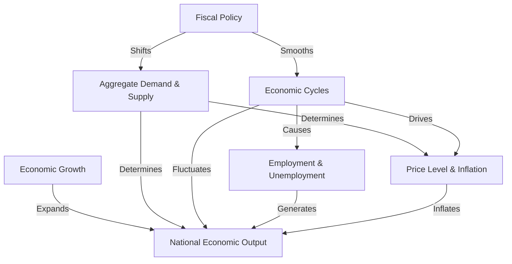

# Tutorial: macro_economic

This project serves as a **macroeconomics core terminology map** that explains how a national economy operates as a "big machine." It breaks down fundamental concepts like **National Economic Output** (GDP), *Economic Growth*, *Employment & Unemployment*, and *Price Level & Inflation*. By illustrating the interactions between **Aggregate Demand & Supply** and **Fiscal Policy**, it helps beginners understand how production, income, and government regulation shape the overall economic health and smooth out *Economic Cycles*.

**Source Repository:** [None](None)

## Chapters

1. [National Economic Output
](01_national_economic_output_.md)
2. [Economic Growth
](02_economic_growth_.md)
3. [Employment & Unemployment
](03_employment___unemployment_.md)
4. [Price Level & Inflation
](04_price_level___inflation_.md)
5. [Aggregate Demand & Supply
](05_aggregate_demand___supply_.md)
6. [Economic Cycles
](06_economic_cycles_.md)
7. [Fiscal Policy
](07_fiscal_policy_.md)

---

Generated by [AI Codebase Knowledge Builder](https://github.com/The-Pocket/Tutorial-Codebase-Knowledge)