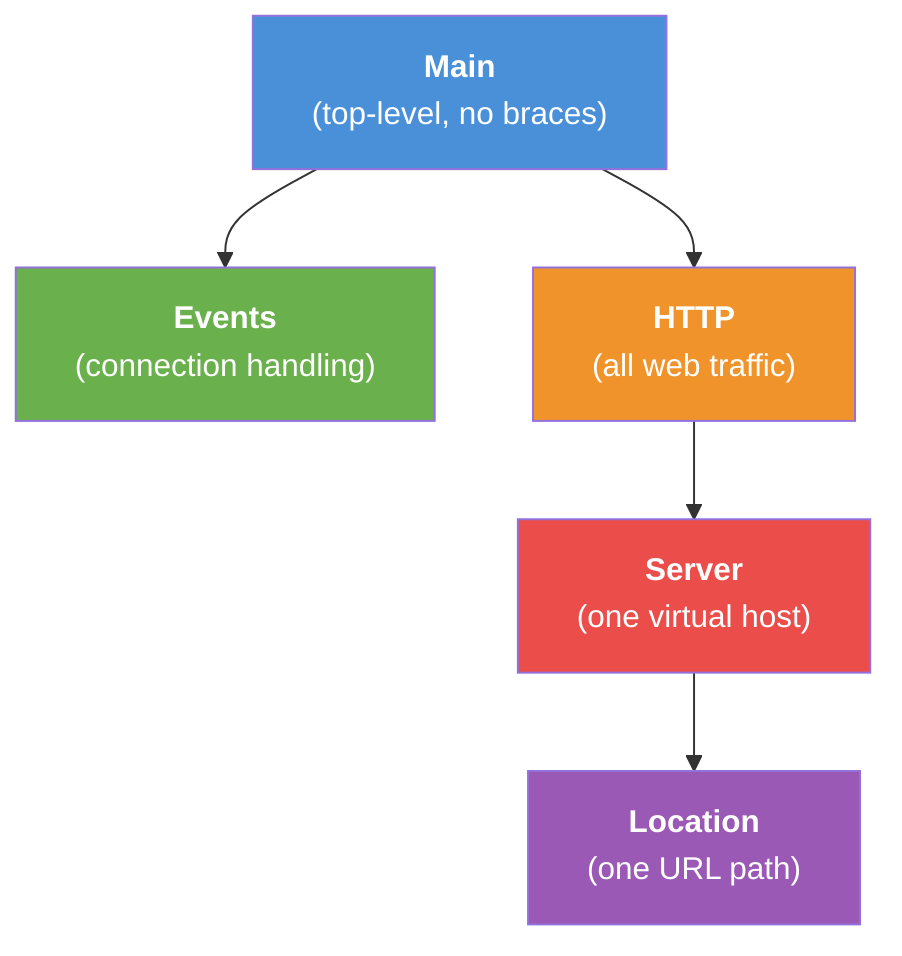
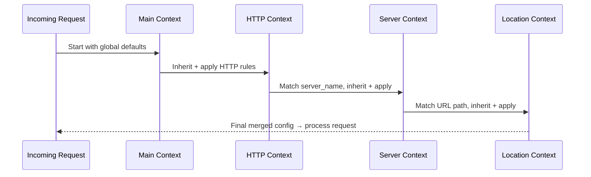

# Chapter 1: Contexts and Directives

## Why Does Nginx Configuration Look Like That?

Imagine you're managing a company. You want to set some rules: everyone works 9-to-5, dress code is business casual, and lunch is 1 hour. But then the engineering team works flexible hours, and the gym team wears athletic gear. You wouldn't write a *separate* rulebook for every single person — you'd write a **global handbook** and let each department **override** what they need.

That's exactly how Nginx configuration works. You set global rules, and more specific sections can inherit or override them. The two building blocks that make this possible are **directives** and **contexts**.

Let's say our use case is: *we want to set a default maximum upload size for our whole website, but allow a specific section (like an admin panel) to accept larger uploads.* By the end of this chapter, you'll know exactly how.

---

## What is a Directive?

A **directive** is simply a command — a single instruction that tells Nginx what to do. It's one line of configuration.

```nginx
worker_processes auto;
```

This directive says: "Nginx, please automatically figure out how many worker processes to run."

There are two flavors of directives:

| Type | What it does | Example |
|------|-------------|---------|
| **Simple directive** | One line, ends with `;` | `client_max_body_size 20m;` |
| **Block directive** | Opens a `{ }` block that contains more directives | `http { ... }` |

> 💡 **Beginner tip:** Forget the semicolon, and Nginx will crash with a config error. That semicolon is like the period at the end of a sentence — it tells Nginx "this command is complete."

---

## What is a Context?

A **context** is a container — a section of configuration where directives live. Block directives create contexts. Think of them as **folders** on your computer: a folder can contain files (directives) and other folders (nested contexts).

```nginx
http {
    # directives inside the "http" context
}
```

The `http { }` block creates an **http context**. Any directive inside it relates to web traffic.

---

## The Nesting Doll: How Contexts Stack

Nginx contexts nest inside each other like Russian nesting dolls. Here's the hierarchy:



| Context | What it controls | Analogy |
|---------|-----------------|---------|
| **Main** | Everything (global settings) | Company-wide handbook |
| **Events** | How connections are handled | IT infrastructure policy |
| **HTTP** | All web traffic settings | Department-wide rules |
| **Server** | One website/virtual host | Team rules |
| **Location** | One specific URL path | Individual project rules |

The **main context** is special — it's the top level of your config file, with no `{ }` around it. Everything else nests inside.

---

## Inheritance: The Global Rule Applies — Unless You Say Otherwise

Here's the magic: **settings in an outer context are automatically inherited by inner contexts.** But if an inner context sets the same directive, it **overrides** the outer value.

Let's see this in action with our use case — setting a default upload size but allowing larger uploads for the admin panel:

```nginx
http {
    client_max_body_size 20m;  # Global: 20MB for all sites
}
```

This says: "Across all websites, allow uploads up to 20MB." Every [Server Block](02_server_blocks__virtual_hosts__.md) and [Location Block](03_location_blocks__routing__.md) inside inherits this.

Now let's override it for a specific site:

```nginx
http {
    client_max_body_size 20m;  # Global: 20MB

    server {
        client_max_body_size 2m;  # This site: only 2MB
    }
}
```

The `server` block inherits everything from `http`, but says "actually, for *this* website, I want 2MB." The local rule wins.

And we can go one level deeper:

```nginx
http {
    client_max_body_size 20m;  # Global: 20MB

    server {
        client_max_body_size 2m;  # This site: 2MB

        location /admin/ {
            client_max_body_size 100m;  # Admin: 100MB!
        }
    }
}
```

Now the `/admin/` path allows 100MB uploads, while the rest of the site is 2MB, and other sites default to 20MB. Problem solved! 🎉

---

## What Happens When Nginx Reads Your Config?

Let's walk through what Nginx does internally when it processes a request, step by step:



When a request arrives, Nginx builds the **final configuration** by walking down the nesting chain:

1. **Start** with main context defaults
2. **Layer on** the HTTP context settings (overriding any conflicts)
3. **Layer on** the matching server block settings
4. **Layer on** the matching location block settings

The result is like painting layers on a canvas — each layer can cover up what's beneath.

---

## A Peek Under the Hood

Inside Nginx's source code (specifically in `src/core/ngx_conf.c`), the configuration parser reads your file token by token. When it encounters a block directive like `http {`, it:

1. **Creates a new context** in memory
2. **Copies inherited values** from the parent context
3. **Reads directives** inside the block, overwriting inherited values as needed
4. **Closes the context** when it hits `}`

Here's a simplified view of how inheritance works internally:

```c
// Simplified: when entering a new context
new_config = copy_from(parent_config);  // Inherit everything

// When a directive is found inside
new_config.setting = parsed_value;      // Override locally
```

This is why setting `client_max_body_size 100m;` in a `location` block doesn't change the parent `server` block — the override only exists in the **copy** created for that location.

> 🔍 **The key insight:** Each context gets its own copy of the configuration. Overrides are local — they never "bubble up" to parent contexts.

---

## Quick Reference: Context Cheat Sheet

```nginx
# Main context (no braces — just top-level directives)
worker_processes auto;

events {
    # Connection handling (covered in Chapter 8)
    worker_connections 1024;
}

http {
    # All web traffic settings
    include mime.types;

    server {
        # One virtual host (covered in Chapter 2)
        listen 80;

        location / {
            # One URL route (covered in Chapter 3)
        }
    }
}
```

Notice how `events` and `http` are siblings (both inside main), while `server` is inside `http`, and `location` is inside `server`. The nesting matters!

---

## Common Beginner Mistakes

| Mistake | Why it's wrong | Fix |
|---------|---------------|-----|
| Putting `server` outside `http` | Server blocks only exist for web traffic | Always nest inside `http { }` |
| Forgetting `;` on simple directives | Nginx can't tell where the command ends | Always end simple directives with `;` |
| Expecting child changes to affect parent | Inheritance goes **down**, not up | Set overrides in the most specific context |

---

## Summary

You've learned the two fundamental building blocks of Nginx configuration:

- **Directives** are commands — simple ones end with `;`, block ones create contexts with `{ }`
- **Contexts** are containers that nest: main → events/http → server → location
- **Inheritance** flows downward — outer settings apply to inner contexts
- **Overrides** are local — inner contexts can replace inherited values without affecting parents

Think of it like a company: global policy applies everywhere, but departments and teams can customize their own rules. This pattern will follow us throughout the entire tutorial.

In the next chapter, we'll zoom into the **server context** — the "department" level — and learn how to host multiple websites on a single Nginx instance: [Server Blocks (Virtual Hosts)](02_server_blocks__virtual_hosts__.md).

---

Generated by [AI Codebase Knowledge Builder](https://github.com/The-Pocket/Tutorial-Codebase-Knowledge)