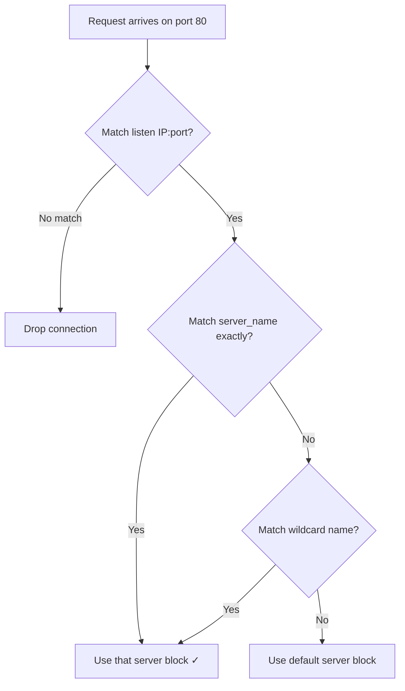
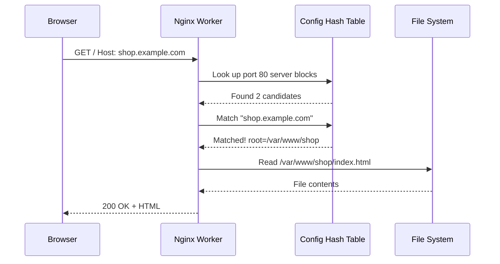

# Chapter 2: Server Blocks (Virtual Hosts)

In [Chapter 1: Contexts and Directives](01_contexts_and_directives_.md), you learned that Nginx configuration is built from nested contexts — like a company handbook with departments overriding global rules. The `server` context was one of those nested layers. Now let's zoom into it: **how does one Nginx instance serve multiple websites?**

---

## The Problem: One Server, Many Websites

Imagine you have a single server with one IP address. You want to host **two websites** on it:

- `blog.example.com` — your personal blog
- `shop.example.com` — your online store

You don't want to buy two servers. You just want Nginx to look at the incoming request and say: *"Ah, this is for the blog"* or *"This is for the shop,"* and serve the right content. That's exactly what **server blocks** do.

---

## The Apartment Building Analogy

Think of your server as an **apartment building**:

| Concept | Analogy |
|---------|---------|
| **Server (IP address)** | The apartment building — one main entrance |
| **Server block** | An individual apartment — its own space and rules |
| **Domain name (Host header)** | The name on the envelope — tells the carrier which apartment |
| **Nginx** | The mail carrier — reads the name and delivers correctly |

One building, many tenants. The mail carrier (Nginx) never gets confused because it reads the name on every envelope.

---

## What Is a Server Block?

A **server block** is a `server { }` context inside the `http { }` context. Each one defines a **virtual host** — a separate website or application.

```nginx
http {
    server {
        listen 80;
        server_name blog.example.com;
        root /var/www/blog;
    }
}
```

This says: *"If a request comes in on port 80 for `blog.example.com`, serve files from `/var/www/blog`."*

Let's break down the key directives:

| Directive | What it does | Example |
|-----------|-------------|---------|
| `listen` | Which port/IP to listen on | `listen 80;` |
| `server_name` | Which domain name to match | `server_name blog.example.com;` |
| `root` | Where the website files live | `root /var/www/blog;` |

---

## Serving Two Websites: Our Use Case

Let's add the shop. We just add **another** `server` block:

```nginx
http {
    server {
        listen 80;
        server_name blog.example.com;
        root /var/www/blog;
    }
}
```

```nginx
    server {
        listen 80;
        server_name shop.example.com;
        root /var/www/shop;
    }
```

Two server blocks, same `http` context, same port 80. When a request arrives:

- Request for `blog.example.com` → first server block → files from `/var/www/blog`
- Request for `shop.example.com` → second server block → files from `/var/www/shop`

Each website is completely isolated. The blog can't accidentally serve the shop's files.

---

## How Does Nginx Pick the Right Server Block?

When a request arrives, Nginx needs to decide which `server` block handles it. Here's the decision process:



Step by step:

1. **Match `listen`** — Filter server blocks that listen on the request's IP and port
2. **Match `server_name`** — Among those, find the one matching the `Host` header
3. **Fall back to default** — If nothing matches, use the **default server**

> 💡 **Beginner tip:** The `server_name` is how Nginx tells your websites apart when they share the same IP and port. This is called **name-based virtual hosting**, and it's the most common approach.

---

## The Default Server: What If Nothing Matches?

What if someone visits your server's IP directly, or uses a domain you didn't configure? Nginx picks a **default server**. By default, that's the **first** server block it finds.

```nginx
server {
    listen 80 default_server;
    server_name _;
    return 444;  # Close the connection
}
```

The `default_server` parameter explicitly marks this block as the fallback. The `server_name _;` is a convention meaning "catch-all" — it doesn't match any real domain. And `return 444;` simply drops the connection (Nginx's way of saying "no one lives here").

---

## Name-Based vs. IP/Port-Based

There are two ways to distinguish server blocks:

| Method | How it works | When to use |
|--------|-------------|-------------|
| **Name-based** | Same IP & port, different `server_name` | Most common — one server, many domains |
| **IP/Port-based** | Different `listen` IP or port | Internal services, non-standard ports |

Name-based is what we've been doing — multiple domains on port 80. Here's a port-based example:

```nginx
server {
    listen 8080;
    server_name localhost;
    root /var/www/admin;
}
```

This serves an admin panel on port 8080, completely separate from your public sites on port 80.

---

## What Happens Internally: Request Routing

Let's trace what Nginx does when a request for `shop.example.com` arrives:



Nginx builds a **hash table** of server names at startup. When a request comes in, it does a fast lookup — not a slow linear scan through every server block. That's one reason Nginx is so fast even with hundreds of virtual hosts.

---

## Under the Hood: How Nginx Stores Server Blocks

Inside Nginx's source code (specifically `src/http/ngx_http_core_module.c`), server blocks are organized into a structure called `ngx_http_core_srv_conf_t`. At startup, Nginx:

1. **Parses** all `server { }` blocks inside `http { }`
2. **Indexes** each `server_name` into a hash table for O(1) lookup
3. **Groups** server blocks by their `listen` address/port

Here's a simplified view of the matching logic:

```c
// Simplified: finding the right server block
servers = find_by_address(port, ip);       // Step 1: by listen
server  = find_by_name(servers, hostname); // Step 2: by server_name
if (!server) server = default_server;      // Step 3: fallback
```

The hash table approach means Nginx can handle **thousands** of virtual hosts without slowing down. Adding one more website is just adding one more entry to the hash.

> 🔍 **The key insight:** Nginx doesn't "try each server block one by one." It uses hash tables for instant lookup. That's why a server with 100 virtual hosts is just as fast as one with 2.

---

## Inheritance in Server Blocks

Remember [inheritance from Chapter 1](01_contexts_and_directives_.md)? Server blocks inherit from the `http` context. This means you can set a global default and override it per-site:

```nginx
http {
    gzip on;  # Enable gzip for ALL sites

    server {
        server_name blog.example.com;
        root /var/www/blog;
    }
}
```

```nginx
    server {
        server_name shop.example.com;
        root /var/www/shop;
        gzip off;  # Override: disable gzip for the shop
    }
```

The blog gets `gzip on` (inherited from `http`), while the shop explicitly turns it off. Just like a department overriding a company-wide policy!

---

## Organizing with `include`

As you add more websites, your config file gets messy. Nginx lets you split server blocks into separate files using the `include` directive:

```nginx
http {
    include /etc/nginx/sites-enabled/*;
}
```

Each file in `sites-enabled/` contains one `server` block. This is how most Linux distributions (Ubuntu, Debian) organize Nginx by default. You can enable or disable a site just by adding or removing a file — no need to edit the main config.

---

## Common Beginner Mistakes

| Mistake | Why it's wrong | Fix |
|---------|---------------|-----|
| Missing `server_name` | Nginx can't tell your sites apart | Always set `server_name` for each block |
| Two server blocks with the same `server_name` | Ambiguous — Nginx picks the first one | Each domain should have exactly one server block |
| Forgetting `root` directive | Nginx doesn't know where to find files | Set `root` in each server block |
| Putting `server` outside `http` | Server blocks only exist for web traffic | Always nest inside `http { }` |

---

## Summary

You've learned how a single Nginx instance can host multiple websites using **server blocks**:

- **Server blocks** are `server { }` contexts inside `http { }` — each one is a virtual host
- **`server_name`** is how Nginx matches incoming requests to the right website (like names on apartment doors)
- **`listen`** specifies which IP and port the server block answers on
- **Default server** handles requests that don't match any `server_name`
- **Inheritance** flows from `http` → `server` — global settings apply unless overridden
- **Hash tables** under the hood make lookup instant, even with hundreds of sites

You now know how to give Nginx its "apartment directory." But what happens *inside* each apartment? How does a single website decide what to do with different URL paths like `/about` vs `/api/users`? That's where [Location Blocks (Routing)](03_location_blocks__routing__.md) come in — the next chapter will show you how to route traffic within a server block.

---

Generated by [AI Codebase Knowledge Builder](https://github.com/The-Pocket/Tutorial-Codebase-Knowledge)