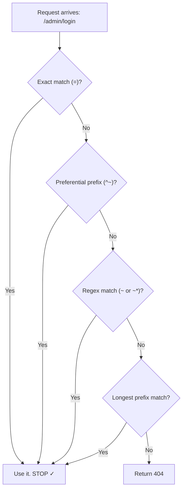
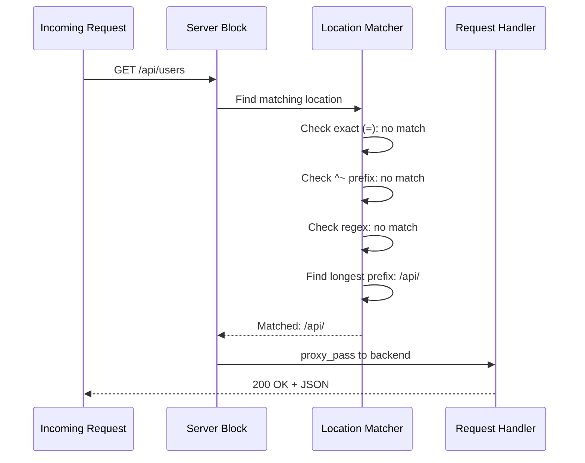

# Chapter 3: Location Blocks (Routing)

In [Chapter 2: Server Blocks (Virtual Hosts)](02_server_blocks__virtual_hosts__.md), you learned how Nginx acts like an apartment building — routing incoming requests to the right "apartment" (server block) based on the domain name. But what happens *inside* each apartment? A single website has many rooms: the homepage, an API, static images, an admin panel. How does Nginx decide what to do with each URL path? That's where **location blocks** come in.

---

## The Problem: One Website, Many Paths

Imagine you're building a web application at `myapp.com`. You need different handling for different parts of your site:

- `/` — serve the homepage (static HTML)
- `/api/` — forward to your Python backend
- `/images/` — serve image files with long cache times
- `/admin/login` — serve a specific login page

You don't want *one* giant rule for everything. You want Nginx to look at the URL path and say: *"Ah, this is an API request — send it to the backend"* or *"This is an image — serve it from disk with caching."* Location blocks let you do exactly that.

---

## What Is a Location Block?

A **location block** is a `location { }` context inside a `server { }` block. It matches a specific URL path and tells Nginx what to do with requests that match.

```nginx
server {
    listen 80;
    server_name myapp.com;

    location / {
        root /var/www/html;
    }
}
```

This says: *"For any request starting with `/`, serve files from `/var/www/html`."* Since every URL starts with `/`, this is the **catch-all** — the fallback for anything not matched by a more specific location.

---

## The Mail Sorting Room Analogy

Think of location blocks as a **mail sorting room**:

| Modifier | Analogy | What it does |
|----------|---------|-------------|
| `=` (exact) | Package marked **"FRAGILE — HANDLE FIRST"** | Matches the URL *exactly* — checked first, stops immediately |
| `^~` (preferential prefix) | Package marked **"PRIORITY MAIL"** | Matches a prefix — if matched, skips regex checking |
| `~` or `~*` (regex) | Packages matching a **pattern** (like "any zip code starting with 902") | Matches using regular expressions — checked in order |
| *(none)* (prefix) | **General sorting** by address prefix | Matches the longest prefix — lowest priority |

The sorting room always checks in this strict order. A "FRAGILE" package never gets mixed into general sorting — it's pulled aside immediately.

---

## The Matching Order: Nginx's Decision Process

This is the most important concept in this chapter. Nginx doesn't just check locations top-to-bottom. It follows a **strict priority order**:



Step by step:

1. **Exact match (`=`)** — If a location matches the URL *exactly*, use it. Done.
2. **Preferential prefix (`^~`)** — Find the longest prefix match. If it has `^~`, use it. Done.
3. **Regular expression (`~` or `~*`)** — Check regex locations in config order. First match wins.
4. **Standard prefix** — Use the longest prefix match from step 2 (the one without `^~`).

> 💡 **Beginner tip:** The order locations appear in your config file **only matters for regex matches**. Prefix matches always use the *longest* match, regardless of config order.

---

## Modifier 1: Exact Match (`=`)

The `=` modifier matches the URL path **exactly** — no extra characters, no sub-paths. It's the highest priority.

```nginx
location = / {
    root /var/www/homepage;
}
```

This matches **only** `/`. It does NOT match `/about` or `/contact`. It's like a VIP lane — if the request is an exact fit, Nginx uses it immediately and stops looking.

**When to use it:** When a specific path needs special handling and you don't want any other location to accidentally catch it. The root URL `/` is the most common use case.

---

## Modifier 2: Preferential Prefix (`^~`)

The `^~` modifier matches a prefix (like a standard location), but if it wins the "longest prefix" contest, Nginx **skips regex checking**. It's like saying: *"I'm important enough — don't bother with pattern matching."*

```nginx
location ^~ /images/ {
    root /var/www/static;
    expires 30d;
}
```

This matches any URL starting with `/images/`. If it's the longest prefix match, Nginx uses it and **won't check regex locations**.

**When to use it:** For static asset directories where you want fast, predictable matching without regex overhead.

---

## Modifier 3: Regular Expression (`~` and `~*`)

Regex locations match URL patterns. They're checked **in the order they appear in your config**.

| Modifier | Meaning | Example |
|----------|---------|---------|
| `~` | Case-sensitive regex | `location ~ \.php$` |
| `~*` | Case-insensitive regex | `location ~* \.(jpg\|png)$` |

```nginx
location ~* \.(jpg|png|gif)$ {
    expires 7d;
}
```

This matches any URL ending in `.jpg`, `.png`, or `.gif` — regardless of case. So `/images/PHOTO.JPG` would match too.

**When to use it:** When you need pattern matching — like "all URLs ending in `.php`" or "any path containing `/api/v` followed by a number."

---

## Modifier 4: Standard Prefix (No Modifier)

A location with no modifier matches by **longest prefix**. It has the lowest priority.

```nginx
location /api/ {
    proxy_pass http://backend;
}
```

This matches any URL starting with `/api/`. If no exact, preferential, or regex location matches, Nginx uses the longest prefix match.

**When to use it:** For general routing — like sending all `/api/` requests to a backend server.

---

## Solving Our Use Case

Let's put it all together for `myapp.com`:

```nginx
server {
    listen 80;
    server_name myapp.com;

    location = / {
        root /var/www/homepage;
    }
}
```

```nginx
    location ^~ /images/ {
        root /var/www/static;
        expires 30d;
    }
```

```nginx
    location ~* \.(jpg|png|gif)$ {
        expires 7d;
    }
```

```nginx
    location /api/ {
        proxy_pass http://backend;
    }
```

```nginx
    location / {
        try_files $uri $uri/ =404;
    }
```

Let's trace what happens with different requests:

| Request | Which location? | Why? |
|---------|----------------|------|
| `/` | `= /` | Exact match — highest priority |
| `/images/logo.png` | `^~ /images/` | Longest prefix with `^~` — skips regex |
| `/assets/photo.jpg` | `~* \.(jpg\|png\|gif)$` | No `^~` match, but regex matches `.jpg` |
| `/api/users` | `/api/` | Longest prefix match |
| `/about` | `/` | Longest prefix match (catch-all) |

Notice how `/images/logo.png` goes to `^~ /images/` and NOT to the regex `~* \.(jpg|png|gif)$`. The `^~` modifier "blocks" regex from being checked. That's the priority system in action!

---

## What Happens Internally: Request Routing

Let's trace what Nginx does when a request for `/api/users` arrives at `myapp.com`:



Nginx walks through the priority levels in order. Once it finds a match at a level that stops searching, it's done.

---

## Under the Hood: How Nginx Stores Locations

Inside Nginx's source code (specifically `src/http/ngx_http_core_module.c`), locations are organized into a **radix tree** (a compressed prefix trie) for prefix matches, and a **linked list** for regex matches.

At startup, Nginx:

1. **Sorts** prefix locations by length (longest first)
2. **Builds** a radix tree for O(1) prefix lookups
3. **Keeps** regex locations in config order as a linked list

Here's a simplified view of the matching logic:

```c
// Simplified: location matching
if (exact_match_found) return exact_location;

prefix_match = find_in_radix_tree(uri);
if (prefix_match && prefix_match->is_preferential)
    return prefix_match;  // ^~ stops here

// Check regex locations in config order
for (regex in regex_list) {
    if (regex_matches(regex, uri))
        return regex_location;
}

// Fall back to longest prefix
return prefix_match;
```

The radix tree makes prefix matching extremely fast — it doesn't scan every location, it traverses the tree character by character. Regex matching is slower (it tests patterns one by one), which is why `^~` exists: it lets you skip regex for paths you know should be handled as static content.

> 🔍 **The key insight:** Nginx uses a radix tree for prefix locations (fast!) and a linear scan for regex locations (slower). The `^~` modifier exists to "opt out" of regex scanning when you know a prefix match should win.

---

## Inheritance in Location Blocks

Remember [inheritance from Chapter 1](01_contexts_and_directives_.md)? Location blocks inherit from their parent `server` block. This means you can set defaults at the server level and override them per-location:

```nginx
server {
    root /var/www/html;  # Default for all locations

    location /admin/ {
        root /var/www/secure;  # Override for /admin/
    }
}
```

A request to `/about` uses `/var/www/html/about`, but `/admin/dashboard` uses `/var/www/secure/admin/dashboard`. The local override wins, just like in [Chapter 1](01_contexts_and_directives_.md).

---

## Common Beginner Mistakes

| Mistake | Why it's wrong | Fix |
|---------|---------------|-----|
| Thinking config order always matters | Only regex locations respect config order | Prefix matches always use the longest match |
| Using regex when prefix would work | Regex is slower and harder to debug | Use `^~` for static paths, regex only for patterns |
| Forgetting a catch-all `/` location | Unmatched paths may return unexpected results | Always include `location / { }` as fallback |
| Using `=` for prefixes | `= /api` only matches `/api`, not `/api/users` | Use `= /api` only for exact paths, no modifier for prefixes |
| Multiple regex matches overlapping | First regex in config wins — can be surprising | Order your regex locations carefully |

---

## Quick Reference: Location Modifier Cheat Sheet

```nginx
# 1. Exact match — highest priority
location = / { ... }

# 2. Preferential prefix — skips regex
location ^~ /static/ { ... }

# 3. Regex (case-sensitive)
location ~ \.php$ { ... }

# 4. Regex (case-insensitive)
location ~* \.(jpg|png)$ { ... }

# 5. Standard prefix — lowest priority
location /api/ { ... }
```

Remember the order: **exact → preferential → regex → prefix**. Like the mail room: fragile first, priority next, pattern-matched, then general sorting.

---

## Summary

You've learned how to route traffic *within* a server block using **location blocks**:

- **Location blocks** match URL paths and tell Nginx how to handle each one
- **Matching priority** follows a strict order: exact (`=`) → preferential prefix (`^~`) → regex (`~`/`~*`) → standard prefix
- **`=`** matches exactly one path — like a VIP lane
- **`^~`** matches a prefix and blocks regex from overriding it — like priority mail
- **`~`/`~*`** match patterns — checked in config order
- **No modifier** matches the longest prefix — the general fallback
- Under the hood, Nginx uses a **radix tree** for fast prefix lookups and a linear scan for regex

You now know how to sort requests within a single website. But what about the `/api/` location we used — where does `proxy_pass http://backend` actually send the request? That's the world of **reverse proxies and upstream servers**, which we'll explore in [Chapter 4: Reverse Proxy & Upstream](04_reverse_proxy___upstream__.md).

---

Generated by [AI Codebase Knowledge Builder](https://github.com/The-Pocket/Tutorial-Codebase-Knowledge)