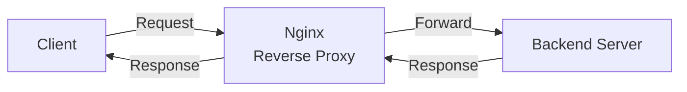
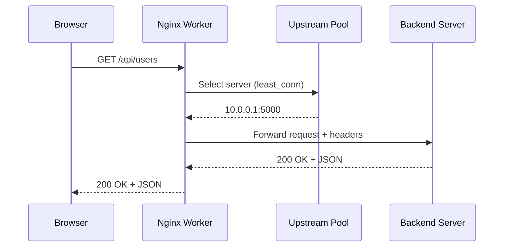

# Chapter 4: Reverse Proxy & Upstream

In [Chapter 3: Location Blocks (Routing)](03_location_blocks__routing__.md), you learned how to route requests to different URL paths within a server block. We even teased a mysterious directive: `proxy_pass http://backend`. But where does that request actually *go*? It's time to open the door and see what's on the other side.

---

## The Problem: Your App Needs a Bodyguard

Imagine you've built a Python web application running on port 5000. You want the world to access it, but you don't want to expose your app directly. Why?

- **Security:** If attackers hit your app directly, they can probe for weaknesses
- **Scalability:** What if one app instance can't handle all the traffic?
- **Flexibility:** What if you need to update your app without downtime?

You need someone to stand in front of your app — receiving all visitors and forwarding them inside. That someone is a **reverse proxy**.

---

## The Call Center Analogy

Think of a busy **call center**:

| Concept | Analogy |
|---------|---------|
| **Client** | The caller |
| **Nginx (reverse proxy)** | The receptionist who answers every call |
| **Upstream servers** | The agents who actually handle the call |
| **Load balancing** | Receptionist distributes calls to available agents |

The caller never speaks directly to an agent. The receptionist answers, finds an available agent, and connects them. If one agent is busy, the receptionist routes to another. If an agent quits and is replaced, the caller never notices.

---

## What Is a Reverse Proxy?

A **reverse proxy** sits in front of your backend servers. Clients talk to Nginx, and Nginx forwards the request to the real server. The response flows back through Nginx to the client.



The client thinks it's talking to Nginx. It has no idea the real work happens elsewhere.

---

## Your First Reverse Proxy

Let's say your Python app runs on `127.0.0.1:5000`. Here's how you tell Nginx to forward requests to it:

```nginx
server {
    listen 80;
    server_name api.example.com;

    location / {
        proxy_pass http://127.0.0.1:5000;
    }
}
```

That's it! When someone visits `api.example.com`, Nginx forwards the request to your app on port 5000 and returns the response.

> 💡 **Beginner tip:** `proxy_pass` is the magic word. It tells Nginx: "Don't serve a file — send this request somewhere else."

---

## But Wait — The Backend Doesn't Know Who's Calling

There's a problem. When Nginx forwards the request, the backend sees Nginx's IP address, not the real client's. It's like the receptionist transferring a call without telling the agent who's on the line.

We fix this by passing **headers** with the original client info:

```nginx
location / {
    proxy_pass http://127.0.0.1:5000;
    proxy_set_header Host $host;
    proxy_set_header X-Real-IP $remote_addr;
}
```

Now the backend knows the original domain (`Host`) and the client's real IP (`X-Real-IP`). The receptionist whispers: *"The caller's name is 192.168.1.42."*

---

## What Is an Upstream?

So far, we've forwarded to a **single** server. But what if you have **multiple** backend instances? That's where the `upstream` block comes in.

An **upstream** defines a group of backend servers — your "pool of agents."

```nginx
upstream backend {
    server 127.0.0.1:5000;
    server 127.0.0.1:5001;
}
```

Then you reference it in `proxy_pass`:

```nginx
location / {
    proxy_pass http://backend;
}
```

Now Nginx will **alternate** between port 5000 and 5001 — distributing the load evenly.

---

## Load Balancing Strategies: How Does the Receptionist Pick?

By default, Nginx uses **round-robin** — each request goes to the next server in line. But you can change the strategy:

| Strategy | Directive | How it works | Analogy |
|----------|-----------|-------------|---------|
| **Round-robin** | *(default)* | Take turns evenly | "You go, then you go" |
| **Least connections** | `least_conn;` | Pick the server with fewest active requests | "Whoever is least busy" |
| **IP hash** | `ip_hash;` | Same client IP → same server | "You always get the same agent" |

Here's how you switch strategies:

```nginx
upstream backend {
    least_conn;
    server 127.0.0.1:5000;
    server 127.0.0.1:5001;
}
```

> 💡 **When to use what:** Use `least_conn` when requests take varying amounts of time. Use `ip_hash` when you need session stickiness (the same user always hits the same server).

---

## Weighted Load Balancing: Some Agents Are Faster

Not all servers are equal. Maybe one has more RAM or a faster CPU. You can assign **weights** — a server with weight 3 gets 3× more requests than one with weight 1:

```nginx
upstream backend {
    server 10.0.0.1 weight=3;
    server 10.0.0.2 weight=1;
}
```

Out of every 4 requests, 3 go to `10.0.0.1` and 1 goes to `10.0.0.2`. The stronger agent handles more calls.

---

## Health Checks: What If an Agent Is Sick?

What happens if a backend server crashes? By default, Nginx will still try to send requests to it — and fail. We need **health checks**.

Nginx uses **passive health checking**: it monitors failed requests and temporarily removes sick servers from the pool.

```nginx
upstream backend {
    server 10.0.0.1 max_fails=3 fail_timeout=30s;
    server 10.0.0.2 max_fails=3 fail_timeout=30s;
}
```

| Parameter | Meaning |
|-----------|---------|
| `max_fails=3` | After 3 failed attempts, consider this server "down" |
| `fail_timeout=30s` | Wait 30 seconds before trying again |

It's like the receptionist marking an agent as "on break" after they miss 3 calls, then checking back in 30 seconds.

---

## Backup Servers: The On-Call Agent

You can designate a **backup** server that only receives traffic when all primary servers are down:

```nginx
upstream backend {
    server 10.0.0.1;
    server 10.0.0.2;
    server 10.0.0.3 backup;
}
```

`10.0.0.3` sits idle until both `10.0.0.1` and `10.0.0.2` are unavailable. The on-call agent only works when everyone else is out.

---

## Solving Our Use Case: A Complete Setup

Let's put it all together. We want `api.example.com` to distribute traffic across three backend instances, with health checks and a backup:

```nginx
upstream backend {
    least_conn;
    server 10.0.0.1:5000 weight=3 max_fails=3 fail_timeout=30s;
    server 10.0.0.2:5000 weight=1 max_fails=3 fail_timeout=30s;
    server 10.0.0.3:5000 backup;
}
```

```nginx
server {
    listen 80;
    server_name api.example.com;

    location / {
        proxy_pass http://backend;
        proxy_set_header Host $host;
        proxy_set_header X-Real-IP $remote_addr;
    }
}
```

Here's what happens with different scenarios:

| Scenario | What Nginx does |
|----------|----------------|
| Normal traffic | Distributes to 10.0.0.1 (75%) and 10.0.0.2 (25%) |
| 10.0.0.1 crashes | All traffic goes to 10.0.0.2 |
| Both primary crash | Traffic goes to backup 10.0.0.3 |
| 10.0.0.1 recovers after 30s | Nginx tries it again |

---

## What Happens Internally: Request Flow

Let's trace a single request through the reverse proxy:



Step by step:

1. **Client** sends request to Nginx
2. **Nginx** looks up the `upstream` group named `backend`
3. **Load balancer** picks a server using the configured strategy
4. **Nginx** forwards the request, adding proxy headers
5. **Backend** processes and responds
6. **Nginx** passes the response back to the client

The client never sees `10.0.0.1`. It only knows about `api.example.com`.

---

## Under the Hood: How Nginx Tracks Upstream Servers

Inside Nginx's source code (specifically `src/http/ngx_http_upstream.c` and `src/http/ngx_http_upstream_round_robin.c`), each upstream group is stored as a structure called `ngx_http_upstream_srv_conf_t`. At startup, Nginx:

1. **Parses** all `upstream { }` blocks
2. **Creates** a peer list with weights, fail counts, and states
3. **Stores** the selection strategy (round-robin, least_conn, ip_hash)

Here's a simplified view of the round-robin selection:

```c
// Simplified: picking the next server
for (peer in peers) {
    if (peer->fails >= max_fails) continue;  // Skip sick servers
    if (peer->weight > 0) {
        peer->weight--;     // Use a "credit"
        return peer;        // This one!
    }
}
// All credits used? Reset and try again
reset_weights(peers);
```

Each server gets "credits" equal to its weight. Nginx spends them one by one. When all credits are used up, it resets. This guarantees the correct distribution — a server with weight 3 gets exactly 3× the traffic of one with weight 1.

> 🔍 **The key insight:** Nginx doesn't use random selection for load balancing. It uses a **deterministic credit system** that guarantees the correct ratio, even with a small number of requests.

---

## Common Beginner Mistakes

| Mistake | Why it's wrong | Fix |
|---------|---------------|-----|
| Using `proxy_pass` without `upstream` | Works for one server, but can't load balance | Define an `upstream` block for multiple servers |
| Forgetting `proxy_set_header` | Backend sees Nginx's IP, not the client's | Always set `Host` and `X-Real-IP` headers |
| Putting `upstream` inside `server` | Upstream blocks belong in the `http` context | Place `upstream` at the same level as `server` |
| No health check parameters | Nginx keeps sending traffic to a dead server | Add `max_fails` and `fail_timeout` |

---

## Quick Reference: Reverse Proxy Cheat Sheet

```nginx
# Define your backend servers
upstream backend {
    least_conn;                              # Strategy
    server 10.0.0.1:5000 weight=3;           # Primary (strong)
    server 10.0.0.2:5000;                    # Primary (normal)
    server 10.0.0.3:5000 backup;             # Backup only
}

# Forward traffic to the upstream
server {
    listen 80;
    server_name api.example.com;

    location / {
        proxy_pass http://backend;
        proxy_set_header Host $host;
        proxy_set_header X-Real-IP $remote_addr;
    }
}
```

---

## Summary

You've learned how Nginx acts as a **reverse proxy** and manages **upstream** servers:

- **Reverse proxy** = Nginx sits in front of backends, forwarding requests and hiding the real servers (like a receptionist)
- **`proxy_pass`** = the directive that sends requests to a backend
- **`upstream`** = a named group of backend servers for load balancing
- **Load balancing strategies** = round-robin (default), `least_conn`, `ip_hash`
- **Weights** = control how much traffic each server gets
- **Health checks** = `max_fails` and `fail_timeout` automatically remove sick servers
- **Backup servers** = only used when all primaries are down

Your Nginx can now act as both a traffic router (from [Chapter 3](03_location_blocks__routing__.md)) and a load balancer. But with great power comes great responsibility — what if someone floods your API with thousands of requests per second? That's where [Security and Rate Limiting](05_security_and_rate_limiting_.md) comes in, the next chapter.

---

Generated by [AI Codebase Knowledge Builder](https://github.com/The-Pocket/Tutorial-Codebase-Knowledge)