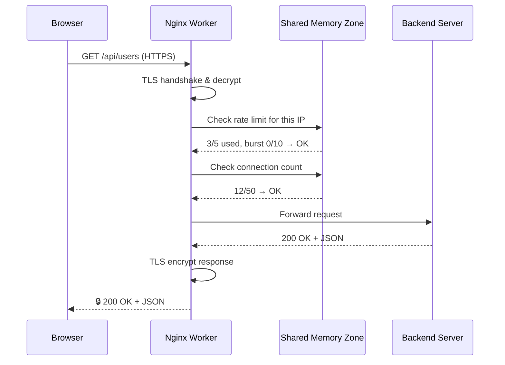

# Chapter 5: Security and Rate Limiting

In [Chapter 4: Reverse Proxy & Upstream](04_reverse_proxy___upstream_.md), you learned how Nginx forwards requests to backend servers and balances the load across them. But there's a problem: your app is standing in the open, and anyone — or anything — can walk right in. What if someone floods your API with 10,000 requests per second? What if attackers intercept passwords in transit? It's time to lock the doors and hire a bouncer.

---

## The Problem: Exposed and Vulnerable

Imagine you've set up your API at `api.example.com` using everything you've learned so far. Two threats keep you up at night:

1. **Eavesdropping:** Clients send passwords and data in plain text over HTTP. Anyone on the network can read them — like sending a postcard instead of a sealed envelope.
2. **Flooding:** A bot (or a disgruntled user) sends thousands of requests per second to `/api/login`, overwhelming your backend servers until they crash.

You need two things: **encryption** to protect data in transit, and **rate limiting** to keep traffic under control. Let's tackle them one at a time.

---

## Line of Defense 1: TLS Termination (The Secure Receiving Dock)

Think of TLS (Transport Layer Security) as a **secure receiving dock** at a warehouse. Packages arrive in locked boxes (encrypted). The dock worker (Nginx) has the key to open them. Once opened, the contents are passed safely inside the building (your internal network) — no one outside can peek.


The client and Nginx speak in encrypted code. Nginx decrypts, then talks to the backend in plain text over the safe internal network. This is called **TLS termination** — Nginx terminates (ends) the encrypted connection.

---

## Setting Up HTTPS: The Basics

To enable TLS, you need two things: a **certificate** (like an ID card proving who you are) and a **private key** (like your signature that only you can produce).

```nginx
server {
    listen 443 ssl http2;
    server_name api.example.com;

    ssl_certificate     /etc/ssl/cert.pem;
    ssl_certificate_key /etc/ssl/cert.key;
}
```

| Directive | What it does | Analogy |
|-----------|-------------|---------|
| `listen 443 ssl` | Listen on the HTTPS port with SSL enabled | Open the secure dock door |
| `ssl_certificate` | Path to your public certificate | Your ID card shown to visitors |
| `ssl_certificate_key` | Path to your private key | Your secret signature |

The `http2` parameter enables the faster HTTP/2 protocol — a free performance bonus!

> 💡 **Beginner tip:** The certificate is **public** — anyone can see it. The private key is **secret** — if someone steals it, they can impersonate you. Protect it like a password.

---

## Redirecting HTTP to HTTPS: No Back Doors

If your site listens on port 443 (HTTPS), users might still type `http://` and hit port 80 (HTTP). You need to **redirect** them to the secure version. It's like putting a sign on the old door saying "Use the secure entrance around the corner."

```nginx
server {
    listen 80;
    server_name api.example.com;
    return 301 https://$host$request_uri;
}
```

This catches any HTTP request and responds with a **301 redirect** to the same URL but with `https://`. The `$host` and `$request_uri` are Nginx variables that preserve the original domain and path.

---

## Hardening TLS: Don't Use Outdated Locks

Not all encryption is equal. Old protocols like SSLv3 and TLS 1.0 have known weaknesses — like using a rusty padlock. You should disable them:

```nginx
ssl_protocols TLSv1.2 TLSv1.3;
ssl_prefer_server_ciphers on;
```

| Directive | What it does |
|-----------|-------------|
| `ssl_protocols` | Only allow modern TLS versions (1.2 and 1.3) |
| `ssl_prefer_server_ciphers` | Nginx picks the cipher, not the client |

And add a security header that tells browsers: *"Always use HTTPS for this site, for the next year"*

```nginx
add_header Strict-Transport-Security "max-age=31536000" always;
```

This is called **HSTS**. Once a browser sees it, it won't even attempt HTTP — it goes straight to HTTPS. No more redirect needed for returning visitors.

---

## Line of Defense 2: Rate Limiting (The Bouncer)

Now your data is encrypted. But what about the flood of requests? Enter the **bouncer**.

Imagine a popular club. Without a bouncer, everyone rushes in at once — the club overflows, the bar runs out of drinks, and nobody has a good time. The bouncer's rule: *"Only 5 people per minute per group."* If you show up with 20 people, 5 go in now, and the rest wait their turn.

That's exactly what **rate limiting** does: it restricts how many requests an IP address can make in a given time period.

---

## Step 1: Define a Rate Limit Zone

Before you can limit anything, you need to define the **rules**. This happens in the `http` context (the same level as [server blocks](02_server_blocks__virtual_hosts__.md)):

```nginx
limit_req_zone $binary_remote_addr zone=api_limit:10m rate=5r/s;
```

Let's break this down piece by piece:

| Part | What it means | Analogy |
|------|---------------|---------|
| `$binary_remote_addr` | Track by client IP address | Identify each group by their name |
| `zone=api_limit:10m` | Name this zone "api_limit", use 10MB of shared memory | The bouncer's notebook (10MB holds ~160k IPs) |
| `rate=5r/s` | Allow 5 requests per second | 5 people per minute through the door |

> 💡 **Beginner tip:** The `zone` is shared memory — all [worker processes](07_master_worker_process_model_.md) can read and write to it. That's why rate limiting works even with multiple workers.

---

## Step 2: Apply the Rate Limit

Now use the zone you defined in a [location block](03_location_blocks__routing__.md):

```nginx
location /api/ {
    limit_req zone=api_limit;
    proxy_pass http://backend;
}
```

Now Nginx checks: *"Has this IP made more than 5 requests in the last second?"* If yes, it returns a **503 Service Unavailable** error. The bouncer says: *"You've had enough — wait a bit."*

---

## Handling Bursts: The Waiting Line

5 requests per second sounds strict. What if a legitimate user loads a page that triggers 8 quick API calls? They'd get errors on calls 6, 7, and 8. That's frustrating.

The `burst` parameter lets you allow temporary spikes — like a waiting line outside the club:

```nginx
limit_req zone=api_limit burst=10 nodelay;
```

| Parameter | What it does | Analogy |
|-----------|-------------|---------|
| `burst=10` | Allow up to 10 extra requests beyond the rate | A waiting line that holds 10 people |
| `nodelay` | Process burst requests immediately (not spaced out) | Let the waiting line in right away, not one-by-one |

Here's how it works: the rate is 5r/s, so Nginx processes 5 requests per second. With `burst=10`, up to 10 additional requests are **queued** instead of rejected. With `nodelay`, those 10 are processed immediately rather than making the client wait. But after the burst is used up, the rate limit kicks in strictly.

> 💡 **Think of it this way:** Without `burst`, the bouncer turns away anyone over the limit. With `burst`, there's a waiting room. With `nodelay`, the waiting room empties fast instead of making people wait.

---

## Connection Limiting: The Capacity Limit

Rate limiting controls **requests per second**. But you might also want to limit **concurrent connections** — how many things one IP can do at the same time. It's like limiting how many people from the same group can be inside the club simultaneously.

First, define a zone in the `http` context:

```nginx
limit_conn_zone $binary_remote_addr zone=conn_limit:10m;
```

Then apply it in a location:

```nginx
location /api/ {
    limit_conn conn_limit 50;
    proxy_pass http://backend;
}
```

This means: *"One IP can have at most 50 simultaneous connections to `/api/`."* If they try to open connection 51, Nginx closes it.

---

## Solving Our Use Case: A Complete Secure Setup

Let's put it all together. We want `api.example.com` to:
1. **Force HTTPS** — no plain HTTP allowed
2. **Use modern TLS** — no weak encryption
3. **Rate limit the API** — 5 requests/second with a burst of 10
4. **Limit connections** — max 50 per IP

Here's the full configuration:

```nginx
limit_req_zone $binary_remote_addr zone=api_limit:10m rate=5r/s;
limit_conn_zone $binary_remote_addr zone=conn_limit:10m;
```

```nginx
server {
    listen 80;
    server_name api.example.com;
    return 301 https://$host$request_uri;
}
```

```nginx
server {
    listen 443 ssl http2;
    server_name api.example.com;

    ssl_certificate     /etc/ssl/cert.pem;
    ssl_certificate_key /etc/ssl/cert.key;
    ssl_protocols TLSv1.2 TLSv1.3;
    ssl_prefer_server_ciphers on;
}
```

```nginx
    add_header Strict-Transport-Security "max-age=31536000" always;

    location /api/ {
        limit_req zone=api_limit burst=10 nodelay;
        limit_conn conn_limit 50;
        proxy_pass http://backend;
        proxy_set_header Host $host;
        proxy_set_header X-Real-IP $remote_addr;
    }
```

Let's trace what happens with different scenarios:

| Scenario | What Nginx does |
|----------|----------------|
| Request to `http://api.example.com` | 301 redirect to `https://` |
| Normal HTTPS request to `/api/users` | Forward to backend ✓ |
| 6th request in 1 second (burst used) | 503 Service Unavailable |
| 51st simultaneous connection from same IP | 503 Service Unavailable |
| Browser returning after HSTS | Goes straight to HTTPS, no redirect needed |

---

## What Happens Internally: A Request Through the Defenses

Let's trace a single request through all the security layers:



Step by step:

1. **TLS handshake** — Client and Nginx establish an encrypted connection
2. **TLS decryption** — Nginx decrypts the incoming request
3. **Rate limit check** — Nginx looks up the IP in the shared memory zone
4. **Connection check** — Nginx counts active connections from this IP
5. **Forward** — If both checks pass, send to the backend (from [Chapter 4](04_reverse_proxy___upstream_.md))
6. **Encrypt and respond** — Nginx encrypts the response and sends it back

If the rate limit is exceeded at step 3, Nginx returns 503 immediately — the backend never sees the request. That's the whole point!

---

## Under the Hood: How Rate Limiting Works

Inside Nginx's source code (specifically `src/http/modules/ngx_http_limit_req_module.c`), rate limiting uses a **leaky bucket algorithm** stored in shared memory.

Here's how it works conceptually:

```c
// Simplified: leaky bucket check
excess = current_excess_for_ip;  // How far over the rate this IP is

if (excess > burst_limit) {
    return HTTP_503;  // Too many! Reject
}

// Otherwise: record this request
excess = excess - rate;  // "Leak" one slot
record_excess(ip, excess);
return ALLOW;  // Let it through
```

The "bucket" fills up with requests and "leaks" at the configured rate (5r/s). If the bucket overflows past the burst limit, new requests are rejected. The shared memory zone (`api_limit:10m`) is allocated at startup and accessed by all workers using atomic operations — no locks needed, which keeps it fast.

> 🔍 **The key insight:** Rate limiting happens **before** the request reaches your backend. Nginx absorbs the flood so your application servers don't have to. The bouncer takes the hit, not the club.

---

## Common Beginner Mistakes

| Mistake | Why it's wrong | Fix |
|---------|---------------|-----|
| Defining `limit_req_zone` inside `server` | Zones must be in the `http` context | Put zone definitions at the `http` level |
| Using `$remote_addr` instead of `$binary_remote_addr` | Text IPs use more memory | `$binary_remote_addr` is 4 bytes vs 15 bytes — saves 60% memory |
| No `burst` parameter | Legitimate users with quick page loads get blocked | Add `burst=10 nodelay` for a reasonable buffer |
| Forgetting the HTTP→HTTPS redirect | Users who type `http://` get errors | Always add the port 80 redirect server block |
| Self-signed certs in production | Browsers show scary warnings | Use Let's Encrypt (free) or a real CA |

---

## Quick Reference: Security Cheat Sheet

```nginx
# In http context: define zones
limit_req_zone $binary_remote_addr zone=api_limit:10m rate=5r/s;
limit_conn_zone $binary_remote_addr zone=conn_limit:10m;

# HTTP → HTTPS redirect
server {
    listen 80;
    return 301 https://$host$request_uri;
}

# HTTPS server with TLS + rate limiting
server {
    listen 443 ssl http2;
    ssl_certificate     /etc/ssl/cert.pem;
    ssl_certificate_key /etc/ssl/cert.key;
    ssl_protocols TLSv1.2 TLSv1.3;

    location /api/ {
        limit_req zone=api_limit burst=10 nodelay;
        limit_conn conn_limit 50;
        proxy_pass http://backend;
    }
}
```

---

## Summary

You've learned how to protect your application with two powerful defenses:

- **TLS termination** is like a secure receiving dock — Nginx handles encryption/decryption so your backend doesn't have to. Clients talk securely to Nginx; Nginx talks plainly to your internal servers.
- **Rate limiting** is like a bouncer — it restricts how many requests an IP can make per second, protecting backends from floods and DDoS attacks.
- **Connection limiting** adds a cap on simultaneous connections per IP.
- **`burst` and `nodelay`** make rate limiting forgiving for legitimate users while still blocking abuse.
- Under the hood, Nginx uses a **leaky bucket algorithm** in shared memory — all workers check the same counters, and rejected requests never reach your backend.

Your Nginx is now both a traffic router and a security guard. But there's one more performance trick up its sleeve: what if Nginx could **remember** backend responses and serve them again without asking the backend? That's **proxy caching**, and it's the topic of [Chapter 6: Proxy Caching](06_proxy_caching_.md).

---

Generated by [AI Codebase Knowledge Builder](https://github.com/The-Pocket/Tutorial-Codebase-Knowledge)