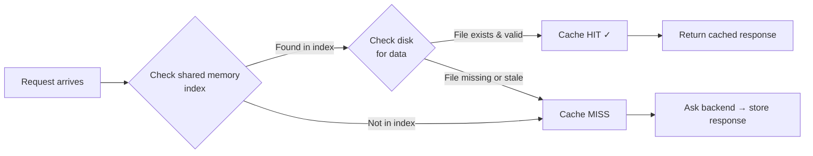
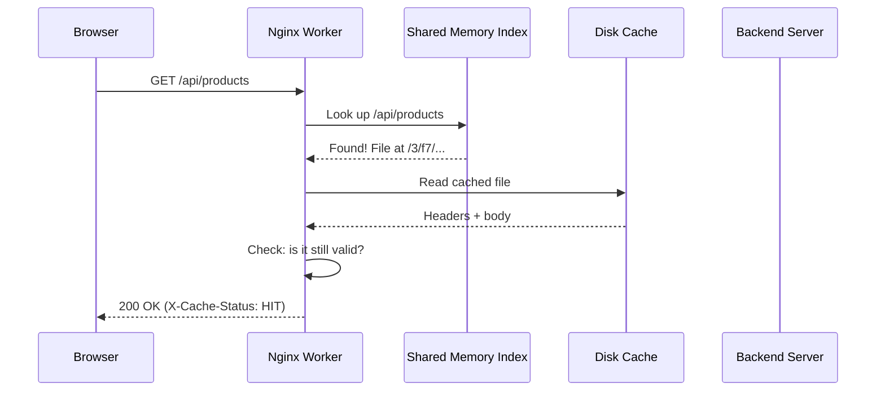

# Chapter 6: Proxy Caching

In [Chapter 5: Security and Rate Limiting](05_security_and_rate_limiting_.md), you learned how to protect your application with TLS encryption and rate limiting — like hiring a bouncer and installing secure doors. But there's still a performance problem: every single request reaches your backend servers, even if they're asking for the exact same thing. What if Nginx could remember the answer and hand it out again without bothering the backend? That's **proxy caching**.

---

## The Problem: Repeating the Same Work

Imagine your backend serves a product catalog at `/api/products`. This data only changes once an hour, but thousands of users request it every minute. Each request travels through Nginx → backend → database → backend → Nginx → user. That's a lot of repeated work for the same answer!

You need a way for Nginx to say: *"I just asked the backend this question 30 seconds ago — here's the same answer."* That's exactly what proxy caching does.

---

## The Librarian Analogy

Think of Nginx as a **librarian** at a busy front desk:

| Concept | Analogy |
|---------|---------|
| **Client** | A visitor asking for a document |
| **Backend server** | The deep archives where original documents live |
| **Shared memory (keys_zone)** | The librarian's index card drawer — quick to search |
| **Disk cache** | The front-desk copies shelf — where actual copies are stored |
| **Cache hit** | Librarian finds the copy at the front desk |
| **Cache miss** | Librarian must walk to the archives |

Without caching, the librarian walks to the archives *every single time*. With caching, the librarian keeps popular documents at the front desk. Visitors get answers instantly, and the archives stay quiet.

---

## The Two-Part Storage: Index and Data

Proxy caching uses **two** storage areas. Understanding this is the key to the whole concept:



| Storage | What it holds | Where | Speed |
|---------|--------------|-------|-------|
| **Shared memory** (keys_zone) | Index: URL → file location mapping | RAM | Lightning fast |
| **Disk** | The actual response data (headers + body) | File system | Fast (no network) |

The index lives in RAM so Nginx can check it instantly. The data lives on disk because responses can be large. Together, they make lookups both fast and space-efficient.

---

## Step 1: Define the Cache Path

Before you can cache anything, you need to tell Nginx **where** to store it. This happens in the `http` context (just like rate limit zones from [Chapter 5](05_security_and_rate_limiting_.md)):

```nginx
proxy_cache_path /var/cache/nginx
    levels=1:2
    keys_zone=mycache:10m
    max_size=1g
    inactive=1d;
```

Let's break this down piece by piece:

| Parameter | What it means | Analogy |
|-----------|--------------|---------|
| `/var/cache/nginx` | Directory on disk for cached data | The front-desk shelf location |
| `levels=1:2` | Two-level subdirectories (e.g., `/a/b2/...`) | Folders within folders to stay organized |
| `keys_zone=mycache:10m` | Name "mycache", 10MB of RAM for the index | The card drawer — 10MB ≈ ~80,000 entries |
| `max_size=1g` | Cap disk usage at 1GB | Shelf space limit |
| `inactive=1d` | Delete files not accessed for 1 day | Toss documents nobody has requested |

> 💡 **Beginner tip:** The `levels=1:2` setting prevents one giant directory with thousands of files (which is slow). Instead, Nginx creates nested subdirectories like `/var/cache/nginx/3/f7/...` — much faster for the filesystem to search.

---

## Step 2: Enable Caching in a Location

Now tell Nginx to **use** the cache for specific requests. This goes in a [location block](03_location_blocks__routing__.md):

```nginx
location /api/ {
    proxy_pass http://backend;
    proxy_cache mycache;
}
```

Just two extra lines! `proxy_cache mycache` tells Nginx: *"Use the cache zone we defined called 'mycache' for this location."*

But wait — how long should cached responses be considered valid? We need to specify that too:

---

## Step 3: Set Cache Validity

Different response types deserve different cache lifetimes. A successful product list might be fresh for 10 minutes, but a "404 Not Found" should expire quickly:

```nginx
proxy_cache_valid 200 302 10m;
proxy_cache_valid 404 1m;
```

| Directive | What it means |
|-----------|--------------|
| `proxy_cache_valid 200 302 10m` | Cache successful responses for 10 minutes |
| `proxy_cache_valid 404 1m` | Cache 404 errors for only 1 minute |

Any response code not listed (like `500`) won't be cached at all. You don't want to cache a server error!

---

## Solving Our Use Case: Caching the Product Catalog

Let's put it all together. We want `/api/products` to be cached for 10 minutes, reducing backend load:

```nginx
proxy_cache_path /var/cache/nginx
    levels=1:2
    keys_zone=mycache:10m
    max_size=1g
    inactive=1d;
```

This goes in the `http` context. Then in your server:

```nginx
server {
    listen 80;
    server_name shop.example.com;
```

```nginx
    location /api/products {
        proxy_pass http://backend;
        proxy_cache mycache;
        proxy_cache_valid 200 10m;
    }
```

Now let's trace what happens:

| Request | What Nginx does |
|---------|----------------|
| First request to `/api/products` | Cache MISS → ask backend → store response → return it |
| Second request (within 10 min) | Cache HIT → return cached copy instantly |
| Request after 10 minutes | Cache STALE → ask backend → store new response |

The first visitor triggers a cache miss (the librarian walks to the archives). Every subsequent visitor for the next 10 minutes gets a cache hit (front-desk copy). The backend only sees **one** request instead of thousands!

---

## Cache Status: How Do You Know It's Working?

When debugging, you want to know: *did this request come from the cache or the backend?* Add a header to reveal the answer:

```nginx
add_header X-Cache-Status $upstream_cache_status;
```

Now every response includes a header like `X-Cache-Status: HIT` or `X-Cache-Status: MISS`. You can check it in your browser's developer tools or with `curl -I`:

| Value | Meaning |
|-------|---------|
| `MISS` | Not in cache — fetched from backend |
| `HIT` | Served from cache |
| `STALE` | Cache expired but backend was slow — served old copy |
| `EXPIRED` | Cache expired — fetched fresh from backend |
| `BYPASS` | Caching was skipped for this request |

---

## Bypassing the Cache: Not Everything Should Be Cached

Some requests must *never* be cached — like a user's shopping cart or personal settings. You can skip the cache based on conditions:

```nginx
proxy_cache_bypass $cookie_nocache $arg_nocache;
```

This says: *"If the request has a `nocache` cookie or a `?nocache=1` query parameter, skip the cache and go straight to the backend."* It's like the librarian knowing that certain documents are personal and must always come from the archives.

---

## What Happens Internally: A Request Through the Cache

Let's trace a request through the caching system:



Step by step:

1. **Client** sends a request
2. **Nginx** hashes the URL to create a cache key
3. **Index lookup** in shared memory (RAM) — instant check
4. **Disk read** — fetch the cached response file
5. **Validity check** — is the cached age within `proxy_cache_valid`?
6. **Return** — serve the cached response, add `X-Cache-Status: HIT`

If the index lookup fails (cache miss), Nginx forwards to the backend, then stores the response in both the index and on disk before returning it.

---

## Under the Hood: How Nginx Stores Cached Responses

Inside Nginx's source code (specifically `src/http/ngx_http_cache.h` and `src/http/ngx_http_file_cache.c`), each cached entry is stored as a file on disk with a header containing metadata:

```c
// Simplified: cache file structure on disk
typedef struct {
    time_t valid_sec;       // When this entry expires
    off_t  body_start;      // Where the body begins in the file
    // ... more metadata
} ngx_http_cache_header_t;
```

The cache key is an MD5 hash of the URL (and optionally other factors like the `Host` header). This hash determines both the index entry and the file path:

```c
// Simplified: computing the cache key
md5_hash = md5(url + host + other_factors);
// e.g., md5("http://backend/api/products") = "3f7a8b..."
// File path: /var/cache/nginx/3/f7/3f7a8b...
```

The `levels=1:2` setting splits the hash into directory levels: the first character (`3`) becomes the first directory, the next two (`f7`) become the second. This keeps directories small and lookups fast.

When the cache exceeds `max_size`, Nginx uses a **least recently used (LRU)** algorithm to evict old entries — just like a librarian removing the least-requested documents when the shelf is full.

> 🔍 **The key insight:** The cache index lives in shared memory so all [worker processes](07_master_worker_process_model_.md) can access it instantly. The data lives on disk because it can be large. The LRU algorithm ensures the most popular content stays cached while stale content gets evicted.

---

## Common Beginner Mistakes

| Mistake | Why it's wrong | Fix |
|---------|---------------|-----|
| Forgetting `proxy_cache_path` | Nginx has nowhere to store the cache | Always define the path in the `http` context first |
| Caching POST requests | POST changes data — caching it returns stale results | Only cache GET and HEAD by default |
| Setting `keys_zone` too small | Index runs out of space → cache evictions | ~10MB per 80,000 entries is a good starting point |
| Not setting `proxy_cache_valid` | Nothing gets cached without validity rules | Always specify how long each status code should be cached |
| Caching authenticated content | User A's data gets served to User B | Use `proxy_cache_bypass` for personalized pages |

---

## Quick Reference: Proxy Caching Cheat Sheet

```nginx
# In http context: define cache storage
proxy_cache_path /var/cache/nginx
    levels=1:2
    keys_zone=mycache:10m
    max_size=1g
    inactive=1d;
```

```nginx
# In location: enable caching
location /api/ {
    proxy_pass http://backend;
    proxy_cache mycache;
    proxy_cache_valid 200 10m;
    proxy_cache_valid 404 1m;
    add_header X-Cache-Status $upstream_cache_status;
}
```

---

## Summary

You've learned how Nginx can **remember** backend responses and serve them again without bothering the upstream:

- **Proxy caching** stores backend responses locally — like a librarian keeping front-desk copies of popular documents
- **Two-part storage**: shared memory (RAM) for the index, disk for the data — fast lookups, large capacity
- **`proxy_cache_path`** defines where and how to store the cache (disk path, index size, max size, expiry)
- **`proxy_cache`** enables caching for a specific location
- **`proxy_cache_valid`** controls how long different response types stay fresh
- **`X-Cache-Status`** header reveals whether a response came from cache or backend
- **`proxy_cache_bypass`** lets you skip caching for personalized or sensitive content
- Under the hood, Nginx uses **MD5 hashing** for cache keys, **LRU eviction** when the cache is full, and **shared memory** so all workers access the same index

Your Nginx is now a full-featured front end: it routes traffic, load balances, secures connections, and caches responses. But have you ever wondered *how* Nginx handles all this work so efficiently? The answer lies in its process architecture — the [Master-Worker Process Model](07_master_worker_process_model_.md), which we'll explore next.

---

Generated by [AI Codebase Knowledge Builder](https://github.com/The-Pocket/Tutorial-Codebase-Knowledge)