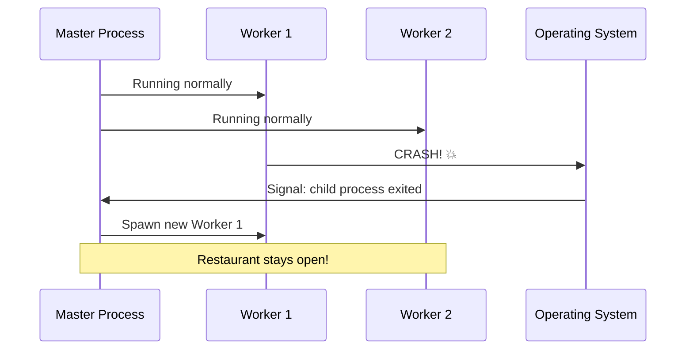
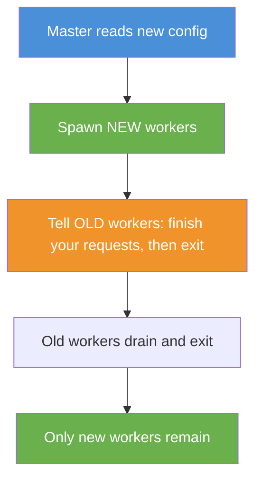
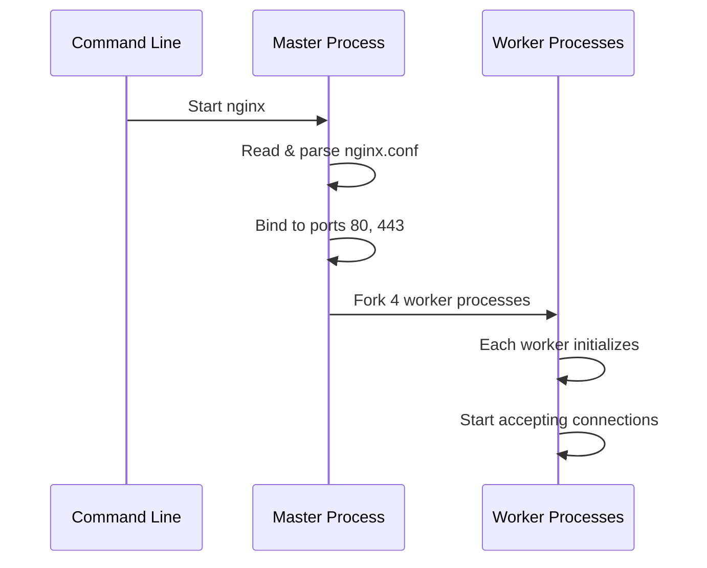

# Chapter 7: Master-Worker Process Model

In [Chapter 6: Proxy Caching](06_proxy_caching_.md), you learned how Nginx stores backend responses locally so it can serve them again instantly — like a librarian keeping popular documents at the front desk. But there's a deeper question we've been hinting at throughout this entire tutorial: *how does Nginx handle thousands of requests at once without falling over?* The answer lies in its **process architecture** — the master-worker model.

---

## The Problem: One Brain Can't Do Everything

Imagine you're running a food truck. You take orders, cook the food, handle payments, and clean up — all by yourself. When there are three customers, you're fine. When there are fifty, you're overwhelmed. Orders get mixed up, food burns, people wait forever.

You need a team. You hire a manager to handle the business side (permits, hiring, supplies) and several cooks to actually make the food. If one cook gets sick, the manager quickly replaces them. The food truck keeps running no matter what.

That's exactly how Nginx works. Let's see it in action.

---

## The Restaurant Analogy

Think of Nginx as a **busy restaurant**:

| Concept | Analogy | What it does |
|---------|---------|-------------|
| **Master process** | The restaurant manager | Hires staff, sets the rules, watches over everything |
| **Worker processes** | The waiters | Actually serve the tables (handle requests) |
| **Configuration file** | The rulebook | The manager reads it to know how to run things |
| **Worker crash** | A waiter faints | The manager instantly hires a replacement |

The manager never serves food — that's the waiters' job. But without the manager, there would be chaos: no one to set the rules, no one to replace fallen waiters, no one to update the menu.

---

## Two Processes, Two Very Different Jobs

When you start Nginx, it creates **one master process** and **multiple worker processes**. Let's see what each one does.

### The Master Process: The Manager

The master process runs as **root** (on Linux) and does the "management" work:

- **Reads the configuration** — parses your `nginx.conf`
- **Binds to ports** — opens port 80, 443, etc. (requires root privileges)
- **Spawns workers** — creates the worker processes
- **Monitors workers** — if a worker crashes, it immediately spawns a new one
- **Handles signals** — responds to `reload`, `quit`, `stop` commands

The master **never** processes client requests. It's purely administrative.

### The Worker Process: The Waiter

Each worker process runs as an unprivileged user (usually `www-data` or `nginx`) and does the real work:

- **Accepts connections** from clients
- **Processes requests** — routing, proxying, caching, etc.
- **Serves responses** back to clients
- **Handles thousands of connections simultaneously** (thanks to the [event-driven architecture](08_event_driven_architecture_.md))

Workers are **independent** — they don't talk to each other. Each one handles its own set of connections.

---

## How Many Workers Should You Have?

The golden rule: **one worker per CPU core**. This way, each worker gets its own core and doesn't fight with others for CPU time.

```nginx
worker_processes auto;
```

The `auto` directive tells Nginx to detect the number of CPU cores and create that many workers. On a 4-core machine, you get 4 workers. On an 8-core machine, you get 8.

You can also set it manually:

```nginx
worker_processes 4;
```

But `auto` is almost always the right choice — Nginx knows your hardware better than you do!

---

## Seeing It in Action

Let's start Nginx and see the processes:

```bash
sudo nginx
ps -ef | grep nginx
```

You'll see something like this:

```
root      1234  1  0  master process
www-data  1235 1234  0  worker process
www-data  1236 1234  0  worker process
```

Notice:
- The master runs as **root** (PID 1234)
- Two workers run as **www-data** (PIDs 1235, 1236)
- The workers' parent PID is 1234 — they're children of the master

> 💡 **Beginner tip:** PID stands for "Process ID" — a unique number the operating system gives to every running program. The parent PID tells you who created this process.

---

## What Happens When a Worker Crashes?

Here's where the master really shines. If a worker crashes (maybe a bug or an out-of-memory error), the master **immediately** spawns a replacement:



Step by step:

1. **Workers are running** — handling requests normally
2. **Worker 1 crashes** — the operating system sends a signal to the master
3. **Master detects the crash** — it receives the `SIGCHLD` signal
4. **Master spawns a replacement** — a new worker is created instantly
5. **Service continues** — clients never notice the crash

This is why Nginx is so **resilient**. A single worker crash doesn't bring down the whole server. The manager always has a backup plan.

---

## Graceful Reload: Changing the Menu Without Closing

What happens when you change the configuration and reload? The master performs a **graceful restart** — it replaces workers one by one without dropping any connections:

```bash
sudo nginx -s reload
```



Here's what happens:

1. **Master reads** the new configuration
2. **Master spawns** new workers with the new config
3. **Master tells** old workers: *"Finish your current requests, then shut down"*
4. **Old workers drain** — they complete in-flight requests, then exit
5. **New workers** take over all incoming requests

No downtime! It's like replacing the waitstaff during a shift change — customers already being served keep their waiter, while new customers get the fresh staff.

---

## The Configuration That Controls It All

Here's the minimal configuration that governs the master-worker model:

```nginx
worker_processes auto;

events {
    worker_connections 1024;
}
```

| Directive | What it does | Where it goes |
|-----------|-------------|---------------|
| `worker_processes` | Number of workers to spawn | Main context |
| `worker_connections` | Max connections per worker | Events context |

The total connections Nginx can handle = `worker_processes × worker_connections`. With `auto` (4 cores) and 1024 connections, that's 4,096 simultaneous connections.

> 💡 **Beginner tip:** Don't confuse `worker_processes` (how many waiters) with `worker_connections` (how many tables each waiter can serve). They're different settings in different [contexts](01_contexts_and_directives_.md).

---

## What Happens Internally: Starting Nginx

Let's trace what happens when you run `sudo nginx`:



Step by step:

1. **Master starts** — reads the configuration file
2. **Master validates** — checks for syntax errors (like `nginx -t`)
3. **Master binds** — opens the listening ports (requires root)
4. **Master forks** — creates worker processes using `fork()`
5. **Workers initialize** — set up their own event loops
6. **Workers accept** — start handling client connections

After startup, the master just waits — monitoring workers and handling signals.

---

## Under the Hood: How the Master Spawns Workers

Inside Nginx's source code (specifically `src/core/ngx_process_cycle.c`), the master creates workers using the Unix `fork()` system call:

```c
// Simplified: master spawning workers
for (i = 0; i < worker_processes; i++) {
    pid = fork();  // Create a child process
    if (pid == 0) {
        // Child: become a worker
        ngx_worker_process_cycle();
    }
    // Parent: master continues looping
}
```

When `fork()` is called:
- The **master** gets back the child's PID — it can track and monitor it
- The **worker** gets back `0` — it knows it's the child and starts its work cycle

After forking, the master drops its own privileges (if configured) and enters a loop where it:
- Waits for signals (`SIGCHLD` for child exits, `SIGHUP` for reload)
- Re-spawns any crashed workers
- Shuts down gracefully on `SIGTERM`

Here's a simplified view of the master's main loop:

```c
// Simplified: master's main loop
for (;;) {
    sigsuspend(&set);  // Wait for a signal

    if (got_SIGCHLD) {
        // A worker crashed — respawn it
        respawn_worker();
    }
    if (got_SIGHUP) {
        // Reload config — start new workers
        ngx_reap_workers();
    }
}
```

> 🔍 **The key insight:** The master doesn't process requests — it **manages** the workers. Its entire life is a loop of waiting for signals and responding to them. This separation of concerns is what makes Nginx so reliable: even if all workers crash, the master is still there to rebuild the team.

---

## How Workers Share Listening Ports

You might wonder: if 4 workers all listen on port 80, don't they fight over connections? On older systems, yes — this was called the **thundering herd problem**, where all workers would wake up and race for one connection.

Modern Linux solves this with `SO_REUSEPORT`, which Nginx can enable:

```nginx
http {
    server {
        listen 80 reuseport;
    }
}
```

With `reuseport`, the kernel creates a **separate socket** for each worker, and the kernel itself distributes incoming connections evenly. No fighting, no wasted wake-ups.

Without `reuseport`, Nginx uses an **accept mutex** — workers take turns accepting new connections, like waiters politely alternating who answers the door.

---

## The Shared Memory Bridge

Workers are independent processes — they don't share variables or memory by default. But some features need shared state. That's where **shared memory zones** come in.

Remember these from earlier chapters?

| Feature | Shared Memory Zone | Why workers need to share |
|---------|-------------------|--------------------------|
| [Rate limiting](05_security_and_rate_limiting_.md) | `limit_req_zone` | All workers must count the same IP's requests |
| [Proxy caching](06_proxy_caching_.md) | `keys_zone` | All workers must see the same cache index |
| Sessions | `ip_hash` upstream | Same IP should reach the same backend |

```nginx
limit_req_zone $binary_remote_addr zone=api:10m rate=5r/s;
```

That `zone=api:10m` allocates 10MB of **shared memory** that all workers can read and write. It's like a whiteboard in the restaurant kitchen — every waiter can see it and update it.

> 💡 **Beginner tip:** Without shared memory, each worker would have its own separate count of requests. An IP could make 5 requests/second to *each* worker — 20 requests/second total on a 4-worker server! Shared memory ensures the limit applies globally.

---

## Common Beginner Mistakes

| Mistake | Why it's wrong | Fix |
|---------|---------------|-----|
| Setting `worker_processes 100` | More workers ≠ more performance — they'll fight over CPU | Use `auto` (one per core) |
| Running workers as root | Security nightmare — a compromised worker has full system access | Let Nginx drop privileges automatically |
| Ignoring `worker_connections` | Default is only 512 — may be too low for busy sites | Increase in the `events` context |
| Forgetting `events { }` block | Worker connections can't be set without it | Always include the `events` context |

---

## Quick Reference: Master-Worker Cheat Sheet

```nginx
# Main context
worker_processes auto;        # One worker per CPU core
```

```nginx
# Events context
events {
    worker_connections 1024;  # Max connections per worker
}
```

```bash
# Useful commands
sudo nginx              # Start (master + workers)
sudo nginx -s reload    # Graceful config reload
ps -ef | grep nginx     # See master and workers
```

---

## Summary

You've learned how Nginx's **process architecture** keeps it fast and resilient:

- **Master process** is the manager — it reads config, binds ports, spawns workers, and monitors them. It never handles client requests.
- **Worker processes** are the waiters — they do the actual work of accepting connections and serving responses.
- **`worker_processes auto`** creates one worker per CPU core — the optimal number.
- **Crash resilience** — if a worker crashes, the master immediately replaces it. Clients never notice.
- **Graceful reload** — the master spawns new workers and lets old ones drain, achieving zero-downtime configuration changes.
- **Shared memory** bridges the gap between independent workers, enabling features like [rate limiting](05_security_and_rate_limiting_.md) and [caching](06_proxy_caching_.md) to work globally.

But there's one piece missing from the puzzle. Each worker handles **thousands** of connections simultaneously — how is that possible with just one process? The answer is Nginx's [event-driven architecture](08_event_driven_architecture_.md), where a single worker juggles connections without ever blocking. That's the final secret behind Nginx's legendary performance, and it's what we'll explore in the next chapter.

---

Generated by [AI Codebase Knowledge Builder](https://github.com/The-Pocket/Tutorial-Codebase-Knowledge)