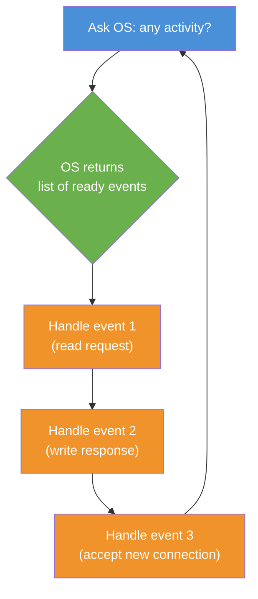
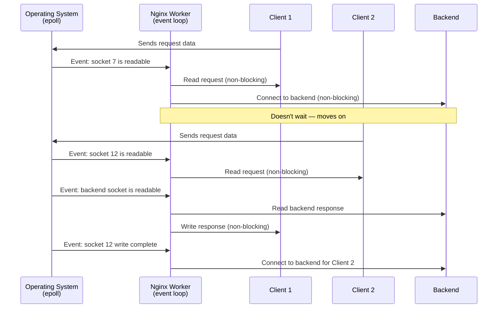

# Chapter 8: Event-Driven Architecture

In [Chapter 7: Master-Worker Process Model](07_master_worker_process_model_.md), you learned how Nginx's master process spawns multiple workers — each one handling client requests independently. But we left a big question unanswered: *how can a single worker process juggle thousands of connections at once without getting overwhelmed?* The answer is Nginx's **event-driven architecture** — the secret sauce behind its legendary performance.

---

## The Problem: One Thread Per Connection Doesn't Scale

Imagine the simplest way to handle web requests: **one thread per connection**. When a client connects, you spawn a new thread just for them. That thread reads the request, waits for the backend, writes the response, and exits.

This works fine for 10 connections. But what about 10,000?

Each thread needs memory (typically 2–8 MB for its stack). 10,000 threads × 8 MB = **80 GB of RAM** — just for thread stacks! Plus, the operating system wastes huge amounts of time switching between threads (called **context switching**), even when most of them are just... waiting.

And that's the real problem: **most of the time, a connection is just waiting** — waiting for the client to send data, waiting for the backend to respond, waiting for the network to deliver bytes. A thread-per-connection model dedicates an entire thread to *waiting*. That's like hiring one receptionist per phone line who just sits there listening to dial tone.

You need a smarter approach.

---

## The Hotel Receptionist Analogy

Think of a busy hotel with **100 phone lines**:

| Approach | What happens | Problem |
|----------|-------------|---------|
| **Thread-per-connection** | Hire 100 receptionists, one per line | Most sit idle; hugely expensive |
| **Event-driven** | Hire **one** sharp receptionist who watches all lines | Efficient; picks up only when a line rings |

The single receptionist doesn't stare at one phone waiting for it to ring. Instead, they have a **dashboard** that lights up whenever any phone has activity. They glance at the dashboard, handle whichever line needs attention, and go back to watching.

That dashboard is the operating system's **event notification system** (like `epoll` on Linux or `kqueue` on macOS). The receptionist is the **event loop**. And the "only pick up when ringing" part is **non-blocking I/O**.

---

## Key Concept 1: Blocking vs. Non-Blocking I/O

To understand event-driven architecture, you first need to understand the difference between blocking and non-blocking I/O.

### Blocking I/O (The Old Way)

```c
// Blocking: "Read data from this socket"
result = read(socket, buffer, size);
// Program STOPS here until data arrives
// Could be milliseconds... or seconds... or forever
```

When you call `read()` on a socket with no data available, the operating system **puts your thread to sleep** until data arrives. The thread can't do anything else. It's like the receptionist picking up a phone and staring at it, unable to do anything until the caller speaks.

### Non-Blocking I/O (The Nginx Way)

```c
// Non-blocking: "Is there data? No? OK, I'll do something else"
result = read(socket, buffer, size);
// If no data: returns immediately with EAGAIN
// Thread is FREE to handle other connections
```

With non-blocking I/O, if there's no data, `read()` returns immediately with a "not ready" signal (`EAGAIN`). The thread doesn't sleep — it moves on to check other connections. It's like the receptionist picking up a silent phone, hearing nothing, and immediately moving to the next task.

---

## Key Concept 2: The Event Loop

Non-blocking I/O is useless without a way to know **when** data becomes available. You don't want to keep polling every socket in a loop ("any data yet? how about now? now?"). That's wasteful.

Enter the **event loop** — a cycle that:

1. Asks the operating system: *"Which of my connections have activity?"*
2. Handles each active connection
3. Goes back to step 1



The worker never sleeps (unless there's truly nothing to do), and it never wastes time on connections that have no activity. Every moment is spent doing **useful work**.

---

## Key Concept 3: I/O Multiplexing (The Dashboard)

The magic that makes the event loop possible is **I/O multiplexing** — the operating system's ability to monitor many file descriptors (sockets) at once and tell you which ones are ready.

| System Call | Operating System | What it does |
|-------------|-----------------|-------------|
| `epoll` | Linux | Efficiently monitors thousands of sockets |
| `kqueue` | macOS / BSD | Same idea, different implementation |
| `select` | All (older) | Older, slower — doesn't scale well |

Think of `epoll` as the **dashboard** that lights up when a phone rings. Instead of checking 10,000 phones one by one, the receptionist just glances at the dashboard and sees: *"Lines 7, 42, and 893 have activity."*

Nginx automatically picks the best available mechanism for your system. On Linux, it uses `epoll`. On macOS, it uses `kqueue`. You don't need to configure this — Nginx figures it out at compile time.

---

## The Configuration: Controlling the Event Engine

The event-driven behavior is configured in the `events` context — the same one we glimpsed in [Chapter 1: Contexts and Directives](01_contexts_and_directives_.md):

```nginx
events {
    worker_connections 1024;
}
```

This single directive tells each [worker process](07_master_worker_process_model_.md) the maximum number of simultaneous connections it should handle. With 4 workers and 1024 connections each, Nginx can manage **4,096 concurrent connections**.

For high-traffic sites, you might increase this:

```nginx
events {
    worker_connections 4096;
}
```

> 💡 **Beginner tip:** The total capacity is `worker_processes × worker_connections`. If you increase one, make sure the other is set appropriately too. Use `auto` for `worker_processes` and tune `worker_connections` based on your expected traffic.

---

## Solving Our Use Case: Handling 10,000 Connections

Let's say you're running a real-time chat application. You expect up to **10,000 simultaneous users**, each holding an open connection. Here's how you'd configure Nginx:

```nginx
worker_processes auto;
```

On an 8-core server, this gives us 8 workers. Now set connections per worker:

```nginx
events {
    worker_connections 2048;
}
```

8 workers × 2,048 connections = **16,384 concurrent connections** — comfortably above our 10,000 target, with headroom for internal connections (like those to [upstream servers](04_reverse_proxy___upstream_.md)).

With the event-driven model, each worker handles ~1,250 connections without breaking a sweat. The worker doesn't need 1,250 threads — it just needs **one event loop** and the operating system's `epoll` dashboard.

---

## What Happens Internally: A Request Through the Event Loop

Let's trace what happens when three clients send requests at roughly the same time, all handled by a single worker:



Notice what's happening: the worker **never blocks**. When Client 1's request needs a backend response, the worker doesn't sit and wait. It moves on to handle Client 2. When the backend responds, the operating system delivers that as another event, and the worker picks it up.

It's like the receptionist putting Client 1 on hold (without dedicating a person to hold the line), helping Client 2, then coming back to Client 1 when their answer is ready.

---

## Under the Hood: How the Event Loop Works

Inside Nginx's source code (specifically `src/event/ngx_event.c` and `src/os/unix/ngx_epoll_module.c`), the event loop is the heart of every worker process. Here's a simplified view:

```c
// Simplified: the core event loop
for (;;) {
    // Ask OS: which sockets have activity?
    events = epoll_wait(epfd, list, max, timeout);

    for (i = 0; i < events; i++) {
        // Handle each ready event
        event = list[i];
        if (event.type == READ) {
            event.handler->read();  // e.g., read request
        }
        if (event.type == WRITE) {
            event.handler->write(); // e.g., send response
        }
    }
}
```

Step by step:

1. **`epoll_wait()`** — The worker asks the operating system: *"Which of my sockets have data ready?"* This call blocks **only** when there's truly nothing to do. The OS returns a list of active events.
2. **Loop through events** — For each event, call the appropriate handler (read, write, accept new connection, etc.)
3. **Repeat** — Go back to `epoll_wait()` for more events

Each handler is designed to be **fast and non-blocking**. If a handler can't complete its work (e.g., the backend hasn't responded yet), it simply schedules itself to be called again later — it never blocks the loop.

> 🔍 **The key insight:** The event loop is just a `for(;;)` loop. The magic isn't in the loop itself — it's in the combination of **non-blocking I/O** (never wait) and **epoll** (the OS tells you when to act). Together, they let one thread handle thousands of connections by never wasting a single moment on idle waiting.

---

## How Nginx Registers Interest in Events

When a new client connects, Nginx needs to tell the operating system: *"Let me know when this socket has data to read."* Here's how that works internally:

```c
// Simplified: registering interest in a socket event
event = create_event(socket, READ, my_handler);
epoll_ctl(epfd, EPOLL_CTL_ADD, socket, event);
```

| Function | What it does | Analogy |
|----------|-------------|---------|
| `epoll_ctl(ADD)` | Tell OS: "monitor this socket" | Add a phone line to the dashboard |
| `epoll_ctl(MOD)` | Change what we're watching for | "Now tell me when this line is free to write" |
| `epoll_ctl(DEL)` | Stop monitoring this socket | Remove a disconnected phone line |

When a request is fully processed and the connection closes (or goes into keep-alive idle mode), Nginx removes the socket from `epoll` or changes what it's watching for. The dashboard is always up to date.

---

## Why This Scales: The Math

Let's compare the two approaches for 10,000 concurrent connections:

| Metric | Thread-per-connection | Event-driven |
|--------|----------------------|-------------|
| Memory per connection | ~8 MB (thread stack) | ~few KB (connection struct) |
| Total memory | ~80 GB | ~50 MB |
| Context switches | Frequent (OS switches between 10K threads) | Minimal (one thread per core) |
| CPU waste | High (switching, not doing useful work) | Low (only active connections get CPU) |

The event-driven model uses **1000× less memory** and wastes far less CPU. That's why Nginx can handle tens of thousands of connections on modest hardware — it only spends resources on connections that are actually *doing something*.

---

## The `multi_accept` Optimization

By default, when the OS notifies Nginx that a listening socket has new connections, the worker accepts **one** connection at a time. For very high traffic, you can tell the worker to accept as many as possible in one go:

```nginx
events {
    worker_connections 2048;
    multi_accept on;
}
```

This is like the receptionist answering all ringing phones at once instead of one by one. It reduces the number of times the worker needs to return to `epoll_wait()`, which can improve throughput under heavy load.

---

## Common Beginner Mistakes

| Mistake | Why it's wrong | Fix |
|---------|---------------|-----|
| Thinking more workers = more performance | Workers fight over CPU if there are more than cores | Use `worker_processes auto` |
| Setting `worker_connections` too low | Default 512 may be too low for busy sites | Increase based on expected concurrent connections |
| Forgetting the `events` block | Nginx requires it — even with default values | Always include `events { }` in your config |
| Confusing connections with requests | One connection can serve multiple requests (keep-alive) | `worker_connections` counts connections, not requests |

---

## Quick Reference: Event Configuration Cheat Sheet

```nginx
# Main context
worker_processes auto;
```

```nginx
# Events context
events {
    worker_connections 2048;
    multi_accept on;
}
```

```bash
# Check your current capacity
# Total connections = worker_processes × worker_connections
grep worker_processes /etc/nginx/nginx.conf
grep worker_connections /etc/nginx/nginx.conf
```

---

## Summary

You've learned the final secret behind Nginx's legendary performance — its **event-driven architecture**:

- **Thread-per-connection doesn't scale** — it wastes memory and CPU on idle connections, like hiring one receptionist per phone line
- **Non-blocking I/O** means Nginx never waits — if a socket isn't ready, it moves on to the next one
- **The event loop** is a simple cycle: ask the OS for active events → handle them → repeat
- **I/O multiplexing** (`epoll`/`kqueue`) is the OS's dashboard — it tells Nginx exactly which connections need attention, so Nginx never wastes time polling
- **`worker_connections`** controls how many simultaneous connections each [worker](07_master_worker_process_model_.md) can handle
- The result: a single worker handles **thousands of connections** with minimal memory and CPU — using 1000× less memory than a thread-per-connection approach

This is the architecture that makes Nginx, Nginx. The [master-worker model](07_master_worker_process_model_.md) gives you resilience and multi-core utilization. The event-driven model gives you efficiency and scale. Together, they're why Nginx powers a huge portion of the world's websites.

---

**Congratulations!** 🎉 You've completed the tutorial. You now understand the full stack of Nginx's architecture — from [contexts and directives](01_contexts_and_directives_.md) at the configuration level, through [server blocks](02_server_blocks__virtual_hosts__.md), [location routing](03_location_blocks__routing__.md), [reverse proxying](04_reverse_proxy___upstream_.md), [security](05_security_and_rate_limiting_.md), and [caching](06_proxy_caching_.md), all the way down to the [process model](07_master_worker_process_model_.md) and the event-driven engine that makes it all fly. You're well equipped to configure, optimize, and troubleshoot Nginx in the real world!

---

Generated by [AI Codebase Knowledge Builder](https://github.com/The-Pocket/Tutorial-Codebase-Knowledge)