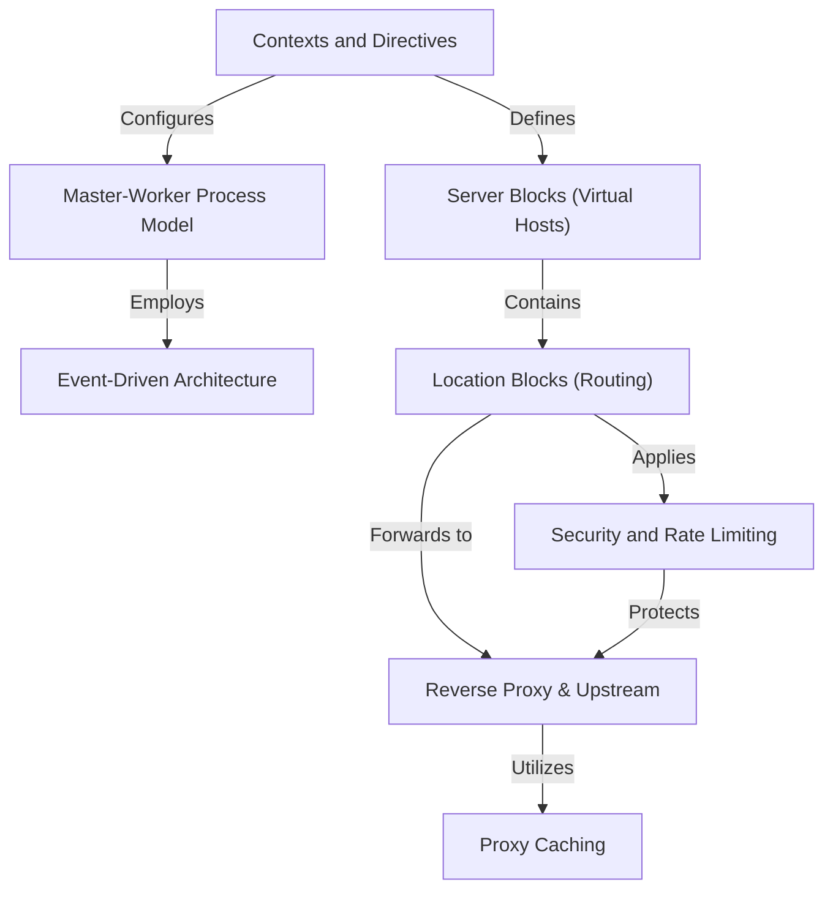

# Tutorial: nginx

Nginx is a high-performance web server and reverse proxy designed to handle massive concurrent traffic efficiently. It uses a **Master-Worker Process Model** where a master process manages workers that rely on an **Event-Driven Architecture** to process thousands of connections without blocking. Configuration is structured using nested **Contexts and Directives**, which define **Server Blocks** for hosting multiple websites and **Location Blocks** for routing specific requests. Nginx can act as a **Reverse Proxy & Upstream** to distribute traffic to backend servers, leveraging **Proxy Caching** to save responses and **Security and Rate Limiting** to protect applications from abuse.

**Source Repository:** [None](None)

## Chapters

1. [Contexts and Directives
](01_contexts_and_directives_.md)
2. [Server Blocks (Virtual Hosts)
](02_server_blocks__virtual_hosts__.md)
3. [Location Blocks (Routing)
](03_location_blocks__routing__.md)
4. [Reverse Proxy & Upstream
](04_reverse_proxy___upstream_.md)
5. [Security and Rate Limiting
](05_security_and_rate_limiting_.md)
6. [Proxy Caching
](06_proxy_caching_.md)
7. [Master-Worker Process Model
](07_master_worker_process_model_.md)
8. [Event-Driven Architecture
](08_event_driven_architecture_.md)

---

Generated by [AI Codebase Knowledge Builder](https://github.com/The-Pocket/Tutorial-Codebase-Knowledge)