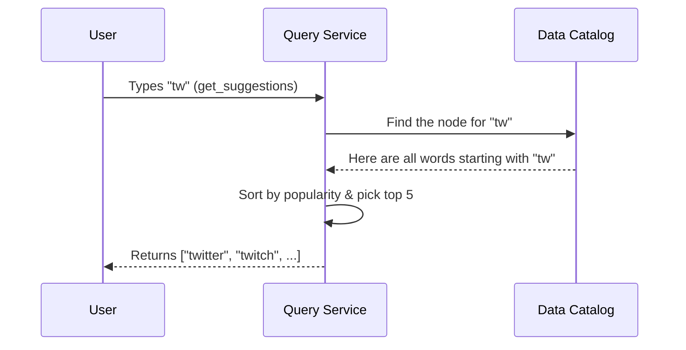

# Chapter 1: Query Service

Welcome to the `search_autocomplete` project! Have you ever noticed how when you start typing "ap" into a search bar, it instantly suggests "apple", "amazon", or "application"? How does it know what you're looking for so quickly? 

That's exactly what we are building, and it all starts with the **Query Service**.

## The Helpful Librarian Analogy

Imagine you walk into a massive library looking for a book. You don't want to wander the aisles for hours. Instead, you go to the front desk and tell the librarian, "I'm looking for a book that starts with *Har...*". 

The librarian doesn't search every shelf. They look into a pre-organized catalog, instantly finds all the books starting with "Har", picks out the 5 most popular ones, and hands them to you. 

In our system, the **Query Service** is that helpful librarian! 

## What Problem Does It Solve?

When a user types a partial word (a "prefix"), we need to:
1. Find all the valid search queries that start with that prefix.
2. Figure out which ones are the most popular.
3. Return the top 5 results to the user as fast as possible.

The Query Service handles this entire flow. It takes the user's raw input and transforms it into a neat, sorted list of helpful suggestions.

## Using the Query Service

Let's see what it looks like when we use the Query Service. Imagine a user is typing in the search box and has entered the prefix `"tw"`. We want the top 5 suggestions.

```python
# Create an instance of our Query Service
service = QueryService()

# User types "tw" and we ask for the top 5 suggestions
suggestions = service.get_suggestions(prefix="tw", k=5)

print(suggestions)
# Output: ['twitter', 'twitch', 'twilight', 'tweety', 'twins']
```

Under the hood, the Query Service took `"tw"`, found all matching words, sorted them by how often people search for them (their popularity), and sliced out the top 5. 

## What Happens Under the Hood?

When `get_suggestions("tw", 5)` is called, the Query Service performs a simple 3-step routine:

1. **Locate the Prefix:** It looks up the starting point for `"tw"` in a special data catalog.
2. **Gather Suggestions:** From that starting point, it collects all the complete, valid search terms underneath it (like "twitter", "twilight", etc.).
3. **Sort and Slice:** It sorts these terms by popularity (highest first) and cuts off the list to only return the top 5.

Here is a visual representation of this flow:



## Inside the Code

Let's look at a simplified version of how this is implemented in code. The Query Service relies heavily on a special catalog called a **Trie** (which we will cover in the next chapter!). 

```python
class QueryService:
    def __init__(self, trie_catalog):
        # The pre-organized catalog (Trie)
        self.catalog = trie_catalog

    def get_suggestions(self, prefix, k=5):
        # Step 1 & 2: Find prefix and gather all valid children
        all_matches = self.catalog.find_all(prefix)
        
        # Step 3: Sort by popularity (highest frequency first)
        sorted_matches = sorted(all_matches, key=lambda x: -x.freq)
        
        # Return only the top k results
        return sorted_matches[:k]
```

### Breaking it down:
- `self.catalog`: This is our pre-organized data structure. We will learn how to build this in [Chapter 2: Trie Data Structure](02_trie_data_structure_.md).
- `find_all(prefix)`: This asks the catalog to traverse down to the prefix and grab all the complete words branching off from it.
- `sorted(...)`: We sort the results by `freq` (frequency/popularity) in descending order (that's what the `-` does).
- `[:k]`: This is just a simple way to slice the list and keep only the top `k` (usually 5) results.

> **Note on Speed:** Gathering *all* matches and sorting them every single time can be a bit slow if there are millions of words. Don't worry! We will optimize this later using [Chapter 3: Node Caching](03_node_caching_.md).

## Conclusion

You've just met the Query Service, the friendly face of our autocomplete system! It takes a user's partial input, searches a catalog for all possible matches, sorts them by popularity, and returns the best results. 

But how does that "catalog" find all words starting with "tw" so efficiently? We need to understand the magic behind the librarian's desk. Let's dive into the data structure that makes it all possible in the next chapter.

[Next Chapter: Trie Data Structure](02_trie_data_structure_.md)

---

Generated by [AI Codebase Knowledge Builder](https://github.com/The-Pocket/Tutorial-Codebase-Knowledge)