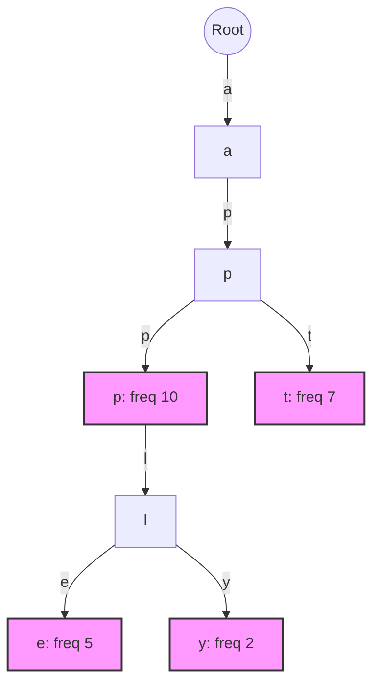
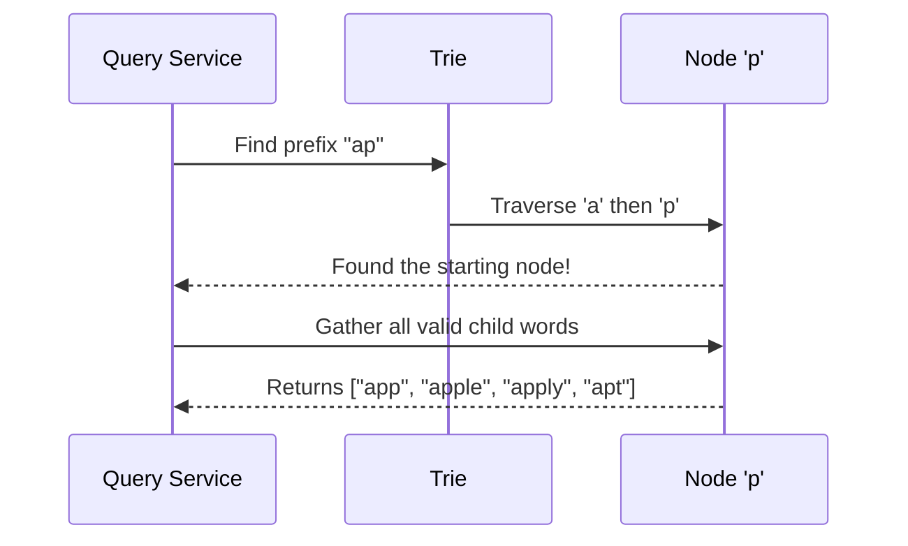

# Chapter 2: Trie Data Structure

In [Chapter 1: Query Service](01_query_service_.md), we met our helpful librarian—the Query Service. When a user types `"tw"`, the Query Service magically finds all words starting with `"tw"` and returns the most popular ones. But how does the librarian's catalog actually organize millions of words so they can be searched in the blink of an eye? 

If we stored words in a simple list, finding all words starting with `"tw"` would mean checking every single word in the dictionary. That's way too slow! We need a data structure that groups words by their shared beginnings. Enter the **Trie**.

## The Family Tree of Words

A **Trie** (pronounced like "try") is a tree-like data structure used to store and retrieve strings efficiently by their prefixes. Think of it like a family tree, but instead of people, it's a tree of letters!

Imagine you want to store the words: `app`, `apple`, `apply`, and `apt`. Instead of storing them separately, a Trie overlaps their shared prefixes:



Notice how `app`, `apple`, and `apply` share the `a -> p -> p` path? That's the magic of a Trie! It saves space and makes finding words by prefix incredibly fast.

## Key Concepts of a Trie

Let's break down the Trie into three simple ideas:

1. **Nodes as Characters:** Each circle (node) in the tree represents a single letter.
2. **Paths as Words:** If you start at the root and trace a path down the tree, the letters you pass form a word. The pink nodes in the diagram above mark the *end* of a valid word.
3. **Frequency/Popularity:** Some words are searched more than others. Our Trie nodes can store a `freq` (frequency) number to remember how popular a word is. For example, `app` has a frequency of 10, meaning it's very popular!

## Solving Our Use Case

Let's see how the Trie solves our autocomplete problem. When a user types `"ap"`, we need to find all words starting with that prefix.

1. **Locate the Prefix:** We traverse the tree following `"a"` then `"p"`. We arrive at the `p` node (the first `p` under `a`).
2. **Gather Children:** From that `p` node, we explore all paths downward to find the valid end-nodes (the pink ones). We find `app` (freq 10), `apple` (freq 5), `apply` (freq 2), and `apt` (freq 7).
3. **Sort and Return:** We sort these by frequency and return the top results!

Here is how that lookup flow looks in action:



## Inside the Code: Building a Trie

How do we represent this in code? A Trie is just a collection of `TrieNode` objects. Let's build a very simple version.

First, let's create a `TrieNode`. Each node needs to know its children (the next letters) and its popularity (frequency).

```python
class TrieNode:
    def __init__(self):
        self.children = {} # Maps a character to its child node
        self.freq = 0      # Popularity of the word ending here
```

**Explanation:** 
- `self.children` is a dictionary. If this node is `a`, its dictionary might hold `{'p': <TrieNode>}`, pointing to the next letter.
- `self.freq` is `0` unless this node marks the end of a complete search query.

Next, let's create the `Trie` itself, which holds the root node and allows us to insert words.

```python
class Trie:
    def __init__(self):
        self.root = TrieNode() # The empty starting point
```

### Inserting a Word

To add a word, we start at the root and walk down the tree, creating new nodes letter by letter. At the end of the word, we update the frequency.

```python
def insert(self, word, freq=1):
    node = self.root
    for char in word:
        # Create a new path if the letter doesn't exist
        if char not in node.children:
            node.children[char] = TrieNode()
        node = node.children[char] # Move to the next letter
    node.freq = freq # Mark the end of the word
```

**Explanation:** If we insert `"app"`, the loop goes `a` -> `p` -> `p`. If the path already exists (like when inserting `"apple"` right after `"app"`), it just reuses the existing nodes. At the final `p`, it sets the `freq`.

### Finding the Prefix Node

When a user types a prefix, the very first step is navigating to that prefix's node in the Trie.

```python
def find_prefix_node(self, prefix):
    node = self.root
    for char in prefix:
        if char not in node.children:
            return None # Prefix doesn't exist!
        node = node.children[char]
    return node # The starting point for suggestions
```

**Explanation:** We loop through the prefix characters (e.g., `"a"`, `"p"`). If we find the letters, we return the node where the prefix ends. The [Chapter 1: Query Service](01_query_service_.md) can then take this node and explore its children to find all valid words!

## Conclusion

You've just unlocked the secret behind lightning-fast prefix searches! The **Trie Data Structure** organizes words by their shared prefixes, acting like a dictionary that is meticulously sorted letter by letter. By storing the frequency at the end nodes, it becomes the perfect catalog for our autocomplete system.

However, there's a tiny catch. If a prefix like `"a"` has millions of words underneath it, exploring all of them and sorting them by frequency every single time is still too slow. How can we speed this up? Let's find out in the next chapter.

[Next Chapter: Node Caching](03_node_caching_.md)

---

Generated by [AI Codebase Knowledge Builder](https://github.com/The-Pocket/Tutorial-Codebase-Knowledge)