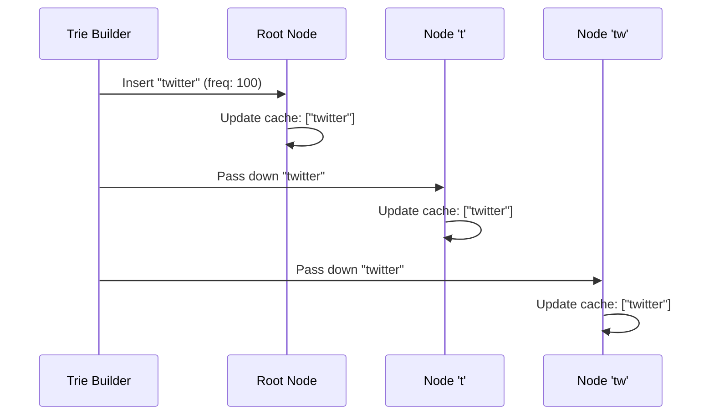

# Chapter 3: Node Caching

In [Chapter 2: Trie Data Structure](02_trie_data_structure_.md), we built a magical tree of letters that groups words by their prefixes. But we left off with a cliffhanger: what if a prefix like `"a"` has millions of words underneath it? Traversing millions of nodes and sorting them by popularity every single time a user types `"a"` would be way too slow!

Our [Chapter 1: Query Service](01_query_service_.md) needs to be lightning-fast. So, how do we avoid doing all that heavy lifting on the fly? Enter **Node Caching**.

## The Restaurant Menu Analogy

Imagine you're at a restaurant. You ask the waiter, "What are the most popular pasta dishes?" 

If the restaurant didn't have a menu, the waiter would have to run to the kitchen, ask the chef to look up the order history for every single pasta dish, calculate the totals, sort them, and run back to you. That would take forever!

Instead, the restaurant has a menu where the "⭐ Chef's Favorites" are already highlighted at the top of the pasta section. The waiter just glances at the menu and reads them off instantly. 

**Node Caching** is exactly those highlights on the menu! We pre-compute the top-k (e.g., top 5) most popular queries and store them directly inside the Trie node. When a user types a prefix, we just read the cached list—no kitchen trips required.

## Key Concepts of Node Caching

Let's break down this optimization into three simple ideas:

1. **The Cache:** Every node in our Trie now holds a small list called a `cache`. 
2. **Top-k Only:** We don't store every possible suggestion in the cache. We only store the top `k` results (usually the top 5). This keeps the cache tiny and fast.
3. **Pre-computed:** The heavy lifting (finding and sorting) happens *before* any user even types anything. We build this cache when we construct the Trie, so at search time, the answer is already waiting!

## Solving Our Use Case

Let's see how our search operation changes. When a user types `"tw"`, we no longer need to gather and sort. We just grab the cache!

```python
# Before: Slow, traverses and sorts everything
all_matches = trie.find_all("tw")
sorted_matches = sorted(all_matches, key=lambda x: -x.freq)
return sorted_matches[:5]
```

```python
# After: Lightning fast, uses the cache!
node = trie.find_prefix_node("tw")
return node.cache  # Already sorted and limited to top 5!
```

**What happens here?** We simply find the node for `"tw"` and return its `cache`. The cache already contains the top 5 most popular words, completely bypassing the need to explore the subtree or sort anything. 

## Under the Hood: How the Cache Gets Populated

You might be wondering: *How did the top 5 results get into the cache in the first place?* 

When we build or update our Trie (usually offline, during off-peak hours), we insert words along with their frequencies. As we insert a word, we update the `cache` for every node along its path to ensure only the top `k` words are kept.

Here’s a visual representation of how a word gets added and updates the caches:



## Inside the Code: Building a Cached Trie

Let's update our `TrieNode` from the previous chapter to include this cache. 

```python
class TrieNode:
    def __init__(self):
        self.children = {}
        self.freq = 0
        self.cache = [] # Our new highlight menu!
```

**Explanation:** The `cache` is just a list. It will hold tuples like `("twitter", 100)` representing the word and its frequency. 

Now, let's look at a simplified version of how we update the cache when inserting a word. As we walk down the tree character by character, we add the word to that node's cache, sort it, and trim it to keep only the top 5.

```python
def insert_and_cache(self, word, freq):
    node = self.root
    for char in word:
        if char not in node.children:
            node.children[char] = TrieNode()
        
        # Update the cache for this node!
        node.cache.append((word, freq))
        node.cache.sort(key=lambda x: -x[1]) # Sort by freq
        node.cache = node.cache[:5]          # Keep top 5
        
        node = node.children[char]
    node.freq = freq
```

**Explanation:** 
- `node.cache.append(...)`: We add the current word to this node's list of suggestions.
- `node.cache.sort(...)`: We sort the list so the highest frequencies are at the front.
- `node.cache = node.cache[:5]`: We slice the list to throw away anything beyond the top 5. This ensures our nodes don't consume too much memory!

> **Note on Real-World Updates:** In a massive system, we don't update the Trie and its caches in real-time for every single search. That would be too slow! Instead, a background pipeline handles this, which we will explore in [Chapter 6: Data Gathering Pipeline](06_data_gathering_pipeline_.md).

## Conclusion

You've just supercharged our Trie! By using **Node Caching**, we traded a little bit of extra memory (storing a top 5 list at each node) for a massive boost in speed. Instead of traversing huge subtrees and sorting on the fly, our [Chapter 1: Query Service](01_query_service_.md) can now return suggestions in the blink of an eye by simply reading the pre-computed cache.

But what happens when our Trie grows so large that it can't fit on a single server? How do we handle millions of words and billions of searches? Let's scale out in the next chapter.

[Next Chapter: Sharding](04_sharding_.md)

---

Generated by [AI Codebase Knowledge Builder](https://github.com/The-Pocket/Tutorial-Codebase-Knowledge)