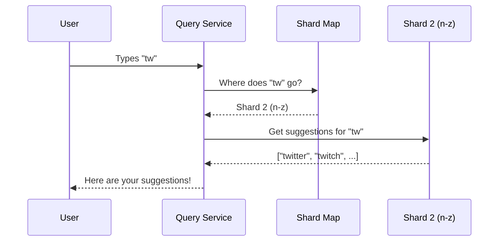
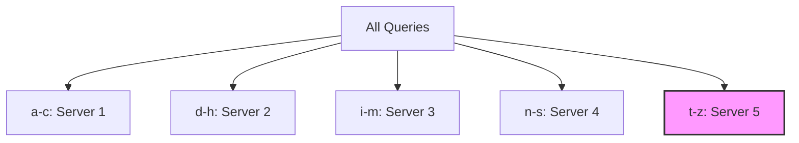

# Chapter 4: Sharding

In [Chapter 3: Node Caching](03_node_caching_.md), we supercharged our Trie by storing the top 5 suggestions directly at each node. Our search is now lightning-fast! But there's a looming problem: what happens when our Trie grows so massive that it can't fit on a single server anymore? 

With millions of search queries, a single server might run out of memory or get crushed under the weight of too many requests. We need a way to spread the load. Enter **Sharding**.

## The Encyclopedia Analogy

Imagine a massive encyclopedia that fills an entire wall. If you have only one librarian managing it, they'll be overwhelmed by the constant requests—looking up words starting with "a", then "z", then "m", back and forth. The line of people waiting will grow endlessly!

The solution? Divide the encyclopedia into volumes and place them on separate desks, each with its own dedicated librarian. One librarian handles A-M, another handles N-Z. Now, the workload is split, and no single librarian gets overwhelmed.

**Sharding** does exactly this with our Trie! We split the data across multiple servers based on prefix ranges.

## Key Concepts of Sharding

Let's break sharding down into three simple ideas:

1. **Shards:** A "shard" is just a piece of the whole. Each shard is a separate server holding a portion of the Trie.
2. **Shard Key:** The rule that decides which piece of data goes where. For our Trie, the shard key is the **prefix range** (e.g., 'a-m' goes to Shard 1, 'n-z' goes to Shard 2).
3. **Shard Map:** A directory that keeps track of which prefix range lives on which server. When a request comes in, we check the map to know exactly where to send it.

## Solving Our Use Case

Let's say a user types `"tw"`. With sharding, our system doesn't search one giant Trie. Instead, it follows a simple 2-step process:

1. **Route:** Look at the first letter `"t"`. Check the shard map: `"t"` falls in the 'a-m' range? No, it falls in the 'n-z' range! Send the request to Shard 2.
2. **Search:** Shard 2 has its own Trie containing only words from 'n-z'. It finds `"tw"` and returns the cached top 5 suggestions.

```python
# The user types "tw"
shard = shard_map.find_shard("tw")  # Returns Shard 2 (n-z)
suggestions = shard.get_suggestions("tw", k=5)

print(suggestions)
# Output: ['twitter', 'twitch', 'twilight', 'tweety', 'twins']
```

The result is exactly the same as before, but now no single server is overwhelmed!

## Under the Hood: How Requests Are Routed

When a user types a prefix, the [Query Service](01_query_service_.md) doesn't search a Trie directly. Instead, it consults a **Shard Map Manager** to route the request to the correct server.

Here's what that flow looks like:



## Inside the Code: The Shard Map

The shard map is the brain of our routing. Let's look at a simple implementation.

```python
class ShardMap:
    def __init__(self):
        # Maps prefix ranges to server addresses
        self.ranges = {
            "a-m": "server_1",
            "n-z": "server_2"
        }
```

**Explanation:** We store a dictionary mapping prefix ranges to server names. In a real system, the values would be network addresses (like IP addresses).

Now, how do we find the right shard for a given prefix?

```python
    def find_shard(self, prefix):
        first_char = prefix[0].lower()
        if 'a' <= first_char <= 'm':
            return self.ranges["a-m"]
        else:
            return self.ranges["n-z"]
```

**Explanation:** We look at the first character of the prefix. If it's between 'a' and 'm', we route to server 1. Otherwise, it goes to server 2. Simple!

## The Problem of Uneven Distribution

Our initial 'a-m' and 'n-z' split seems fair—13 letters each. But in the real world, some letters are WAY more popular. Words starting with 'a', 's', and 't' are incredibly common, while 'x', 'y', and 'z' are rare.

If Shard 1 handles 'a-m', it might get 80% of all traffic and still get overwhelmed! Shard 2 sits mostly idle. This is called **hotspotting**.

The solution? Split the busy ranges further! Instead of just 'a-m', we can break it down:

```python
class ShardMap:
    def __init__(self):
        self.ranges = {
            "a-c": "server_1",
            "d-h": "server_2",
            "i-m": "server_3",
            "n-s": "server_4",
            "t-z": "server_5"
        }
```

**Explanation:** Now 't' gets its own dedicated server range ('t-z'), so popular prefixes like `"tw"` don't overload a server that's also handling 'n' through 's'. 

If 't' alone is still too busy? Split it even further: `"ta-tg"`, `"th-tn"`, `"to-tz"`. Sharding is flexible! You can keep splitting hot ranges until the traffic is balanced.



The highlighted node (Server 5) handles the 't-z' range, which includes highly popular prefixes like "tw" and "th". If this server gets too busy, we can split it into even smaller ranges.

## Conclusion

You've just learned how to scale our autocomplete system to handle massive amounts of data and traffic! **Sharding** distributes our Trie across multiple servers based on prefix ranges, like dividing a giant encyclopedia among several librarians. By using a shard map to route requests and splitting busy ranges further, we ensure no single server gets overwhelmed.

But wait—what if we need to block certain suggestions, like inappropriate or harmful content? We don't want those showing up in our results! Let's learn how to filter them out in the next chapter.

[Next Chapter: Filter Layer](05_filter_layer_.md)

---

Generated by [AI Codebase Knowledge Builder](https://github.com/The-Pocket/Tutorial-Codebase-Knowledge)