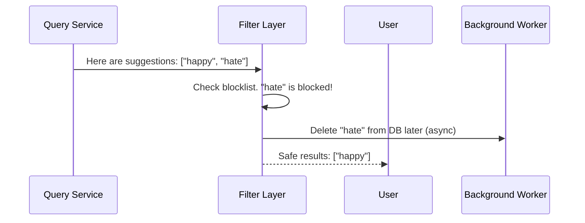

# Chapter 5: Filter Layer

In [Chapter 4: Sharding](04_sharding_.md), we learned how to split our massive Trie across multiple servers to handle huge amounts of traffic. But what happens when the content itself is the problem? If our autocomplete suggests something harmful or inappropriate, scaling it just means we deliver bad results faster! We need a way to keep our suggestions safe.

## The Bouncer at the Club Analogy

Imagine your autocomplete system is an exclusive club. People (search queries) are lining up to get on the dance floor (the user's screen). You want the club to be popular, but you also need it to be safe. If someone tries to enter who is on the banned list (like hate speech or offensive terms), they need to be stopped at the door.

Enter the **Filter Layer**. It acts as the bouncer at the club, checking the list of potential suggestions and blocking any that violate the rules, ensuring a safe and clean experience for everyone inside.

## Key Concepts of the Filter Layer

Let's break down the Filter Layer into two simple ideas:

1. **The Bouncer (Real-time Filtering):** When the [Query Service](01_query_service_.md) gets results from the Trie, they must pass through the Filter Layer *before* reaching the user. If a result is on the blocklist, it gets removed instantly.
2. **The Cleanup Crew (Asynchronous Deletion):** Blocking the word at the door is great for the user, but the bad word is still in our database (the Trie). Deleting it immediately could slow down the system. Instead, we send a message to a background worker to delete it from the database later. This is called **asynchronous deletion**.

## Solving Our Use Case

Let's see the Filter Layer in action. Imagine a user types `"ha"`. The Trie returns `["happy", "halloween", "hate", "hats"]`. However, `"hate"` is on our blocklist.

```python
# The raw results from the Trie
raw_suggestions = ["happy", "halloween", "hate", "hats"]

# The Filter Layer steps in
safe_suggestions = filter_layer.sanitize(raw_suggestions)

print(safe_suggestions)
# Output: ["happy", "halloween", "hats"]
```

The user only sees the safe words, completely unaware that `"hate"` was blocked at the door!

## Under the Hood: How the Filter Works

What happens step-by-step when a blocked word is found? The Filter Layer checks the results, removes the bad ones, and quietly tells a background worker to clean up the database later.



## Inside the Code: Building the Filter

Let's look at how the Filter Layer checks the blocklist. We use a `set` for the blocklist because checking if a word exists in a set is incredibly fast.

```python
class FilterLayer:
    def __init__(self, blocklist):
        self.blocklist = set(blocklist) # Fast lookup!

    def sanitize(self, suggestions):
        safe = []
        for word in suggestions:
            if word not in self.blocklist:
                safe.append(word)
            else:
                self._trigger_async_delete(word)
        return safe
```

**Explanation:** 
- `self.blocklist`: A set of banned words. 
- We loop through the suggestions. If the word is safe, we add it to our `safe` list. If it's on the blocklist, we trigger the cleanup crew and leave it out of the results.

Now, let's see the async trigger. We don't delete the word from the database right then and there; we just put a message on a queue for a background worker to handle.

```python
    def _trigger_async_delete(self, word):
        # Put a message on a queue for background workers
        message_queue.publish("delete_word", word)
```

**Explanation:** By publishing to a `message_queue`, we don't make the user wait while we update the database. The [Chapter 6: Data Gathering Pipeline](06_data_gathering_pipeline_.md) will explain more about how workers process these background jobs. For now, just know that the actual deletion happens out of sight, keeping our [Query Service](01_query_service_.md) lightning-fast!

## Conclusion

You've just met the bouncer of our autocomplete system! The **Filter Layer** ensures that users never see harmful or inappropriate suggestions by filtering them out in real-time. Meanwhile, it quietly schedules the bad data for deletion in the background so our database stays clean without slowing down the user experience.

But where does all this data come from in the first place? How do we gather billions of search queries to build and update our Trie? Let's find out in the next chapter.

[Next Chapter: Data Gathering Pipeline](06_data_gathering_pipeline_.md)

---

Generated by [AI Codebase Knowledge Builder](https://github.com/The-Pocket/Tutorial-Codebase-Knowledge)