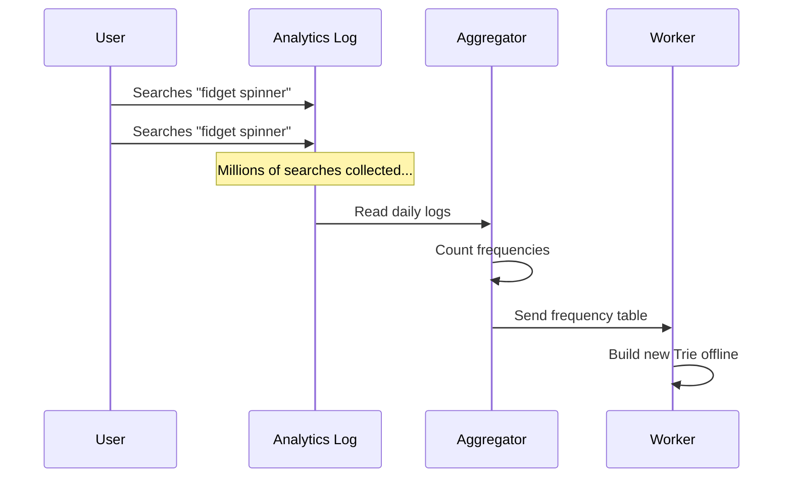

# Chapter 6: Data Gathering Pipeline

In [Chapter 5: Filter Layer](05_filter_layer_.md), we met the bouncer of our system that blocks bad words in real-time and quietly schedules them for deletion in the background. But this brings up a big question: how do we actually update our database in the first place? If a million people suddenly search for a new trend like "fidget spinner", how does our [Chapter 2: Trie Data Structure](02_trie_data_structure_.md) learn about it?

You might think we should just update the Trie every time a user hits "Enter" on a search. But with millions of users, that would mean millions of updates per second! Updating the Trie and recalculating the [Chapter 3: Node Caching](03_node_caching_.md) on every single keystroke or search would melt our servers. We need a smarter way. Enter the **Data Gathering Pipeline**.

## The Factory Assembly Line Analogy

Imagine a car factory. If a worker tried to build a whole car from scratch every time a new order came in, it would take forever. Instead, factories use an **assembly line**. Raw materials come in, they are slowly refined step-by-step offline, and a finished car rolls off the end of the line.

The **Data Gathering Pipeline** is our assembly line. Instead of updating the Trie instantly for every search, we treat searches like raw materials. We collect them, slowly count them up in the background, and use those counts to build a fresh, updated Trie. 

## Key Concepts of the Pipeline

Let's break down this assembly line into three simple stages:

1. **Analytics Logs (The Raw Materials):** When a user searches for something, we don't update the database. We simply write their search query to a text file or log. This is incredibly fast—just appending a line of text!
2. **Aggregators (The Refiners):** Periodically (like once a day or once a week), a background program reads the logs and counts how many times each word was searched. It outputs a neat frequency table (e.g., "apple: 5000, banana: 2000").
3. **Workers (The Builders):** Another background program takes that frequency table and builds a brand new, shiny Trie from scratch. Once it's done, it replaces the old Trie.

## Solving Our Use Case

Let's see how a surge in searches for "fidget spinner" is handled. 

Instead of updating the live Trie a million times, we just write "fidget spinner" to our logs a million times. Later that night, the Aggregator counts them up, and the Worker builds a new Trie where "fidget spinner" has a massive frequency. The next morning, users see it in their autocomplete!

```python
# A user searches for "fidget spinner"
# Instead of updating the Trie, we just log it:
log_query("fidget spinner") 

# Later, the Aggregator counts the logs
counts = aggregate_logs() 
# Output: {"fidget spinner": 1000000, "apple": 5000}

# The Worker builds the new Trie using these counts
new_trie = build_new_trie(counts)
```

## Under the Hood: How the Pipeline Flows

Let's look at the step-by-step journey of a search query as it moves through our offline assembly line.



Notice how the User only interacts with the fast Analytics Log. The heavy lifting (Aggregator and Worker) happens completely offline in the background!

## Inside the Code: The Assembly Line

Let's look at simplified code for each stage of our pipeline.

### Stage 1: Logging the Query

When a search happens, we just append it to a log. This takes almost zero time.

```python
def log_query(query):
    # Just append to a file! Super fast.
    with open("search_logs.txt", "a") as f:
        f.write(query + "\n")
```
**Explanation:** We open a file in append mode (`"a"`) and write the query. No complex database locks, no sorting. Just a simple diary entry.

### Stage 2: Aggregating the Logs

Later, the Aggregator reads this file and counts the words. (We will dive much deeper into how this works in the next chapter!)

```python
def aggregate_logs(log_file):
    counts = {}
    for query in log_file:
        # Count how many times each query appears
        counts[query] = counts.get(query, 0) + 1
    return counts # e.g., {"fidget spinner": 1000000}
```
**Explanation:** We loop through the raw logs and use a dictionary to keep a running tally. The result is a clean summary of frequencies.

### Stage 3: Building the New Trie

The Worker takes those counts and uses our trusty Trie `insert` method to build a fresh index.

```python
def build_new_trie(counts):
    new_trie = Trie()
    for word, freq in counts.items():
        # Insert with the exact frequency from our counts
        new_trie.insert(word, freq)
    return new_trie
```
**Explanation:** We create an empty Trie. Then, we iterate over our frequency table, inserting each word along with its newly calculated popularity score. Once this is done, this new Trie can be swapped in to replace the old one!

## Conclusion

You've just learned how to handle massive amounts of data without crashing our system! By using a **Data Gathering Pipeline**, we treat search updates like a factory assembly line. We quickly log raw searches, count them up offline, and build a fresh Trie in the background. This ensures our [Chapter 1: Query Service](01_query_service_.md) remains lightning-fast while our data stays up-to-date.

But how exactly does the Aggregator count billions of logs efficiently without running out of memory? Let's zoom in on the refiner in the next chapter.

[Next Chapter: Aggregator](07_aggregator_.md)

---

Generated by [AI Codebase Knowledge Builder](https://github.com/The-Pocket/Tutorial-Codebase-Knowledge)