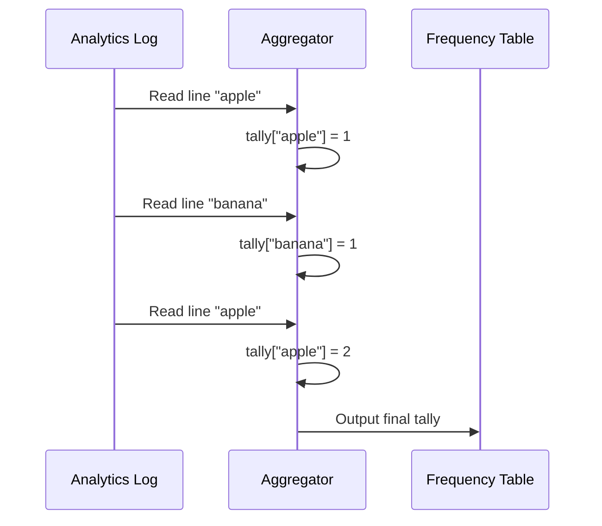

# Chapter 7: Aggregator

In [Chapter 6: Data Gathering Pipeline](06_data_gathering_pipeline_.md), we designed our system's assembly line. We learned that instead of updating our database on every single search, we quickly write user queries to an Analytics Log. But a giant text file of repeated searches isn't very useful on its own—we can't build a [Chapter 2: Trie Data Structure](02_trie_data_structure_.md) out of raw text! We need to summarize it. 

Enter the **Aggregator**.

## The Vote Counter Analogy

Imagine an election day. Throughout the day, people drop paper ballots into a box. At the end of the day, you have a massive box of unorganized paper. You can't just look at the box and know who won. 

You need a **vote counter**. The vote counter opens the box, reads each ballot one by one, and tallies up the votes for each candidate on a scoreboard. 

The **Aggregator** is our vote counter! It takes the raw, messy search logs (the ballots) and counts how many times each query was searched within a specific time window. It produces a clean frequency table (the scoreboard) that tells us exactly how popular each query is.

## Key Concepts of the Aggregator

Let's break down the Aggregator into three simple ideas:

1. **Raw Logs (The Ballots):** The input. This is the continuous stream of search queries recorded by our system.
2. **Time Window (The Voting Day):** We don't count logs from the beginning of time. We count within a specific period—like the last 24 hours or the past week. This ensures our suggestions stay trendy!
3. **Frequency Table (The Tally Sheet):** The output. A clean dictionary or map that links each query to its total search count (e.g., `{"apple": 5000, "banana": 2000}`).

## Solving Our Use Case

Let's see the Aggregator in action. Imagine our Analytics Log recorded the following searches today:

```text
apple
banana
apple
apple
```

We want the Aggregator to read this log and produce a frequency table. 

```python
# The Aggregator reads the log and processes it
aggregator = Aggregator()
aggregator.process_log("search_logs.txt")

# We get the final tally
freq_table = aggregator.get_frequency_table()

print(freq_table)
# Output: {"apple": 3, "banana": 1}
```

Just like that, our messy log has been transformed into a neat summary! This frequency table is exactly what our Workers need to build a fresh Trie with updated popularity scores.

## Under the Hood: How the Aggregator Works

When the Aggregator runs (usually during off-peak hours), it reads the log file line by line. For each query, it updates a running tally in memory. Once it finishes reading the entire time window's logs, it outputs the final counts.

Here’s a visual representation of this flow:



## Inside the Code: Building the Aggregator

Let's look at how we can implement this in code. We'll use a simple dictionary to keep track of our tallies.

First, we set up our Aggregator with an empty tally sheet:

```python
class Aggregator:
    def __init__(self):
        # Our tally sheet (empty dictionary)
        self.counts = {} 
```

**Explanation:** `self.counts` will hold our running totals. The keys will be the search queries, and the values will be the number of times we've seen them.

Next, we need a way to process a single line from the log:

```python
    def process_line(self, query):
        # If query exists, add 1. Otherwise, start at 1.
        self.counts[query] = self.counts.get(query, 0) + 1
```

**Explanation:** The `get(query, 0)` method looks for the query in our dictionary. If it's not there yet, it returns `0`. Then we add `1` to the count and save it back. This is the core counting logic!

Finally, we process the entire log file and return the results:

```python
    def process_log(self, log_file):
        with open(log_file, "r") as f:
            for line in f:
                self.process_line(line.strip())
                
    def get_frequency_table(self):
        return self.counts
```

**Explanation:** We open the log file, read it line by line, and feed each query to `process_line`. The `.strip()` just removes any extra whitespace or newlines. When we're done, `get_frequency_table` returns our final scoreboard!

> **Note on Big Data:** In a real system with billions of logs, a single Python dictionary on one machine might run out of memory! Systems at this scale use distributed counting tools like MapReduce or Apache Spark to split the logs across many servers, count them in parallel, and merge the results. But the core concept remains exactly the same: read logs, count occurrences, output a table.

## Conclusion

You've just learned how our system turns raw data into meaningful insights! The **Aggregator** acts as a diligent vote counter, reading through massive Analytics Logs and compiling them into a Frequency Table. This table provides the exact popularity scores needed to build our [Chapter 2: Trie Data Structure](02_trie_data_structure_.md) and ensure users get the most relevant suggestions.

Now that we have our frequency table and a freshly built Trie, where do we store it so that our [Chapter 1: Query Service](01_query_service_.md) can access it quickly? Let's explore our storage options in the next chapter.

[Next Chapter: Trie Storage](08_trie_storage_.md)

---

Generated by [AI Codebase Knowledge Builder](https://github.com/The-Pocket/Tutorial-Codebase-Knowledge)