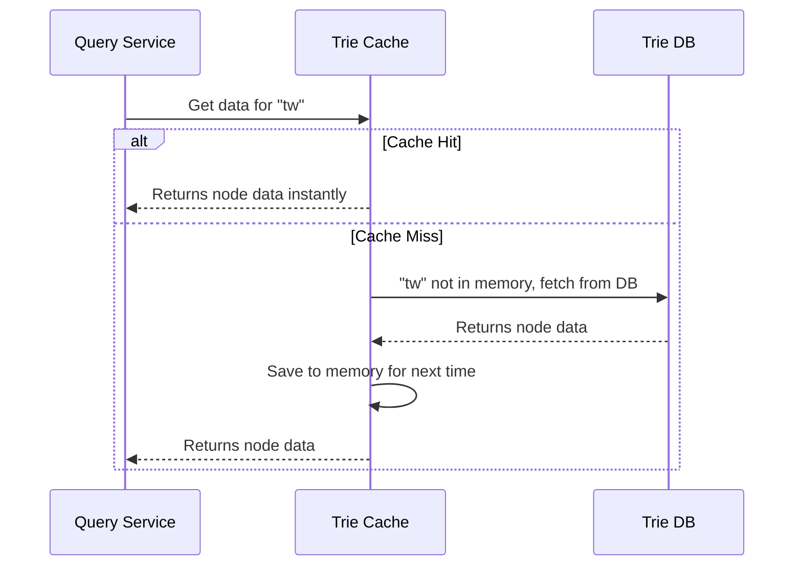

# Chapter 8: Trie Storage

In [Chapter 7: Aggregator](07_aggregator_.md), we learned how our system counts billions of raw search logs and turns them into a neat frequency table. But once our Workers use that table to build a fresh, updated [Chapter 2: Trie Data Structure](02_trie_data_structure_.md), where does it live? How does our [Chapter 1: Query Service](01_query_service_.md) access it in the blink of an eye?

If we just left the Trie on the Worker's hard drive, the Query Service would have to read from a disk every time someone typed a letter—which is far too slow! We need a smart way to store our Trie so it's both safe for the long term and lightning-fast to read. Enter **Trie Storage**.

## The Librarian's Desk Analogy

Imagine you are researching a topic in a library. You have a massive, heavy encyclopedia (our Trie) that you need to reference constantly. 

Would you walk to the deep archive room, unlock the door, and pull the heavy book off the shelf every time you needed to check a fact? Of course not! You'd leave the book open on your desk for instant access. But you still keep the master copy in the archive in case your desk gets cleaned off or something spills.

**Trie Storage** works exactly like this:
- **Trie Cache (The Desk):** A distributed in-memory system that keeps the Trie readily available for ultra-fast reads.
- **Trie DB (The Archive):** Long-term, persistent storage that safely keeps the master copies of the Trie.

## Key Concepts of Trie Storage

Let's break down these two layers:

### 1. Trie DB (The Archive)
This is our persistent database. When a Worker builds a new Trie, it saves it here. Because a Trie is a tree, storing it in a traditional database can be tricky. We usually use one of two approaches:
- **Document Store (e.g., MongoDB):** We serialize the entire Trie into a single document or a few large chunks and save it. It's like taking a photo of the whole tree and storing the photo.
- **Key-Value Store (e.g., Redis, DynamoDB):** We break the Trie into pieces. Every prefix (like `"a"`, `"ap"`, `"app"`) becomes a "Key", and the data inside that node (its children, frequency, and [Chapter 3: Node Caching](03_node_caching_.md) data) becomes the "Value". 

### 2. Trie Cache (The Desk)
This is a distributed in-memory cache (like Memcached or Redis). Memory is much faster than disk, so we load the Trie here to serve user requests instantly. When the [Chapter 1: Query Service](01_query_service_.md) needs data, it asks the Cache first.

## Solving Our Use Case

Let's see how the Query Service uses Trie Storage to get suggestions for the prefix `"tw"`.

1. **Check the Desk (Cache):** The Query Service asks the Trie Cache for the node data for `"tw"`.
2. **Cache Hit:** If the data is in the Cache, it is returned instantly! 
3. **Cache Miss:** If the data isn't in the Cache (maybe the server restarted), the Cache asks the Trie DB, loads the data into memory, and then returns it to the Query Service.

```python
# Query Service wants the top 5 for "tw"
node_data = trie_storage.get_node("tw")
suggestions = node_data.cache # Read the pre-computed top 5!

print(suggestions)
# Output: ['twitter', 'twitch', 'twilight', 'tweety', 'twins']
```

## Under the Hood: How Data Flows

What happens step-by-step when the Query Service tries to read a node? Let's look at the flow, including the fallback to the database when the cache is empty.



This pattern is called a **Cache-Aside** pattern. The Cache sits "aside" the database, intercepting requests and only bothering the DB when necessary.

## Inside the Code: Building the Storage

Let's look at a simplified implementation of our Trie Storage, focusing on the Key-Value approach where every prefix is a key.

### Saving to the DB

When a Worker finishes building a Trie, it saves the nodes to the Trie DB so they aren't lost.

```python
def save_trie_to_db(trie_node, current_prefix=""):
    # Save this specific node to the Key-Value DB
    db.set(key=current_prefix, value=trie_node.data)
    
    # Recursively save all children
    for char, child_node in trie_node.children.items():
        save_trie_to_db(child_node, current_prefix + char)
```
**Explanation:** We traverse the tree. For every node, we use its prefix (like `"ap"`) as the key, and save the node's data (frequency, cache, children links) as the value.

### Reading from Storage

When the Query Service needs a node, we check the Cache first, then the DB.

```python
def get_node(prefix):
    # 1. Check the Cache (The Desk)
    data = cache.get(prefix)
    if data:
        return data # Cache Hit!
    
    # 2. Check the DB (The Archive)
    data = db.get(prefix)
    if data:
        cache.set(prefix, data) # Put it on the desk for next time
        return data # Cache Miss, but DB Hit!
        
    return None # Prefix doesn't exist at all
```
**Explanation:** We ask the `cache` for the prefix. If it's not there, we ask the `db`. If the DB has it, we make sure to `cache.set()` it so future reads will be a Cache Hit!

## Updating the Storage

What happens when the [Chapter 6: Data Gathering Pipeline](06_data_gathering_pipeline_.md) finishes building a brand new weekly Trie? 

We don't just delete the old one instantly! A safe approach is to write the new Trie to the Trie DB alongside the old one. Once the entire new Trie is safely saved in the DB, we update a pointer (a simple flag or config value) that tells the system to start using the new Trie. Then, the Cache gradually loads the new data, and the old Trie is eventually deleted.

## Conclusion

Congratulations, you've reached the final piece of our system! You've just learned how to safely store and quickly access our massive Trie. By using a **Trie DB** as a secure archive for long-term persistence and a **Trie Cache** as a fast desk for real-time reads, we ensure that our autocomplete suggestions are both safe from data loss and lightning-fast for our users.

You now understand the complete journey of a search query—from how it's gathered and counted, to how it's stored, filtered, and served in milliseconds. Great job making it through the entire system!

---

Generated by [AI Codebase Knowledge Builder](https://github.com/The-Pocket/Tutorial-Codebase-Knowledge)