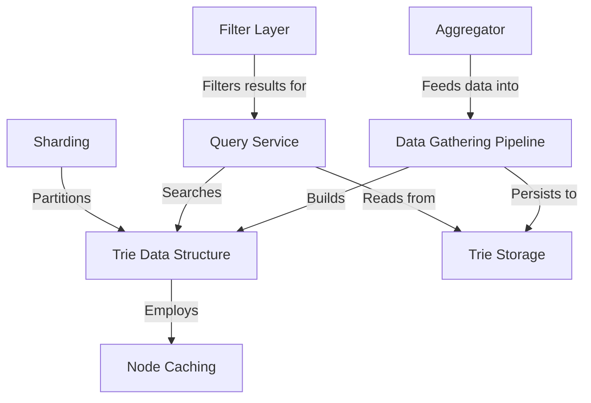

# Tutorial: search_autocomplete

This project designs a **search autocomplete system** that provides real-time, popular search suggestions as users type. It uses a **Trie Data Structure** to efficiently store and retrieve queries by their prefixes, and a *Data Gathering Pipeline* to asynchronously process and aggregate search logs into frequency counts. To ensure fast responses, the system employs *Node Caching* to store top results directly at each trie node and uses **Sharding** to distribute the data across multiple servers for scalability. A *Filter Layer* is also included to block inappropriate suggestions, ensuring a safe and clean user experience.

**Source Repository:** [None](None)

## Chapters

1. [Query Service
](01_query_service_.md)
2. [Trie Data Structure
](02_trie_data_structure_.md)
3. [Node Caching
](03_node_caching_.md)
4. [Sharding
](04_sharding_.md)
5. [Filter Layer
](05_filter_layer_.md)
6. [Data Gathering Pipeline
](06_data_gathering_pipeline_.md)
7. [Aggregator
](07_aggregator_.md)
8. [Trie Storage
](08_trie_storage_.md)

---

Generated by [AI Codebase Knowledge Builder](https://github.com/The-Pocket/Tutorial-Codebase-Knowledge)