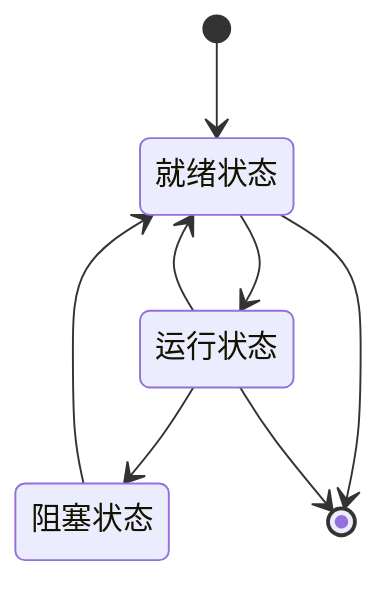

# Chapter 2: 操作系统


在前一章中，我们学习了计算机体系结构，了解了计算机的“蓝图”——硬件组件如何协同工作。就像盖房子需要蓝图一样，计算机需要操作系统来管理这些硬件资源。如果没有操作系统，用户需要直接操作硬件，这就像没有管家的房子，混乱不堪。操作系统就像计算机的“管家”，负责分配处理器时间、内存空间和设备访问权限，让计算机更易用、更高效。

## 2.1 为什么需要操作系统？

想象一下，你要使用计算机，但需要直接操作硬件：自己编写代码控制CPU、管理内存、处理输入输出。这就像你要盖房子，却需要亲自搬运砖块、调配水泥、安装水电管道——既复杂又容易出错。操作系统解决了这个问题，它为应用程序提供了一个运行环境，处理多任务并发执行，确保系统稳定性和安全性。

操作系统的设计理念（如进程管理、内存管理）是理解计算机如何高效运行的关键。它就像一个智能管家，协调所有硬件和软件资源，让计算机系统有序运行。

## 2.2 操作系统的定义

操作系统（Operating System，OS）是计算机系统中的核心系统软件，负责管理和控制计算机系统中的硬件和软件资源，合理地组织计算机工作流程和有效地利用资源，在计算机与用户之间起接口的作用。操作系统为用户提供的接口表现形式一般为：命令、菜单、窗口之类的，而操作系统为应用程序提供的接口为API。

> 操作系统是计算机系统中的核心系统软件，负责管理和控制计算机系统中的硬件和软件资源，合理地组织计算机工作流程和有效地利用资源，在计算机与用户之间起接口的作用。

简单来说，操作系统就像一个“中间人”，它管理硬件资源（如CPU、内存、硬盘），同时为应用程序提供服务。没有操作系统，应用程序无法直接访问硬件，用户也无法方便地使用计算机。

## 2.3 操作系统的类型

按照操作系统的功能划分，操作系统的基本类型有批处理操作系统、分时操作系统、实时操作系统、网络操作系统、分布式操作系统、嵌入式操作系统、微内核操作系统等。

- **批处理操作系统**：像工厂的流水线，将多个任务批量处理。用户提交一批作业，操作系统按顺序执行，适合计算密集型任务。
- **分时操作系统**：允许多个用户同时使用计算机，每个用户感觉像独占计算机。比如，大学计算机实验室的多用户系统。
- **实时操作系统**：要求任务在严格时间内完成，如航空控制系统、工业自动化。
- **网络操作系统**：管理网络资源，如Windows Server、Linux服务器版。
- **嵌入式操作系统**：运行在嵌入式设备中，如手机、智能家电。
- **微内核操作系统**：只保留最核心功能，其他功能作为服务模块，如Windows NT、macOS。

## 2.4 操作系统的五大管理功能

操作系统的主要功能是进行处理机与进程管理、存储管理、文件管理、设备管理和作业管理的工作。这些功能就像管家的不同职责，确保计算机系统高效运行。

### 2.4.1 进程管理

进程是处理机管理中最基本的、最重要的概念。进程是系统并发执行的体现。由于在多道程序系统中，众多的计算机用户都以各种各样的任务，随时随地争夺使用处理机。为了动态地看待操作系统，则以进程作为独立运行的基本单位，以进程作为分配资源的基本单位，从进程的角度来研究操作系统。

进程的状态转换如下：



- **就绪状态**：进程已分配了除CPU以外的所有必要资源，只要能再获得处理机，便能立即执行。
- **运行状态**：进程已获得处理机，其程序正在执行。
- **阻塞状态**：进程因发生某事件（如请求I/O、申请缓冲空间等）而暂停执行。

进程互斥与同步是进程管理的重要内容。互斥是资源的竞争关系，而同步是进程间的协作关系。例如，多个进程共享打印机时，需要互斥访问；而生产者-消费者问题中，生产者和消费者需要同步，确保生产者生产的产品被消费者及时取走。

### 2.4.2 存储管理

存储器是计算机系统中最重要的资源之一。存储管理直接影响系统性能。存储管理主要是指对内存储器的管理，负责对内存的分配和回收、内存的保护和内存的扩充。

存储管理的目的是尽量提高内存的使用效率。常见的存储管理方式有：

- **页式存储管理**：将程序的逻辑空间和内存的物理空间按照同样的大小划分成若干页面，并以页面为单位进行分配。
- **段式存储管理**：将用户作业按逻辑意义上有完整意义的段来划分，并以段为单位作为内外存交换的空间尺度。
- **段页式存储管理**：段式和页式两种管理方法结合的产物，综合了段式组织与页式组织的特点。

页式存储管理的动态地址转换过程如下：

```mermaid
sequenceDiagram
    用户程序->>操作系统： 访问虚地址(p, d)
    操作系统->>页表： 查页号p
    页表-->>操作系统： 返回物理页号p'
    操作系统->>物理地址： 组合p'和d得到物理地址r
    操作系统->>内存： 访问物理地址r
```

当进程运行时，其页表的首地址已在系统的动态地址转换机构中的基本地址寄存器中。执行的指令访问虚存地址（p，d）时，首先根据页号p查页表，由状态可知，这个页是否已经调入内存。若已调入内存，则得到该页的内存位置p'，然后，与页内相对位移d组合，得到物理地址r。如果该页尚未调入内存，则产生缺页中断，以装入所需的页。

## 2.5 总结

本章我们学习了操作系统的基本概念，包括操作系统的定义、类型和五大管理功能。操作系统是计算机的“管家”，负责管理硬件和软件资源，让计算机更易用、更高效。我们了解了进程管理（进程的状态转换、互斥与同步）和存储管理（页式、段式、段页式存储管理）。

这些知识是理解计算机如何工作的关键，就像盖房子需要蓝图一样，理解操作系统才能优化计算机性能。

下一章我们将学习**数据库系统**，它是计算机的“数据仓库”，负责存储和管理数据。请继续阅读[数据库系统](03_数据库系统_.md)，了解数据库如何组织和管理数据！

---

Generated by [AI Codebase Knowledge Builder](https://github.com/The-Pocket/Tutorial-Codebase-Knowledge)