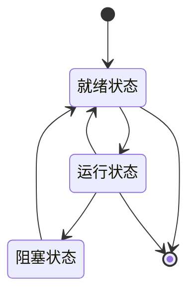

# Chapter 2: 操作系统


在上一章，我们了解了计算机的“骨架”——计算机体系结构，知道了硬件组件如何协同工作。但光有硬件还不够，计算机要真正好用，还需要一个“管家”来管理这些硬件资源，让用户和应用程序能轻松使用。这个“管家”就是**操作系统（Operating System，OS）**。本章我们将学习操作系统的基本概念，以及它如何让计算机变得更易用、更高效。


## 2.1 为什么需要操作系统？

想象一下，如果没有操作系统，你要用电脑写文档，可能需要直接操作内存地址、控制CPU执行指令，甚至管理打印机。这就像让你直接指挥建筑工人盖房子，而不是请一个项目经理——太复杂了！操作系统就像项目经理，它隐藏了硬件的复杂细节，让你通过简单的界面（比如桌面、命令行）就能使用计算机。例如，当你打开浏览器时，操作系统会帮你分配内存、调度CPU时间，让你能流畅地浏览网页，而不用关心底层如何工作。


## 2.2 操作系统是什么？

根据源材料，**操作系统是计算机系统中的核心系统软件，负责管理和控制计算机的硬件和软件资源，合理组织计算机工作流程，为用户和应用程序提供接口**。简单来说，它有两大核心作用：

1. **管理资源**：比如分配CPU时间（让多个程序轮流用）、管理内存（避免程序互相干扰）、控制设备（比如打印机、硬盘）。
2. **提供接口**：为用户提供图形界面（比如Windows的桌面）、命令行（比如Linux的终端）；为应用程序提供API（比如让浏览器能读取文件）。

操作系统的地位如图2-1所示（源材料中的图，这里用文字描述）：它位于硬件和应用软件之间，是连接两者的桥梁。


## 2.3 操作系统的类型

操作系统有不同的类型，根据功能划分，常见的有：

- **批处理操作系统**：处理一批任务（比如银行批量处理账单），适合不需要用户交互的场景。
- **分时操作系统**：允许多个用户同时使用一台计算机（比如服务器），每个用户感觉自己在独占计算机。
- **实时操作系统**：要求及时响应（比如工业控制、航空航天），必须在规定时间内完成任务。


## 2.4 操作系统的核心功能：资源管理

操作系统的核心是**资源管理**，主要管理五大资源：处理器（CPU）、存储器（内存）、文件、设备、作业。其中，**进程管理**和**存储管理**是最重要的两部分，我们重点讲解。


### 2.4.1 进程管理：程序的“动态执行”

当你打开一个程序（比如Word），操作系统会为它创建一个**进程**（Process）。进程是“正在运行的程序”，它有自己的内存空间、CPU时间等资源。进程有三种状态：

- **就绪状态**：进程已准备好运行，等待CPU分配时间（比如等待中的Word程序）。
- **运行状态**：进程正在使用CPU（比如正在编辑文档的Word）。
- **阻塞状态**：进程等待某个事件（比如等待打印机打印，或等待用户输入）。

这些状态会动态转换，比如：

- 运行中的进程用完CPU时间，进入就绪状态（等待下一次调度）。
- 运行中的进程需要等待资源（比如读文件），进入阻塞状态。
- 阻塞中的进程等到资源，进入就绪状态。

用mermaid画状态转换图，更直观：



#### 进程同步与互斥：协作与竞争

在多道程序系统中，进程之间有**协作**（同步）和**竞争**（互斥）的关系。比如：

- **互斥**：多个进程不能同时使用同一个资源（比如打印机），否则会冲突。比如，两个程序同时打印，可能会把内容混在一起。操作系统用**信号量**（Semaphore）来管理，比如`mutex`信号量，初值为1，进程进入临界区（使用资源的代码段）前执行`P(mutex)`（减1，若小于0则等待），退出时执行`V(mutex)`（加1，唤醒等待的进程）。
  
- **同步**：进程之间需要按顺序执行。比如“生产者-消费者”问题：生产者做面包（生产），消费者吃面包（消费）。生产者必须等消费者吃完才能再做，消费者必须等生产者做好才能吃。用两个信号量`empty`（初始为1，表示缓冲区有空位）和`full`（初始为0，表示缓冲区有面包）来同步：

  ```plaintext
  生产者：
  生产面包
  P(empty)  // 等待空位
  把面包放入缓冲区
  V(full)   // 告诉消费者有面包了

  消费者：
  P(full)   // 等待面包
  从缓冲区取面包
  V(empty)  // 告诉生产者有空位了
  ```


### 2.4.2 存储管理：内存的“灵活分配”

内存是计算机的“临时仓库”，但容量有限。操作系统通过**虚拟存储**技术，让用户感觉内存很大（比如你的电脑只有8GB内存，但能运行需要16GB内存的程序）。虚拟存储的核心是**页式管理**：

- 把程序和内存都分成固定大小的“页”（比如4KB一页）。
- 程序运行时，只把需要的页加载到内存，不用的页放在硬盘（外存）。
- 当程序需要访问不在内存的页时，操作系统会自动把该页从硬盘调入内存（这叫“缺页中断”）。

比如，你打开一个大型游戏，操作系统不会把整个游戏都加载到内存，而是只加载当前需要的部分，这样节省内存，让你能流畅运行。


## 2.5 检查你的理解

1. 操作系统像什么？它的核心作用是什么？
2. 进程有哪三种状态？它们之间如何转换？
3. 虚拟存储技术如何让内存“变大”？


## 结论

本章我们学习了操作系统的基本概念：它是计算机的“管家”，负责管理硬件和软件资源，让用户能轻松使用计算机。我们重点了解了进程管理（程序的动态执行）和存储管理（内存的灵活分配），这些都是操作系统的核心功能。理解操作系统，能帮你明白为什么计算机能同时运行多个程序，为什么内存不够时还能运行大程序。

下一章我们将进入**数据库系统**，学习如何存储和管理大量数据。请继续阅读[第三章：数据库系统](03_数据库系统_.md)。

---

Generated by [AI Codebase Knowledge Builder](https://github.com/The-Pocket/Tutorial-Codebase-Knowledge)