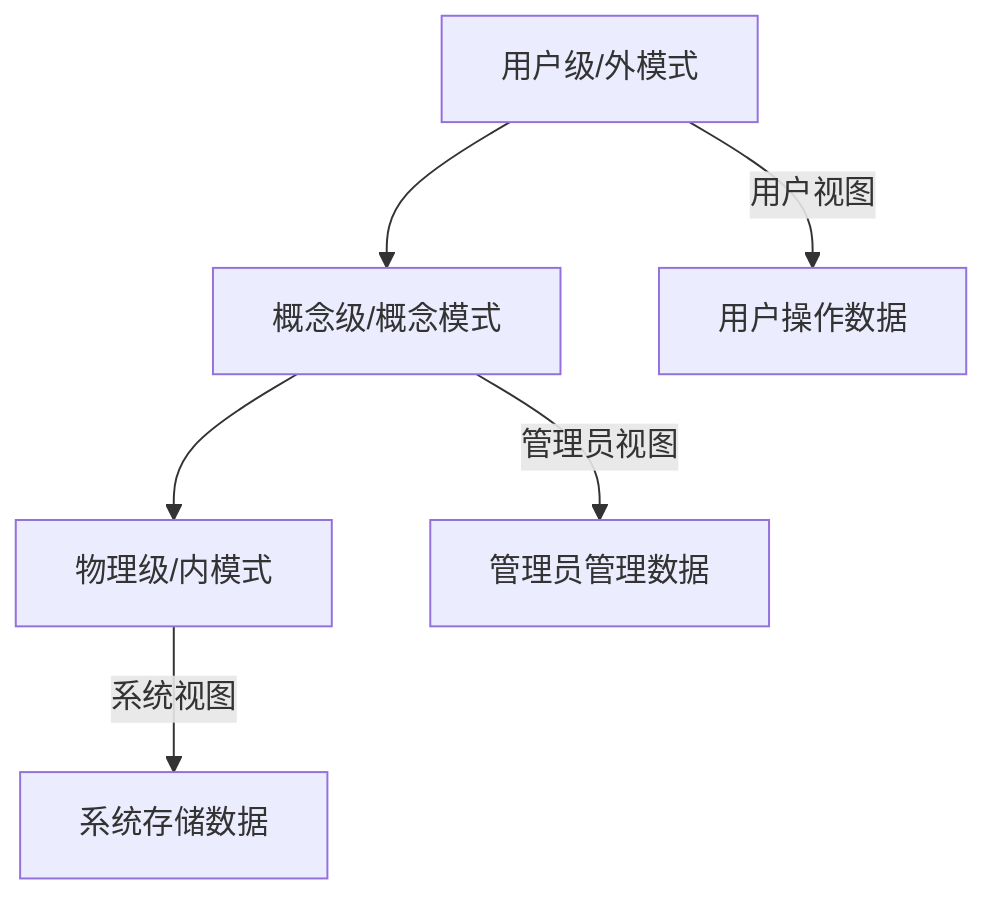

# Chapter 3: 数据库系统

在前一章中，我们学习了操作系统，了解了计算机的“管家”——操作系统如何管理硬件和软件资源，让计算机更易用。就像房子需要管家打理一样，计算机处理的数据也需要一个“仓库”来存储和管理。这一章我们将学习**数据库系统**，它是计算机的“数据仓库”，负责高效存储、管理和检索数据，是现代信息系统的核心。


## 3.1 为什么需要数据库系统？

想象一下，你要管理一家书店的顾客信息：有的顾客买过小说，有的买过教材，有的买过工具书。如果没有数据库，这些信息可能分散在多个Excel文件或纸条上：有的记录在“小说顾客表”，有的在“教材顾客表”，甚至有的手写在笔记本里。当你想查找“买过《Python入门》的顾客有哪些”时，需要翻遍所有文件，效率极低，还容易遗漏或重复。

数据库系统解决了这个问题：它像一个**结构化的数字图书馆**，把所有数据集中存储，并提供快速查询、更新和删除的功能。比如，书店的顾客信息可以存入数据库，当你需要查询特定书籍的购买者时，只需输入书名，数据库就能立刻返回结果，既快又准。


## 3.2 数据库系统是什么？

数据库系统（Database System）是用于**存储、管理和检索数据**的软件。它通过**模式设计**（比如后面会讲的范式理论）确保数据一致性和完整性，支持高效查询（比如数据仓库）。简单来说，数据库系统就像一个“智能图书馆管理员”，帮你整理数据，让你能快速找到需要的信息。

### 3.2.1 数据库管理系统的类型

数据库管理系统（DBMS）有很多类型，但最常用的是**关系型DBMS**（如MySQL、Oracle）。关系型DBMS用**表格**（表）存储数据，表中的每一行是一个“记录”（比如一个顾客的信息），每一列是一个“属性”（比如顾客姓名、购买书籍）。例如，一个“顾客表”可能包含以下列：

| 顾客ID | 姓名   | 购买书籍       | 购买日期   |
|--------|--------|----------------|------------|
| 001    | 张三   | 《Python入门》 | 2023-10-01 |
| 002    | 李四   | 《数据库基础》 | 2023-10-05 |

除了关系型，还有文档型（如MongoDB，存储JSON格式数据）、键值型（如Redis，存储键值对）等，但关系型DBMS是应用最广泛的。


### 3.2.2 数据库的三级抽象：像图书馆的分层管理

数据库系统通过**三级抽象**（用户级、概念级、物理级）来组织数据，让不同角色（用户、管理员、系统）看到不同的数据视图，同时保证数据一致性。我们可以用**图书馆**来类比：

- **用户级（外模式）**：相当于“借书卡”。用户只能看到自己能借的书（比如学生只能借教材，老师能借所有书），这就是“外模式”——用户能操作的数据子集。  
- **概念级（概念模式）**：相当于“图书馆总目录”。管理员能看到所有书籍的完整信息（书名、作者、分类），这就是“概念模式”——数据库的整体逻辑结构。  
- **物理级（内模式）**：相当于“书架上的书”。系统看到的是书籍的实际存储位置（比如A区、B区），这就是“内模式”——数据的物理存储方式。

这种分层设计让用户不用关心数据如何存储，管理员不用关心用户如何使用，系统负责底层存储，三者各司其职。




### 3.2.3 数据模型：关系模型的“表格魔法”

数据模型是数据库的核心，定义了数据如何组织。**关系模型**是最常用的模型，它用**表格**表示数据，用**外键**表示数据之间的联系。例如，书店的“顾客表”和“书籍表”可以通过“购买记录表”关联：

- 顾客表：存储顾客信息（顾客ID、姓名）  
- 书籍表：存储书籍信息（书籍ID、书名）  
- 购买记录表：存储顾客和书籍的关联（顾客ID、书籍ID、购买日期）

这样，当你想查询“张三买了哪些书”时，数据库会通过“顾客ID”关联“购买记录表”和“书籍表”，快速返回结果。


### 3.2.4 范式：让数据更“干净”的规则

范式是数据库设计的“规范”，目的是消除数据冗余（重复数据）和异常（比如删除一个顾客导致书籍信息丢失）。常见的范式有：

#### 1. 第一范式（1NF）：属性不可再分
1NF要求表的每一列都是“原子性”的（不可再分）。例如，如果“地址”列包含“北京市海淀区中关村大街1号”，这不符合1NF（因为地址可以拆分成省、市、区、街道）。拆分后：

| 顾客ID | 姓名 | 省份   | 城市   | 区     | 街道           |
|--------|------|--------|--------|--------|----------------|
| 001    | 张三 | 北京市 | 海淀区 | 中关村 | 中关村大街1号   |

这样，地址的每个部分都能独立查询（比如“找海淀区的顾客”）。

#### 2. 第二范式（2NF）：消除部分依赖
部分依赖是指一个非主属性只依赖主键的一部分。例如，一个“证书表”包含：证书ID、证书名称、发证部门。如果证书ID是主键，但“发证部门”只依赖“证书名称”（比如“Python证书”的发证部门是“Python协会”），这就存在部分依赖。拆分后：

- 证书表：证书ID、证书名称  
- 发证部门表：证书名称、发证部门  

这样，修改发证部门时只需更新“发证部门表”，不会影响“证书表”。

#### 3. 第三范式（3NF）：消除传递依赖
传递依赖是指一个非主属性依赖另一个非主属性。例如，一个“工资表”包含：员工ID、工资级别、工资额。如果“工资额”依赖“工资级别”（比如1级工资是5000，2级是6000），这就存在传递依赖。拆分后：

- 工资级别表：工资级别、工资额  
- 员工表：员工ID、工资级别  

这样，修改工资级别时只需更新“工资级别表”，不会影响“员工表”。


## 3.3 数据库设计：从需求到实现

设计数据库就像盖房子：先了解用户需要什么（需求分析），再画蓝图（概念设计），然后转换成施工图（逻辑设计），最后施工（物理设计）。

### 3.3.1 需求分析：问用户“你需要什么？”
需求分析是第一步，目的是收集用户的数据需求。比如，书店管理员需要知道：
- 需要存储哪些数据？（顾客信息、书籍信息、购买记录）  
- 数据之间有什么联系？（顾客买书籍）  
- 数据如何使用？（查询特定书籍的购买者、统计畅销书）

### 3.3.2 概念结构设计：画“数据蓝图”
概念结构设计用**E-R图**（实体-联系图）表示数据。例如，书店的E-R图可能包含：
- 实体：顾客、书籍  
- 联系：购买（顾客和书籍的多对多联系，因为一个顾客可以买多本书，一本书可以被多个顾客买）

```mermaid
erDiagram
    顾客 ||--o{ 购买 }|| 书籍
    顾客 {
        string 顾客ID
        string 姓名
    }
    书籍 {
        string 书籍ID
        string 书名
    }
    购买 {
        string 购买日期
    }
```

### 3.3.3 逻辑结构设计：转换成数据库表
逻辑结构设计把E-R图转换成关系型DBMS的表。例如，上面的E-R图可以转换成：
- 顾客表（顾客ID、姓名）  
- 书籍表（书籍ID、书名）  
- 购买记录表（顾客ID、书籍ID、购买日期）

### 3.3.4 物理设计：优化存储
物理设计决定数据如何存储（比如用MySQL的InnoDB引擎，还是MongoDB的文档存储），以及索引（比如给“书籍ID”加索引，加快查询速度）。


## 3.4 数据库的好处：为什么它这么重要？

数据库系统是现代信息系统的核心，因为它能：
- **保证数据一致性**：比如银行转账，数据库确保“转出账户减钱”和“转入账户加钱”同时完成，不会出现钱没了但没到账的情况。  
- **提高查询效率**：比如电商平台查询“最近一个月销量最高的商品”，数据库能快速返回结果，不用遍历所有订单。  
- **支持多用户访问**：比如多个员工同时操作书店的顾客系统，数据库能处理并发请求，不会冲突。


## 总结

本章我们学习了数据库系统的核心概念：它是“数据仓库”，通过三级抽象、关系模型和范式设计，高效存储和管理数据。我们了解了数据库的类型、模式结构、范式规则和设计步骤，这些都是构建现代信息系统的基石。

下一章我们将学习**计算机网络**，它是计算机之间的“通信网络”，让不同计算机能互相连接和通信。请继续阅读[计算机网络](04_计算机网络_.md)，了解计算机如何“联网”！

---

Generated by [AI Codebase Knowledge Builder](https://github.com/The-Pocket/Tutorial-Codebase-Knowledge)