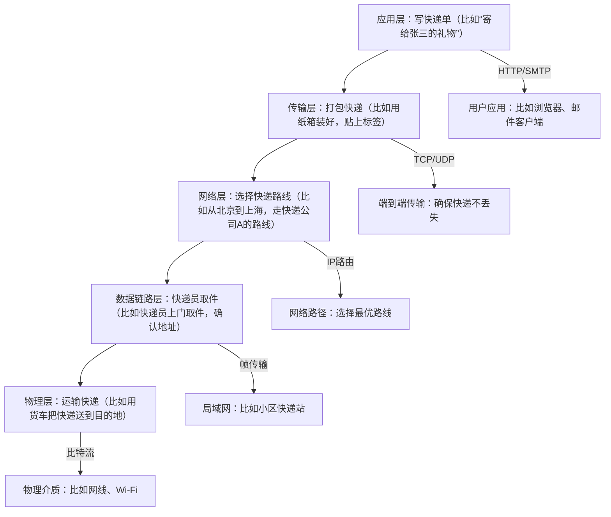

# Chapter 4: 计算机网络

在前一章中，我们学习了数据库系统，了解了计算机的“数据仓库”——数据库如何存储和管理数据。就像房子需要仓库，但不同房子之间需要道路连接一样，计算机之间也需要“通信网络”来交换数据。这一章我们将学习**计算机网络**，它是计算机之间的“通信网络”，让不同计算机能互相连接和通信，避免信息孤岛，就像把分散的仓库用道路连起来，方便货物（数据）流通。

## 4.1 为什么需要计算机网络？

想象一下，你要在家里的电脑上查看公司服务器的文件，或者用手机上网查资料——这些都需要计算机之间互相通信。如果没有计算机网络，每台计算机就像一座孤岛，无法共享资源（比如文件、打印机）或访问互联网。计算机网络解决了这个问题，它让计算机能够：

- **共享资源**：比如家里的打印机可以被多台电脑使用，公司服务器上的文件可以被员工访问。  
- **交换数据**：比如你发送邮件给朋友，数据通过计算机网络从你的电脑传到邮件服务器，再到朋友的电脑。  
- **访问互联网**：让你能浏览网页、看视频、使用云服务（比如百度网盘）。

## 4.2 计算机网络是什么？

从定义上说，计算机网络是由通信线路连接的多台独立计算机组成的系统，目的是**资源共享**（比如文件、打印机）和数据交换。它就像一个“数字社区”，每台计算机是社区里的住户，通信线路是社区里的道路，协议是住户之间的“沟通规则”（比如用同一种语言说话）。  

为了理解计算机网络，我们可以把它拆分成几个关键部分：**网络架构**（分层设计）、**网络协议**（通信规则）、**网络类型**（局域网/广域网）和**网络设备**（连接工具）。

## 4.3 网络架构：分层的“沟通规则”

计算机之间的通信很复杂，比如要考虑数据如何传输、如何路由、如何确保可靠。为了简化问题，网络设计者把通信过程分成**层次**，每层负责不同的任务，就像邮局处理信件的过程：

- **物理层**：负责传输“比特”（0和1），就像邮递员送信（只管把信送到，不管信的内容）。  
- **数据链路层**：负责把比特组成“帧”（有头有尾的数据包），就像邮局分拣信件（给信加标签，确保送到正确地址）。  
- **网络层**：负责“路由选择”（决定数据走哪条路），就像邮路规划（选择最快的路线）。  
- **传输层**：负责“端到端可靠传输”（确保数据完整到达），就像快递公司保证信件不丢失。  
- **应用层**：负责“具体应用”（比如网页、邮件），就像信件的内容（比如你写的信是邀请函还是账单）。

### 4.3.1 OSI参考模型 vs TCP/IP模型

有两种常见的网络架构模型：

- **OSI模型**：国际标准化组织（ISO）制定的七层模型，从下到上分别是：物理层、数据链路层、网络层、传输层、会话层、表示层、应用层。  
- **TCP/IP模型**：实际应用最广泛的四层模型，从下到上分别是：网络接口层、网络层、传输层、应用层（会话层和表示层的功能合并到应用层）。  

TCP/IP模型更简单，比如你的电脑上网时，用的是TCP/IP协议族，它包括IP（网络层）、TCP（传输层）、HTTP（应用层）等协议。

### 4.3.2 各层的功能（用日常例子解释）

我们可以用“寄快递”来类比各层的功能：

- **应用层**：直接面向用户，比如浏览器（HTTP协议）、邮件客户端（SMTP协议）、文件传输（FTP协议）。  
- **传输层**：负责端到端的数据传输，比如TCP（可靠，像快递公司保证送达）、UDP（快速，像快递公司加急但可能丢失）。  
- **网络层**：负责IP地址路由，比如你的电脑的IP地址（比如`192.168.1.100`）和网络上的其他设备通信。  
- **数据链路层**：负责局域网内的帧传输，比如你的电脑和路由器之间的通信。  
- **物理层**：负责物理介质（网线、Wi-Fi）的比特传输。

## 4.4 常见的网络协议：沟通的“语言”

网络协议是计算机之间通信的规则，就像两个人说话需要用同一种语言。常见的协议有：

### 4.4.1 应用层协议

- **HTTP（超文本传输协议）**：用于网页传输，比如你输入网址`https://www.baidu.com`，浏览器用HTTP协议向百度服务器请求网页。  
- **FTP（文件传输协议）**：用于传输文件，比如从服务器下载文件到本地，或上传文件到服务器。  
- **SMTP（简单邮件传输协议）**：用于发送邮件，比如你用邮箱发送邮件，SMTP协议把邮件传到邮件服务器。  
- **DNS（域名系统）**：把域名（比如`www.baidu.com`）转换成IP地址（比如`14.215.177.38`），因为计算机只认识IP地址。比如你输入域名，DNS服务器帮你找到对应的IP，然后HTTP协议请求网页。

### 4.4.2 传输层协议

- **TCP（传输控制协议）**：可靠传输，像快递公司保证信件送达，适合传输重要数据（比如网页、邮件）。  
- **UDP（用户数据报协议）**：快速传输，像快递公司加急但可能丢失，适合传输实时数据（比如视频通话、在线游戏）。

### 4.4.3 网络层协议

- **IP（网际协议）**：负责路由选择，把数据包从源地址传到目的地址，比如你的电脑的IP地址是`192.168.1.100`，服务器的IP是`14.215.177.38`，IP协议负责把数据包从你的电脑传到服务器。  
- **ARP（地址解析协议）**：把IP地址转换成MAC地址（网卡的物理地址），比如你的电脑要和路由器通信，ARP协议把路由器的IP地址转换成它的MAC地址。

## 4.5 局域网与广域网：不同范围的“社区”

计算机网络根据覆盖范围分为两种：

- **局域网（LAN）**：覆盖小范围（比如家里、办公室），数据传输快，比如家里的Wi-Fi网络。  
- **广域网（WAN）**：覆盖大范围（比如城市、国家），比如互联网。

### 4.5.1 局域网的拓扑结构

局域网的连接方式（拓扑结构）有几种：

- **星形结构**：所有设备连接到中心设备（比如路由器），像星星的形状。比如家里的路由器连接电脑、手机、打印机。  
- **总线结构**：所有设备连接到一条共享线路（比如同轴电缆），像一条总线。现在很少用了，因为容易冲突。  
- **环形结构**：设备连成环状，数据沿环传输。比如早期的以太网。  
- **网状结构**：设备之间互相连接，可靠性高，但成本高。比如大型企业的网络。

### 4.5.2 无线局域网（WLAN）

无线局域网用Wi-Fi代替网线，让你不用插线就能上网。比如家里的无线路由器（AP，接入点）发射Wi-Fi信号，手机、电脑连接到路由器，就能上网。

## 4.6 网络设备：连接网络的“工具”

网络设备是连接计算机和网络的关键，常见的有：

- **路由器**：连接不同网络（比如家里的局域网和互联网），负责路由选择（决定数据走哪条路）。比如你的无线路由器，让你家网络连到互联网。  
- **交换机**：连接局域网内的设备（比如电脑、打印机），负责帧传输（把数据包送到正确设备）。比如办公室的交换机，让多台电脑连到同一个网络。  
- **网关**：连接不同协议的网络（比如局域网和互联网），负责协议转换。比如家里的路由器也是网关，把局域网的IP地址转换成互联网的IP地址。

## 4.7 IPv6：解决IPv4地址不够的问题

IPv4地址是32位，比如`192.168.1.100`，只能支持约42亿个地址，现在不够用了。IPv6地址是128位，比如`2001:0db8:85a3:0000:0000:8a2e:0370:7334`，能支持更多地址。  

IPv6的地址表示更简单，比如可以压缩连续的0：`2001:db8:85a3::8a2e:370:7334`（`::`表示连续的0）。IPv6还有更多优势，比如更好的安全性、更快的路由。

## 总结

本章我们学习了计算机网络的核心概念：它是计算机之间的“通信网络”，通过分层架构、协议和设备，实现资源共享和数据交换。我们了解了网络架构（OSI/TCP/IP）、常见协议（HTTP、TCP、IP）、局域网/广域网的区别，以及网络设备（路由器、交换机）的作用。  

计算机网络是现代信息社会的基础，让你能上网、共享文件、使用云服务。就像道路连接了城市，计算机网络连接了计算机，让数据流通更方便。

下一章我们将学习**虚拟化与云计算**，它是计算机资源的“共享池”，让多台计算机像一台电脑一样使用。请继续阅读[虚拟化与云计算](05_虚拟化与云计算_.md)，了解如何让计算机资源更高效！

---

Generated by [AI Codebase Knowledge Builder](https://github.com/The-Pocket/Tutorial-Codebase-Knowledge)