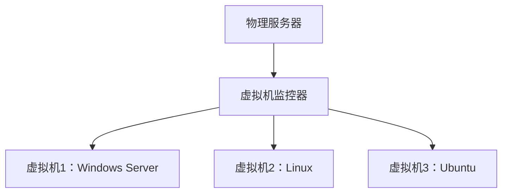

# Chapter 5: 虚拟化与云计算

在前一章中，我们学习了计算机网络，了解了计算机之间的“通信网络”——计算机网络如何连接不同计算机，让数据流通。就像道路连接了城市，但如何更高效利用这些道路上的资源呢？比如，如果每辆车都自己建加油站，会很浪费；如果大家共享加油站，按需加油，会更高效。虚拟化与云计算就是这样的技术：它们把物理资源（比如服务器、存储）抽象成逻辑资源，让多台计算机像一台电脑一样使用，按需获取资源，就像共享加油站一样。


## 5.1 为什么需要虚拟化与云计算？

想象一下，你要开一家网店，需要服务器来运行网站。如果自己买一台服务器，可能大部分时间都闲置（比如晚上没人访问），而且维护服务器需要专业知识（比如装系统、修硬件）。这时候，虚拟化和云计算就能解决问题：

- **虚拟化**：把一台物理服务器分成多个“虚拟机”，每个虚拟机可以运行不同的网站，就像把一个大房间分成多个单间，每个单间租给不同租客，互不干扰。
- **云计算**：通过互联网租用这些虚拟机，不用自己买服务器，按使用时间付费，就像租房子按月付租金，不用自己盖房子。

这样，资源利用率提高了（服务器不再闲置），成本降低了（不用买和维护服务器），灵活性也增强了（需要更多资源时随时增加）。


## 5.2 虚拟化：把物理资源变成“逻辑资源”

虚拟化（Virtualization）是将物理资源（比如CPU、内存、硬盘）抽象成逻辑资源的技术。最常见的是**平台虚拟化**，它通过虚拟机监控器（Hypervisor）在物理硬件上创建多个虚拟机，每个虚拟机可以运行独立的操作系统（比如Windows、Linux）。

### 5.2.1 虚拟机：逻辑上的“独立电脑”

虚拟机就像一台“逻辑电脑”，它有自己的CPU、内存和硬盘，但实际运行在物理服务器上。比如，一台物理服务器可以运行3个虚拟机：一个跑Windows Server（放网站），一个跑Linux（跑数据库），一个跑Ubuntu（跑开发环境）。每个虚拟机互不干扰，就像三个独立的电脑。



### 5.2.2 虚拟化的类型（简化版）

虚拟化有很多类型，但最常见的是**全虚拟化**和**超虚拟化**：

- **全虚拟化**：虚拟机监控器模拟完整的底层硬件（比如CPU、内存），让客户机操作系统（Guest OS）完全不用修改就能运行。就像模拟一个完整的电脑，客户机操作系统以为自己在真实硬件上运行。
  
  > 源材料中的描述：“全虚拟化（Full Virtualization）是指虚拟机模拟了完整的底层硬件，包括处理器、物理内存、时钟、外设等，使得为原始硬件设计的操作系统或其他系统软件完全不作任何修改就可以在虚拟机中运行。”
  
  类比：全虚拟化像“模拟器”，比如模拟器让你在手机上玩PS游戏，游戏以为自己在PS上运行。

- **超虚拟化**：修改客户机操作系统的部分代码，让它直接和虚拟机监控器交互，提高性能。就像让租客直接和房东沟通，不用通过中介，更高效。
  
  > 源材料中的描述：“超虚拟化（Paravirtualization）是一种修改Guest OS部分访问特权状态的代码以便直接与VMM交互的技术。”
  
  类比：超虚拟化像“优化后的模拟器”，比如模拟器优化了游戏代码，让游戏运行更快。

### 5.2.3 虚拟化的好处

虚拟化解决了什么问题？比如，以前一台服务器只能跑一个应用，现在可以跑多个，资源利用率从10%提升到80%。而且，虚拟机可以快速迁移（比如把虚拟机从一台物理服务器移到另一台），实现高可用性（比如一台服务器坏了，虚拟机自动移到另一台）。


## 5.3 云计算：按需获取的“计算服务”

云计算（Cloud Computing）是通过互联网提供按需计算服务的技术。它的核心思想是“资源池化”：把大量计算资源（服务器、存储、网络）集中起来，形成“云”，用户按需租用，就像租水电一样。

### 5.3.1 云计算的“服务模型”

云计算有三种主要的服务模型，就像租房子有不同的方式：

- **IaaS（基础设施即服务）**：租用基础设施（服务器、存储、网络）。比如AWS的EC2，你可以租用虚拟机，自己装操作系统和应用。类比：租房子时，房东提供毛坯房，你自己装修。
  
  > 源材料中的描述：“基础设施即服务（Infrastructure as a Service，IaaS）是指消费者通过Internet可以从完善的计算机基础设施获得服务。”

- **PaaS（平台即服务）**：租用开发平台（数据库、应用服务器）。比如Heroku，你可以直接部署应用，不用管底层基础设施。类比：租房子时，房东提供装修好的房子，你直接搬进去住。
  
  > 源材料中的描述：“平台即服务（Platform-as-a-Service，PaaS）是把服务器平台或者开发环境作为一种服务提供的商业模式。”

- **SaaS（软件即服务）**：租用软件应用。比如Google Docs，你直接用在线文档，不用安装软件。类比：租房子时，房东提供家具齐全的房子，你直接使用。
  
  > 源材料中的描述：“软件即服务（Software-as-a-Service，SaaS）是基于互联网提供软件服务的软件应用模式。”

### 5.3.2 云计算的特点

云计算为什么受欢迎？因为它有以下特点：

- **弹性伸缩**：按需增加或减少资源。比如你的网店突然有很多访问，云计算可以自动增加服务器，等访问减少后再减少，避免浪费。
- **按需付费**：只付使用的资源，比如用了10小时的服务器，就付10小时的费用，不用买整台服务器。
- **高可用性**：云服务商有多个数据中心，你的应用可以自动备份到不同地方，即使一个数据中心坏了，也不会中断服务。

### 5.3.3 云计算的例子

- **云存储**：比如百度网盘，你把文件存在云端，不用自己买硬盘，随时随地访问。
- **云安全**：比如云杀毒软件，通过云端分析病毒，保护你的电脑。
- **云会议**：比如腾讯会议，通过云端处理视频和音频，让你和全球团队开会。


## 5.4 虚拟化与云计算的关系

虚拟化是云计算的基础。云计算需要把物理资源抽象成逻辑资源，而虚拟化就是实现这种抽象的技术。比如，云计算服务商用虚拟化技术把物理服务器分成多个虚拟机，然后租给用户。

```mermaid
sequenceDiagram
    participant 用户
    participant 云服务商
    participant 物理服务器
    用户->>云服务商： 请求租用虚拟机
    云服务商->>物理服务器： 使用虚拟化技术创建虚拟机
    物理服务器-->>云服务商： 返回虚拟机
    云服务商-->>用户： 提供虚拟机访问
    用户->>虚拟机： 运行应用
```


## 5.5 总结

本章我们学习了虚拟化与云计算的核心概念：

- **虚拟化**：把物理资源抽象成逻辑资源，提高资源利用率（比如一台服务器跑多个虚拟机）。
- **云计算**：通过互联网按需提供计算服务，降低成本（比如租用虚拟机，不用自己买服务器）。

这些技术是现代IT基础设施的核心，让资源更高效、更灵活。就像共享经济（比如共享单车）改变了出行方式，虚拟化与云计算改变了计算资源的使用方式。

下一章我们将学习**嵌入式系统**，它是“小而专”的计算机系统，比如手机、智能家电中的芯片。请继续阅读[嵌入式系统](06_嵌入式系统_.md)，了解这些“小电脑”如何工作！

---

Generated by [AI Codebase Knowledge Builder](https://github.com/The-Pocket/Tutorial-Codebase-Knowledge)