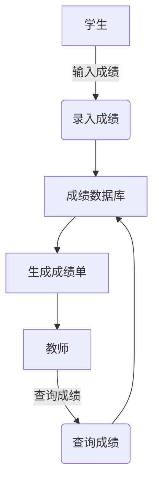
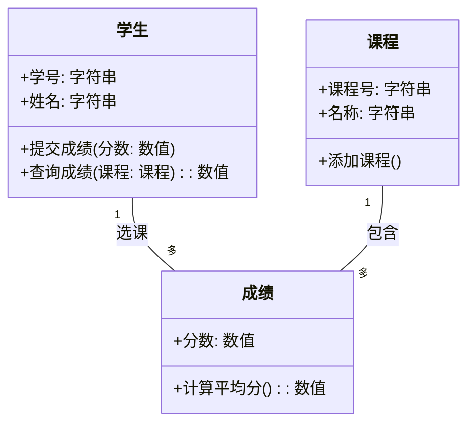

# Chapter 7: 系统分析与设计方法

在上一章，我们了解了嵌入式系统如何让设备（如智能手表、汽车）具备智能功能。但如何设计一个完整的系统，让这些设备协同工作，满足用户需求呢？这就需要**系统分析与设计方法**——它就像建筑前的“蓝图规划”，决定了系统的结构和功能，确保最终产品能高效、可靠地解决问题。

## 7.1 为什么需要系统分析与设计方法？

想象一下：你要盖一栋房子，如果直接开始砌墙，没有设计图纸，可能会出现房间布局不合理、水电线路混乱等问题，后期需要大量修改，甚至推倒重来。系统开发也是如此——如果没有系统分析与设计，项目可能会偏离用户需求，导致成本超支、进度延迟，甚至失败。

根据研究，**74%的软件项目失败源于需求问题**（Standish Group对23000个项目的研究）。系统分析与设计方法正是解决这个问题的关键：它通过明确需求、规划结构，确保系统“做正确的事”（满足用户需求）和“正确地做事”（高效实现功能）。

## 7.2 系统分析与设计是什么？

系统分析与设计是**定义系统需求和结构的过程**，分为两个核心阶段：  
- **系统分析**：回答“系统需要做什么？”（需求分析），比如用户需要存储成绩、查询成绩。  
- **系统设计**：回答“系统如何实现？”（结构设计），比如用数据库存储成绩，用界面展示查询结果。  

它就像“翻译”用户需求为技术方案的过程，确保最终系统既满足用户需求，又具备可维护性、可扩展性。

## 7.3 关键方法：结构化 vs. 面向对象

系统分析与设计有两种主流方法，适用于不同场景：

### 7.3.1 结构化方法：关注“过程流”

结构化方法把系统看作**一系列过程的集合**（如数据输入、处理、输出），用**数据流图（DFD）** 描述系统逻辑。它适合大型数据处理系统，比如银行账单处理、库存管理。

#### 核心工具：数据流图（DFD）
DFD用简单符号表示系统元素：  
- **外部实体**：系统外的数据源/目的地（如用户、银行系统）；  
- **过程**：处理数据的步骤（如“计算成绩”“生成报表”）；  
- **数据存储**：保存数据的地方（如数据库、文件）；  
- **数据流**：数据传输的路径（如“学生信息”从用户输入到数据库）。  

**例子**：设计一个学生成绩系统，DFD可能包含：  
- 外部实体：学生、教师；  
- 过程：录入成绩、查询成绩、生成成绩单；  
- 数据存储：成绩数据库；  
- 数据流：“学生信息”从学生输入到“录入成绩”过程，再到“成绩数据库”。  

### 7.3.2 面向对象方法：关注“对象交互”

面向对象方法把系统看作**相互影响的“对象”集合**（如“学生”“课程”“成绩”），用**类图（UML）** 描述对象属性和行为。它适合复杂、易变的系统，比如社交软件、电商系统。

#### 核心工具：类图（UML）
类图用“类”表示对象，包含：  
- **属性**：对象的特征（如“学生”的“学号”“姓名”）；  
- **方法**：对象的行为（如“学生”的“提交成绩”“查询成绩”）；  
- **关系**：对象间的关联（如“学生”与“课程”的“选课”关系）。  

**例子**：设计学生成绩系统，类图可能包含：  
- 类：学生（属性：学号、姓名；方法：提交成绩）、课程（属性：课程号、名称；方法：添加课程）、成绩（属性：分数、课程；方法：计算平均分）；  
- 关系：学生“选课”课程，成绩“关联”学生和课程。  

### 7.3.3 两者区别：过程 vs. 对象
| 特性         | 结构化方法               | 面向对象方法             |
|--------------|--------------------------|--------------------------|
| 核心视角     | 系统是“过程流”            | 系统是“对象交互”          |
| 适用场景     | 大型数据处理、流程固定     | 复杂系统、需求易变         |
| 工具         | 数据流图（DFD）           | 类图（UML）               |
| 优势         | 简单、直观，适合初学者     | 易扩展、易维护，符合现实世界 |

## 7.4 系统分析与设计的步骤

系统分析与设计通常分为**四步**，以“设计学生成绩系统”为例：

### 7.4.1 定义问题：明确“要解决什么”
首先，通过访谈用户（如教师、学生），确定系统目标：  
- 目标：存储学生成绩，支持查询、生成报表；  
- 影响：教师能快速统计成绩，学生能查看个人成绩；  
- 约束：必须在校园网内使用，数据需加密存储。  

### 7.4.2 需求分析：细化“需要什么功能”
需求分为三类：  
- **功能需求**：系统必须做的事（如“录入成绩”“查询成绩”）；  
- **非功能需求**：系统的品质（如“响应时间≤1秒”“数据安全”）；  
- **设计约束**：限制条件（如“必须用MySQL数据库”）。  

**例子**：学生成绩系统的需求：  
- 功能需求：学生能提交成绩，教师能修改成绩，管理员能生成班级成绩单；  
- 非功能需求：查询成绩时，页面加载时间不超过1秒；  
- 设计约束：使用Java开发，部署在Linux服务器。  

### 7.4.3 系统设计：规划“如何实现”
根据需求，选择方法设计系统结构：  
- 若用**结构化方法**：画DFD图，划分模块（如“录入模块”“查询模块”），设计数据存储（如成绩数据库表结构）；  
- 若用**面向对象方法**：画类图，定义类（如“学生类”“成绩类”），设计接口（如“成绩服务接口”）。  

### 7.4.4 验证与迭代：确保“正确性”
通过评审（如让用户确认需求）、原型测试（如做一个简化版系统），修正设计中的问题。比如，用户反馈“查询成绩时需要按课程筛选”，则调整DFD或类图，增加“课程筛选”功能。

## 7.5 为什么系统分析与设计很重要？

良好的系统分析与设计能：  
- **减少后期修改成本**：需求明确后，设计阶段修正问题比开发后期修改更便宜（据统计，需求阶段修正问题的成本是开发阶段的1/100）；  
- **确保满足用户需求**：通过用户参与（如访谈、评审），避免系统偏离实际需求；  
- **提高系统质量**：模块化设计（高内聚、低耦合）让系统易维护、易扩展。  

## 7.6 常见误区：避免这些错误

- **误区1**：“需求不重要，先做再说”——需求不明确会导致大量返工，比如用户需要“按课程查询成绩”，但系统只做了“按学生查询”，后期需要重写；  
- **误区2**：“设计越复杂越好”——过度设计会增加维护成本，比如用10个类实现“录入成绩”，其实2个类就够了；  
- **误区3**：“忽略非功能需求”——比如系统响应时间慢，用户会放弃使用，即使功能正确。  

## 检查你的理解
1. 系统分析与设计方法像什么？它的核心作用是什么？  
2. 结构化方法和面向对象方法的主要区别是什么？分别适合什么场景？  
3. 为什么需求分析是系统开发的关键？  

## 结论

本章我们学习了系统分析与设计方法：它是系统开发的“蓝图”，通过明确需求、规划结构，确保系统满足用户需求。结构化方法关注“过程流”，适合大型数据处理；面向对象方法关注“对象交互”，适合复杂系统。无论用哪种方法，核心都是**“做正确的事”**（满足需求）和**“正确地做事”**（高效实现）。  

理解系统分析与设计，能帮你避免项目失败，为后续学习[敏捷开发方法](08_敏捷开发方法_.md)（如何快速响应需求变化）打下基础。</think>

---

Generated by [AI Codebase Knowledge Builder](https://github.com/The-Pocket/Tutorial-Codebase-Knowledge)