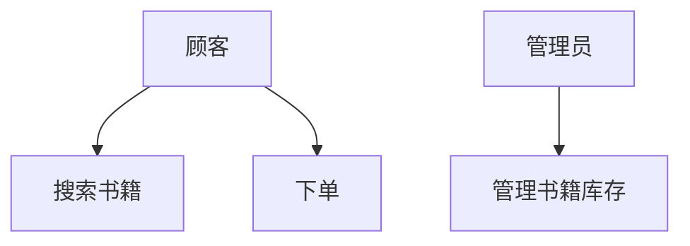
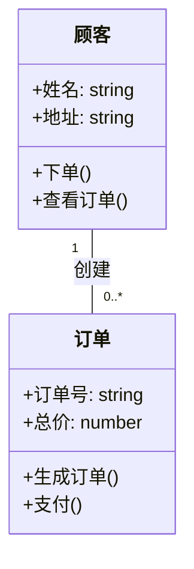
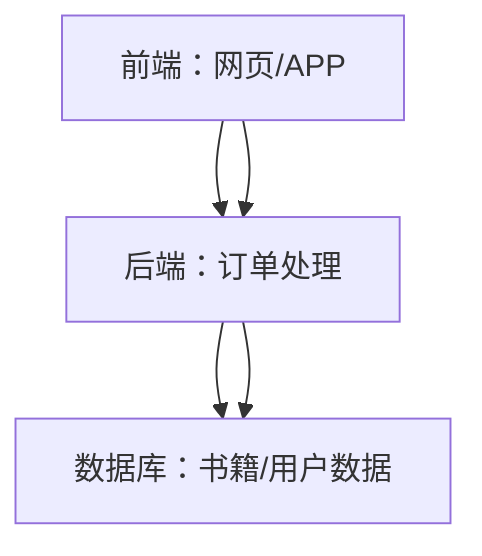

# Chapter 7: 系统分析与设计方法

在前一章中，我们学习了嵌入式系统，了解了“小而专”的计算机系统如何让设备智能。就像盖房子需要先设计蓝图，开发软件系统也需要先分析需求、规划结构——这就是**系统分析与设计方法**。这一章我们将学习如何像建筑师规划房子一样，规划软件系统，确保它满足用户需求，减少后期修改成本。

## 7.1 为什么要做系统分析与设计？

想象你要开发一个在线书店系统。如果没有提前分析，可能开发到一半发现用户需要“推荐相似书籍”功能，但系统没设计，只能返工，浪费时间和成本。系统分析与设计就是解决这个问题的：先明确“用户需要什么”（分析），再规划“系统怎么做”（设计），就像盖房子前画蓝图，避免施工中频繁修改。

## 7.2 系统分析与设计是什么？

根据源材料，**系统分析与设计是定义系统需求和结构的过程，如同建筑前的规划和设计**。它包括两个核心步骤：  
- **系统分析**：理解用户需求，明确系统要“做什么”（功能需求）和“具备什么品质”（非功能需求，如性能、安全）。  
- **系统设计**：将需求转化为系统结构，规划“怎么做”（如模块划分、架构设计）。  

举个例子，在线书店的系统分析会明确：  
- 功能需求：用户能搜索书籍、下单购买、查看订单；  
- 非功能需求：页面加载时间不超过2秒，支付信息必须加密。  

系统设计则会规划：  
- 前端（用户界面，如网页/APP）；  
- 后端（处理订单、库存、支付逻辑）；  
- 数据库（存储书籍、用户、订单信息）。  

## 7.3 系统分析：明确用户需求

系统分析的目标是“把用户的话变成系统要做的任务”。常用方法有两种：  

### 7.3.1 结构化方法：像“流水线”分解任务  
结构化方法把系统看作“过程的集合”，用**数据流图（DFD）** 建模，把复杂系统分解成简单步骤。比如在线书店的订单流程：  
1. 用户提交订单 → 2. 系统检查库存 → 3. 扣减库存 → 4. 生成订单 → 5. 发送确认邮件。  

### 7.3.2 面向对象方法：像“积木”组合功能  
面向对象方法把系统看作“对象的集合”，用**用例图（UML）** 建模，把系统分解成“对象”（如“用户”“书籍”“订单”）。比如在线书店的用例图：  
- 参与者：顾客、管理员；  
- 用例：顾客“搜索书籍”“下单”，管理员“管理书籍库存”。  

## 7.4 系统设计：规划系统结构

系统设计把需求转化为“系统的骨架”，常用工具是**统一建模语言（UML）**，用图形表示系统结构。  

### 7.4.1 类图：定义对象的“属性”和“关系”  
类图描述对象的属性（如“书籍”有“书名”“价格”）和关系（如“顾客”和“订单”是一对多关系）。比如在线书店的类图：  
- “顾客”类：属性（姓名、地址），方法（下单、查看订单）；  
- “订单”类：属性（订单号、总价），方法（生成订单、支付）；  
- 关系：“顾客”可以创建多个“订单”。  

### 7.4.2 架构设计：规划系统的“分层结构”  
架构设计把系统分成不同层次，提高可维护性。比如在线书店的分层架构：  
- 表示层（前端：用户界面）；  
- 业务层（后端：处理订单、库存逻辑）；  
- 数据层（数据库：存储数据）。  

## 7.5 系统分析与设计的好处

良好的系统分析与设计能：  
- **满足用户需求**：提前明确用户要什么，避免开发后返工；  
- **降低成本**：减少后期修改，比如提前设计“推荐功能”的模块，后续添加就方便；  
- **提高可维护性**：清晰的架构让系统更容易扩展（如增加“优惠券功能”）。  

## 总结

本章我们学习了系统分析与设计方法，它是软件开发的关键步骤，像建筑蓝图一样重要。通过分析需求（明确“做什么”）和设计结构（规划“怎么做”），我们能开发出满足用户需求、成本低、易维护的系统。  

下一章我们将学习**敏捷开发方法**，了解如何更灵活地开发系统，请继续阅读[敏捷开发方法](08_敏捷开发方法_.md)，学习如何快速响应需求变化！

---

Generated by [AI Codebase Knowledge Builder](https://github.com/The-Pocket/Tutorial-Codebase-Knowledge)