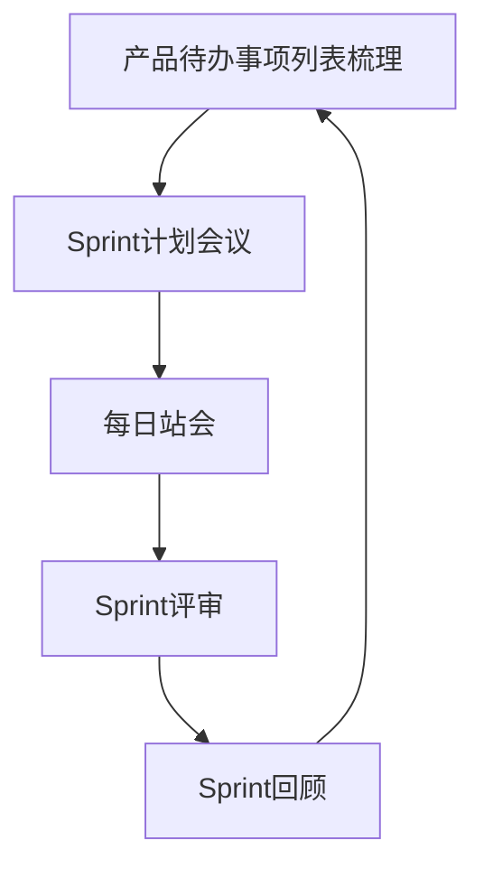

# Chapter 8: 敏捷开发方法


在前一章中，我们学习了**系统分析与设计方法**，了解了如何像建筑师规划房子一样，规划软件系统的结构和需求。但实际开发中，客户的需求往往会发生变化——比如盖房子时，客户突然想改窗户位置；开发软件时，客户可能希望增加新功能或调整原有功能。传统方法（如瀑布模型）可能需要等到整个开发阶段结束才能修改，导致返工和延误。而**敏捷开发方法**就像一支“灵活的施工队”，能快速响应变化，让开发过程更适应需求的变化，持续交付有价值的功能。


## 8.1 为什么需要敏捷开发？

想象你要开发一个**在线书店系统**：  
- 一开始，客户要求“用户能搜索书籍、下单购买”；  
- 开发到一半，客户说：“能不能加个‘推荐相似书籍’的功能？”  
- 传统方法可能需要重新规划整个流程，而敏捷开发可以快速调整，在下一个迭代中实现这个功能。  

敏捷开发的核心是**“快速响应变化”**，通过短周期的迭代（比如2周一个“Sprint”），持续交付可工作的软件，让客户随时反馈，避免后期的大规模修改。


## 8.2 敏捷开发是什么？

根据源材料，敏捷开发是一种**迭代和增量的软件开发方法**，强调：  
- 快速响应变化；  
- 持续交付价值；  
- 团队协作与客户反馈。  

它像一场“灵活的团队运动”：团队通过短周期迭代（如Scrum的Sprint），不断调整方向，适应需求变化。比如，开发团队每两周交付一个“可用的功能模块”，客户测试后提出意见，团队在下个周期改进。


### 8.2.1 敏捷宣言：敏捷的“灯塔”

2001年，17位开发者发表了《敏捷软件开发宣言》，其中提到：  
> “尽早地、持续地向客户交付有价值的软件对开发人员来说是最重要的。拥抱变化，即使在开发的后期。敏捷过程能够驾驭变化，保持客户的竞争力。”  

这些话是敏捷方法的核心理念，强调**客户价值**和**适应变化**。比如，与其花几个月做完美但可能不符合客户需求的功能，不如先做简单的功能，让客户用起来，再逐步优化。


### 8.2.2 敏捷的四大价值观

敏捷宣言背后是四大价值观，它们是敏捷的“灵魂”：  
1. **沟通**：团队成员之间持续交流，避免信息差。比如，程序员和产品经理每天沟通，确保开发的功能符合需求。  
2. **简单**：只做“今天够用”的功能，不提前规划未来可能的变化（避免过度设计）。比如，先实现“用户注册”，再根据反馈加“邮箱验证”。  
3. **反馈**：通过持续交付，让客户和团队及时获得反馈。比如，每两周交付一个功能，客户说“注册按钮太隐蔽”，团队下次迭代调整。  
4. **勇气**：敢于面对变化，比如重构代码（改进代码而不改变功能），或调整需求。  


## 8.3 敏捷开发的关键实践：以Scrum为例

Scrum是敏捷方法中最常用的框架，像“敏捷的骨架”，帮助团队组织开发过程。它通过**短周期迭代（Sprint）** 和**固定流程**，让团队高效协作。


### 8.3.1 Scrum的核心流程

Scrum的流程可以简化为：  
1. **产品待办事项列表梳理**：整理所有需求，按优先级排序（比如“用户注册”优先级最高，“推荐功能”次之）。  
2. **Sprint计划会议**：团队选Sprint（2周）要完成的需求（如“用户注册”）。  
3. **每日站会**：每天15分钟，团队成员说“昨天做了什么、今天做什么、遇到的问题”。  
4. **Sprint评审**：Sprint结束时，展示交付的功能，客户反馈。  
5. **Sprint回顾**：团队讨论“哪里做得好、哪里不好，怎么改进”。  

这个流程循环进行，每个Sprint交付一个“可工作的软件增量”。


#### 流程示例：用mermaid图展示




### 8.3.2 每日站会：团队的“每日同步”

每日站会是Scrum的核心活动之一，目的是让团队同步进度、解决问题。比如，开发电商网站的团队：  
- 开发人员A：“昨天做了注册页面的前端，今天做后端接口。”  
- 开发人员B：“昨天调试了数据库，今天测试注册功能。”  
- 开发人员C：“遇到数据库连接问题，需要帮助。”  

通过站会，团队快速发现障碍，及时解决。


#### 每日站会的mermaid示例

```mermaid
sequenceDiagram
    participant 开发人员A
    participant 开发人员B
    participant 开发人员C
    开发人员A->>团队： 昨天做了注册页面前端，今天做后端接口
    开发人员B->>团队： 昨天调试了数据库，今天测试注册功能
    开发人员C->>团队： 遇到数据库连接问题，需要帮助
```


### 8.3.3 用户故事：明确需求的“小卡片”

敏捷开发用**用户故事**定义需求，格式是：“作为一个[角色]，我希望[功能]，以便[价值]”。比如：  
- “作为一个顾客，我希望能够注册账号，以便购买商品。”  

用户故事让需求更具体，避免模糊。比如，产品经理和客户一起写用户故事，确保功能符合客户实际需求。


## 8.4 敏捷开发如何解决“需求变化”问题？

回到在线书店的例子：  
- 传统方法：先做完整的需求分析，再开发，客户中途改需求，需要返工。  
- 敏捷方法：每两周交付一个功能（如第一个Sprint做“用户注册”），客户测试后说“注册按钮太丑”，团队在下一个Sprint调整。  

通过**迭代**，团队每次只关注当前Sprint的需求，避免过度规划。同时，**持续反馈**让客户参与开发过程，确保功能符合预期。


## 8.5 敏捷 vs 传统方法：有什么不同？

| 特性         | 传统方法（瀑布模型）       | 敏捷方法               |
|--------------|--------------------------|------------------------|
| 需求变化     | 难以调整，后期修改成本高   | 快速适应，迭代调整       |
| 交付频率     | 一次性交付（项目结束时）   | 短周期交付（每2周）       |
| 客户参与     | 项目后期参与             | 全程参与，持续反馈       |
| 团队协作     | 分工明确，沟通较少         | 密切沟通，协作紧密       |


## 8.6 总结

本章我们学习了**敏捷开发方法**，它通过**迭代、持续反馈、团队协作**，让软件开发更灵活，适应快速变化的业务需求。Scrum作为敏捷的框架，通过短周期Sprint和固定流程，帮助团队高效交付价值。  

敏捷开发不是“无序”，而是“有序的灵活”——它像“边做边改”的施工队，让开发过程更贴近客户需求。  

下一章我们将学习**软件架构设计**，了解如何设计系统的“骨架”，让软件更稳定、可扩展。请继续阅读[软件架构设计](09_软件架构设计_.md)，探索软件的“蓝图”设计！

---

Generated by [AI Codebase Knowledge Builder](https://github.com/The-Pocket/Tutorial-Codebase-Knowledge)