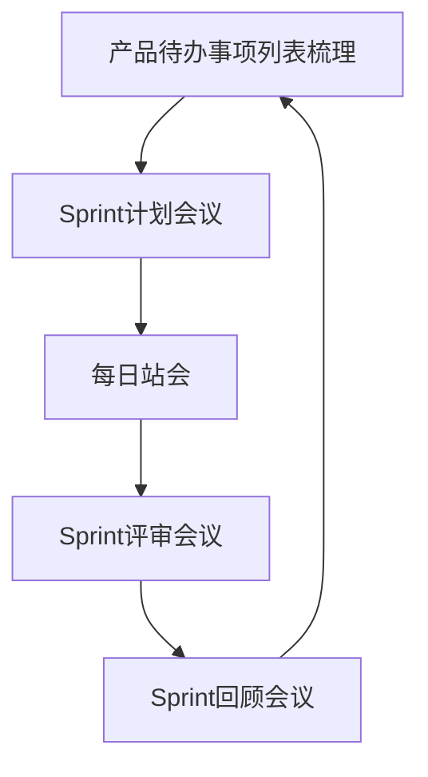

# Chapter 8: 敏捷开发方法

在上一章，我们学习了系统分析与设计方法，了解了如何通过结构化或面向对象的方法来规划系统。但现实中的项目常常面临需求变化、时间紧迫等挑战，传统的瀑布式开发可能无法快速响应这些变化。那么，有没有一种方法能让开发团队更灵活地应对变化，持续交付价值呢？这就是本章要介绍的**敏捷开发方法**。

## 8.1 为什么需要敏捷开发？

想象一下，你正在开发一个电商网站，客户突然提出“希望增加直播功能”。如果使用传统方法，可能需要重新规划整个项目，导致进度延迟。而敏捷开发方法强调**快速响应变化**，通过短周期迭代和持续反馈，让团队在开发过程中灵活调整方向。

敏捷开发的核心思想是：**像一场灵活的团队运动**。它通过短周期迭代（如Scrum的Sprint）和持续反馈，让团队像运动员一样，根据比赛情况随时调整策略，最终赢得胜利（交付客户满意的软件）。

## 8.2 敏捷开发的核心价值观

2001年，17位软件开发者发布了《敏捷软件开发宣言》，提出了敏捷的四大核心价值观：
1. **沟通**：团队成员之间持续交流，避免因信息不畅导致的错误。
2. **简单**：只做“够用”的功能，不追求过度设计。
3. **反馈**：通过频繁交付可工作的软件，让客户及时提出意见。
4. **勇气**：勇于面对变化，及时重构代码或调整计划。

这四大价值观是敏捷的“灵魂”，所有敏捷方法都围绕它们展开。

## 8.3 常见的敏捷方法

敏捷不是单一的方法，而是一系列方法的集合。以下是几种主流的敏捷方法：

### 8.3.1 极限编程（XP）

XP是敏捷中最著名的框架之一，强调通过12个最佳实践来提高效率和质量。例如：
- **测试先行**：先写测试代码，再写功能代码，确保每个功能都通过测试。
- **结对编程**：两名程序员一起编写代码，一人编码，一人审查，提高代码质量。
- **持续集成**：频繁合并代码，确保团队工作同步。

XP的四大价值观是沟通、简单、反馈和勇气，这些价值观通过实践落地。例如，结对编程促进了沟通，测试先行提供了反馈，简单设计体现了简单性。

### 8.3.2 Scrum

Scrum是目前最流行的敏捷框架，特别适合复杂项目。它的核心是**短周期迭代**（称为Sprint），每个Sprint通常为2-4周。Scrum有五个关键活动：
1. **产品待办事项列表梳理**：整理需求，确保优先级清晰。
2. **Sprint计划会议**：团队选择本次Sprint要完成的需求。
3. **每日站会**：每天15分钟，同步进度和问题。
4. **Sprint评审会议**：展示本次Sprint的成果，收集反馈。
5. **Sprint回顾会议**：总结经验，改进流程。

Scrum的流程可以用以下图表表示：

### 8.3.3 特征驱动开发（FDD）

FDD强调**按特征开发**，每个特征是一个小功能。它有6种角色，如项目经理、首席架构设计师和领域专家。FDD的五个核心过程包括：
1. 开发整体对象模型。
2. 构造特征列表。
3. 计划特征开发。
4. 特征设计。
5. 特征构建。

FDD的特色是**类的个体所有**，即每个类由特定成员负责，确保代码质量和责任明确。

### 8.3.4 水晶方法

水晶方法适用于小团队（6人以下），强调**频繁交付**和**反思改进**。它的七大体系特征包括：
- 经常交付：每几个月交付可工作的软件。
- 反思改进：定期总结问题，优化流程。
- 渗透式交流：团队成员在同一空间工作，信息自然流动。

水晶方法适合小型项目，注重团队协作和个人安全。

## 8.4 敏捷开发的优势

敏捷开发相比传统方法，有以下优势：
- **快速响应变化**：通过短周期迭代，及时调整需求。
- **提高客户满意度**：频繁交付可工作的软件，让客户看到进展。
- **增强团队协作**：每日站会、结对编程等实践促进沟通。

## 8.5 常见误解

- **误解1**：敏捷就是“没有计划”。实际上，敏捷强调**动态计划**，通过Sprint计划会议等确保方向。
- **误解2**：敏捷不需要文档。敏捷重视文档，但更强调**可工作的软件**，文档服务于代码。
- **误解3**：敏捷只适合小项目。Scrum等框架已成功应用于大型项目，如IBM、微软的实践。

## 检查你的理解
1. 敏捷开发的四大核心价值观是什么？
2. Scrum的Sprint是什么？它包含哪些活动？
3. 极限编程（XP）的12个最佳实践中，哪两个最有助于提高代码质量？

## 结论

本章我们学习了敏捷开发方法，它通过迭代、反馈和协作，让团队更灵活地应对变化。无论是极限编程的实践，还是Scrum的短周期迭代，敏捷的核心都是**持续交付价值**。理解敏捷，能帮助你在快速变化的项目中保持高效和客户满意度。

下一章我们将进入**软件架构设计**，了解如何设计系统的结构，为敏捷开发提供坚实的基础。请继续阅读[第九章：软件架构设计](09_软件架构设计_.md)。

---

Generated by [AI Codebase Knowledge Builder](https://github.com/The-Pocket/Tutorial-Codebase-Knowledge)