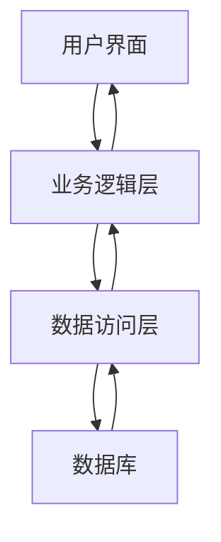

# Chapter 9: 软件架构设计

在前一章中，我们学习了**敏捷开发方法**，了解了如何通过迭代和持续反馈来适应需求变化。但当我们开发一个大型软件系统时，仅仅有敏捷方法还不够——我们还需要一个清晰的"蓝图"来规划系统的整体结构，确保它能够满足性能、安全性等质量要求。这就是**软件架构设计**的作用：它像建筑师的蓝图，决定了软件系统的整体布局和组件关系，是大型软件项目的关键。

## 9.1 为什么需要软件架构设计？

想象一下你要盖一座大型购物中心：如果没有蓝图，工人可能会随意施工，导致结构不稳定、空间浪费，甚至安全隐患。同样，开发一个复杂的软件系统（如电商平台）也需要架构设计来规划系统的整体结构。

例如，一个电商平台需要处理用户登录、商品展示、订单处理、支付等多个功能。如果没有良好的架构设计：
- 不同模块可能相互干扰，导致系统崩溃
- 修改一个功能可能影响其他功能
- 系统可能无法承受大量用户同时访问

软件架构设计解决了这些问题，它定义了系统的"骨架"，确保各部分协同工作，就像蓝图确保购物中心各区域合理布局一样。

## 9.2 软件架构设计的基本概念

### 9.2.1 什么是软件架构？

软件架构是软件系统的高层结构，它定义了系统的组件、组件之间的关系以及指导系统设计和演化的原则。简单来说，它回答了"系统由哪些部分组成？这些部分如何协同工作？"的问题。

就像城市规划一样，软件架构关注：
- 系统的整体布局（如分层结构）
- 组件之间的连接方式
- 系统需要满足的质量属性（如性能、安全性）

### 9.2.2 软件架构的重要性

良好的软件架构设计能带来许多好处：

1. **提高可维护性**：清晰的架构让开发者更容易理解和修改系统
2. **增强可扩展性**：系统可以方便地添加新功能
3. **保证可靠性**：架构设计考虑了错误处理和容错机制
4. **降低成本**：良好的架构减少了后期的修改和调试成本

正如源材料中所说：
> "软件架构设计是定义软件系统高层结构的过程，如同城市规划，决定了系统的整体布局和组件关系。"

### 9.2.3 软件架构风格

软件架构设计不是凭空创造的，而是基于一些经过验证的模式，这些模式称为"架构风格"。常见的架构风格包括：

- **分层系统**：将系统分为表示层、业务层和数据层
- **客户端/服务器（C/S）**：客户端和服务器分离
- **浏览器/服务器（B/S）**：通过浏览器访问服务器
- **MVC（模型-视图-控制器）**：分离数据、界面和业务逻辑

这些风格提供了现成的解决方案，帮助开发者快速构建稳定、可扩展的系统。

## 9.3 如何设计软件架构？

回到电商平台的例子，我们可以使用分层架构风格来设计：

### 9.3.1 分层架构设计

分层架构将系统分为三层：

1. **表示层**：用户界面，负责与用户交互（如网页、APP界面）
2. **业务层**：处理业务逻辑（如订单处理、支付验证）
3. **数据层**：管理数据存储（如数据库、文件系统）

这种设计的好处是：
- 各层职责明确，互不干扰
- 修改表示层不会影响业务层
- 可以独立扩展某一层（如增加服务器提高性能）

### 9.3.2 质量属性考虑

在架构设计时，我们还需要考虑系统的质量属性：

- **性能**：如何确保系统快速响应？
- **安全性**：如何保护用户数据和交易安全？
- **可伸缩性**：如何支持更多用户？

例如，对于性能，我们可以：
- 使用缓存减少数据库访问
- 采用负载均衡分散请求
- 优化算法提高处理速度

源材料中提到：
> "软件架构设计关注质量属性（如文件28的性能、安全性），并使用架构风格（如文件29的分层系统）来指导设计。"

## 9.4 软件架构的模型

软件架构可以从不同角度来描述，常见的模型包括：

### 9.4.1 "4+1"视图模型

"4+1"视图模型从五个角度描述架构：

1. **逻辑视图**：系统的功能需求（如用户、订单、商品）
2. **开发视图**：软件模块的组织（如前端、后端、数据库）
3. **进程视图**：系统的运行特性（如并发、分布）
4. **物理视图**：软件到硬件的映射（如服务器、数据库服务器）
5. **场景**：重要系统活动的抽象（如用户下单流程）

这种多角度描述确保架构的完整性，让不同角色（开发者、管理者、用户）都能理解系统。

### 9.4.2 架构需求与质量属性

架构设计需要满足质量属性需求，如：

- **可用性**：系统无故障运行的能力
- **可修改性**：系统适应变化的能力
- **性能**：系统及时响应的能力
- **安全性**：系统防止未授权访问的能力

这些属性之间可能存在权衡，例如提高安全性可能影响性能，架构设计师需要做出合理决策。

## 9.5 软件架构的工作原理

让我们通过一个简单的流程图来理解分层架构的工作原理：

在这个流程中：
1. 用户通过界面（如网页）发起请求
2. 请求到达业务逻辑层，处理具体业务（如计算总价）
3. 业务逻辑层调用数据访问层，获取或存储数据
4. 数据访问层与数据库交互，完成数据操作
5. 结果返回给用户界面，显示给用户

这种分层设计确保了各层职责明确，便于维护和扩展。

### 9.5.1 架构决策

架构设计师需要做出许多关键决策，例如：

- 选择哪种编程语言
- 采用哪种数据库
- 如何处理并发请求
- 如何保证数据安全

这些决策会影响系统的整体性能和可维护性，因此需要仔细考虑。

## 9.6 总结

本章我们学习了软件架构设计的基本概念，包括：

- 软件架构是系统的"蓝图"，定义了整体结构和组件关系
- 良好的架构设计能提高系统的可维护性、可扩展性和可靠性
- 常见的架构风格包括分层系统、C/S、B/S和MVC
- 架构设计需要考虑质量属性，如性能、安全性和可伸缩性

软件架构设计是大型软件项目的关键，它为系统提供了稳定的基础，确保系统能够满足用户需求并适应未来变化。

下一章我们将学习**设计模式**，它是软件设计中可复用的解决方案，帮助开发者解决常见问题。请继续阅读[设计模式](10_设计模式_.md)，了解如何使用这些模式来优化软件设计！

---

Generated by [AI Codebase Knowledge Builder](https://github.com/The-Pocket/Tutorial-Codebase-Knowledge)