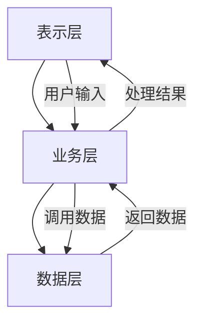

# Chapter 9: 软件架构设计

在上一章，我们学习了敏捷开发方法如何让团队灵活应对需求变化。但光有敏捷还不够——如果软件的“骨架”没设计好，即使开发再快，系统也可能变得混乱、难以维护。这就好比盖房子，就算工人再熟练，没有蓝图（架构设计），房子也可能结构不稳、功能混乱。本章我们将学习**软件架构设计**，它是软件系统的“布局谋篇”，决定了系统的整体结构和组件关系，是大型软件项目的关键。

## 9.1 为什么需要软件架构设计？

想象一下，你要开发一个电商网站，包含用户登录、商品浏览、订单支付等功能。如果没有架构设计，开发团队可能各自为政：有的用Python，有的用Java，数据库设计混乱，导致后期修改时牵一发而动全身。而软件架构设计就像“建筑蓝图”，它定义了系统的**高层结构**（比如分层、模块划分），确保所有组件协同工作，避免混乱。

源材料中提到：“软件架构设计是定义软件系统高层结构的过程，如同城市规划，决定了系统的整体布局和组件关系。” 这句话直接点出了架构设计的核心——**让系统有清晰的“骨架”**，就像城市规划决定了哪里建住宅、哪里建商业区，软件架构决定了哪些模块负责用户界面、哪些负责数据处理。

## 9.2 软件架构是什么？

根据源材料，软件架构是“**软件或计算机系统的软件架构是该系统的一个（或多个）结构，而结构由软件元素、元素的外部可见属性及它们之间的关系组成**”。简单来说，架构就是**系统的“骨架”**，包含：

- **软件元素**：比如模块、组件（如用户管理模块、订单处理模块）；
- **外部可见属性**：元素能提供的功能（如用户模块能注册、登录）；
- **元素间的关系**：模块如何交互（如用户模块调用订单模块处理支付）。

举个例子，电商网站的架构可能包含：用户模块（处理登录）、商品模块（展示商品）、订单模块（处理下单），这些模块通过API接口交互，这就是架构的“结构”。

## 9.3 软件架构的重要性

为什么架构设计这么重要？源材料中提到，架构设计有以下几个关键作用：

1. **项目干系人交流的平台**：架构提供了一个共同语言，让客户、开发团队、测试人员能理解系统的整体结构，避免沟通偏差。
2. **早期设计决策**：架构是系统最早的决策，决定了后续开发的方向（比如用分层架构还是微服务架构），影响系统的性能、可维护性。
3. **软件复用**：好的架构能让模块被多个系统复用（比如用户模块可以复用到其他电商项目中），降低开发成本。
4. **指导开发**：架构像“指南针”，指导开发团队如何实现功能，确保代码规范、一致。

比如，如果架构设计采用“分层系统”，那么开发团队就知道：表示层（用户界面）不能直接访问数据库，必须通过业务层，这样能提高安全性。

## 9.4 软件质量属性：架构设计的“目标”

架构设计不是随便画个图，而是要满足**质量属性**（非功能性需求），比如性能、安全性、可维护性等。源材料中列出了常见的质量属性：

| 质量属性       | 说明                                                                 |
|----------------|----------------------------------------------------------------------|
| 性能           | 系统响应速度，比如用户点击“下单”后，多久能完成支付                       |
| 安全性         | 防止非法访问，比如用户密码加密存储                                     |
| 可维护性       | 修改代码的难易程度，比如添加新功能时，是否需要修改很多模块               |
| 可扩展性       | 系统应对流量增长的能力，比如双十一时，能否通过增加服务器来支持更多用户     |

这些属性之间可能存在“权衡”：比如提高安全性可能降低性能（加密需要时间），架构设计师需要根据需求平衡这些属性。

## 9.5 常见的软件架构风格

架构设计不是唯一的，有很多“风格”（模式），就像建筑有中式、西式风格。常见的架构风格包括：

### 9.5.1 分层系统（Layered System）

分层系统是最常见的架构风格，把系统分成多层，每层负责不同功能，比如：

- **表示层**：用户界面（如网页、APP界面）；
- **业务层**：处理业务逻辑（如计算订单总价、验证用户权限）；
- **数据层**：管理数据（如数据库、文件存储）。

分层系统的优势是**职责清晰**，比如表示层只负责展示，不处理业务逻辑，这样修改界面时不会影响业务层。源材料中提到：“分层系统组织成一个层次结构，每一层为上层服务，并作为下层客户。” 比如，表示层调用业务层的接口，业务层调用数据层的接口。

用mermaid画分层系统的结构：

### 9.5.2 MVC架构（Model-View-Controller）

MVC是分层系统的一种，专门用于人机交互应用，把系统分成：

- **Model（模型）**：数据和行为（如用户信息、订单数据）；
- **View（视图）**：用户界面（如网页的HTML、APP的界面）；
- **Controller（控制器）**：处理用户输入（如点击按钮、提交表单），调用Model和View。

MVC的优势是**关注点分离**：Model负责数据，View负责展示，Controller负责逻辑，这样修改界面时不会影响数据逻辑。比如，把网页改成APP界面，只需修改View，Model和Controller不用变。

### 9.5.3 C/S与B/S架构

- **C/S（客户端/服务器）**：客户端（如电脑上的软件）和服务器（如数据库服务器）通信，比如QQ；
- **B/S（浏览器/服务器）**：用户通过浏览器访问服务器，比如淘宝网站。

B/S架构的优势是**零客户端**，用户不用安装软件，直接用浏览器就能使用，适合互联网应用。

## 9.6 例子：电商网站的架构设计

假设我们要设计一个电商网站，采用分层系统架构：

1. **表示层**：网页（HTML/CSS/JavaScript），负责展示商品、接收用户输入（如点击“加入购物车”）；
2. **业务层**：处理业务逻辑，比如计算订单总价、验证用户权限；
3. **数据层**：数据库（如MySQL），存储用户信息、商品数据、订单数据。

当用户点击“下单”时，流程如下：

1. 表示层发送请求到业务层；
2. 业务层调用数据层查询用户信息和商品库存；
3. 业务层计算订单总价，生成订单；
4. 数据层保存订单数据；
5. 业务层返回结果给表示层，表示层展示“下单成功”。

这样，每个层职责清晰，修改表示层（比如改网页样式）不会影响业务层和数据层。

## 检查你的理解

1. 软件架构设计像什么？它的核心作用是什么？
2. 分层系统架构的优势是什么？举例说明。
3. 质量属性之间可能存在什么关系？（比如性能和安全性）

## 结论

本章我们学习了软件架构设计：它是软件系统的“布局谋篇”，决定了系统的整体结构和组件关系。通过分层系统、MVC等架构风格，我们能设计出清晰、可维护的系统。理解架构设计，能帮助我们避免“代码混乱”，让系统像“结构稳固的房子”一样，即使需求变化，也能轻松修改。

下一章我们将进入**设计模式**，学习如何用现成的“解决方案”解决常见问题，让开发更高效。请继续阅读[第十章：设计模式](10_设计模式_.md)。

---

Generated by [AI Codebase Knowledge Builder](https://github.com/The-Pocket/Tutorial-Codebase-Knowledge)